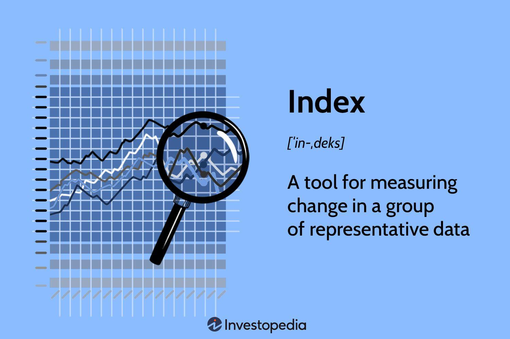

## Table of Contents

## What are financial indices and why are they important?

Financial indices are like scoreboards for the stock market. They track the performance of a group of stocks, which can represent a whole market or a specific part of it, like technology companies or banks. Some well-known indices are the S&P 500, the Dow Jones Industrial Average, and the Nasdaq Composite. These indices give us a quick way to see how the market or certain parts of it are doing without having to look at every single stock.

Indices are important because they help investors and people interested in the economy understand what's happening in the market. By looking at an index, you can tell if the market is going up or down, which can help you decide whether to buy or sell stocks. They also help people compare the performance of their investments to the overall market. For example, if your stocks are doing better than the S&P 500, you might be making good choices. Plus, indices are used to create financial products like index funds, which let people invest in a broad part of the market easily.

## How can beginners start trading financial indices?

To start trading financial indices, beginners should first learn about the basics of the stock market and how indices work. It's important to understand that indices are made up of a collection of stocks, and their performance reflects the overall health of those stocks. You can learn about this through books, online courses, or even free resources on the internet. Once you have a good grasp of the basics, the next step is to choose a reliable broker. A broker is a company that lets you buy and sell financial products, including indices. Look for a broker that is easy to use, has low fees, and offers good customer support.

After choosing a broker, you'll need to open an account and deposit some money. This money is called your trading capital, and it's what you'll use to buy and sell indices. Start small, as trading can be risky, and it's better to learn with less money at stake. Once your account is set up, you can start trading. Most brokers offer different ways to trade indices, like buying shares in an index fund or using financial instruments like futures and options. It's a good idea to start with index funds, as they are simpler and less risky than other methods. As you gain more experience, you can explore more advanced trading strategies.

## What are the most popular financial indices to trade?

The most popular financial indices to trade are the S&P 500, the Dow Jones Industrial Average, and the Nasdaq Composite. The S&P 500 tracks the performance of 500 large companies in the U.S. and is often seen as a good measure of how the overall U.S. stock market is doing. The Dow Jones Industrial Average, or just the Dow, follows 30 big companies in the U.S. and is one of the oldest and most well-known indices. The Nasdaq Composite includes all the companies listed on the Nasdaq stock exchange, with a focus on technology and internet companies.

These indices are popular because they are easy to understand and give a good overview of the market. Many people trade these indices through index funds, which are a type of investment that tries to match the performance of the index. For example, an S&P 500 index fund will go up and down with the S&P 500. This makes it easy for beginners to invest in the stock market without having to pick individual stocks. Plus, these indices are widely covered in the news, so it's easy to stay informed about their performance.

## What are the risks associated with trading financial indices?

Trading financial indices can be risky because the value of indices can go up and down a lot. This is called market [volatility](/wiki/volatility-trading-strategies). When you trade indices, you're betting on whether the market will go up or down. If you guess wrong, you can lose money. Sometimes, big news or events can make the market move a lot in a short time, which can be hard to predict. Also, if you use something called leverage, which is borrowing money to trade, you can lose more than what you put in. This makes trading indices even riskier.

Another risk is not knowing enough about the market. If you don't understand how indices work or what can affect their prices, you might make bad trading decisions. This can lead to losing money. It's important to learn about the market and maybe even practice with a fake account before you start trading for real. Also, you might feel a lot of stress when trading, especially if you're using your own money. It's good to be careful and not risk more than you can afford to lose.

## How do economic indicators affect financial indices?

Economic indicators are like signals that tell us how the economy is doing. They can affect financial indices because these indices are made up of stocks, and stocks go up or down based on what's happening in the economy. For example, if a report shows that more people have jobs than before, it's good news because people with jobs can spend more money. This can make companies sell more stuff, and their stock prices might go up. When a lot of stock prices go up, the financial index that includes those stocks will also go up. On the other hand, if an indicator shows that the economy is slowing down, like fewer people buying houses, it can make people worried. They might sell their stocks, which can make the stock prices and the index go down.

Different economic indicators can have different effects on financial indices. For instance, the unemployment rate is a big one. If it goes down, it can make the stock market happy because more people working means more money being spent. Another important indicator is inflation, which is when prices for things like food and gas go up. If inflation is too high, it can make people worried about the future, and they might sell their stocks, pushing the index down. Interest rates set by the government also matter a lot. If they go up, borrowing money becomes more expensive, which can slow down the economy and affect stock prices and indices. So, keeping an eye on these indicators can help you understand why financial indices are moving the way they are.

## What are the different methods of trading financial indices (e.g., CFDs, futures, options)?

One way to trade financial indices is through Contracts for Difference, or CFDs. CFDs let you bet on whether an index will go up or down without actually owning the index. You make money if you guess right, and lose money if you guess wrong. CFDs can be risky because you can use something called leverage, which means borrowing money to trade. This can make your wins bigger, but your losses can also be bigger than what you started with. CFDs are popular because they are easy to use and you can trade them quickly.

Another way to trade indices is through futures. Futures are agreements to buy or sell an index at a certain price on a future date. They are used a lot by people who want to protect themselves from big changes in the market. For example, if you think the market will go down, you can buy a future that lets you sell the index at today's price, even if it drops later. Futures can be complicated and might need a lot of money to start trading, but they can be a good way to manage risk.

Options are another method to trade indices. An option gives you the right, but not the obligation, to buy or sell an index at a certain price before a certain date. There are two types of options: calls and puts. A call option lets you buy the index, and a put option lets you sell it. Options can be used to make money if you think the market will move a lot, or to protect other investments from big drops. They can be tricky to understand and use, but they offer a lot of flexibility in how you trade.

## How can technical analysis be used in trading financial indices?

Technical analysis is a way to look at past prices and other data to guess where financial indices might go next. It's like trying to find patterns in a chart to help you decide when to buy or sell. People who use technical analysis look at things like moving averages, which smooth out price changes over time to show trends. They also use indicators like the Relative Strength Index (RSI) to see if an index is overbought or oversold, which can signal if a price change might happen soon. By studying these patterns and indicators, traders hope to make better decisions about when to trade.

For example, if a trader sees that the S&P 500 has been going up and is now above its 50-day moving average, they might think it's a good time to buy because the trend looks strong. On the other hand, if the RSI shows the index is overbought, the trader might wait or even sell, thinking the price could drop soon. Technical analysis doesn't always work perfectly, but it gives traders a way to make sense of all the price changes and try to predict what might happen next. It's important to use it along with other information, like news about the economy, to make the best trading decisions.

## What role does fundamental analysis play in trading financial indices?

Fundamental analysis is like looking under the hood of a car to see how it's running. When trading financial indices, it means studying the overall health of the economy and the companies that make up the index. This can include looking at things like how fast the economy is growing, how many people have jobs, and how much money companies are making. By understanding these big-picture factors, traders can guess if the index is likely to go up or down. For example, if companies in the S&P 500 are making more money and the economy is doing well, the index might go up.

Even though indices are made up of many stocks, [fundamental analysis](/wiki/fundamental-analysis) helps traders see the bigger picture. They might look at economic reports, like the unemployment rate or inflation numbers, to understand what's happening in the economy. If these reports show good news, like more people working or prices staying stable, it could mean the index will do well. On the other hand, bad news, like a slowing economy or high inflation, might make traders think the index will go down. So, fundamental analysis is important because it helps traders make smarter decisions based on what's really going on in the economy and with the companies in the index.

## How do global events influence the performance of financial indices?

Global events can have a big impact on financial indices because they can change how people feel about the economy. When something big happens, like a war or a natural disaster, it can make people worried about the future. This worry can make them sell their stocks, which makes the index go down. For example, if there's a big earthquake in a country that makes a lot of stuff, it might slow down their factories and make it harder for them to sell things. This can hurt the companies in the index and make their stock prices drop.

On the other hand, good news can make people feel more confident and want to buy stocks. If a country signs a new trade deal that helps their businesses grow, it can make the companies in the index do better and their stock prices go up. Also, things like elections or changes in government policies can affect the economy and, in turn, the indices. For example, if a new law makes it easier for companies to make money, it can make the index go up. So, keeping an eye on global events can help traders understand why financial indices are moving the way they are.

## What are some advanced strategies for trading financial indices?

One advanced strategy for trading financial indices is called pairs trading. This is when you find two indices that usually move together, like the S&P 500 and the Dow Jones. If one index starts to go up more than the other, you can buy the one that's going down and sell the one that's going up. The idea is that they will go back to moving together, and you can make money from the difference. This strategy can be good because it doesn't matter if the whole market goes up or down, as long as the two indices move back to being similar. But it can be tricky because you need to find the right pair and know when to trade.

Another strategy is called hedging. This is when you use other financial products, like options or futures, to protect your investments in an index. For example, if you own a lot of S&P 500 stocks and you're worried the market might go down, you can buy a put option on the S&P 500. This gives you the right to sell the index at a certain price, even if it drops. This way, if the index goes down, you lose money on your stocks but make money on your option, which can help balance things out. Hedging can be complicated and might cost money, but it's a way to manage risk when trading indices.

A third strategy is [algorithmic trading](/wiki/algorithmic-trading), where you use computer programs to buy and sell indices based on certain rules. These rules can be based on technical analysis, like looking for patterns in price charts, or on fundamental analysis, like reacting to economic reports. Algorithmic trading can be fast and can help you trade without letting emotions get in the way. But it requires a lot of knowledge about programming and the market, and you need to keep an eye on your algorithms to make sure they're working right. This strategy can be powerful but also risky if not managed carefully.

## How can algorithmic trading be applied to financial indices?

Algorithmic trading can be used to trade financial indices by setting up computer programs that follow specific rules to buy and sell. These rules can be based on things like moving averages or other technical indicators that traders use to spot trends in the market. For example, if the S&P 500 goes above its 50-day moving average, the algorithm might be programmed to buy the index, thinking it's a good time because the trend looks strong. On the other hand, if the index drops below this average, the algorithm might sell, expecting the price to keep going down. This way, algorithmic trading can help traders make quick decisions without letting their emotions get in the way.

Another way to use algorithmic trading with indices is to react to economic reports and other fundamental data. For instance, if a report shows that more people are working than expected, an algorithm might be set up to buy the index because good economic news often makes stock prices go up. The algorithm can be programmed to scan news feeds and economic data releases, then make trades based on what it finds. This can be especially useful for trading indices because they are influenced by big-picture economic factors. However, setting up these algorithms takes a lot of knowledge about both programming and the market, and it's important to keep an eye on them to make sure they're working correctly.

## What are the tax implications and regulatory considerations for trading financial indices?

When you trade financial indices, you need to think about taxes. If you make money from trading, you have to pay taxes on your profits. The amount you pay can depend on how long you held the investment. If you held it for less than a year, it's usually taxed as regular income, which can be a lot. If you held it for more than a year, it might be taxed at a lower rate, called the long-term capital gains rate. But the rules can be different in different countries, so it's important to know the tax laws where you live. Also, if you trade a lot, you might have to pay taxes more often, which can be a hassle.

There are also rules you have to follow when trading indices. These rules are made by government groups to make sure trading is fair and safe. In the U.S., for example, the Securities and Exchange Commission (SEC) and the Commodity Futures Trading Commission (CFTC) make rules about trading. These rules can say things like who can trade, how much money you need to start trading, and what information you have to share. If you break these rules, you can get in trouble and maybe even have to pay fines. So, it's important to understand the rules in your country and follow them carefully when you trade indices.

## What is the understanding of Financial Indices?

Financial indices are pivotal instruments in the stock market, designed to track and represent the performance of a select group of assets. These indices are typically used to reflect various industries, markets, or specific economic sectors. Primarily, they serve as benchmarks, allowing investors and analysts to gauge the health and trends of broader market segments.

Prominent examples of financial indices include the Dow Jones Industrial Average (DJIA) and the FTSE 100. The DJIA, for instance, is a price-weighted index comprising 30 significant publicly traded companies in the United States, often serving as an indicator of the general market conditions. Meanwhile, the FTSE 100, a market-capitalization-weighted index, includes the 100 largest companies listed on the London Stock Exchange, representing about 81% of the entire market capitalization of the UK's main market.

Despite their significance, these indices are not traded directly in the stock market. Instead, they are utilized through various financial derivatives such as futures contracts, options, or Exchange-Traded Funds (ETFs). These instruments allow investors to gain exposure to the index's performance without owning the underlying assets.

The calculation of indices involves the weighted average of the component securities within the index. This weighting can be based on different methodologies, such as price, market capitalization, or a more complex fundamental approach. For example, a simple price-weighted index can be computed as:

$$
\text{Index Value} = \frac{\sum (\text{Price of each stock})}{\text{Number of stocks}}
$$

Conversely, a market-capitalization-weighted index calculation might be represented as:

$$
\text{Index Value} = \sum \left( \frac{\text{Market Cap of Company}}{\text{Total Market Cap of Index}} \times \text{Base Value of Index} \right)
$$

These weighted calculations ensure that the index reflects a realistic picture of market sentiment and performance, accounting for the size and price of the constituent stocks. They provide insights into market trends, making them invaluable for investors looking to make informed decisions.

In conclusion, financial indices are integral to the analysis of economic conditions and guiding investment strategies. Understanding their composition and the methodology behind their calculation aids in interpreting market directions and performance levels more accurately.

## References & Further Reading

[1]: Bergstra, J., Bardenet, R., Bengio, Y., & Kégl, B. (2011). ["Algorithms for Hyper-Parameter Optimization."](https://papers.nips.cc/paper/4443-algorithms-for-hyper-parameter-optimization) Advances in Neural Information Processing Systems 24.

[2]: ["Advances in Financial Machine Learning"](https://www.amazon.com/Advances-Financial-Machine-Learning-Marcos/dp/1119482089) by Marcos Lopez de Prado

[3]: ["Evidence-Based Technical Analysis: Applying the Scientific Method and Statistical Inference to Trading Signals"](https://www.amazon.com/Evidence-Based-Technical-Analysis-Scientific-Statistical/dp/0470008741) by David Aronson

[4]: ["Machine Learning for Algorithmic Trading"](https://github.com/PacktPublishing/Machine-Learning-for-Algorithmic-Trading-Second-Edition) by Stefan Jansen

[5]: ["Quantitative Trading: How to Build Your Own Algorithmic Trading Business"](https://books.google.com/books/about/Quantitative_Trading.html?id=j70yEAAAQBAJ) by Ernest P. Chan