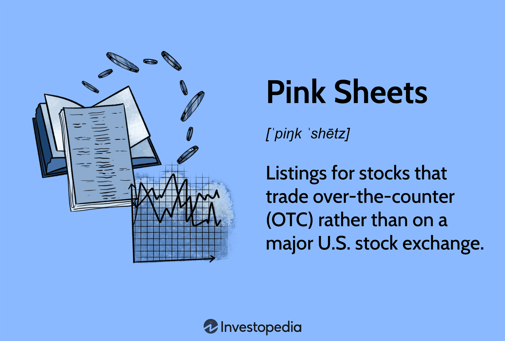

The stock market offers a plethora of trading avenues, with Over-the-Counter (OTC) Markets being one notable option. Within the hierarchy of OTC Markets, the Pink Sheets stand out as the most speculative and loosely regulated segment. Unlike major exchanges such as the New York Stock Exchange (NYSE) or NASDAQ, Pink Sheets do not impose stringent regulatory standards. This lack of oversight draws a variety of companies, ranging from legitimate foreign firms to more erratic penny stocks.

This article focuses on stock trading within the OTC Market, with a particular emphasis on Pink Sheets and the role of algorithmic trading. Pink Sheets present unique opportunities and challenges compared to more conventional markets. While the potential for high returns exists, the inherent risks are equally significant. Understanding the characteristics that differentiate Pink Sheets from other markets can aid traders in navigating potential pitfalls.



Furthermore, this article will examine the evolving landscape of algorithmic trading and its interaction with the complexities inherent in Pink Sheets. Algorithmic trading, which utilizes computer programs to automate and optimize trading strategies, is becoming increasingly prevalent even in less structured markets. These algorithms can offer a competitive edge by effectively managing the volatility and liquidity constraints typical of Pink Sheets transactions.

This guide is particularly suited to traders interested in less conventional markets and emerging trading techniques. By understanding the dynamics of Pink Sheets and the potential of algorithmic trading, investors can better position themselves to make informed decisions that balance risk and reward effectively.

## Table of Contents

## Understanding Pink Sheets in the OTC Market

Pink Sheets stocks operate within the Over-the-Counter (OTC) Market, which contrasts significantly with major stock exchanges such as the New York Stock Exchange (NYSE) and NASDAQ. Unlike these major exchanges, the OTC Market does not impose stringent listing requirements, offering an alternative platform for companies unable or unwilling to meet such standards.

Historically, Pink Sheets derived their name from the color of paper used for their listing. Today, these transactions take place electronically, reflecting advancements in trading technologies. Despite this modern shift, Pink Sheets remain a popular venue for many companies. The reasons can vary—with some firms being unable to satisfy the comprehensive financial and regulatory benchmarks required for listing on NYSE or NASDAQ, while others may deliberately choose this route to avoid the complexities and costs associated with compliance.

The Pink Sheets are characterized by lower regulatory oversight, which presents a double-edged sword for investors. On one hand, the absence of strict regulations can lead to higher levels of risk, due to increased potential for price manipulations and volatile market behavior. Nonetheless, this high-risk environment also offers potential rewards, especially for investors adept at navigating the nuances and who possess a keen understanding of market dynamics.

Within the Pink Sheets, a diverse range of entities can be found, from penny stocks that trade at low share prices to reputable foreign companies aiming to access U.S. investors without adhering fully to the stringent regulatory requirements imposed by the Securities and Exchange Commission (SEC). This diversity underscores the Pink Sheets as a distinctive component of the OTC Market, providing opportunities and challenges alike for participants in the stock market ecosystem.

## Why Companies Trade on the Pink Sheets

Companies trade on the Pink Sheets for several strategic reasons, often revolving around cost, accessibility, and regulatory flexibility. One primary motive is to eschew the significant financial and logistical burdens associated with meeting the stringent reporting and listing requirements of major exchanges, such as the New York Stock Exchange (NYSE) or NASDAQ. Compliance with these exchanges demands extensive documentation, routine disclosure, and adherence to rigorous financial standards, which can be particularly taxing for smaller or financially unstable entities.

For many companies, particularly those that are smaller in size or facing economic difficulties, the Pink Sheets serve as an accessible alternative platform. This market provides an opportunity for firms that are unable to meet the higher listing standards of more prestigious exchanges. These standards typically encompass market capitalization thresholds, minimum share prices, and specific financial performance indicators, among others.

Additionally, the Pink Sheets attract a diverse array of companies, including foreign businesses seeking to penetrate the U.S. market without undergoing the full extent of compliance required by the Securities and Exchange Commission (SEC). The reduced disclosure requirements of the Pink Sheets appeal to these firms as they can enter the market more expeditiously and with fewer hurdles. However, this flexibility often results in diminished transparency, presenting certain risks to investors. The lack of comprehensive financial information means investors must exert extra caution and perform rigorous due diligence when evaluating Pink Sheets-listed companies.

In summary, trading on the Pink Sheets allows companies to operate with less regulatory oversight and administrative burden, making it an attractive venue for those unable or unwilling to adhere to the complex regulations of major exchanges. This reduced scrutiny, while advantageous for companies, presents inherent challenges and risks for potential investors due to the limited availability of reliable financial data.

## Algorithmic Trading in the Pink Sheets Market

Algorithmic trading employs advanced computer algorithms to execute trading strategies at speeds and frequencies that human traders cannot match. Though popular across various stock markets, [algorithmic trading](/wiki/algorithmic-trading) in the OTC Pink Sheets market is uniquely challenging due to low [liquidity](/wiki/liquidity-risk-premium) and high [volatility](/wiki/volatility-trading-strategies). These characteristics can result in wider spreads and sudden price swings, creating additional complexity for automated strategies.

Despite these challenges, firms utilizing robust algorithms have a competitive advantage in navigating the Pink Sheets. Algorithms can process vast amounts of data quickly, identifying patterns and executing trades based on predefined criteria. However, in a less regulated market like the Pink Sheets, algorithms must be sophisticated enough to adapt to unpredictable market movements and limited information.

Algorithmic models in the Pink Sheets often incorporate behavioral finance principles to predict market trends. These models analyze investor sentiment and transaction data to gauge market mood and sentiment, offering a unique edge over manual trading. By understanding patterns and anomalies not typically evident in more structured markets, algorithms can exploit inefficiencies for potential high returns.

Incorporating [artificial intelligence](/wiki/ai-artificial-intelligence) (AI) further enhances these models, enabling them to learn and adapt to new market conditions autonomously. For instance, [machine learning](/wiki/machine-learning) algorithms can continuously improve by analyzing prior trades and outcomes. This adaptability is crucial in a market where conditions and sentiment can shift rapidly.

Here is an example of a simple trading algorithm using Python's pandas and NumPy libraries:

```python
import pandas as pd
import numpy as np

# Load historical stock data
data = pd.read_csv('pink_sheet_stock_data.csv')

# Calculate moving averages
data['SMA_50'] = data['Close'].rolling(window=50).mean()
data['SMA_200'] = data['Close'].rolling(window=200).mean()

# Generate signals
data['Signal'] = np.where(data['SMA_50'] > data['SMA_200'], 1, 0)

# Calculate returns
data['Daily_Returns'] = data['Close'].pct_change()
data['Strategy_Returns'] = data['Daily_Returns'] * data['Signal'].shift(1)

# Cumulative returns
cumulative_returns = (1 + data['Strategy_Returns']).cumprod()

print(cumulative_returns)
```

This Python code uses moving averages to generate buy and sell signals, which can be further refined with more complex models incorporating real-time data analysis and AI-driven insights.

Algorithmic trading's potential within the Pink Sheets market is substantial, especially for sophisticated investors capable of deploying advanced models and technologies. With ongoing technological advancements, the integration of AI and machine learning is likely to redefine tactics used in these speculative markets, offering potential for enhanced performance and greater profitability. However, traders need to remain aware of the market's inherent risks and adapt algorithms to respond effectively to the evolving landscape.

## Risks and Rewards of Trading Pink Sheets

Trading Pink Sheets involves inherent risks primarily due to the lower regulatory oversight, making these stocks susceptible to fraud and manipulation. The lack of stringent requirements can lead to potential opaqueness in financial disclosures, thereby increasing the possibility for reports to be misleading or incomplete. As such, traders venturing into Pink Sheets must be prepared to navigate the nuances of less oversight and variable transparency, contributing to heightened risk levels.

Stocks within the Pink Sheets are characterized by significant volatility, which can lead to large price swings. This volatility is partly due to the low liquidity of many of the stocks traded in this segment. With fewer active investors and lower trading volumes, even relatively small trades can have an outsized impact on stock prices. This environment creates a market where prices can be easily influenced by sentiment or speculative actions rather than fundamental analyses. Consequently, traders need to remain vigilant and monitor price changes closely.

Despite these risks, trading Pink Sheets offers substantial opportunities for significant gains, particularly when investing in undervalued stocks or companies within emerging industries. Many Pink Sheet stocks are from smaller or lesser-known companies that may not be on the radar of mainstream traders. These companies might possess innovative products or services poised for growth, providing potential high-reward scenarios for investors who identify them early.

However, given the limited publicly available information about companies in the Pink Sheets market, investors must conduct thorough due diligence. This diligence involves a deep dive into whatever financial and operational information is accessible, cross-referencing multiple sources to build a complete picture of a company's prospects. Investors might also need to track industry trends and competitor performances to gauge market positioning accurately.

To manage the inherent risks while capitalizing on opportunities, executing a well-thought-out trading strategy can be advantageous. Incorporating algorithmic support into trading decisions can help mitigate some risks by exploiting market inefficiencies more effectively than manual strategies. Algorithms can analyze large volumes of data quickly and execute trades at optimal moments, potentially smoothing out the impact of market volatility. Moreover, their ability to scan for unusual trading patterns or stock movements can alert traders to market manipulation or impending volatility spikes.

Overall, trading in the Pink Sheets market requires a strategic balance of risk management and opportunistic decision-making. Through diligent research, algorithmic trading strategies, and an understanding of market dynamics, investors can navigate this challenging but potentially rewarding segment.

## Regulatory Framework and Compliance

Pink Sheets, as part of the Over-the-Counter (OTC) Markets, operate under a regulatory framework overseen by both the U.S. Securities and Exchange Commission (SEC) and the Financial Industry Regulatory Authority (FINRA). These entities aim to maintain fair trading practices and investor protection, yet the requirements for Pink Sheets are distinctly less rigorous compared to major exchanges such as the New York Stock Exchange (NYSE) or NASDAQ. This lenient regulatory oversight translates to minimal filing requirements and limited financial disclosure mandates, thus presenting heightened risks alongside potential opportunities for investors.

Market makers serve as pivotal players within the OTC Market, including Pink Sheets. Their chief function is to ensure liquidity, facilitating the efficient execution of trades by maintaining a market for stocks that might otherwise be illiquid. While market makers stabilize stock prices by offering to buy or sell at publicly quoted prices, they also hold the power to impact price stability through their trading activities. This influence can occasionally lead to increased volatility, particularly in a market characterized by lower trading volumes and fewer transparent practices like the Pink Sheets.

In response to the challenges posed by low transparency and potential investor vulnerability, recent regulatory changes have focused on enhancing transparency within the Pink Sheets market. For instance, the SEC has rolled out initiatives to improve the availability of financial and business information concerning OTC-traded companies. Despite these efforts, accessing reliable and comprehensive data about companies listed on Pink Sheets remains a challenge, as many do not meet the stringent information disclosure required by larger exchanges.

Investors looking to trade in the Pink Sheets market must stay informed about the evolving regulatory environment. Regulatory updates may affect trade executions and necessitate ongoing compliance. Understanding these dynamics is essential not only to navigate the complexities of OTC trading but also to mitigate risks associated with investing in an environment with less stringent oversight. Continuous monitoring of regulatory developments and compliance requirements will enable investors to adapt their strategies effectively, minimize exposure to fraudulent practices, and exploit any informational advantages that the Pink Sheets may offer.

## Conclusion

The Pink Sheets present a unique opportunity within the stock trading landscape by balancing high risk with potentially high rewards. This segment of the market, characterized by its less stringent regulatory standards, offers openings for discerning investors who can navigate its complexities effectively. Algorithmic trading, though challenging within the Pink Sheets market due to its inherent unpredictability, can be a powerful tool when harnessed correctly. Implementing well-structured and robust systems can lead to advantageous outcomes, especially as algorithms continue to benefit from technological advancements.

As technology evolves, a new frontier is emerging where sophisticated algorithmic models can analyze and react to market cap variances with unprecedented speed and accuracy. This capability is particularly valuable in the Pink Sheets market, enabling algorithms to capitalize on fleeting opportunities that are often elusive to manual traders. Such technological prowess is increasingly essential, as it not only enhances trading efficiency but also provides a competitive edge in this speculative market sector.

Investors aiming to succeed in trading Pink Sheets stocks must remain vigilant regarding regulatory changes and market trends. Given the dynamic nature of financial regulations and market operations, keeping abreast of these developments is crucial for making informed investment decisions. Furthermore, employing a comprehensive approach—combining advanced data analysis, continuous learning, and strategic risk management—can help mitigate the inherent risks associated with Pink Sheets trading.

With the appropriate strategies and tools, trading in the Pink Sheets can yield rewarding results. This requires a meticulous approach, where due diligence, technological leverage, and market insight converge to maximize investment potential. For astute investors willing to embrace these challenges, the Pink Sheets offer a promising avenue for achieving substantial returns.

## References & Further Reading

[1]: Bergstra, J., Bardenet, R., Bengio, Y., & Kégl, B. (2011). ["Algorithms for Hyper-Parameter Optimization."](https://dl.acm.org/doi/10.5555/2986459.2986743) Advances in Neural Information Processing Systems 24.

[2]: ["Advances in Financial Machine Learning"](https://www.amazon.com/Advances-Financial-Machine-Learning-Marcos/dp/1119482089) by Marcos Lopez de Prado

[3]: ["Evidence-Based Technical Analysis: Applying the Scientific Method and Statistical Inference to Trading Signals"](https://www.amazon.com/Evidence-Based-Technical-Analysis-Scientific-Statistical/dp/0470008741) by David Aronson

[4]: ["Machine Learning for Algorithmic Trading"](https://github.com/stefan-jansen/machine-learning-for-trading) by Stefan Jansen

[5]: ["Quantitative Trading: How to Build Your Own Algorithmic Trading Business"](https://www.amazon.com/Quantitative-Trading-Build-Algorithmic-Business/dp/1119800064) by Ernest P. Chan