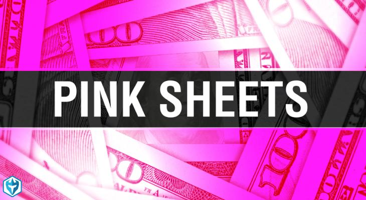

## Table of Contents

## What are Pink Sheets and how do they differ from major stock exchanges?

Pink Sheets, also known as the Pink Market, is a place where some companies' stocks are traded. These companies are often smaller and might not meet the rules to be listed on bigger stock exchanges like the New York Stock Exchange (NYSE) or NASDAQ. The Pink Sheets are run by a company called OTC Markets Group, and they got their name because the stock prices used to be printed on pink paper.

The main difference between Pink Sheets and major stock exchanges is the level of rules and information. Major stock exchanges have strict rules that companies must follow, like sharing a lot of financial information with the public. This helps investors make better decisions. On the other hand, Pink Sheets have fewer rules, so companies don't have to share as much information. This can make it riskier for investors because it's harder to know if a company is doing well or not.

## How can one start trading on the Pink Sheets market?

To start trading on the Pink Sheets market, you first need to find a broker that allows trading on this market. Not all brokers offer this service, so you might need to do some research to find one that does. Once you have chosen a broker, you will need to open an account with them. This usually involves filling out some forms and providing personal information, like your name, address, and social security number. After your account is set up, you can deposit money into it to start trading.

Once your account is funded, you can start looking for companies listed on the Pink Sheets that you want to buy or sell. You can do this through your broker's trading platform, which will show you the current prices and allow you to place orders. Remember, trading on the Pink Sheets can be riskier than trading on major stock exchanges because there is less information available about the companies. Always do your research and be careful with your investments.

## What are the risks associated with trading on the Pink Sheets?

Trading on the Pink Sheets can be riskier than trading on bigger stock exchanges. One big reason is that the companies on the Pink Sheets don't have to share as much information about their business. This means it's harder for you to know if a company is doing well or if it's in trouble. Without good information, you might make bad choices about which stocks to buy or sell.

Another risk is that the Pink Sheets have less trading activity. This means there might not be many people wanting to buy or sell the stocks you're interested in. When this happens, it can be hard to sell your stocks quickly, and the price can change a lot. This can make your investments more unpredictable and risky. Always be careful and do your homework before trading on the Pink Sheets.

## What types of companies are typically listed on the Pink Sheets?

The Pink Sheets usually have smaller companies that don't meet the rules to be on bigger stock exchanges. These can be new companies that are just starting out and don't have a lot of money yet. They might also be companies from other countries that want to trade their stocks in the United States but don't want to follow all the strict rules of the bigger exchanges.

Sometimes, you can also find companies on the Pink Sheets that used to be on bigger exchanges but got kicked off because they didn't follow the rules. These companies might be in financial trouble or have other problems. Because of this, trading on the Pink Sheets can be riskier, but it can also be a place where you might find good deals if you're willing to take the chance.

## How does the lack of SEC oversight affect trading on the Pink Sheets?

The lack of SEC oversight on the Pink Sheets means that companies don't have to follow as many rules as they would on bigger stock exchanges. The SEC, or Securities and Exchange Commission, is like a watchdog that makes sure companies tell the truth about their money and business. On the Pink Sheets, companies can share less information, which makes it harder for people who want to buy their stocks to know if the company is doing well or not. This can make trading riskier because you might not have all the facts you need to make good choices.

Because there's less oversight, the Pink Sheets can be a place where some companies try to trick people. Without the SEC watching closely, it's easier for bad companies to hide problems or lie about how much money they're making. This means that people who trade on the Pink Sheets need to be extra careful and do a lot of research before they buy any stocks. It's important to understand that while there can be good opportunities on the Pink Sheets, the risks are higher because of the lack of strict rules and oversight.

## What are the key differences between Pink Sheets and OTCQB or OTCQX markets?

Pink Sheets, OTCQB, and OTCQX are all part of the over-the-counter (OTC) markets, but they have some big differences. Pink Sheets have the least rules and oversight. Companies on the Pink Sheets don't have to share a lot of information about their business, which can make it riskier for people who want to buy their stocks. This market is for smaller companies that might not meet the rules to be on bigger stock exchanges. Because there's less oversight, it's easier for bad companies to hide problems or lie about their money.

OTCQB and OTCQX are a bit different because they have more rules than the Pink Sheets. OTCQB is for early-stage and developing companies that want to show they are more transparent and follow better practices. They have to share more information than Pink Sheets companies, but it's still less than what's needed on big stock exchanges. OTCQX is even stricter and is for more established companies, often from other countries, that want to trade in the U.S. They have to meet high financial standards and follow rules about sharing information. Both OTCQB and OTCQX are seen as safer places to trade than the Pink Sheets because of these extra rules.

## How can investors research and evaluate companies on the Pink Sheets?

To research and evaluate companies on the Pink Sheets, investors need to be extra careful because these companies don't have to share a lot of information. Start by looking at the company's website to see if they post any financial reports or news. You can also check out websites like OTC Markets, where companies might share more details about their business. Reading news articles and press releases can give you more clues about how the company is doing. Sometimes, talking to other investors or joining online forums can help you learn more about the company and see what others think.

It's also important to look at the company's history and any past problems they might have had. You can use tools like Google to find out if the company has been in the news for bad reasons or if they have faced legal issues. Checking the company's financial statements, if they are available, can tell you if they are making money or losing it. Remember, because Pink Sheets companies don't have to follow strict rules, it's harder to find all this information. So, take your time, be patient, and don't rush into buying stocks without knowing as much as you can.

## What are some common strategies for trading on the Pink Sheets?

One common strategy for trading on the Pink Sheets is to focus on finding undervalued companies. This means looking for companies that are selling for less than they are really worth. To do this, you need to do a lot of research to understand the company's business and see if it has good potential to grow. You might find a company that is not well-known but has a strong product or service. If you believe in the company's future, you can buy its stock and hold onto it, hoping that as the company grows, the stock price will go up.

Another strategy is to trade based on news and events. Companies on the Pink Sheets can be affected a lot by news, like new products, partnerships, or financial reports. If you keep up with the news and understand how it might affect the company, you can buy stocks when good news comes out and sell them when the price goes up. This can be risky because the news can be hard to predict, but if you're good at spotting trends, it can be a way to make money.

Lastly, some people use a strategy called momentum trading. This means buying stocks that are already going up in price and hoping they will keep going up. You need to watch the stock prices closely and be ready to sell quickly if the price starts to drop. This can be exciting but also very risky because the prices on the Pink Sheets can change a lot in a short time. Always remember to be careful and do your homework before you start trading.

## How do liquidity and volatility impact trading on the Pink Sheets?

Liquidity and volatility are two big things that can affect trading on the Pink Sheets. Liquidity means how easy it is to buy or sell a stock. On the Pink Sheets, there are often fewer people wanting to buy or sell stocks compared to bigger stock exchanges. This means it can be hard to sell your stocks quickly if you need to. You might have to wait a long time or sell them for less money than you wanted. This can make trading on the Pink Sheets riskier because you might not be able to get your money out when you need it.

Volatility means how much the price of a stock can change in a short time. On the Pink Sheets, the prices can go up and down a lot because there are fewer people trading and less information about the companies. This can be good if you buy a stock and the price goes up quickly, but it can also be bad if the price drops suddenly. Because of this, trading on the Pink Sheets can be exciting but also very risky. You need to be ready for big changes and think carefully about when to buy and sell.

## What role do market makers play in the Pink Sheets market?

Market makers are important in the Pink Sheets market. They are like middlemen who help people buy and sell stocks. When you want to buy a stock, the market maker will sell it to you from their own supply. If you want to sell a stock, they will buy it from you and add it to their supply. This helps make sure there are always stocks available to trade, even if not many people are buying or selling.

Because the Pink Sheets have less trading activity than bigger stock exchanges, market makers are really important. They help keep the market running smoothly by making sure there is always someone to trade with. Without them, it would be much harder to buy and sell stocks on the Pink Sheets. They also help set the prices for the stocks, which can change a lot because of the low liquidity and high volatility in this market.

## How can advanced traders use technical analysis on Pink Sheets stocks?

Advanced traders can use technical analysis on Pink Sheets stocks to try to predict where the stock prices might go next. They look at charts and use different tools to see patterns in how the stock has moved in the past. For example, they might use moving averages to see if the stock is going up or down over time. They could also use indicators like the Relative Strength Index (RSI) to see if a stock is overbought or oversold, which can help them decide when to buy or sell. Because Pink Sheets stocks can be very volatile, technical analysis can be a useful way to make sense of the quick changes in price.

However, using technical analysis on Pink Sheets stocks can be tricky because these stocks often have low liquidity. This means there might not be enough trading happening to make the charts and indicators reliable. Traders need to be careful and use other information, like news about the company, along with their technical analysis. By combining these tools, advanced traders can make better guesses about where the stock price might go next, but they should always remember that trading on the Pink Sheets is riskier than on bigger stock exchanges.

## What are the tax implications of trading on the Pink Sheets?

When you trade on the Pink Sheets, you need to think about taxes. If you make money from selling stocks, you have to pay capital gains tax. This tax depends on how long you held the stock before selling it. If you held it for less than a year, it's a short-term capital gain, and you pay your regular income tax rate on it. If you held it for more than a year, it's a long-term capital gain, and the tax rate is usually lower. So, knowing how long you've held your stocks can help you figure out how much tax you'll owe.

Also, if you lose money on your Pink Sheets trades, you can use those losses to lower your taxes. This is called a capital loss, and you can use it to reduce your taxable income. You can even carry over losses to future years if they're more than your gains in the current year. But remember, the rules can be different depending on where you live, so it's a good idea to talk to a tax professional to make sure you're doing everything right.

## References & Further Reading

[1]: Bergstra, J., Bardenet, R., Bengio, Y., & Kégl, B. (2011). ["Algorithms for Hyper-Parameter Optimization."](https://dl.acm.org/doi/10.5555/2986459.2986743) Advances in Neural Information Processing Systems 24.

[2]: ["Advances in Financial Machine Learning"](https://www.amazon.com/Advances-Financial-Machine-Learning-Marcos/dp/1119482089) by Marcos Lopez de Prado

[3]: ["Evidence-Based Technical Analysis: Applying the Scientific Method and Statistical Inference to Trading Signals"](https://www.amazon.com/Evidence-Based-Technical-Analysis-Scientific-Statistical/dp/0470008741) by David Aronson

[4]: ["Machine Learning for Algorithmic Trading"](https://github.com/stefan-jansen/machine-learning-for-trading) by Stefan Jansen

[5]: ["Quantitative Trading: How to Build Your Own Algorithmic Trading Business"](https://www.amazon.com/Quantitative-Trading-Build-Algorithmic-Business/dp/1119800064) by Ernest P. Chan