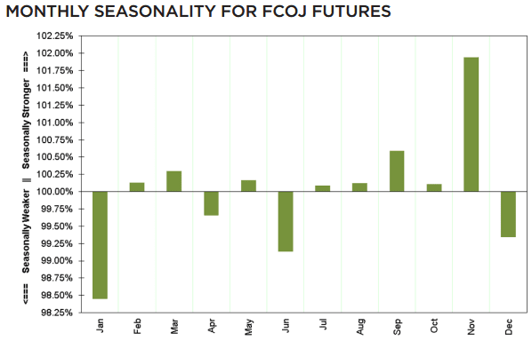

## Table of Contents

## What are orange juice options and how do they work?

Orange juice comes in different types, like fresh squeezed, from concentrate, and not-from-concentrate. Fresh squeezed orange juice is made by squeezing fresh oranges. It tastes the best but doesn't last long. From concentrate orange juice starts as fresh juice, then water is taken out to make it smaller. Later, you add water back to drink it. Not-from-concentrate juice is also made from fresh oranges, but it is treated to last longer without losing water.

Each type of orange juice works differently. Fresh squeezed juice needs to be drunk soon after it's made because it can go bad quickly. From concentrate juice is easy to store and carry because it's smaller before you add water. Not-from-concentrate juice is good because it lasts longer than fresh squeezed, but you don't need to add water like with from concentrate juice. Depending on what you need, you can pick the best type of orange juice for you.

## What are the basic terms and concepts I need to know before trading orange juice options?

Trading orange juice options involves understanding a few basic terms and concepts. An option is a contract that gives you the right, but not the obligation, to buy or sell orange juice at a specific price before a certain date. There are two types of options: calls and puts. A call option lets you buy orange juice, while a put option lets you sell it. The price at which you can buy or sell is called the strike price, and the date by which you must decide is the expiration date. The cost of the option itself is known as the premium, which you pay to the seller of the option.

Another important concept is the underlying asset, which in this case is orange juice. The value of the option depends on the price of orange juice. If you think the price of orange juice will go up, you might buy a call option. If you think it will go down, you might buy a put option. Options can be used for speculation, where you try to make money from price changes, or for hedging, where you try to protect against price changes. Understanding these basics will help you make informed decisions when trading orange juice options.

## How can I start trading orange juice options?

To start trading orange juice options, you first need to open an account with a brokerage firm that offers commodity options trading. Choose a reputable broker that provides access to the futures and options markets. Once your account is set up, you'll need to fund it with enough money to cover the premiums of the options you want to trade, plus any additional margin requirements set by the broker. It's important to understand the fees and commissions that the broker charges, as these can affect your overall profitability.

After setting up your account, you can start looking at the available orange juice options. These are listed on exchanges like the Intercontinental Exchange (ICE). You'll see different strike prices and expiration dates for both call and put options. Decide if you think the price of orange juice will go up or down, and then buy the corresponding option. For example, if you believe the price will rise, you might buy a call option. Always keep an eye on market news and trends that could affect orange juice prices, like weather conditions in major orange-growing regions or changes in consumer demand. Remember, trading options involves risk, so it's wise to start small and learn as you go.

## What are the risks associated with trading orange juice options?

Trading orange juice options can be risky. The price of orange juice can go up and down a lot because of things like bad weather, diseases that hurt orange trees, or changes in what people want to buy. If you guess wrong about which way the price will move, you could lose the money you spent on the option. This money is called the premium, and you don't get it back if the option doesn't work out.

Another risk is that options have an expiration date. If the price of orange juice doesn't move the way you thought it would before the option expires, the option becomes worthless. This means you lose the money you paid for it. Trading options also involves using borrowed money, which is called margin. If things go badly, you might have to pay back more money than you expected, which can be a big problem. It's important to understand these risks and maybe start with small amounts until you learn more about how options work.

## How does the orange juice futures market influence options trading?

The orange juice futures market is really important for people who trade options. Futures are like bets on what the price of orange juice will be in the future. When people buy or sell futures, it can change the price of orange juice. This means that if the price of orange juice goes up or down because of futures trading, the value of options will change too. If you have an option to buy orange juice at a certain price, and the futures market makes the price go up, your option becomes more valuable because you can buy the juice cheaper than the new higher price.

Understanding the futures market can help you make better choices when trading options. For example, if you see that a lot of people are buying futures because they think the price of orange juice will go up, you might want to buy a call option. This way, you can make money if the price does go up like they expect. On the other hand, if people are selling futures because they think the price will go down, you might want to buy a put option to make money if the price falls. The futures market gives you clues about where the price might be headed, which can help you decide what kind of option to buy.

## What strategies can beginners use when trading orange juice options?

For beginners, starting with simple strategies like buying call or put options can be a good idea. If you think the price of orange juice will go up, you can buy a call option. This gives you the right to buy orange juice at a set price before a certain date. If the price goes up like you thought, you can make money by buying the juice cheaper than it's selling for and then selling it at the higher price. If you think the price will go down, you can buy a put option. This lets you sell orange juice at a set price before a certain date. If the price goes down, you can buy the juice at the lower price and then sell it at the higher price you set with the option.

Another strategy for beginners is to start small and learn as you go. Don't spend a lot of money on options until you understand how they work. You can also try using a demo account to practice trading without risking real money. Watching the futures market can give you clues about where the price of orange juice might be headed. This can help you decide when to buy or sell options. Remember, options have an expiration date, so you need to keep an eye on the calendar and be ready to act before your options expire.

## How do seasonal factors affect orange juice options pricing?

Seasonal factors can really change the price of orange juice options. Oranges mostly grow in certain times of the year, like winter in places like Florida. When it's time for the oranges to be picked, there's a lot of them, so the price of orange juice can go down. But if something goes wrong, like a big storm that hurts the oranges, the price can go up because there's less orange juice to go around. People who trade options need to watch these seasonal changes because they can make the options they buy or sell more or less valuable.

Also, the time of year can change how much people want to buy orange juice. In the summer, more people might want to drink orange juice because it's hot out. This can make the price go up. But in the winter, people might not want it as much, so the price could go down. Traders need to think about these things when they decide to buy or sell options. If they think the price will go up because of the season, they might buy a call option. If they think it will go down, they might buy a put option.

## What are the key indicators to watch when trading orange juice options?

When trading orange juice options, it's important to keep an eye on the price of orange juice futures. These futures prices can give you clues about where the price of orange juice might be going. If you see the futures price going up, it might be a good time to buy a call option because you think the price of orange juice will keep going up. On the other hand, if the futures price is going down, you might want to buy a put option because you think the price will keep falling.

Another key indicator to watch is the weather in places where oranges are grown, like Florida and Brazil. Bad weather, like hurricanes or freezes, can hurt the orange trees and make less orange juice available. This can make the price go up. Also, keep an eye on any diseases that can affect orange trees, like citrus greening. If there's news about these problems, it can change the price of orange juice and affect your options.

## How can I use technical analysis in trading orange juice options?

Technical analysis can help you make better choices when trading orange juice options by looking at past price movements and patterns. You can use charts to see how the price of orange juice has changed over time. By looking for patterns like trends, support and resistance levels, and chart formations, you can try to guess where the price might go next. For example, if you see the price of orange juice going up and up, you might think it will keep going up, so you could buy a call option. On the other hand, if the price seems to be going down a lot, you might buy a put option because you think it will keep falling.

You can also use technical indicators like moving averages, the Relative Strength Index (RSI), and the Moving Average Convergence Divergence (MACD) to help you make decisions. A moving average can show you the average price over a certain time, which can help you see if the price is going up or down. The RSI can tell you if the price is too high or too low, which might mean it's time to buy or sell. The MACD can show you when the price might change direction. By using these tools, you can get a better idea of when to buy or sell your orange juice options.

## What advanced strategies can experienced traders use in the orange juice options market?

Experienced traders in the orange juice options market might use a strategy called a straddle. This means buying both a call option and a put option at the same time, with the same strike price and expiration date. The idea is to make money no matter which way the price of orange juice moves. If the price goes up a lot, the call option becomes more valuable. If the price goes down a lot, the put option becomes more valuable. This strategy works best when you think the price will move a lot, but you're not sure which way.

Another advanced strategy is called a spread. This involves buying and selling different options at the same time. For example, you might buy a call option with a lower strike price and sell a call option with a higher strike price. This is called a bull call spread, and it can help you make money if the price of orange juice goes up, but not as much as if you just bought the call option. Spreads can help limit your risk because you're both buying and selling options, but they also limit how much money you can make. Experienced traders use these strategies to take advantage of their knowledge of the market and manage their risk better.

## How do global events and weather patterns impact orange juice options?

Global events and weather patterns can have a big impact on the price of orange juice, which in turn affects orange juice options. When there are big storms like hurricanes in places where oranges grow, like Florida, they can damage the orange trees and make less orange juice available. This can make the price of orange juice go up because there's not as much to go around. Also, if there are big changes in how much people want to buy orange juice around the world, like if a new health trend makes more people want to drink it, the price can go up too. Traders need to watch these things because they can change how much their options are worth.

Weather patterns are especially important because they can change from year to year. For example, if there's a drought in Brazil, another big place where oranges grow, it can hurt the orange trees and make less orange juice. This can push the price up. On the other hand, if the weather is good and there's a lot of oranges, the price might go down because there's more orange juice to go around. Traders who understand how these weather patterns work can make better guesses about where the price of orange juice might go, which helps them decide when to buy or sell their options.

## What are the tax implications and regulatory considerations for trading orange juice options?

When you trade orange juice options, you need to think about taxes. The money you make from trading options is usually seen as capital gains by the tax people. If you hold your options for less than a year before selling them, the gains are short-term and taxed like your regular income. If you hold them for more than a year, the gains are long-term and might be taxed at a lower rate. You also need to keep good records of all your trades because you have to report them on your tax return. It's a good idea to talk to a tax expert to make sure you're doing everything right.

There are also rules you need to follow when trading options. The Commodity Futures Trading Commission (CFTC) and the National Futures Association (NFA) are the main groups that watch over the trading of commodity options like orange juice. They make sure that everyone follows the rules and that the market is fair. You need to know these rules and make sure you're following them. If you don't, you could get in trouble. It's also important to use a good broker who knows all the rules and can help you stay on the right side of them.

## What are the challenges and considerations in orange juice trading?

The [volatility](/wiki/volatility-trading-strategies) in orange juice markets can lead to both profitable opportunities and significant risks for traders. Understanding the distinctive characteristics of orange juice options and devising appropriate trading strategies are crucial for navigating this market effectively.

One fundamental aspect is the specification of orange juice options contracts, which are standardized to correspond with 15,000 pounds of frozen concentrated orange juice (FCOJ) solids. The strike price, which is the predetermined price at which the underlying asset can be bought or sold, plays a pivotal role in defining the potential profitability or loss associated with an option. Traders must select strike prices strategically, considering their expectations of future price movements and their risk tolerance. 

Beyond strike prices, the impact of time decay, or theta, is a critical consideration in options trading. Time decay reflects the erosion of an option's value as it approaches its expiration date. This erosion occurs because the likelihood of the option being unprofitable increases as the expiration date nears. Mathematically, time decay can be expressed as:

$$
\Theta = -\frac{\partial V}{\partial t}
$$

where $V$ is the option's value and $t$ is the time remaining until expiration. Understanding and managing time decay is crucial for options traders, particularly when constructing strategies that involve holding long options positions.

Continuous monitoring of relevant market information is imperative. This includes keeping abreast of the latest news in the orange juice industry, production reports from key growing regions like Florida and Brazil, and international trade policies that may influence demand and supply dynamics. 

To ensure informed decision-making, traders can leverage data analytics and [machine learning](/wiki/machine-learning) algorithms to process and interpret large volumes of data from diverse sources. For instance, Python libraries such as pandas and NumPy can be employed to analyze historical price data and forecast future trends based on economic indicators and weather patterns. Using a code snippet:

```python
import pandas as pd
import numpy as np

# Load historical price data into a DataFrame
data = pd.read_csv('orange_juice_prices.csv')

# Calculate historical volatility as an indicator
volatility = data['Price'].pct_change().rolling(window=30).std()

# Analyze correlation with weather patterns
weather_data = pd.read_csv('weather_data.csv')
correlation = data['Price'].corr(weather_data['Temperature'])
```

Prioritizing these considerations can enable traders to approach orange juice options trading with a comprehensive strategy, balancing the potential for high returns with the need for risk management.

## References & Further Reading

[1]: Jarrow, R. A., & Turnbull, S. M. (1996). ["Derivative Securities."](https://archive.org/details/derivativesecuri0000jarr) Oxford University Press.

[2]: Hull, J. C. (2012). ["Options, Futures, and Other Derivatives"](https://www.semanticscholar.org/paper/Options%2C-Futures%2C-and-Other-Derivatives-Hull/89bdee500c8623864fc9eb7a471546aa713acc44) (9th ed.). Pearson.

[3]: Peters, E., & Jones, H. (1995). ["Algorithmic Trading: Winning Strategies and Their Rationale."](https://www.wiley.com/en-us/Algorithmic+Trading%3A+Winning+Strategies+and+Their+Rationale-p-9781118460146) John Wiley & Sons.

[4]: Mukherjee, A. (2018). ["Machine Learning for Commodity Trading."](https://scholar.google.com/citations?user=T4iBN5cAAAAJ&hl=en) Proceedings of the 24th ACM SIGKDD International Conference on Knowledge Discovery & Data Mining. 

[5]: Yadav, N., Kumar, A., & Choudhary, S. (2017). ["Algorithmic Aspects of Speed and Efficiency in Algorithmic Trading: A Literature Review."](https://link.springer.com/article/10.1007/s13738-024-03142-3) SAGE Open.