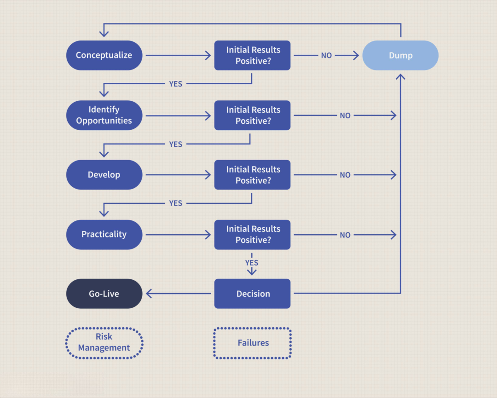

Financial markets have evolved immensely over the years, offering a plethora of investment opportunities for both individuals and institutions. These markets serve as platforms for trading a variety of financial instruments, including stocks, bonds, commodities, and currencies. As a crucial component of economic systems, financial markets facilitate the efficient allocation of resources and contribute to economic growth and stability.

Investment planning plays a vital role in navigating these markets, enabling investors to leverage the available opportunities to achieve their financial goals. It involves setting clear financial objectives and crafting strategies to reach them, taking into account factors such as risk tolerance, investment horizon, and market conditions. A disciplined investment plan helps mitigate risks and optimize returns.



With technological advancements, the trading landscape has seen the rise of algorithmic trading, commonly referred to as algo trading. This approach uses sophisticated computer algorithms to execute trades at speeds and frequencies that far exceed human capabilities. By analyzing market data and statistical models, algo trading can make informed decisions quickly, reducing the impact of human emotions on trading outcomes.

This article will explore the intersection of investment planning, trading strategies, and algorithmic trading within financial markets. Each component plays a critical role, and understanding their interactions can provide valuable insights into how they contribute to achieving financial success.

## Table of Contents

## Understanding Financial Markets

Financial markets are integral components of the global economy, serving as structured platforms where various financial instruments such as securities, commodities, derivatives, and currencies are actively traded. These markets are essential in facilitating the optimal distribution of resources, thereby playing a pivotal role in economic stability and growth. Their ability to bring together buyers and sellers from across the globe enhances liquidity and provides opportunities for price discovery, which is critical for the efficient functioning of the economy.

The primary types of financial markets are stock markets, bond markets, forex markets, and derivatives markets, each serving unique functions and attracting different participants. The stock market is a venue where shares of publicly listed companies are bought and sold, offering investors a platform to earn returns through dividends and capital gains. It is vital for the allocation of capital to firms, allowing them to grow and contribute to economic development.

Bond markets, on the other hand, deal with the issuance and trading of debt securities, providing a means for governments, municipalities, and corporations to raise capital. They are critical for securing long-term financing and feature various instruments, including government bonds, corporate bonds, and municipal bonds, each varying in risk and return profiles.

The [forex](/wiki/forex-system) market is the largest financial market globally, with trillions of dollars traded daily. It involves the exchange of currencies and is crucial for international trade and investments, enabling businesses and governments to manage foreign exchange risk through various currency pairs.

Derivatives markets trade contracts whose value is derived from underlying assets like commodities, currencies, interest rates, or stocks. These markets are vital for hedging risk, leveraging positions, and optimizing portfolio returns. Instruments such as options, futures, and swaps are commonly traded, providing sophisticated investors with strategies to safeguard against price [volatility](/wiki/volatility-trading-strategies).

For investors, comprehending these market dynamics is fundamental to strategizing and making informed decisions. Market functioning relies heavily on economic indicators, geopolitical events, interest rates, and corporate performances, among others. Therefore, investors must remain informed and continuously monitor these factors to devise effective investment strategies. Moreover, understanding the interplay between these diverse markets is crucial for diversification, as each responds differently to various economic conditions, thus spreading risk and enhancing potential returns.

In summary, financial markets are complex ecosystems that require a solid understanding of their mechanisms and interactions to navigate effectively. Their efficient operation underpins economic progress, and mastering their complexities can empower investors to make strategic choices aligned with their financial goals.

## Investment Planning in Financial Markets

Investment planning in financial markets is an essential component of achieving financial stability and growth. It is the process of identifying and setting financial goals and creating a structured plan to accomplish these objectives. A key starting point in investment planning is understanding one's risk tolerance, investment horizon, and the specific financial goals one aims to achieve. Risk tolerance refers to the degree of variability in investment returns that an investor is willing to withstand. It is influenced by factors such as age, income, financial responsibilities, and overall comfort with risk.

Investment horizon, on the other hand, is the time period over which one expects to invest before needing to access the funds. Shorter investment horizons may necessitate more conservative strategies, while longer horizons might allow for more aggressive approaches, capitalizing on the market's long-term growth potential. Clearly defined financial goals, whether they are for retirement, purchasing a home, or funding education, guide the investment process by establishing clear targets to tailor strategies.

Central to investment planning are key aspects such as asset allocation, diversification, and regular portfolio reviews. Asset allocation involves spreading investments across various asset classes—such as equities, bonds, and cash equivalents—to optimize the balance between risk and return. Diversification, a fundamental principle of investing, seeks to mitigate risk by constructing a portfolio composed of diverse investments within and across these asset classes. This approach reduces the impact that a single underperforming investment may have on overall portfolio performance.

Regular portfolio reviews are crucial for maintaining alignment with financial goals and adapting to new market conditions or changes in personal circumstances. Conducting these reviews allows investors to rebalance portfolios, ensuring the intended asset allocation is maintained, and adjusts for shifts in risk tolerance or investment horizon. 

A well-structured investment plan serves as a roadmap, helping investors manage risks and capitalize on market opportunities. By clearly outlining objectives and systematically assessing progress, investment planning enables individuals and institutions to make informed decisions and remain resilient against market volatility. Through disciplined planning and execution, investors can better position themselves to achieve their financial aspirations.

## Trading Strategy: Essentials for Success

A trading strategy is a systematically crafted approach aimed at optimizing buying and selling activities in securities markets to achieve financial returns. This process entails the skillful use of both technical and fundamental analyses to glean insights and inform decisions. Technical analysis involves studying price patterns and market trends using charts and statistical indicators to predict future movements. Commonly employed techniques include moving averages, Bollinger Bands, and the Relative Strength Index (RSI). On the other hand, [fundamental analysis](/wiki/fundamental-analysis) focuses on evaluating a security's intrinsic value based on financial statements, industry conditions, and macroeconomic factors.

One of the prevalent strategies is trend-following, which involves identifying and investing in securities that exhibit persistent upward or downward trajectories. This approach capitalizes on the premise that asset prices are more likely to continue moving in the same direction. Mean reversion, another widely used strategy, operates on the notion that asset prices will eventually revert to their historical averages after significant deviations. Traders using this strategy seek out securities that have diverged considerably from their average valuations.

Momentum trading centers on exploiting the continuance of an existing trend within the market. Traders look for securities that have demonstrated recent price strength and seek to buy in anticipation of further [momentum](/wiki/momentum). This strategy is based on the belief that securities that have performed well recently will continue to do so in the short term.

Developing a robust trading plan is paramount for achieving consistency and mitigating emotional decision-making. It involves defining clear entry and [exit](/wiki/exit-strategy) points, establishing risk management protocols, and setting realistic profit targets. This structured approach helps traders remain disciplined, reducing the likelihood of impulsive decisions driven by emotions such as fear and greed. A well-constructed plan also facilitates systematic evaluation and adjustments, allowing traders to optimize their strategies based on performance data and market conditions. 

For those interested in coding their strategies, Python offers a robust platform for [algorithmic trading](/wiki/algorithmic-trading), backed by numerous libraries such as Pandas, NumPy, and TA-Lib. Implementing a basic trading rule could look like the following:

```python
import talib
import numpy as np

# Assuming 'data' is a Pandas DataFrame with a 'close' column for closing prices
short_window = 40
long_window = 100

signals = np.zeros(data.shape[0])
positions = np.zeros(data.shape[0])

# Calculate moving averages
short_mavg = talib.SMA(data['close'], timeperiod=short_window)
long_mavg = talib.SMA(data['close'], timeperiod=long_window)

# Generate signals
signals[short_mavg > long_mavg] = 1
signals[short_mavg < long_mavg] = -1

# Simple implementation decision (1: Buy, -1: Sell, 0: Hold)
positions[1:] = signals[1:] - signals[:-1]
```

This example demonstrates a basic crossover strategy where signals are generated when a short-term moving average crosses above or below a long-term moving average. Such coding strategies allow for [backtesting](/wiki/backtesting) against historical data, aiding in strategy refinement and objective evaluation before deployment in live markets.

 to Algorithmic Trading

Algorithmic trading, commonly known as algo trading, refers to the use of computer programs or algorithms to automate the trading of financial instruments at speeds and frequencies that surpass human capabilities. These algorithms make decisions based on predefined criteria, enabling trades to be executed with minimal human intervention. This technology-driven approach has fundamentally transformed the landscape of trading, offering significant advantages over traditional methods.

Historically, algo trading was under the purview of institutional investors like hedge funds, investment banks, and large financial firms due to the substantial technological infrastructure and expertise required. However, recent advances in technology and the proliferation of trading platforms have gradually made algo trading accessible to retail traders. This democratization allows individual investors to employ sophisticated strategies that were once exclusive to large institutions.

One of the primary advantages of algorithmic trading is its ability to eliminate the psychological biases and emotional influences that often affect human traders. By relying on quantitative analysis and data-driven strategies, algorithms ensure that trading decisions remain consistent and objective, free from the common pitfalls of human emotion such as fear and greed. This objectivity is crucial in maintaining discipline and ensuring that trades are executed strictly according to the predefined strategy.

The most compelling benefit of algorithmic trading is its speed. Algorithms can analyze a vast array of market variables in real-time and execute trades within milliseconds, allowing traders to capitalize on short-lived market opportunities. This high-speed execution is crucial in markets where prices can fluctuate rapidly, with volatility presenting both challenges and opportunities for traders.

Moreover, algorithmic trading leverages statistical and mathematical models to optimize trading strategies. By analyzing historical data and identifying patterns, these models can predict future price movements and inform trading decisions. Techniques such as regression analysis, [machine learning](/wiki/machine-learning), and neural networks are employed to enhance the precision and efficacy of these strategies. For example, a simple moving average crossover strategy could be implemented using Python:

```python
import pandas as pd

# Fetch historical price data
data = pd.read_csv('historical_prices.csv')

# Calculate moving averages
data['SMA_10'] = data['Close'].rolling(window=10).mean()
data['SMA_50'] = data['Close'].rolling(window=50).mean()

# Generate trading signals
data['Signal'] = 0
data['Signal'][10:] = np.where(data['SMA_10'][10:] > data['SMA_50'][10:], 1, 0)
data['Position'] = data['Signal'].diff()

# Output trading signals
print(data[['Date', 'Close', 'SMA_10', 'SMA_50', 'Signal', 'Position']])
```

Despite its numerous advantages, algorithmic trading also comes with challenges and risks. Technical failures, such as hardware malfunctions, software bugs, or connectivity issues, can lead to significant financial losses. Furthermore, over-reliance on back-tested models without accounting for real-world market conditions can result in suboptimal performance. Therefore, robust risk management and continuous monitoring are essential components of a successful algorithmic trading strategy.

Algorithmic trading represents a paradigm shift in trading methodologies, characterized by increased speed, efficiency, and data-driven decision-making. As technology continues to evolve, the accessibility and capability of algo trading are expected to expand, offering traders even more sophisticated tools to navigate the complexities of financial markets.

## Popular Algorithmic Trading Strategies

Trend-following strategies are a fundamental approach in algorithmic trading. These strategies capitalize on the tendency of markets to move in a consistent direction for a period. By identifying and following these trends, traders can potentially profit from sustained market movements. Trend-following strategies often use technical indicators such as moving averages, the Relative Strength Index (RSI), and the Average Directional Index (ADX). These indicators help determine entry and exit points by signaling potential trend commencements or terminations. 

Mean reversion strategies operate on the principle that asset prices will revert to their historical average over time. This approach assumes that high prices will decrease and low prices will increase, creating potential profit opportunities. Traders use various statistical measures, such as Bollinger Bands and the Z-score, to identify when an asset is overbought or oversold. The formula for the Z-score is:

$$
Z = \frac{(X - \mu)}{\sigma}
$$

where $X$ is the current price, $\mu$ is the mean price, and $\sigma$ is the standard deviation. 

Arbitrage strategies exploit inefficiencies across different markets or financial instruments. These strategies involve buying and selling similar assets in separate markets to profit from price discrepancies. For example, currency [arbitrage](/wiki/arbitrage) may involve trading currency pairs across different forex exchanges. The effectiveness of arbitrage strategies is contingent upon the speed of execution and the ability to manage transaction costs.

High-Frequency Trading ([HFT](/wiki/high-frequency-trading-strategies)) is characterized by the rapid execution of a large number of small transactions over short time frames. HFT strategies aim to capitalize on minute price changes and leverage computational power to execute orders faster than the average trader. Key components of HFT include colocation to reduce latency, advanced algorithms for market predictions, and powerful computing resources. Here is a simple Python snippet representing an HFT-like execution strategy:

```python
import time
import random

def hft_strategy(symbol, market_data):
    while True:
        current_price = market_data.get_price(symbol)
        decision = compute_trading_decision(current_price)
        execute_trade(decision)
        time.sleep(random.uniform(0.01, 0.05))  # simulate frequent trading

def compute_trading_decision(price):
    # Put trading logic here
    return "buy" if price < threshold else "sell"

def execute_trade(decision):
    # Execute the trade
    print(f"Executing trade: {decision}")

# Example usage
symbol = "AAPL"
market_data = MarketDataService()
hft_strategy(symbol, market_data)
```
HFT requires sophisticated infrastructure and presents regulatory and ethical challenges due to its potential impact on market volatility. Adopting HFT strategies necessitates a thorough understanding of both market dynamics and the technological landscape.

## Technical and Regulatory Requirements for Algo Trading

Algorithmic trading is heavily reliant on advanced computational technology and precise regulatory adherence to function effectively. The technological aspect requires traders to have access to powerful computing resources capable of processing vast amounts of data swiftly. High-speed internet connectivity is equally crucial to ensure rapid execution of trades. Latency, the delay before a transfer of data begins following an instruction, must be minimized as even milliseconds may impact profitability in a highly competitive trading environment. Consequently, traders frequently use co-location services, situating their servers close to the exchange servers to reduce latency further.

Regulatory compliance represents a critical [factor](/wiki/factor-investing) in algorithmic trading. Various jurisdictions mandate specific legal and ethical trading standards aimed at maintaining market integrity and protecting investors. Traders and firms are obligated to ensure their strategies align with these regulations to avoid penalties and operational disruptions. For instance, regulations might encompass requirements like maintaining transparent records of trade algorithms, implementing risk management parameters to prevent erroneous trades, and observing market stabilizing rules such as circuit breakers.

The continuous monitoring of trading algorithms is necessary to adapt to market changes and rectify any anomalies swiftly. Furthermore, measuring and managing latency can involve using sophisticated tools to monitor network traffic, such as employing Python scripts to log latency data and analyze potential bottlenecks. Here is a basic example of a Python script that might be used for such monitoring:

```python
import time
import requests

def check_latency(url):
    start = time.time()
    try:
        response = requests.get(url)
        latency = time.time() - start
        return latency if response.status_code == 200 else None
    except requests.exceptions.RequestException:
        return None

# Example usage
url = "https://api.example.com/data"
latencies = []

for _ in range(10):
    latency = check_latency(url)
    if latency:
        latencies.append(latency)
        print(f"Latency: {latency:.4f} seconds")
    else:
        print("Failed to retrieve data")

average_latency = sum(latencies) / len(latencies)
print(f"Average Latency: {average_latency:.4f} seconds")
```

This script attempts to measure the latency of a trading server by timing how long it takes to receive a data response. Monitoring such performance indicators is crucial for maintaining the effectiveness of algorithmic trading operations. Adopting comprehensive technical infrastructures and adhering to regulatory standards are indispensable components essential for the success of algorithmic trading strategies.

## Pros and Cons of Algorithmic Trading

Algorithmic trading, commonly known as algo trading, offers numerous advantages to traders and investors, facilitating enhanced decision-making and execution processes in financial markets. One of the primary benefits of algo trading is its increased speed and efficiency. Algorithms can execute trades in fractions of a second, significantly outperforming the speed of human traders. This rapid execution enables traders to capitalize on fleeting market opportunities that would be otherwise impossible to exploit manually.

Moreover, algorithmic trading significantly reduces emotional bias in trading activities. Human traders are often swayed by emotions, such as fear and greed, which can lead to irrational decisions and trading errors. Algorithms operate based on predetermined criteria, executing trades impartially and consistently without emotional interference, thereby enhancing the reliability of trading outcomes.

Another significant advantage of algo trading is the ability to backtest strategies. Traders can use historical market data to simulate and evaluate the performance of their trading algorithms before deploying them in live markets. This backtesting process allows for the optimization of trading strategies, ensuring that they are robust and capable of performing under various market conditions.

Despite its advantages, algorithmic trading comes with its own set of challenges. One major concern is the potential for technical failures. The dependency on sophisticated technology, including software and hardware, means that technical glitches, software bugs, or system outages can lead to significant financial losses. Ensuring the reliability and stability of trading systems is paramount to mitigating these risks.

Over-optimization is another risk associated with algo trading. Traders may excessively refine their algorithms to fit historical data perfectly, a practice known as curve fitting. While this might enhance past performance metrics, it often reduces the strategy’s adaptability and effectiveness in future, unforeseen market conditions. Striking a balance in strategy optimization is crucial to maintaining its validity across varying market environments.

Regulatory challenges also pose significant hurdles. Different jurisdictions have distinct legal frameworks governing algo trading, and traders must ensure compliance with these rules to avoid legal repercussions. Adhering to regulatory standards and maintaining transparency in trading operations is essential for sustainable algo trading practices.

In conclusion, while the benefits of algorithmic trading, such as speed, reduced emotional bias, and backtesting capabilities, are compelling, there are equally important considerations regarding technical robustness, over-optimization, and compliance. A balanced approach that incorporates both the advantages and limitations of algo trading is essential for effective strategy implementation. Successful traders must remain vigilant about technological advancements, continually refine their algorithms, and stay informed about regulatory developments to harness the full potential of algorithmic trading.

## Integrating Investment Planning with Algo Trading

Integrating algorithmic trading (algo trading) into investment planning can significantly enhance portfolio management by improving efficiency and optimizing returns. The method leverages sophisticated algorithms to automate trade execution, analyze vast data sets, and capitalize on market opportunities swiftly. To harness the full potential of algo trading for investment planning, it is essential to ensure that trading strategies align with overarching financial goals and risk tolerance.

Algo trading facilitates the implementation and management of diversified investment portfolios by automating the process, thus eliminating human error and emotional bias. For instance, a well-constructed algo can analyze current market conditions against a predefined set of criteria to execute trades across asset classes instantaneously. This capability can be particularly beneficial in constructing a diversified portfolio by allocating assets based on quantitative strategies. For example, a Python-based algorithm might periodically rebalance a portfolio to maintain a preset asset allocation, minimizing deviation from the targeted risk profile:

```python
import numpy as np

# Define current portfolio and target allocation
current_portfolio = np.array([0.4, 0.3, 0.3]) # Current weights
target_allocation = np.array([0.5, 0.25, 0.25]) # Target weights

# Calculate rebalancing required
rebalancing_vector = target_allocation - current_portfolio

# Output the trades needed to rebalance
print("Rebalance by adjusting as follows:", rebalancing_vector)
```

Incorporating algo trading into investment planning demands an explicit alignment between trading strategies and financial objectives. A well-integrated system should factor in desired returns, risk appetite, and investment horizon. For successful alignment, it is crucial to backtest algorithms using historical data to ensure that the implemented strategies yield satisfactory results under varied market conditions. This process involves assessing the performance of chosen strategies and adjusting parameters to fine-tune algorithms, thereby increasing the probability of achieving financial goals.

Furthermore, risk management protocols should be incorporated into algorithms to limit potential losses. Strategies such as setting stop-loss orders, employing hedging tactics, and dynamic position sizing can help in managing downside risks. These can be programmed directly into the trading algorithms, allowing for real-time risk assessment and prompt interventions when necessary.

In conclusion, effectively integrating algo trading into investment planning requires a harmonious combination of technical strategy design and strategic financial planning. By employing algo trading, investors can execute diversified portfolio strategies with precision, adhere closely to predetermined financial goals, and respond dynamically to changing market conditions, ultimately enhancing overall investment performance.

## Conclusion

Algorithmic trading constitutes a noteworthy milestone in the evolution of financial markets. By automating the trading process, it offers unprecedented advantages such as enhanced speed, accuracy, and the capacity to process massive volumes of data in real time. These features not only elevate the efficiency of executing trades but also significantly diminish emotional and psychological biases that often impair human decision-making.

Effectively integrating algorithmic trading with coherent investment planning and strategic trading approaches can substantially leverage investment returns. This integration allows for precise implementation of strategies such as diversification and risk management, which are crucial for achieving a balanced and optimized portfolio. For example, algorithmic systems can rapidly adjust asset allocations in response to evolving market conditions, ensuring alignment with predefined financial goals.

However, success in algorithmic trading requires a continuous commitment to staying informed about current market trends and technological advancements. The rapid pace of innovation in both financial instruments and technology necessitates that investors, whether novice or seasoned, adapt swiftly to maintain a competitive edge. Furthermore, given the complex regulatory landscape, traders must ensure compliance with relevant legal standards, which is critical to safeguarding against legal and financial repercussions.

In conclusion, while algorithmic trading provides substantial benefits, its integration into an overarching investment strategy demands due diligence, continuous learning, and strategic adaptability. Investors who harness these elements effectively can gain a formidable edge in achieving their financial objectives.

## References & Further Reading

[1]: Bergstra, J., Bardenet, R., Bengio, Y., & Kégl, B. (2011). ["Algorithms for Hyper-Parameter Optimization."](https://papers.nips.cc/paper/4443-algorithms-for-hyper-parameter-optimization) Advances in Neural Information Processing Systems 24.

[2]: ["Advances in Financial Machine Learning"](https://www.amazon.com/Advances-Financial-Machine-Learning-Marcos/dp/1119482089) by Marcos Lopez de Prado

[3]: ["Evidence-Based Technical Analysis: Applying the Scientific Method and Statistical Inference to Trading Signals"](https://www.amazon.com/Evidence-Based-Technical-Analysis-Scientific-Statistical/dp/0470008741) by David Aronson

[4]: ["Machine Learning for Algorithmic Trading"](https://github.com/stefan-jansen/machine-learning-for-trading) by Stefan Jansen

[5]: ["Quantitative Trading: How to Build Your Own Algorithmic Trading Business"](https://books.google.com/books/about/Quantitative_Trading.html?id=j70yEAAAQBAJ) by Ernest P. Chan