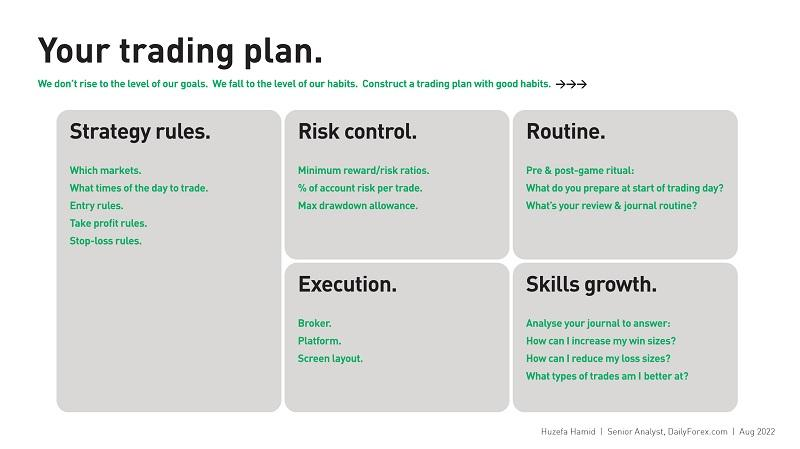

## Table of Contents

## What is a trading plan and why is it important for traders?

A trading plan is like a roadmap that traders use to guide their buying and selling decisions in the market. It includes rules and strategies that help traders know when to enter or exit a trade, how much money to risk, and what goals they want to achieve. Think of it as a set of instructions that keeps traders focused and disciplined, rather than making random decisions based on emotions or market noise.

Having a trading plan is important because it helps traders manage their risks and stay consistent. Without a plan, traders might make impulsive decisions that can lead to big losses. A good trading plan also helps traders learn from their past trades by keeping a record of what worked and what didn't. This way, they can improve their strategies over time and increase their chances of making profits in the long run.

## What are the basic components of a trading plan?

A trading plan includes a few key parts that help traders make smart choices. The first part is setting clear goals. Traders need to know what they want to achieve, like making a certain amount of money or improving their skills. They also need to decide how much time and money they can spend on trading. Another important part is choosing a trading strategy. This means picking the right times to buy and sell, and deciding which markets or stocks to focus on. Traders should also set rules for how much they are willing to risk on each trade.

The second part of a trading plan involves risk management. This means setting stop-loss orders to limit losses and deciding how much of their trading money to use on each trade. It's also important to keep track of all trades in a trading journal. This helps traders see what's working and what's not, so they can make better decisions in the future. Finally, a good trading plan includes a review process. Traders should regularly look at their plan and see if it needs any changes based on their performance and any new information. This helps keep the plan up-to-date and effective.

## How do you set trading goals within a trading plan?

Setting trading goals within a trading plan is important because it gives you a clear idea of what you want to achieve. Your goals should be specific, measurable, achievable, relevant, and time-bound. For example, instead of saying "I want to make money," you could say "I want to earn a 10% return on my investment within six months." This way, you know exactly what you're aiming for and can track your progress. Your goals should also match your personal situation, like how much time and money you can spend on trading.

Once you have your goals, you need to break them down into smaller steps. This makes them easier to reach and helps you stay motivated. For instance, if your goal is to earn a 10% return in six months, you might set monthly targets or decide how many successful trades you need each week. It's also important to review your goals regularly. If you find that they're too hard or too easy, you can adjust them to keep them realistic. This way, your trading plan stays useful and helps you improve over time.

## What are the common risk management rules included in a trading plan?

Risk management rules in a trading plan help traders protect their money and stay safe while trading. One common rule is setting a stop-loss order. This means deciding at what price you will sell a stock to limit your losses if the price goes down. Another rule is deciding how much money to risk on each trade. Traders often use a percentage of their total trading money, like risking no more than 1% to 2% on any single trade. This helps keep losses small and manageable.

Another important rule is to use a risk-reward ratio. This means comparing the potential profit of a trade to the possible loss. For example, a trader might only take trades where the potential profit is at least twice the potential loss. This helps make sure that the rewards are worth the risks. Finally, diversification is a key rule. This means spreading your money across different types of investments to reduce the risk of losing it all in one place. By following these rules, traders can manage their risks better and increase their chances of success.

## How can a beginner trader start developing their first trading plan?

A beginner trader can start developing their first trading plan by first figuring out what they want to achieve. This means setting clear goals, like [earning](/wiki/earning-announcement) a certain amount of money or learning specific trading skills. It's important to make these goals specific and realistic. For example, instead of saying "I want to make money," a beginner might say "I want to earn a 5% return on my investment within three months." Once the goals are set, the next step is to decide how much time and money can be spent on trading. This helps create a plan that fits the beginner's lifestyle and financial situation.

After setting goals, a beginner should choose a simple trading strategy. This could be based on technical analysis, like watching charts and patterns, or fundamental analysis, like studying company news and financial reports. It's also crucial to include risk management rules in the plan. This means setting stop-loss orders to limit losses and deciding to risk only a small percentage of the trading money on each trade, like 1% or 2%. Keeping a trading journal to record all trades is another helpful step. This allows the beginner to learn from their experiences and make improvements over time. By following these steps, a beginner can create a solid trading plan that guides them through the exciting world of trading.

## What are some examples of entry and exit strategies in a trading plan?

Entry and exit strategies are important parts of a trading plan. They help traders know when to buy and when to sell. A common entry strategy is to use technical indicators, like moving averages or the Relative Strength Index (RSI). For example, a trader might decide to buy a stock when its price goes above its 50-day moving average. Another entry strategy is based on news and events, like buying a stock when a company announces good earnings. Exit strategies are just as important. A trader might decide to sell a stock when it reaches a certain profit target or when it falls to a stop-loss level to limit losses.

Another entry strategy is called [breakout](/wiki/breakout-trading) trading. This means buying a stock when its price breaks out of a certain range. For example, if a stock has been trading between $50 and $60, a trader might buy it when it goes above $60. On the other hand, an exit strategy could be based on time. A trader might decide to sell a stock after holding it for a certain number of days, no matter what the price does. This is called a time-based exit strategy. By using these entry and exit strategies, traders can make more informed decisions and manage their trades better.

## How do you adjust a trading plan based on market conditions?

Adjusting a trading plan based on market conditions means changing your strategies to fit what's happening in the market. Markets can be calm or wild, and they can go up or down. If the market is moving a lot, you might need to use tighter stop-loss orders to protect your money. If the market is quiet, you might want to wait for bigger moves before making trades. It's also important to look at economic news and events. For example, if there's a big news event coming up, like a company's earnings report or a government announcement, you might want to adjust your trades to take advantage of the news or avoid getting caught in sudden price swings.

Another way to adjust your trading plan is by looking at how well your current strategies are working. If you're making money, you might not need to change much. But if you're losing money, it's time to think about what's not working and try something new. You could change your entry and exit points, or try a different trading strategy altogether. It's also a good idea to talk to other traders or read about what's happening in the market to get new ideas. By keeping an eye on the market and being willing to change your plan, you can stay ahead and keep making smart trading decisions.

## What role does psychology play in adhering to a trading plan?

Psychology is a big part of sticking to a trading plan. When trading, people can feel strong emotions like fear and excitement. These feelings can make them want to do things that aren't in their plan, like selling too soon or holding onto a losing trade for too long. A good trading plan helps by giving clear rules to follow, but it's the trader's mind that needs to stick to those rules. Learning to control emotions and stay calm is important. Traders can do this by taking breaks, using relaxation techniques, or even talking to other traders for support.

Another part of psychology in trading is having confidence in your plan. If you believe in your plan, you're more likely to follow it even when things get tough. It's also important to keep learning and improving your plan. This means looking back at your trades and seeing what you can do better next time. By understanding your own mind and working on your emotional control, you can stick to your trading plan and make better decisions in the market.

## Can you provide examples of successful trading plans used by experienced traders?

One example of a successful trading plan is used by a trader who focuses on swing trading. This trader looks at daily and weekly charts to find stocks that are moving in a clear trend. They use technical indicators like moving averages and the Relative Strength Index (RSI) to decide when to buy and sell. For example, they might buy a stock when it crosses above its 50-day moving average and sell it when it reaches a certain profit target or falls to a stop-loss level. This trader also keeps a trading journal to track their trades and learn from their mistakes. They only risk 1% of their trading money on each trade to manage their risk. By sticking to this plan, the trader has been able to make steady profits over time.

Another example is a trader who uses a [day trading](/wiki/day-trading-spy) strategy. This trader watches the market closely during the trading day and makes quick trades based on short-term price movements. They use a strategy called [scalping](/wiki/gamma-scalping), where they buy and sell stocks within minutes to make small profits. The trader sets strict rules for entering and exiting trades, like buying when the price breaks out of a certain range and selling when it reaches a small profit target. They also use tight stop-loss orders to limit their losses. This trader keeps a close eye on market news and events that could affect their trades. By following this plan and staying disciplined, the trader has been able to make consistent profits from their day trading activities.

## How do you evaluate and refine a trading plan over time?

Evaluating and refining a trading plan over time means looking at how well it's working and making changes to make it better. A good way to do this is by keeping a trading journal where you write down all your trades, including when you bought and sold, how much money you made or lost, and what you were thinking at the time. By looking back at your journal, you can see patterns in your trading and figure out what's working and what's not. If you notice that you're losing money on certain types of trades, you might want to change your strategy or set stricter rules for those trades. It's also important to pay attention to how well you're sticking to your plan. If you find that you're often making trades that aren't in your plan, you might need to work on your discipline or adjust your plan to make it easier to follow.

Another way to refine your trading plan is by staying updated on market conditions and learning from other traders. The market can change over time, and what worked well in the past might not work as well in the future. By reading news, watching market trends, and talking to other traders, you can get new ideas and insights that can help you improve your plan. It's also a good idea to set regular times to review and update your trading plan, like once a month or once a quarter. During these reviews, you can look at your goals and see if they still make sense, check if your risk management rules are working, and make any necessary changes to your entry and exit strategies. By doing this, you can keep your trading plan fresh and effective, helping you make better trades and reach your goals.

## What are advanced techniques for optimizing trading plan performance?

Advanced techniques for optimizing trading plan performance include using backtesting and forward testing. Backtesting means running your trading strategy through historical data to see how it would have performed in the past. This helps you find out if your plan works well or if there are any problems that need fixing. Forward testing, on the other hand, involves testing your strategy in real-time with small amounts of money to see how it works in current market conditions. By combining both types of testing, you can make sure your trading plan is strong and likely to succeed in the future.

Another advanced technique is using [algorithmic trading](/wiki/algorithmic-trading). This means using computer programs to make trades based on your plan's rules. Algorithms can analyze lots of data quickly and make trades without letting emotions get in the way. This can help you stick to your plan better and make more consistent profits. It's also important to keep learning and adapting. Markets change, and what worked well before might not work as well now. By staying updated on new trading strategies and market trends, and by regularly reviewing and adjusting your plan, you can keep it performing at its best.

## How do professional traders integrate technology and algorithms into their trading plans?

Professional traders use technology and algorithms to make their trading plans better and more efficient. They use special computer programs, called trading algorithms, to follow the rules in their trading plan without letting feelings get in the way. These algorithms can look at a lot of market data very quickly and make trades based on the plan's rules. This helps traders stick to their plan and make more consistent profits. For example, a trader might use an algorithm to buy a stock when its price goes above a certain level and sell it when it reaches a profit target or a stop-loss level.

Another way professional traders use technology is by using tools like backtesting and forward testing. Backtesting means running their trading strategy through old market data to see how it would have worked in the past. This helps them find any problems with their plan and fix them before they lose money. Forward testing involves trying out their strategy in real-time with small amounts of money to see how it works in today's market. By using these tools, traders can make sure their trading plan is strong and likely to succeed. They also use technology to keep track of their trades and learn from their experiences, which helps them keep improving their plan over time.

## How do you craft a trading plan?

A trading plan is a customized framework that guides an investor's buying and selling decisions within the financial markets. It serves as a strategic blueprint, tailored to align with the individual’s financial objectives and risk tolerance, and is an essential component of disciplined investing.

Key elements of a trading plan include entry and [exit](/wiki/exit-strategy) criteria, risk management rules, and position sizing, each of which plays a vital role in achieving trading consistency.

### Entry and Exit Criteria

Entry criteria define the conditions under which a trader will initiate a position. These criteria can be based on technical indicators, such as moving averages or relative strength index (RSI), or [fundamental analysis](/wiki/fundamental-analysis) factors including earnings reports and economic data. Identifying precise entry points helps minimize the impact of [volatility](/wiki/volatility-trading-strategies) and enhances the potential for profitable trades.

Exit criteria are equally important as they determine when a position should be closed to secure profits or limit losses. These criteria may include stop-loss levels, profit targets, or trailing stops to protect gains as they accumulate. By clearly defining exit strategies, traders prevent emotional decision-making, thus maintaining consistent performance.

### Risk Management Rules

Effective risk management is crucial to the survival and success of any trader. It involves setting limits on the amount of capital exposed to any single trade, known as risk per trade. For instance, a common rule is to risk no more than 1-2% of the trading account on any given trade. This conservative approach safeguards the trader’s capital against substantial losses.

Moreover, traders can employ risk-to-reward ratios to evaluate the potential profitability of trades. By aiming for a reward-to-risk ratio of at least 2:1, traders ensure that the potential return on successful trades outweighs potential losses.

### Position Sizing

Position sizing determines the amount of capital allocated to each trade based on the trader’s account size and risk tolerance. Proper position sizing ensures that the impact of any single trade on the overall portfolio is manageable. An effective way to compute position size is using the formula:

$$
\text{Position Size} = \frac{\text{Account Equity} \times \text{Risk Per Trade}}{\text{Trade Risk (Stop Loss)}}
$$

where "Account Equity" is the total capital available, "Risk Per Trade" is the intended percentage of capital risked, and "Trade Risk (Stop Loss)" is the difference between the entry price and the stop-loss level.

### Adaptability and Performance Monitoring

A trading plan should be adaptable, allowing revisions based on performance metrics and evolving market conditions. Regular performance analysis helps identify strengths and weaknesses in the trading approach, providing insights for necessary adjustments.

Traders may incorporate [backtesting](/wiki/backtesting), which involves testing the trading plan against historical market data to evaluate its effectiveness without risking actual capital. This process assists in refining strategies and enhancing decision-making based on empirical evidence.

In conclusion, a well-thought-out trading plan is instrumental in maintaining discipline and emotional control during trading activities. Successful traders recognize that such a plan is not static but requires continuous refinement to remain aligned with market dynamics and personal trading psychology.

## References & Further Reading

[1]: Kirilenko, A. A., & Kyle, A. S. (2011). "The Flash Crash: Algorithmic Trading in an Electronic Market." National Bureau of Economic Research.

[2]: Bergstra, J., Bardenet, R., Bengio, Y., & Kégl, B. (2011). ["Algorithms for Hyper-Parameter Optimization."](https://dl.acm.org/doi/10.5555/2986459.2986743) Advances in Neural Information Processing Systems 24.

[3]: ["Advances in Financial Machine Learning"](https://www.amazon.com/Advances-Financial-Machine-Learning-Marcos/dp/1119482089) by Marcos Lopez de Prado

[4]: ["Evidence-Based Technical Analysis: Applying the Scientific Method and Statistical Inference to Trading Signals"](https://www.amazon.com/Evidence-Based-Technical-Analysis-Scientific-Statistical/dp/0470008741) by David Aronson

[5]: ["Machine Learning for Algorithmic Trading"](https://github.com/stefan-jansen/machine-learning-for-trading) by Stefan Jansen

[6]: ["Quantitative Trading: How to Build Your Own Algorithmic Trading Business"](https://www.amazon.com/Quantitative-Trading-Build-Algorithmic-Business/dp/1119800064) by Ernest P. Chan