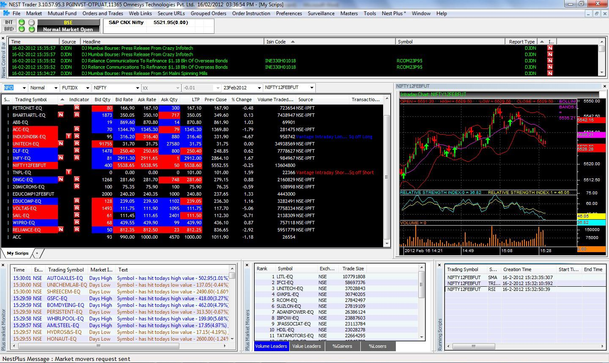

## Table of Contents

## What is a trading platform?

A trading platform is a software system that lets people buy and sell things like stocks, cryptocurrencies, and other financial products. It's like a marketplace where you can trade with others from your computer or phone. The platform shows you prices and charts, and you can place orders to buy or sell.

These platforms are used by both regular people and professional traders. They often have tools to help you make decisions, like graphs and news updates. Some platforms charge a fee for each trade you make, while others might have different ways to make money, like charging for special features or subscriptions.

## What are the different types of trading platforms available?

There are several types of trading platforms, each designed for different needs and users. One common type is the web-based platform, which you can use directly from your internet browser without needing to download any software. These are easy to access and good for beginners because they usually have simple interfaces. Another type is the desktop platform, which you download and install on your computer. These often have more advanced features and are favored by professional traders who need powerful tools for analysis and trading.

Mobile trading platforms are another popular type, designed for smartphones and tablets. They let you trade on the go, which is great for people who want to keep an eye on their investments anytime, anywhere. Some platforms also offer a combination of these types, so you can switch between using them on your computer, phone, or web browser. Lastly, there are specialized platforms that focus on specific markets, like [forex](/wiki/forex-system) or cryptocurrencies, offering tools and features tailored to those areas.

Each type of platform has its own advantages and might suit different kinds of traders. For example, if you're just starting out, a web-based or mobile platform might be easier to use. But if you're a more experienced trader looking for detailed analysis tools, a desktop platform might be better. It's important to choose a platform that matches your trading style and needs.

## How do I choose the right trading platform for my needs?

Choosing the right trading platform depends on what you need and how you like to trade. First, think about what you want to trade, like stocks, cryptocurrencies, or forex. Different platforms might focus on different markets, so pick one that has what you're interested in. Then, consider how much you know about trading. If you're new, a simple, easy-to-use platform might be best. But if you're more experienced, you might want a platform with lots of tools and features for analyzing the market.

Next, think about how you'll use the platform. Do you want to trade from your phone, or do you prefer a computer? Some platforms work well on mobile devices, while others are better on a desktop. Also, look at the costs. Some platforms charge you for each trade, while others might have monthly fees or no fees at all. Make sure you understand all the costs before you choose. Finally, try out a few platforms if you can. Many offer demo accounts where you can practice trading without using real money. This can help you see which one feels right for you.

## What are the key features to look for in a trading platform?

When looking for a trading platform, it's important to consider the user interface and ease of use. A good platform should be easy to navigate, with clear menus and simple ways to place trades. If you're new to trading, you'll want a platform that's not too complicated. But even if you're experienced, a clean and efficient interface can make your trading smoother. Also, think about the tools the platform offers. Good platforms have charts, indicators, and other tools to help you analyze the market and make smart decisions.

Another key feature is the range of assets you can trade. Some platforms focus on specific markets like stocks or cryptocurrencies, while others offer a wide variety of options. Make sure the platform supports the types of assets you're interested in. Also, consider the costs. Some platforms charge fees for each trade, while others might have monthly fees or no fees at all. It's important to understand all the costs so you can choose a platform that fits your budget. Finally, look for platforms that offer good customer support and educational resources, which can be really helpful, especially if you're just starting out.

## How do I set up and start using a trading platform?

To set up and start using a trading platform, first, you need to choose a platform that fits your needs. Once you've picked one, go to their website and sign up for an account. You'll need to provide some personal information like your name, email, and sometimes your address. After signing up, you'll need to verify your identity, which usually involves uploading a photo of your ID and maybe a utility bill to prove where you live. Once your account is verified, you can log in and start setting things up.

After logging in, you'll need to add money to your account. This is called depositing funds, and you can usually do it with a bank transfer, credit card, or sometimes even [cryptocurrency](/wiki/cryptocurrency). Once you have money in your account, you can start trading. Look around the platform to get familiar with it. You'll see different sections for placing trades, checking your balance, and looking at charts. If you're new, it's a good idea to start with a demo account if the platform offers one. This lets you practice trading without using real money, so you can learn how everything works before you start trading for real.

## What are the costs associated with using a trading platform?

Using a trading platform can come with different costs. One common cost is the trading fee, which is a small amount of money you pay every time you buy or sell something on the platform. This fee can be a fixed amount or a percentage of the money you're trading. Some platforms also charge a fee for withdrawing money from your account, so it's good to check how much that costs before you start trading.

Another cost to think about is the subscription fee. Some platforms might ask you to pay a monthly or yearly fee to use their services, especially if they offer special tools or features. Not all platforms have this fee, so it's important to know if you'll need to pay it. Also, keep in mind that there might be other small costs, like fees for using certain payment methods or for not using your account for a while. Always read the platform's fee schedule carefully to understand all the costs involved.

## How can I ensure the security of my transactions on a trading platform?

To keep your transactions safe on a trading platform, start by choosing a platform that is known for being secure. Look for platforms that use strong encryption to protect your information and have good reviews from other users. Also, make sure the platform is regulated by a financial authority, which means they have to follow strict rules to keep your money safe. When you sign up, use a strong password and enable two-[factor](/wiki/factor-investing) authentication if the platform offers it. This adds an extra step to log in, making it harder for someone else to get into your account.

Once you're using the platform, be careful about where you're logging in from. Always use a secure internet connection, and avoid public Wi-Fi if you can. Keep an eye on your account for any strange activity, and if you see anything odd, report it to the platform right away. It's also a good idea to keep your computer or phone up to date with the latest security software. By taking these steps, you can help make sure your transactions on the trading platform stay safe and secure.

## What are the common technical indicators and tools provided by trading platforms?

Trading platforms often come with a variety of technical indicators and tools to help you make better trading decisions. Some of the most common indicators you'll find are moving averages, which help you see the average price of an asset over a certain period of time. This can show you if the price is going up or down. Another popular tool is the Relative Strength Index (RSI), which tells you if an asset is overbought or oversold. This can help you decide if it's a good time to buy or sell. You'll also find tools like Bollinger Bands, which show you how much the price of an asset is moving around its average, helping you spot when the price might be about to change direction.

In addition to these indicators, trading platforms often provide charts and graphs to help you see how prices are moving. You can usually customize these charts to show different time frames, like daily, weekly, or even minute-by-minute. Many platforms also offer drawing tools, so you can draw lines and shapes on the charts to highlight trends or patterns. Some platforms even have automated trading tools, which let you set up rules for buying and selling without having to do it yourself. These tools can be really helpful, especially if you're new to trading and want to learn more about how the market works.

## How can I use a trading platform to develop and test trading strategies?

To develop and test trading strategies using a trading platform, start by using the platform's demo account if available. A demo account lets you practice trading with fake money, so you can try out different strategies without risking real money. You can use the platform's tools like charts, indicators, and drawing tools to analyze the market and see how your strategies might work. For example, you might use moving averages to spot trends or the RSI to find good times to buy or sell. By testing your strategies on the demo account, you can see what works and what doesn't, and make changes to improve your approach.

Once you have a strategy that seems to work well in the demo account, you can start using it with real money. But before you do, it's a good idea to keep testing and refining your strategy. Many platforms let you backtest your strategies, which means you can see how they would have worked in the past using historical data. This can give you more confidence in your strategy. Also, keep an eye on how your strategy performs over time and be ready to adjust it if the market changes. By using the tools and features of the trading platform, you can develop and test strategies that help you make smarter trading decisions.

## What are the advanced features available on professional trading platforms?

Professional trading platforms come with advanced features that help experienced traders make better decisions. One key feature is [algorithmic trading](/wiki/algorithmic-trading), which lets you set up computer programs to buy and sell automatically based on rules you create. This can be really helpful if you want to trade quickly or if you're trading a lot of different things at once. Another advanced tool is advanced charting, which gives you more detailed and customizable charts than what you'd find on simpler platforms. You can add lots of different indicators and draw on the charts to spot patterns and trends that might be hard to see otherwise.

These platforms also often have direct market access (DMA), which lets you trade directly with the market instead of going through a middleman. This can give you faster trades and sometimes better prices. Additionally, professional platforms usually offer more detailed data and analytics, like real-time market data, news feeds, and advanced risk management tools. These tools help you keep track of your trades and manage your risks better. By using these advanced features, professional traders can get a deeper understanding of the market and make more informed trading decisions.

## How do trading platforms integrate with other financial tools and services?

Trading platforms often work together with other financial tools and services to make trading easier and more effective. For example, many platforms connect with banking services so you can move money in and out of your trading account easily. They might also link up with financial data providers to give you real-time market information and news, which can help you make better trading decisions. Some platforms even connect with tax software, so you can keep track of your trades and report them correctly when it's time to do your taxes.

Another way trading platforms integrate with other services is through APIs, which are like special codes that let different software talk to each other. This means you can use tools from other companies right inside your trading platform. For instance, you might use a risk management tool from another service to help you keep your trading safe, or a charting tool that gives you more detailed analysis than what the platform offers on its own. By working together with these other tools and services, trading platforms can give you a more complete and powerful way to manage your investments.

## What are the future trends and developments expected in trading platforms?

In the future, trading platforms are expected to become even more user-friendly and packed with advanced features. One big trend is the use of [artificial intelligence](/wiki/ai-artificial-intelligence) (AI) and [machine learning](/wiki/machine-learning). These technologies can help platforms give you better advice and make trading easier. For example, AI might be able to predict market trends or suggest the best times to buy and sell. Also, platforms might use more automation, so you can set up trades to happen automatically without you having to do anything. This can save you time and help you trade more effectively.

Another trend is the focus on mobile trading. More and more people are using their phones to trade, so platforms are working to make their mobile apps better. They might add more features to the apps or make them easier to use. Also, security is becoming more important. Trading platforms are likely to use even stronger security measures to keep your money and information safe. This could include things like better encryption and more ways to verify who you are when you log in. Overall, the future of trading platforms looks like it will be about making trading easier, safer, and more powerful for everyone.

## References & Further Reading

[1]: Bergstra, J., Bardenet, R., Bengio, Y., & Kégl, B. (2011). ["Algorithms for Hyper-Parameter Optimization."](https://papers.nips.cc/paper/4443-algorithms-for-hyper-parameter-optimization) Advances in Neural Information Processing Systems 24.

[2]: ["Advances in Financial Machine Learning"](https://www.amazon.com/Advances-Financial-Machine-Learning-Marcos/dp/1119482089) by Marcos Lopez de Prado

[3]: ["Evidence-Based Technical Analysis: Applying the Scientific Method and Statistical Inference to Trading Signals"](https://www.amazon.com/Evidence-Based-Technical-Analysis-Scientific-Statistical/dp/0470008741) by David Aronson

[4]: ["Machine Learning for Algorithmic Trading"](https://github.com/stefan-jansen/machine-learning-for-trading) by Stefan Jansen

[5]: ["Quantitative Trading: How to Build Your Own Algorithmic Trading Business"](https://www.amazon.com/Quantitative-Trading-Build-Algorithmic-Business/dp/1119800064) by Ernest P. Chan