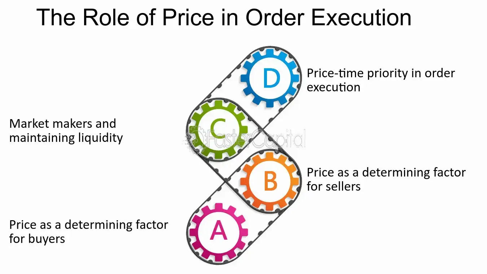

## Table of Contents

## What is trading price-time priority?

Trading price-time priority is a rule used in stock markets to decide which orders get filled first. When people want to buy or sell stocks, they place orders. If there are many orders at the same price, the one that was placed first gets filled first. This means that if you and someone else want to buy a stock at the same price, but you placed your order before them, your order will be filled before theirs.

This system helps keep things fair and orderly in the market. It makes sure that everyone has a chance to trade, and it prevents people from cutting in line. By following the price-time priority rule, the market can handle lots of orders smoothly and make sure that trades happen in a way that everyone can predict.

## How does price-time priority work in trading?

Price-time priority is a rule that helps decide which orders get filled first when people want to buy or sell stocks. Imagine you and your friend both want to buy the same stock at the same price. If you put in your order before your friend, your order will be filled first. This rule makes sure that the order placed earliest at a specific price gets priority.

This system keeps trading fair and organized. It stops people from jumping the line and makes sure everyone gets a fair chance to trade. By using price-time priority, the stock market can handle lots of orders smoothly and everyone knows what to expect. It's like waiting in line at a store; the person who got there first gets served first.

## Why is price-time priority important in financial markets?

Price-time priority is important in financial markets because it helps keep things fair and orderly. When lots of people want to buy or sell the same stock at the same price, this rule makes sure that the person who put in their order first gets to trade first. It's like waiting in line at a store; the person who got there first gets served first. This stops people from cutting in line and makes sure everyone has a fair chance to trade.

This rule also helps the market run smoothly. By following price-time priority, the market can handle lots of orders without getting confused. Everyone knows what to expect because the orders are filled in a clear and predictable way. This makes the market more reliable and trustworthy for everyone who trades there.

## What are the benefits of using a price-time priority system?

Using a price-time priority system in trading helps keep things fair and orderly. When lots of people want to buy or sell the same stock at the same price, this rule makes sure that the person who put in their order first gets to trade first. It's like waiting in line at a store; the person who got there first gets served first. This stops people from cutting in line and makes sure everyone has a fair chance to trade.

This rule also helps the market run smoothly. By following price-time priority, the market can handle lots of orders without getting confused. Everyone knows what to expect because the orders are filled in a clear and predictable way. This makes the market more reliable and trustworthy for everyone who trades there.

## Can you explain the difference between price priority and time priority?

Price priority means that when people want to buy or sell a stock, the orders with the best price get filled first. For example, if you want to buy a stock and someone else wants to buy it at a higher price, your order will be filled before theirs because your price is better. This rule makes sure that the best prices get the first chance to trade, which helps keep the market efficient.

Time priority, on the other hand, comes into play when there are multiple orders at the same price. In this case, the order that was placed first gets filled first. So, if you and your friend both want to buy a stock at the same price, but you put in your order before your friend, your order will be filled first. This rule helps keep things fair by making sure that the person who got there first gets to trade first.

Together, price priority and time priority work to make sure that trading is both efficient and fair. Price priority ensures that the best prices get filled first, while time priority makes sure that when prices are the same, the earliest orders get priority. This system helps the market run smoothly and keeps everyone on a level playing field.

## How does price-time priority affect order execution?

Price-time priority affects order execution by deciding which orders get filled first. When people want to buy or sell a stock, the orders with the best price get filled first. This is called price priority. For example, if you want to buy a stock at a lower price than someone else, your order will be filled before theirs because your price is better. This helps make sure that the market stays efficient by filling the best prices first.

If there are many orders at the same price, time priority comes into play. This means that the order that was placed first at that price gets filled first. So, if you and your friend both want to buy a stock at the same price, but you put in your order before your friend, your order will be filled first. This rule keeps things fair by making sure that the person who got there first gets to trade first.

Together, price priority and time priority help the market run smoothly and fairly. Price priority makes sure that the best prices get filled first, while time priority makes sure that when prices are the same, the earliest orders get priority. This system helps everyone know what to expect and keeps the market orderly.

## What are the potential drawbacks or limitations of price-time priority?

Price-time priority can sometimes make trading slower. If lots of people want to buy or sell at the same price, the orders have to be filled one by one based on when they were placed. This can take time, especially if there are many orders. Traders who want to buy or sell quickly might not like this because they have to wait for their turn, even if they are willing to pay more or accept less.

Another problem is that price-time priority might not be fair in all situations. For example, big traders with lots of money and fast computers can place orders very quickly. This means they can get their orders filled before smaller traders, even if the smaller traders placed their orders just a little bit later. This can make it harder for smaller traders to compete in the market, which might not seem fair to them.

## How do different trading platforms implement price-time priority?

Different trading platforms use price-time priority to make sure orders are filled in a fair and orderly way. When someone wants to buy or sell a stock, the platform looks at the price first. If there are many orders at the same price, the platform then looks at the time the orders were placed. The order that was placed first at that price gets filled first. This helps keep things fair because everyone knows that the best price and the earliest order get priority.

Some platforms might have slightly different ways of handling price-time priority. For example, some might use special technology to make sure orders are processed very quickly, which can be important for big traders. Others might have rules about how long an order can wait before it gets filled, to make sure the market keeps moving. Even though the basic idea is the same, these small differences can affect how quickly and fairly orders are filled on different platforms.

## What strategies can traders use to optimize their orders under a price-time priority system?

Traders can use a few smart strategies to make sure their orders get filled quickly under a price-time priority system. One good idea is to place their orders as early as possible. If a trader knows they want to buy or sell a stock at a certain price, they should put in their order before others do. This way, their order will be at the front of the line when it's time to trade. Another strategy is to use limit orders, where the trader sets the exact price they want to trade at. This can help them get a better price and still be at the front of the line if others want to trade at the same price.

Another helpful strategy is to keep an eye on the market and be ready to adjust their orders. If the price of a stock starts to move, a trader might need to change their order to stay competitive. For example, if the price is going up, they might need to raise their buy order to keep it at the front of the line. Also, using technology can help. Some traders use special software that can place orders very quickly, which can be a big advantage in a price-time priority system. By being quick and smart about when and how they place their orders, traders can do better in this kind of market.

## How does price-time priority interact with other order types like market and limit orders?

Price-time priority works with different types of orders like market and limit orders to decide which orders get filled first. A market order is when someone wants to buy or sell a stock right away at the best available price. When a trader places a market order, it gets filled quickly because it's willing to take whatever price is currently available. But if there are many market orders at the same time, the one that was placed first will get filled first because of time priority. This helps keep things fair and orderly, even when people want to trade right away.

A limit order is when someone sets a specific price they want to buy or sell at. If the stock reaches that price, the limit order gets filled. When there are many limit orders at the same price, the one that was placed first will get filled first because of time priority. This means that if you and someone else want to buy a stock at the same price, but you placed your order before them, your order will be filled first. By using price-time priority with both market and limit orders, the market can handle lots of orders smoothly and make sure everyone gets a fair chance to trade.

## What are some real-world examples where price-time priority has significantly impacted trading outcomes?

One real-world example where price-time priority made a big difference happened during a big stock market event. Imagine a lot of people wanted to buy a popular stock at the same price. The traders who put in their orders first got their shares before others, even if others were willing to pay a little more. This meant that those who were quick to place their orders ended up with the stock, while others had to wait or miss out. This shows how important it is to be fast when you want to buy or sell in a busy market.

Another example is when a company announced some exciting news, and everyone wanted to buy its stock. The price of the stock went up quickly, but some traders had already placed their orders at a lower price before the news came out. Because of price-time priority, those early orders got filled first, even though the price had gone up. This meant that the traders who were quick to act got a better deal than those who tried to buy after the news broke. It shows how being early can help you get a better price in a fast-moving market.

## How might future technological advancements influence the effectiveness of price-time priority systems?

Future technology could make price-time priority systems work even better. With faster computers and better internet, orders can be placed and filled much quicker. This means traders can get their orders in front of others even faster, making time priority more important. Also, new technology like [artificial intelligence](/wiki/ai-artificial-intelligence) might help predict when to place orders, so traders can be at the front of the line more often. This could make the market more efficient and fair, as everyone has a better chance to trade quickly.

However, these advancements might also create new challenges. If only big traders with the best technology can place orders super fast, it might not be fair for smaller traders. They might find it harder to compete because they can't place their orders as quickly. So, while technology can help make price-time priority work better, it's important to make sure it doesn't make the market less fair for everyone.

## References & Further Reading

[1]: Angel, J. J., Harris, L. E., & Spatt, C. S. (2011). ["Equity Trading in the 21st Century."](https://papers.ssrn.com/sol3/papers.cfm?abstract_id=1584026) The Quarterly Journal of Finance, 1(1), 1-53.

[2]: Harris, L. (2003). ["Trading and Exchanges: Market Microstructure for Practitioners."](https://www.amazon.com/Trading-Exchanges-Market-Microstructure-Practitioners/dp/0195144708) Oxford University Press.

[3]: Hasbrouck, J. (2007). ["Empirical Market Microstructure: The Institutions, Economics, and Econometrics of Securities Trading."](https://academic.oup.com/book/52241) Oxford University Press.

[4]: O’Hara, M. (1995). ["Market Microstructure Theory."](https://www.wiley.com/en-us/Market+Microstructure+Theory-p-9781557864437) Wiley-Blackwell.

[5]: Hendershott, T., Jones, C. M., & Menkveld, A. J. (2011). ["Does Algorithmic Trading Improve Liquidity?"](https://onlinelibrary.wiley.com/doi/full/10.1111/j.1540-6261.2010.01624.x) The Journal of Finance, 66(1), 1-33.

[6]: Stoll, H. R. (2006). ["Electronic Trading in Stock Markets."](https://pubs.aeaweb.org/doi/pdfplus/10.1257/089533006776526067) The Journal of Economic Perspectives, 20(1), 153-174.

[7]: Chordia, T., Roll, R., & Subrahmanyam, A. (2008). ["Liquidity and Market Efficiency."](https://www.sciencedirect.com/science/article/pii/S0304405X07001833) Financial Analysts Journal, 64(6), 45-56.