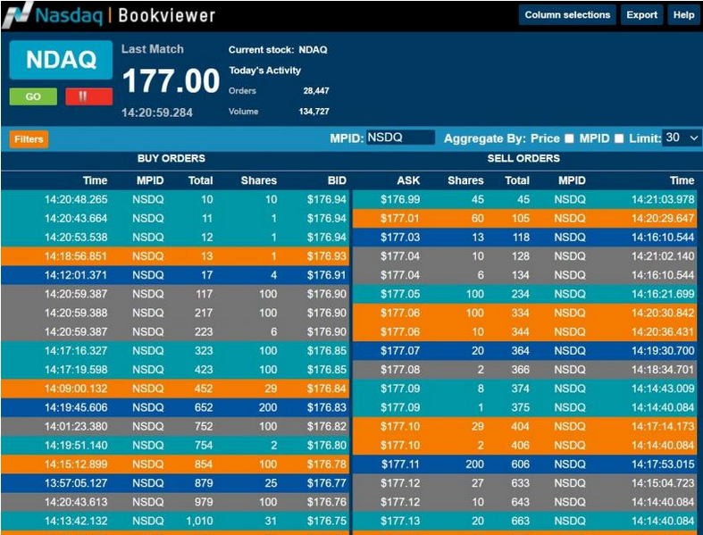

In today's fast-paced financial markets, where technology and automation have become essential, the principle of price-time priority is a key element in algorithmic trading and order execution. Price-time priority refers to the process by which orders are prioritized for execution in a trading environment, placing emphasis first on the price and then on the time the orders are submitted.

This mechanism plays a significant role in ensuring fairness and transparency in financial markets. It grants execution priority to higher bids when buying and lower asks when selling, while also considering the sequence in which these orders are received. Such a structure helps in organizing the order flow efficiently, thereby facilitating a fair trading environment. For market participants, including individual traders, institutional investors, and market makers, having a good grasp of the intricacies of price-time priority is essential.

The understanding of price-time priority's nuances is crucial as it directly influences trading strategies and outcomes. Market participants must navigate through the subtle dynamics that this system introduces, particularly in environments where milliseconds can determine order precedence. Furthermore, this concept impacts the overall trading environment by dictating how orders are processed and executed, thereby shaping the functions of financial markets.

This article explores the concept of price-time priority and investigates its impact on market operations. It also considers the advantages and disadvantages of adopting such a priority system in comparison to other order execution methods prevalent in financial markets. By examining these aspects, traders and investors can better appreciate the role price-time priority plays and how it may affect their trading decisions.

## Table of Contents

## Understanding Order-Driven Systems

Order-driven systems are fundamental to the operation of financial markets, characterized by the use of an order book that records the buy and sell intentions of all market participants. In these systems, the primary function is the balancing and matching of orders based on price and time priorities, which are central to their operation.

In an order-driven system, participants submit different types of orders, mainly market orders and limit orders. Market orders are executed immediately at the best available price, reflecting the current market status. Limit orders, on the other hand, specify a price at which the trader is willing to buy or sell, and these orders remain in the order book until the specified price conditions are met. The order book lists all outstanding limit orders organized by price and then by the time of submission, creating a transparent environment where the intentions of buyers and sellers are visible to all participants.

The priority given to orders based on price and time impacts market dynamics significantly. Price takes precedence; thus, orders offering higher buying prices or lower selling prices are prioritized for execution. If multiple orders exist at the same price, time becomes the determining [factor](/wiki/factor-investing), with earlier orders receiving precedence over those submitted later. This ensures fairness in order execution and provides incentives for traders to submit competitive and timely orders.

Liquidity and market depth are crucial aspects influencing the efficacy of order-driven systems. Liquidity refers to the ease with which assets can be bought or sold without causing a significant change in their price. High [liquidity](/wiki/liquidity-risk-premium) indicates a large number of buyers and sellers, which generally leads to tighter bid-ask spreads and more efficient order execution. Market depth, on the other hand, is related to the [volume](/wiki/volume-trading-strategy) of orders present at different price levels and determines the market's capacity to handle large trades without a substantial impact on price.

Understanding these systems enables traders to optimize their strategies effectively. By analyzing the [order book](/wiki/order-book-trading-strategies) and comprehending the prevailing market liquidity and depth, traders can better predict price movements and execute trades that capitalize on market inefficiencies. In highly liquid markets, traders may frequently encounter narrow spreads and rapid order execution, while in less liquid markets, they might experience larger spreads and slower execution, impacting trading decisions.

In conclusion, order-driven systems are integral to financial markets, influencing how trades are conducted through a transparent mechanism of price and time prioritization. Mastery of these systems allows traders to enhance their market strategies and anticipate price movements with greater precision.

## The Role of Price in Order Execution

Price serves as the primary determinant in the sequence of order execution, wherein higher bids and lower asks receive priority during the matching process. This system ensures that the optimal prices are targeted first, fostering a competitive and equitable trading environment. For buyers, the objective is to acquire assets at the lowest price possible to maximize potential profit margins. Conversely, sellers strive to dispose of their assets at the highest possible prices to enhance their revenue.

Market makers play an indispensable role in this framework by providing liquidity and reducing bid-ask spreads, thus facilitating efficient price discovery. By continuously quoting buy and sell prices, market makers ensure there is always a counterparty for trade execution. This activity helps mitigate the gap between the highest bid and the lowest ask prices, which is pivotal for maintaining market stability and ensuring traders receive fair prices.

Price prioritization aims to guarantee that trading opportunities are optimized and proficiently managed. This system promotes fairness by adhering to a first-come, first-served approach based on price levels, thereby preventing manipulation or preferential treatment of specific market participants. The competitive nature of price-based execution encourages participants to adjust their orders dynamically in response to real-time market conditions, ultimately contributing to the liquidity and overall health of financial markets.

In summary, the price-based priority mechanism in order-driven markets incentivizes market participants to strategically position their bids and asks to optimize order execution outcomes. By prioritizing the most favorable prices, this system supports a transparent, efficient, and competitive trading landscape.

## The Importance of Time in Order Execution

In the competitive environment of financial markets, where execution speed is paramount, time is a significant determinant of order processing, especially when price levels are identical among multiple orders. This principle, known as time priority, ensures that orders which arrive earlier are executed first at a given price level. This system prioritizes the chronological order of trades, which is crucial in maintaining fairness and orderliness.

Early arrivals at a specified price level gain an advantage by securing their trades ahead of subsequent ones. This concept is particularly beneficial in high-frequency trading scenarios where millisecond differences can determine profitability. Faster market participants who can swiftly adapt to changing prices are rewarded with execution priority, incentivizing timeliness and quick decision-making.

Time priority not only rewards those who act rapidly but also brings discipline to the trading process by supporting a fair and efficient marketplace. By processing trades in the order they are received, the system prevents discrepancies that could arise from arbitrary execution sequences. This orderly processing protects against potential manipulation and ensures that all participants, regardless of size, have equal opportunities to fulfill their trading intentions.

Furthermore, this mechanism plays a crucial role during periods of market [volatility](/wiki/volatility-trading-strategies) when price levels can shift rapidly. Traders who exhibit agility in response to market developments can enhance their outcomes by leveraging time priority. This responsiveness ensures that traders remain competitive and can capitalize on fleeting opportunities that characteristically define volatile market environments.

In conclusion, time is a vital factor when prioritizing order execution, working alongside price to provide a comprehensive strategy for fair trading. By recognizing the importance of order arrival time, the financial markets can uphold a structured and equitable system that maximizes efficiency and maintains participant trust.

## Analyzing the Impact of Price-Time Priority

Price-time priority significantly impacts market fairness by countering favoritism and ensuring equal trading opportunities. By prioritizing orders based on price and time, the system prevents preferential treatment and creates a transparent environment where all participants have an equitable chance to execute trades. This structure inherently promotes market liquidity, as traders are motivated to submit orders that are both competitive and timely. High liquidity levels facilitate smoother trading, reduce transaction costs, and enable efficient price discovery, making markets more attractive to investors and traders.

However, this prioritization system is not without its challenges. One of the primary concerns is the potential for front-running—a practice where traders exploit information about impending orders to gain an unfair advantage. In a price-time priority system, traders might anticipate large orders and place their own orders just before the anticipated trades are executed, thereby manipulating price movements to their benefit. This exploitation undermines market fairness and can erode trust among market participants.

The implications of price-time priority highlight the necessity for a balanced approach in trading systems to maintain both fairness and efficiency. While the system encourages transparency and competition, strict regulations and advanced surveillance technologies are essential to mitigate risks like front-running. This balance is crucial to fostering a trading environment that remains equitable and efficient for all participants.

## Advantages and Disadvantages of Price-Time Priority

Price-time priority plays a crucial role in ensuring the effectiveness and fairness of order execution in financial markets. It offers several advantages that enhance the trading environment. A primary benefit is the assurance of securing the best price matches. By prioritizing orders first by price, this system ensures that participants can trade at the most competitive rates, whether buying at higher bids or selling at lower asks. This feature fundamentally promotes fair treatment, as every market participant operates under the same rules, reducing the likelihood of biased trade executions and ensuring transparency.

Another advantage of price-time priority is its strong incentive for liquidity. By ensuring that the best prices are filled first and rewarding earlier order submissions, the system encourages traders to contribute to the market's liquidity. This contribution is vital for efficient price discovery, where active participation from buyers and sellers helps in identifying true asset values.

Despite these benefits, price-time priority is not without drawbacks. One potential disadvantage is the increased episode volatility it can introduce. In an environment where speed is highly prized, rapid order submissions and cancellations might lead to price fluctuations, impacting market stability. Such volatility can be particularly challenging in high-frequency trading settings where minor discrepancies can lead to significant price movements.

Additionally, the system may disincentivize liquidity providers in certain contexts. Market makers, who provide liquidity by placing both buy and sell orders, might find price-time priority less attractive if their orders frequently fall behind more competitive bids or offers. This scenario could result in reduced incentives for market makers to maintain tight bid-ask spreads, potentially increasing transaction costs for other market participants.

Balancing these advantages and disadvantages is crucial for market structure and regulatory considerations. While price-time priority promotes fairness and liquidity, regulators and market designers must address the potential challenges of volatility and liquidity disincentives to maintain efficient and stable markets.

## Comparing Price-Time Priority with Other Execution Methods

In financial markets, various order execution methods are utilized to optimize trading efficiency and effectiveness. Price-time priority, pro-rata allocation, Last In, First Out (LIFO), and auction methods each have distinct characteristics that cater to different trading needs and contexts.

Price-time priority is a widely adopted mechanism that emphasizes both price accuracy and market fairness. It prioritizes orders based on the best price, and among orders with the same price, the first entered order gets precedence. This encourages traders to place their orders quickly at competitive prices, enhancing market liquidity and ensuring that the best-priced orders are filled first. This method is particularly advantageous in fast-moving markets where price changes can be rapid and unpredictable.

Conversely, pro-rata allocation distributes orders proportionally based on the quantity available at a particular price point. This method is often used in environments where market participants seek to ensure a fair share distribution among all interested parties. For instance, if a trader wants to buy 100 shares and there are 1,000 shares available at a particular price, they might receive a proportional allocation based on the total demand. While pro-rata ensures a more even distribution of available quantity, it may not always lead to the most efficient price discovery, especially in highly competitive markets.

The LIFO method serves different strategic needs. It prioritizes the most recently submitted orders over earlier ones, which can be beneficial in scenarios where rapid execution of the latest market insights delivers an edge. However, this approach could lead to significant market inefficiencies and potential disorderly trading environments, as earlier orders can be overlooked despite their competitive pricing.

Auction methods, such as the Dutch auction, offer another alternative for price determination and order execution. In a Dutch auction, the auctioneer begins with a high asking price that is lowered until a participant accepts the current price. This can effectively determine market interest and clearing prices but might lead to suboptimal outcomes if not conducted transparently or efficiently.

Ultimately, the choice among these execution methods depends on the specific objectives and the trading context. Price-time priority remains a cornerstone for its ability to uphold market integrity and accuracy, which is crucial in maintaining trader confidence. By understanding the advantages and pitfalls of each method, traders and institutions can refine their strategies and select the most appropriate execution approach for their needs. This selection process involves weighing factors such as market volatility, trading volume, and the strategic goals of the trading entities involved.

## Real-World Examples of Price-Time Priority in Action

Price-time priority is an essential mechanism for maintaining fairness and transparency across various trading platforms, including stock exchanges, [cryptocurrency](/wiki/cryptocurrency) trading arenas, and foreign exchange markets. In these diverse environments, price-time priority ensures that trades are executed efficiently and equitably by prioritizing price first and time second.

### Stock Exchanges

On stock exchanges such as the New York Stock Exchange (NYSE) and NASDAQ, price-time priority is fundamental to the order execution process. Orders are listed in the electronic order book by price, with the best prices (highest bids and lowest asks) prioritized. If multiple orders are at the best price, they are then queued according to the time received—a system that rewards both competitive pricing and promptness. This mechanism is pivotal for managing the millions of orders received daily, ensuring that investors have a fair opportunity to execute trades at the most advantageous prices available.

### Cryptocurrency Trading Platforms

In cryptocurrency markets, platforms like Binance and Coinbase also employ a price-time priority system. Given the volatile nature of cryptocurrencies, where prices can fluctuate significantly within seconds, this method provides stability and reliability in the trading process. By recording the sequence of submitted orders based on price and subsequently on time, traders are assured of a fair execution environment. This setup minimizes disputes and enhances market efficiency, fostering trust in decentralized trading ecosystems.

### Foreign Exchange Markets

The global foreign exchange ([forex](/wiki/forex-system)) market, the world's largest financial market, benefits from price-time priority in facilitating currency swaps and exchanges among banks and financial institutions. In forex platforms, given the sheer volume of transactions that occur around the clock, priority systems are crucial. They enable rapid and fair matching of buy and sell orders, ensuring liquidity is maintained across currency pairs, which is crucial for participants managing exchange rate risks.

### Auctions and Initial Public Offerings (IPOs)

Auctions and IPOs serve as prime examples of price-time priority’s versatility. In IPOs, where shares of a company are offered to the public for the first time, price-time priority ensures that allotments are made efficiently, often prioritizing institutional investors due to their larger bid sizes and timeliness in submission. Similarly, in auctions, such as those conducted by governments for treasury bills, price-time priority facilitates equitable distribution by allocating assets according to competitive bids and submission times. This leads to a fair allocation process and competitive pricing.

Across these varied examples, the application of price-time priority not only strengthens the operational integrity of markets but also supports the equitable treatment of market participants. Its adoption promotes a transparent, orderly environment, essential for sustaining investor confidence and market vitality across different trading settings.

## The Future of Price-Time Priority in Order-Driven Systems

The rapid advancement of technology in financial markets is reshaping traditional priority systems, particularly with the rise of [algorithmic trading](/wiki/algorithmic-trading) and high-frequency trading ([HFT](/wiki/high-frequency-trading-strategies)). These innovations demand more than just speed; they require systems capable of managing vast amounts of data in real-time while ensuring fair and efficient order execution.

Algorithmic trading systems automate complex trading strategies, detecting and executing trades at speeds beyond human capability. This places pressure on traditional price-time priority systems, as algorithms can submit multiple orders at high frequencies, potentially leading to unfair advantages for those with superior technological infrastructure. As a result, exchanges and regulators are compelled to evolve the classic price-time priority rules to maintain equity among all market participants.

Technological advancements also bring improvements in latency reduction, with direct market access and co-location services becoming more prevalent. By minimizing the time it takes for an order to reach an exchange, traders can capitalize on minute price discrepancies. However, this can result in a race where those able to afford better technology gain precedence, at the potential cost of market fairness.

To address these challenges, regulatory bodies are putting forth frameworks that can accommodate both technological progress and fairness. Measures such as speed bumps—deliberate delays that level the playing field for market participants—and enhanced audit trails are being implemented to ensure transparency and fairness without stifiling the innovative capabilities of modern traders.

Looking forward, market participants must be proactive in adapting to these changes. As the efficiency of execution systems continues to improve, traders and institutions need to evaluate their technological capabilities and adjust their strategies accordingly. This involves both investing in technology and understanding forthcoming regulatory changes.

The future utility of price-time priority hinges on finding a balance between embracing innovation and ensuring an equitable trading environment. By anticipating these shifts, traders can not only mitigate risks associated with technological lag but also exploit new opportunities that arise from the evolving market landscape.

## References & Further Reading

[1]: Angel, J. J., Harris, L. E., & Spatt, C. S. (2011). ["Equity Trading in the 21st Century."](https://papers.ssrn.com/sol3/papers.cfm?abstract_id=1584026) The Quarterly Journal of Finance, 1(1), 1-53.

[2]: Harris, L. (2003). ["Trading and Exchanges: Market Microstructure for Practitioners."](https://www.amazon.com/Trading-Exchanges-Market-Microstructure-Practitioners/dp/0195144708) Oxford University Press.

[3]: Hasbrouck, J. (2007). ["Empirical Market Microstructure: The Institutions, Economics, and Econometrics of Securities Trading."](https://academic.oup.com/book/52241) Oxford University Press.

[4]: O’Hara, M. (1995). ["Market Microstructure Theory."](https://www.wiley.com/en-us/Market+Microstructure+Theory-p-9781557864437) Wiley-Blackwell.

[5]: Hendershott, T., Jones, C. M., & Menkveld, A. J. (2011). ["Does Algorithmic Trading Improve Liquidity?"](https://onlinelibrary.wiley.com/doi/full/10.1111/j.1540-6261.2010.01624.x) The Journal of Finance, 66(1), 1-33.

[6]: Stoll, H. R. (2006). ["Electronic Trading in Stock Markets."](https://pubs.aeaweb.org/doi/pdfplus/10.1257/089533006776526067) The Journal of Economic Perspectives, 20(1), 153-174.

[7]: Chordia, T., Roll, R., & Subrahmanyam, A. (2008). ["Liquidity and Market Efficiency."](https://www.sciencedirect.com/science/article/pii/S0304405X07001833) Financial Analysts Journal, 64(6), 45-56.