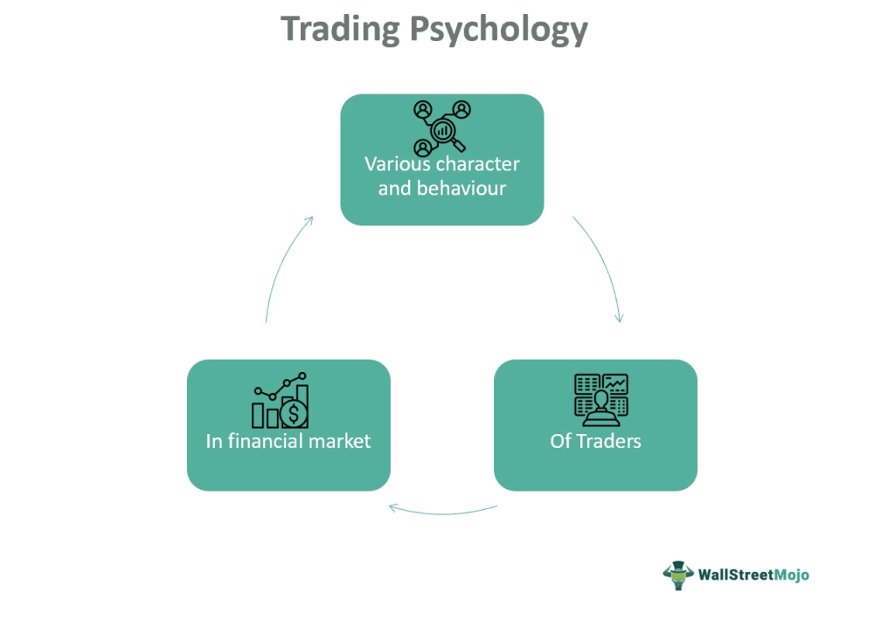

Trader behavior encompasses the actions and decision-making processes of individuals or entities engaged in buying and selling financial instruments. It is a field closely linked with behavioral finance, which merges insights from psychology and economics to understand deviations from traditional financial theory based on rational decision-making. Trading psychology focuses specifically on the mental and emotional factors that influence traders' decisions, such as stress, fear, and confidence levels. Algorithmic trading, on the other hand, refers to the use of computer programs and algorithms to execute trades at speeds and complexities beyond human capacity.

Understanding trader behavior holds significant importance in modern financial markets. Individual and collective behaviors can heavily influence market trends, causing phenomena such as market bubbles and crashes. Psychological elements are pivotal, as they shape risk perception and investment strategies. Emotions such as fear and greed can lead to irrational decision-making, affecting both the individual trader's success and broader market dynamics.

Algorithmic trading has increasingly impacted traditional trading methods. It offers advantages in speed and efficiency and significantly reduces the emotional biases that can hinder human traders. Yet, the deployment of algorithms introduces new dynamics, as these systems can amplify rapid market movements and contribute to flash crashes due to their high execution speeds.

This article explores the complex interplay between human behavior and algorithmic systems in trading. By examining trader psychology and algorithmic influence, we aim to uncover how these elements interact to shape financial markets, ultimately seeking a deeper understanding that could enhance trading strategies and market stability.

## Table of Contents

## Understanding Trader Behavior

Trader behavior in financial markets is characterized by patterns such as fear, greed, and overconfidence, which significantly influence decision-making processes and subsequently impact market outcomes. Understanding these behaviors is crucial as they often drive market dynamics and contribute to phenomena like volatility and mispricing.

Fear in trading can manifest when traders react to potential losses, leading them to sell positions prematurely or avoid risky investments altogether. For instance, during periods of market decline, widespread fear may lead to panic selling, exacerbating price drops and market instability. This behavior aligns with the concept of loss aversion, where the pain of losing is psychologically more impactful than the pleasure of gaining.

Conversely, greed is seen when traders aim to maximize profits, sometimes leading to excessive risk-taking. An example is when speculative bubbles form, driven by the collective greed of market participants who continuously buy into rising markets anticipating further gains. Such behavior often results in unsustainable price levels that can culminate in sharp corrections.

Overconfidence is another prevalent behavior where traders overestimate their knowledge or predictive power. This can lead to overtrading or insufficient diversification, increasing the likelihood of significant losses. Overconfidence can be fueled by past successes, fostering a belief that one's trading decisions are infallible, which can be detrimental in volatile market conditions.

These emotions and behaviors impact market outcomes by contributing to increased [volatility](/wiki/volatility-trading-strategies). Volatility, a statistical measure of the [dispersion](/wiki/dispersion-trading) of returns, is often heightened when emotional trading leads to significant price swings. For example, during economic announcements or geopolitical events, traders' emotional responses can lead to rapid buying or selling, thus amplifying market fluctuations.

Behavioral traps are cognitive biases that can ensnare traders, affecting even the most experienced ones. One such trap is the confirmation bias, where traders favor information that confirms their existing beliefs and ignore contrary data. This bias can lead to poor decision-making and missed opportunities. Another example is the sunk cost fallacy, where traders hold onto losing positions due to an emotional attachment to their initial investment, rather than making rational decisions based on current information.

These patterns of behavior not only affect individual traders but can also have broader implications for market efficiency and stability. Addressing these pitfalls involves fostering self-awareness among traders and employing strategies to manage emotions effectively, thereby enhancing decision-making processes and potentially stabilizing market movements.

## Behavioral Finance: Bridging Psychology and Economics

Behavioral finance has emerged as a crucial field that bridges the knowledge gap between traditional finance theories and psychological insights. It challenges the longstanding assumption that markets and investors always act rationally by incorporating psychological factors into financial decision-making processes. This discipline provides a more nuanced understanding of how real-world markets operate, offering explanatory and predictive insights that conventional theories fail to address fully.

At the core of behavioral finance are key concepts such as cognitive biases and heuristics. Cognitive biases are systematic deviations from rationality in judgment and decision-making. Common biases impacting trading decisions include overconfidence, loss aversion, and confirmation bias. Heuristics, on the other hand, are mental shortcuts or rules of thumb used to make complex decision-making processes more manageable. While heuristics can be helpful, they often lead to errors and predictable biases under certain market conditions.

One of the pivotal contributions of behavioral finance is its ability to explain and predict market behavior more accurately. By recognizing that investors are not always rational and may act in predictably irrational ways, this field of study aids in understanding phenomena such as asset bubbles, market overreactions, and excessive market volatility. For instance, the disposition effect, where investors sell winning investments while holding on to losing ones, can explain why certain stocks may be undervalued or overvalued for extended periods.

Prospect Theory, developed by Daniel Kahneman and Amos Tversky, is a cornerstone of behavioral finance. It highlights how people perceive gains and losses differently, affecting their risk-taking behavior. Unlike traditional utility theory, Prospect Theory suggests that people value gains and losses differently, leading to decisions that might deviate from what is considered rational. The value function proposed by Prospect Theory is generally concave for gains and convex for losses, illustrating loss aversion—where losses loom larger than equivalent gains.

Risk perception is another critical aspect influencing trading and investment decisions. Behavioral finance emphasizes that investors' perception of risk is often more subjective and subjective than the quantitative measures of risk typically used in finance. Factors like recent experience and emotional responses can disproportionately sway risk perception, leading to decisions that might diverge from expected utility maximization.

In summary, behavioral finance serves as a critical intersection between psychology and economics, providing valuable insights into how psychological factors influence financial markets. By understanding concepts such as cognitive biases, heuristics, Prospect Theory, and risk perception, both investors and market analysts can develop improved strategies and frameworks that account for human elements in financial decision-making. Through this integration, behavioral finance continues to contribute to a more comprehensive and realistic understanding of market dynamics.

## The Impact of Trading Psychology

Psychological factors significantly influence trading decisions, often determining the success or failure of traders in financial markets. Stress and fatigue are two primary psychological variables that can adversely affect decision-making processes. Stress can lead to hasty decisions, increased risk-taking, and failure to adhere to trading plans. Fatigue, often resulting from extended trading hours or inadequate rest, impairs cognitive functions, leading to poor judgment and increased susceptibility to errors.

To manage these emotions, traders employ various techniques aimed at enhancing emotional stability. Mindfulness, a state of active, open attention to the present, is a common method. It helps traders maintain focus and clarity, enabling them to recognize emotional responses and regulate reactions effectively. Disciplined routines, such as setting specific trading hours and taking regular breaks, also contribute to emotional regulation, reducing the impact of fatigue and stress.

A well-structured trading plan is essential in mitigating psychological pitfalls. Such a plan outlines entry and [exit](/wiki/exit-strategy) strategies, risk management protocols, and specific goals, providing a cognitive anchor that reduces impulsivity. By adhering to a pre-defined strategy, traders can minimize deviations prompted by emotional responses, allowing for more consistent performance.

Maintaining psychological stability is crucial for enhancing trading performance. Stability in emotions and decision-making processes fosters an environment where rational choices predominate, leading to improved outcomes in trading activities. Consistent psychological practices, alongside disciplined trading routines, contribute to sustained performance gains over time.

In summary, understanding and managing psychological impacts play a pivotal role in successful trading. By employing techniques to control stress and fatigue, adhering to structured trading plans, and maintaining psychological stability, traders can optimize their decision-making processes and achieve better market results.

## Algorithmic Trading: The New Frontier

Algorithmic trading refers to the use of computer algorithms to automate trading decisions, execute trades at speeds and volumes beyond human capabilities, and optimize trade outcomes based on predefined criteria. Its growing dominance in financial markets is driven by its ability to process vast amounts of data swiftly, evaluate complex trading strategies, and minimize the emotional biases inherent in human trading.

**Advantages of Algorithmic Trading**

One of the primary advantages of [algorithmic trading](/wiki/algorithmic-trading) is speed. Algorithms can analyze market conditions, compute intricate models, and execute orders in fractions of a second, significantly faster than human traders. This speed allows traders to capitalize on tiny price movements and accurately exploit inefficiencies before they vanish.

Accuracy is another advantage, as algorithms follow predefined instructions and rules precisely, reducing the margin of error in trade execution. This minimizes slippage and ensures that trades adhere strictly to strategy specifications. Furthermore, by removing human emotions such as fear and greed from the equation, algorithmic trading reduces the emotional impact that can lead to irrational decision-making.

**Challenges and Limitations**

Despite its advantages, algorithmic trading is not without challenges. One significant limitation is the reliance on historical data to forecast future market conditions. While algorithms can identify past trends, they may not always predict future outcomes accurately due to market changes or unforeseen economic events. Additionally, high-frequency trading, a subset of algorithmic trading, can contribute to market volatility and exacerbate rapid price swings.

Another challenge is the complexity of developing robust algorithms. Designing an algorithm that performs well in diverse market conditions requires deep technical knowledge and significant computational resources. There is also the risk of model overfitting, where an algorithm is too tailored to historical data and performs poorly in real-time trading. 

**Ethical Considerations and Regulatory Concerns**

As algorithmic trading grows, ethical considerations and regulatory concerns have emerged. High-frequency trading can create an uneven playing field, giving well-resourced firms unfair advantages over traditional traders. This raises questions about market fairness and transparency. Moreover, the flash crash of May 2010, partially attributed to algorithmic trading, highlighted the potential for algorithms to trigger significant market disruptions.

Regulatory bodies worldwide are increasingly scrutinizing algorithmic trading. In the U.S., the Securities and Exchange Commission (SEC) and the Commodity Futures Trading Commission (CFTC) have implemented rules requiring greater transparency and risk management procedures for firms using automated trading systems. These regulations aim to mitigate systemic risks and ensure that algorithms do not manipulate or destabilize markets.

Algorithmic trading remains an exciting development in financial markets, offering significant benefits while presenting challenges that demand ongoing scrutiny and adaptation. Understanding these dynamics is crucial as the trading landscape continues to evolve.

## The Interplay Between Human Behavior and Algo Trading

Human biases significantly influence the development and deployment of algorithmic trading strategies. Although algorithmic trading, or algo trading, is designed to minimize emotional factors, the initial coding reflects the biases and assumptions of its human developers. For instance, developers might encode their personal risk preferences and market interpretations into the trading algorithms, inadvertently introducing biases such as overconfidence or optimism bias. These biases can affect how an algorithm interprets market signals and makes decisions, potentially leading to suboptimal trading outcomes.

Algo-herding, a phenomenon where algorithms exhibit synchronized trading behaviors, can exacerbate market instability. As multiple algorithms respond similarly to the same market signals, they can create feedback loops that amplify market movements, increasing volatility. This herding behavior occurs when algorithms are based on similar strategies or are designed to follow the same trend indicators, leading to simultaneous buy or sell pressures in the market. Algo-herding can result in rapid price swings and exacerbate market crashes, as seen in instances of flash crashes where automated trading amplifies market orders.

Understanding human behavior can provide valuable insights for improving algo trading strategies. Recognizing cognitive biases and behavioral tendencies can help developers create algorithms that are more adaptive and resilient to market fluctuations. For example, by incorporating elements of behavioral finance, algorithms can be programmed to recognize and mitigate actions that could be driven by fear or greed, thus avoiding precipitous market exits or entries based on such emotions.

Examples of synergy between human traders and algorithms illustrate the optimization of performance through the blend of human intuition and computational efficiency. Hybrid trading models, where human traders collaborate with algorithms, leverage the strengths of both parties. Human traders offer contextual insights and intuitive decision-making, while algorithms bring speed and data processing capabilities. For instance, a trader may override an algorithm's trade in unexpected market conditions where human judgment may be more effective, or they may use algorithms to execute trades more efficiently than manual processes allow.

By addressing human biases through careful algorithm design and fostering a cooperative environment between human judgment and algorithmic precision, the performance and stability of financial markets can be significantly enhanced. Through this thoughtful integration, trading strategies can become more robust and adaptable to the ever-changing landscape of global markets.

## Conclusion

In this exploration of trader behavior, psychology, and algorithmic trading, we have uncovered several important insights that emphasize the intricate relationship between human emotions and the efficiency of modern financial systems. Understanding the human element, such as the impact of emotions like fear and greed on decision-making and market dynamics, remains crucial within financial markets. Trader psychology significantly influences market trends, often leading to volatility or mispricing, which can be exacerbated by behavioral biases and cognitive limitations.

The potential for integrating behavioral finance principles with algorithmic trading presents an exciting avenue for development. As algorithmic trading continues to dominate financial markets, incorporating insights from behavioral finance can enhance these systems' robustness and adaptability. Recognizing human biases during the development and deployment of algorithms can lead to the creation of more nuanced strategies that account for both human and algorithmic elements. This integration could lead to more stable and efficient market environments that leverage both computational power and psychological understanding.

As developers and traders consider future strategies, acknowledging psychological factors becomes increasingly important. Developing more sophisticated algorithms that account for human behavior can lead to improved trading outcomes and risk management. For instance, strategies that dynamically adjust to market sentiment or recognize patterns of emotion-driven volatility can better capitalize on market conditions while reducing potential pitfalls.

Looking ahead, the evolution of trading will likely hinge on the fusion of behavioral insights with cutting-edge algorithmic techniques. This synergy has the potential to not only enhance market performance but also contribute to more stable financial systems. By harmonizing the strengths of human intuition with the precision of algorithms, the financial industry can aspire toward a new paradigm—one that embraces complexity and fosters innovation in response to the ever-changing landscape of global finance.

## References & Further Reading

[1]: Thaler, R. H. (1994). ["The Winner's Curse: Paradoxes and Anomalies of Economic Life."](https://psycnet.apa.org/record/1991-98876-000) Princeton University Press.

[2]: Kahneman, D., & Tversky, A. (1979). ["Prospect Theory: An Analysis of Decision under Risk."](https://www.jstor.org/stable/1914185) Econometrica, 47(2), 263-291.

[3]: Barberis, N., & Thaler, R. (2003). ["A Survey of Behavioral Finance."](https://www.semanticscholar.org/paper/A-Survey-of-Behavioral-Finance-Barberis-Thaler/a4ab7d7161deac0f532d121b1614cf7b97d90e78) Handbook of the Economics of Finance.

[4]: Lo, A. W. (2004). ["The Adaptive Markets Hypothesis: Market Efficiency from an Evolutionary Perspective."](https://papers.ssrn.com/sol3/papers.cfm?abstract_id=602222) The Journal of Portfolio Management, 30(5), 15-29.

[5]: Aldridge, I. (2013). ["High-Frequency Trading: A Practical Guide to Algorithmic Strategies and Trading Systems."](https://www.amazon.com/High-Frequency-Trading-Practical-Algorithmic-Strategies/dp/1118343506) Wiley.

[6]: Goldstein, M. A., Kumar, P., & Graves, F. C. (2014). ["Computerized and High-Frequency Trading."](https://papers.ssrn.com/sol3/papers.cfm?abstract_id=2379842) Journal of Financial and Quantitative Analysis, 49(4), 913-936.