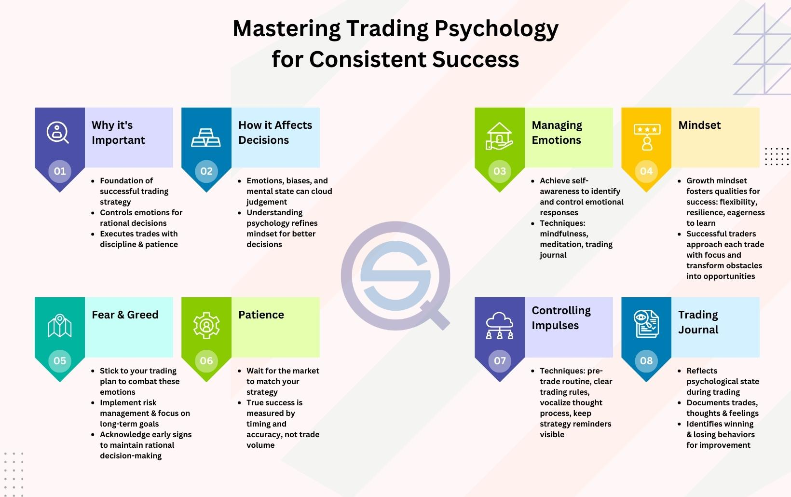

## Table of Contents

## What is trading psychology and why is it important for traders?

Trading psychology is about the feelings and thoughts that traders have when they buy and sell things like stocks or cryptocurrencies. It includes how traders handle stress, fear, and greed, and how these emotions can affect their decisions. For example, a trader might feel scared and sell their stocks too soon, even if the market is still good. Or they might get too excited and buy too much, hoping to make a lot of money quickly.

Understanding trading psychology is very important because it helps traders make better choices. If traders know about their own emotions, they can control them better and not make quick, bad decisions. This can lead to more successful trades and less stress. By learning about trading psychology, traders can develop good habits, like sticking to a plan and not letting emotions take over. This can make a big difference in how well they do in the long run.

## How can emotions like fear and greed affect trading decisions?

Fear and greed are two big emotions that can really mess up trading decisions. When traders are scared, they might sell their investments too early, even if the market is still doing okay. They might think the market will keep going down and want to get out before they lose more money. This can make them miss out on good opportunities because they sold too soon. Fear can also make traders not want to buy anything at all, even if it's a good time to invest, because they're too worried about losing money.

On the other hand, greed can make traders take big risks. They might buy a lot of something because they think they can make a lot of money fast. This can lead to buying things that are too expensive or risky, hoping the price will keep going up. But if the market goes down, they could lose a lot. Greed can also make traders hold onto their investments for too long, hoping for even bigger profits, which can be dangerous if the market turns around.

Both fear and greed can make traders forget their plans and make quick decisions based on emotions. This is why it's important for traders to understand these feelings and try to control them, so they can make smarter choices and do better in the long run.

## What are common psychological biases that impact trading behavior?

One common psychological bias that impacts trading behavior is overconfidence. Traders who are overconfident might think they know more than they really do and take bigger risks. They might believe they can predict the market better than others, which can lead to bad decisions. For example, an overconfident trader might put all their money into one stock, thinking it will definitely go up, but if it doesn't, they could lose a lot.

Another bias is loss aversion, where traders feel the pain of losing money much more than the joy of making money. This can make them hold onto losing investments for too long, hoping they will come back up, instead of cutting their losses and moving on. It can also make them sell winning investments too soon, just to lock in a small profit and avoid any possible future loss. Both of these actions can hurt their overall performance.

Confirmation bias is also a big problem. This is when traders only look for information that supports what they already believe and ignore anything that doesn't. For example, if a trader thinks a certain stock will go up, they might only read news that says good things about it and ignore any warnings. This can lead to a false sense of security and bad trading decisions because they're not seeing the whole picture.

## How can a trader develop a disciplined trading mindset?

To develop a disciplined trading mindset, a trader needs to start by setting clear goals and making a solid trading plan. This plan should include rules for when to buy and sell, how much money to risk on each trade, and what to do if things don't go as expected. Sticking to this plan is really important, even when emotions like fear or greed start to kick in. It's also helpful to keep a trading journal where you write down your trades and what you learned from them. This can help you see patterns in your behavior and make better decisions in the future.

Another key part of developing discipline is learning to manage emotions. This means understanding how fear and greed can affect your decisions and finding ways to control them. One way to do this is by practicing mindfulness or meditation, which can help you stay calm and focused. It's also important to take breaks and not trade when you're feeling stressed or tired. Over time, by following your plan and managing your emotions, you can build the discipline needed to be a successful trader.

## What role does risk management play in trading psychology?

Risk management is a big part of trading psychology because it helps traders control their emotions and make better decisions. When traders know how much they can lose on a trade, they feel less scared. This means they are less likely to make quick, bad choices just because they're afraid of losing money. By setting limits on how much they can lose, traders can stick to their plans and not let fear take over. This makes them feel more in control and helps them trade more calmly and confidently.

Having good risk management also helps traders deal with greed. When traders know they can only risk a certain amount, they are less likely to go after big, risky trades just because they want to make a lot of money fast. This helps them stay disciplined and not chase after every opportunity that comes along. By managing risk well, traders can focus on making steady, long-term gains instead of trying to get rich quick. This balance between managing fear and greed through risk management is key to having a healthy trading psychology.

## How can traders manage stress and maintain emotional balance during trading?

Traders can manage stress and keep their emotions in check by taking breaks and not trading all the time. It's important to step away from the screen and do something relaxing, like going for a walk or spending time with family and friends. This helps clear the mind and reduces the pressure of constantly watching the market. Another good way to manage stress is by practicing mindfulness or meditation. These techniques can help traders stay calm and focused, even when the market is going crazy. By taking care of their mental health, traders can make better decisions and not let stress get the best of them.

Having a solid trading plan also helps traders stay emotionally balanced. When traders know exactly what they're going to do and stick to their plan, they feel more in control and less worried about what might happen. This plan should include rules for when to buy and sell, how much money to risk, and what to do if things go wrong. By following these rules, traders can avoid making quick, emotional decisions that they might regret later. Over time, sticking to a plan builds confidence and helps traders handle the ups and downs of the market without getting too stressed out.

## What are the psychological effects of winning and losing streaks on traders?

Winning streaks can make traders feel really good and confident. They might start to think they are really good at trading and can't lose. This can make them take bigger risks because they feel like they can do no wrong. But this overconfidence can be dangerous. If they keep taking bigger risks, they might lose a lot of money when the winning streak ends. It's important for traders to stay humble and stick to their trading plan, even when they are winning a lot.

Losing streaks can make traders feel really bad and scared. They might start to doubt themselves and their trading skills. This can lead to fear and make them want to stop trading or make quick decisions to try to get their money back. Some traders might even start to take bigger risks, hoping to win big and make up for their losses. But this can make things worse. It's important for traders to stay calm during losing streaks, stick to their plan, and not let fear control their decisions. Taking a break and coming back with a clear mind can help them make better choices.

## How can cognitive behavioral techniques be applied to improve trading performance?

Cognitive behavioral techniques can help traders by teaching them to recognize and change harmful thoughts and behaviors. For example, if a trader always feels scared and sells too soon, they can learn to notice this fear and question if it's really based on facts or just their feelings. By challenging these thoughts, traders can start to see things more clearly and make better decisions. They might use a technique called "thought recording" where they write down their negative thoughts and then come up with more balanced, realistic thoughts to replace them. This can help them stay calm and stick to their trading plan, even when the market is going up and down.

Another way cognitive behavioral techniques can help is by helping traders set and reach small, achievable goals. Instead of trying to make a lot of money all at once, traders can focus on small steps, like sticking to their trading plan for a week or not letting emotions control their decisions. By celebrating these small wins, traders can build confidence and feel more in control. Over time, these small changes can add up and lead to better trading performance. By using these techniques, traders can learn to manage their emotions and make smarter choices, which can make a big difference in how well they do in the long run.

## What is the impact of overconfidence on trading decisions and outcomes?

Overconfidence can really mess up trading decisions. When traders feel too sure of themselves, they might think they know more than they really do. This can make them take bigger risks, like putting all their money into one stock or trading too much. They might believe they can predict the market better than others, but this often leads to bad choices. For example, an overconfident trader might ignore warning signs and keep buying a stock even when it's going down, thinking it will go back up. This can lead to big losses if the market doesn't go the way they expected.

The outcomes of overconfidence can be pretty bad. Traders who are overconfident might lose a lot of money because they took too many risks. They might also miss out on good opportunities because they were too busy chasing after risky trades. Over time, this can hurt their overall performance and make them less successful. It's important for traders to stay humble and stick to their trading plan, even when they feel like they're on a winning streak. By keeping their overconfidence in check, traders can make smarter decisions and do better in the long run.

## How do different personality types influence trading styles and strategies?

Different personality types can really change how people trade. For example, people who are careful and like to plan things out might use a strategy that looks at a lot of information before making a trade. They might wait for the perfect time to buy or sell and not take big risks. On the other hand, people who like excitement and taking chances might trade more often and go for big wins. They might not spend as much time planning and could be more likely to make quick decisions based on what's happening right now in the market.

Another way personality affects trading is how people handle stress and emotions. Someone who stays calm and doesn't let feelings get in the way might stick to their trading plan no matter what. They can handle losing streaks without getting too upset and keep making smart choices. But if a person gets stressed out easily, they might make quick decisions just to feel better, even if it's not the best move. Understanding your own personality can help you pick a trading style that works well for you and helps you do better in the long run.

## What advanced psychological tools and techniques can expert traders use to enhance their decision-making?

Expert traders can use advanced psychological tools like neurofeedback to improve their decision-making. Neurofeedback involves using technology to monitor brain activity and give feedback in real-time. This helps traders learn how to control their brain waves and stay calm under pressure. By practicing neurofeedback, traders can reduce stress and make better choices, even when the market is going crazy. It's like training your brain to be more focused and less emotional, which can make a big difference in trading performance.

Another useful technique is cognitive restructuring, which helps traders change the way they think about trading. This involves identifying negative thoughts and replacing them with more positive and realistic ones. For example, if a trader always thinks they will lose money, they can learn to challenge this thought and see it's not always true. By doing this, traders can feel more confident and less scared, which helps them stick to their trading plan. Over time, using cognitive restructuring can help traders make smarter decisions and handle the ups and downs of the market better.

## How can traders use psychological analysis to predict market movements and trader behavior?

Traders can use psychological analysis to predict market movements by understanding how other traders think and feel. They look at things like fear and greed, which can make a lot of traders act the same way at the same time. For example, if everyone is scared and selling their stocks, the market might go down. By watching for signs of these emotions, like a lot of people talking about a market crash, traders can guess what might happen next. They can also use tools like sentiment analysis, which looks at what people are saying on social media or in the news to see if the overall mood is positive or negative. This can help traders decide when to buy or sell.

Another way traders use psychological analysis is by looking at common biases and how they affect trader behavior. For example, if a lot of traders are overconfident, they might keep buying a stock even when it's going down, thinking it will go back up. By knowing this, other traders can predict that the stock might keep falling because of this overconfidence. Traders can also watch for patterns like loss aversion, where people hold onto losing investments too long, hoping they will recover. By understanding these patterns, traders can make better guesses about what the market will do and plan their trades accordingly.

## References & Further Reading

[1]: Thaler, R. H. (1994). ["The Winner's Curse: Paradoxes and Anomalies of Economic Life."](https://psycnet.apa.org/record/1991-98876-000) Princeton University Press.

[2]: Kahneman, D., & Tversky, A. (1979). ["Prospect Theory: An Analysis of Decision under Risk."](https://www.jstor.org/stable/1914185) Econometrica, 47(2), 263-291.

[3]: Barberis, N., & Thaler, R. (2003). ["A Survey of Behavioral Finance."](https://www.semanticscholar.org/paper/A-Survey-of-Behavioral-Finance-Barberis-Thaler/a4ab7d7161deac0f532d121b1614cf7b97d90e78) Handbook of the Economics of Finance.

[4]: Lo, A. W. (2004). ["The Adaptive Markets Hypothesis: Market Efficiency from an Evolutionary Perspective."](https://papers.ssrn.com/sol3/papers.cfm?abstract_id=602222) The Journal of Portfolio Management, 30(5), 15-29.

[5]: Aldridge, I. (2013). ["High-Frequency Trading: A Practical Guide to Algorithmic Strategies and Trading Systems."](https://www.amazon.com/High-Frequency-Trading-Practical-Algorithmic-Strategies/dp/1118343506) Wiley.

[6]: Goldstein, M. A., Kumar, P., & Graves, F. C. (2014). ["Computerized and High-Frequency Trading."](https://papers.ssrn.com/sol3/papers.cfm?abstract_id=2379842) Journal of Financial and Quantitative Analysis, 49(4), 913-936.