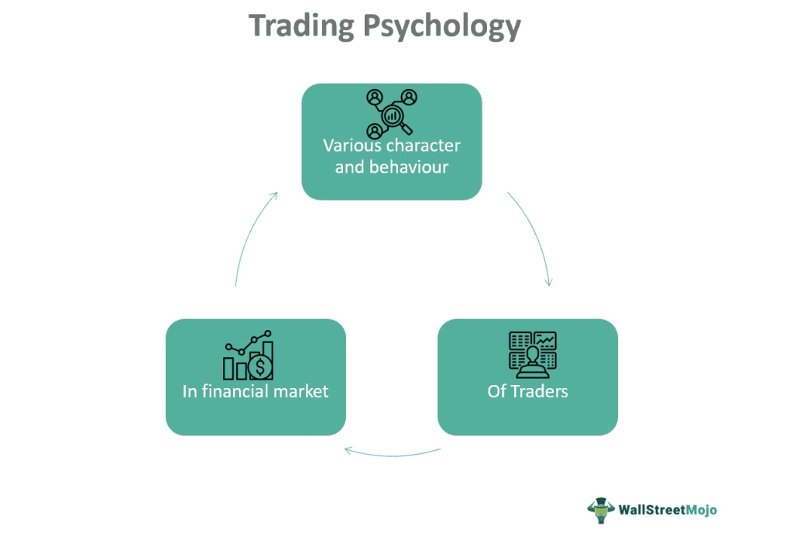

In the complex world of investing, emotional trading, trading psychology, and algorithmic trading are crucial components that significantly influence traders' success. Understanding these elements can empower investors to improve their decision-making processes and achieve superior investment outcomes. Emotional trading encompasses the impact of human emotions on investment choices, often leading to impulsive and suboptimal decisions. Trading psychology highlights the mental and emotional factors that shape these decisions, such as fear, greed, and cognitive biases. Recognizing and managing these psychological influences is essential for traders aiming to enhance their strategies and performance.

On the other hand, algorithmic trading offers an alternative approach by utilizing pre-programmed strategies to make trading decisions. This method reduces the emotional interference in trading by relying on data-driven strategies, thus promoting more rational and objective decision-making. By minimizing emotional biases, algorithmic trading can help traders maintain discipline and consistency in their trading practices.



This article explores the relationship between emotions and trading, underscoring the importance of psychology in the decision-making process. It will also examine the role of algorithmic trading in mitigating emotional biases, offering a more systematic approach to investing. Understanding these interconnected aspects can guide traders in developing a balanced strategy that incorporates both emotional intelligence and algorithmic precision, ultimately leading to better investment outcomes.

## Table of Contents

## The Role of Trading Psychology

Trading psychology encompasses the mental and emotional elements influencing traders' decision-making processes. It is an integral part of trading that can significantly affect a trader's performance. Emotions such as fear, greed, and overconfidence are prevalent and can compromise objective analysis, leading to potential financial losses.

Fear occurs when the market behaves contrary to expectations, often resulting in premature sell-offs or decisions to avoid losses, even when the loss is minor. Greed, on the other hand, might drive traders to make impulsive decisions, such as holding a position for too long in anticipation of further gains. Overconfidence can lead traders to disregard crucial information, increasing the likelihood of risky trades.

Recognizing and understanding these emotional factors is crucial for traders. By being aware of the emotional triggers and biases that affect them, traders can implement strategies to manage these emotions. Such awareness and management lead to more consistent and rational decision-making and ultimately improve trading strategies and performance.

In the context of trading psychology, cognitive biases such as confirmation bias—where traders seek information confirming their beliefs rather than objectively analyzing data—and loss aversion, which is the tendency to prefer avoiding losses to acquiring equivalent gains, also play pivotal roles. These biases need to be identified and managed to enhance trading efficacy.

For traders seeking to improve their trading psychology, several approaches can be beneficial. Adopting a systematic trading strategy that includes clear entry and [exit](/wiki/exit-strategy) criteria can help. Incorporating regular reviews of one's performance and decisions can also provide insights into emotional patterns affecting trades. Practicing mindfulness and emotional regulation techniques can further aid traders in maintaining focus and minimizing the impact of adverse emotions. 

Through understanding and managing the psychological components of trading, traders can aim for improved performance and more favorable investment outcomes.

## Common Emotional Biases in Trading

In the world of trading, emotional biases can significantly impact decision-making and financial outcomes. Two primary emotions, fear and greed, play crucial roles in influencing traders' behavior. Fear can lead to hasty decisions aimed at avoiding losses, often causing traders to exit positions prematurely or miss out on profitable opportunities. Conversely, greed can drive traders to take excessive risks in pursuit of high returns, often resulting in significant losses when markets shift unexpectedly.

Traders also exhibit several behavioral biases that can further complicate decision-making processes. Overconfidence is a common bias where traders overestimate their knowledge or ability to predict market movements, leading them to take on greater risks without adequate justification. This can manifest in excessive trading or holding onto losing positions with the expectation that they will eventually turn profitable.

Herd behavior represents another influential bias, where traders mimic the actions of others rather than relying on their analyses. This collective behavior can lead to asset bubbles or sudden crashes, as seen in numerous historical events such as the dot-com bubble of the late 1990s. Traders following the herd often fail to conduct independent evaluations of market conditions, resulting in irrational investment decisions.

Regret aversion is a bias that affects traders' willingness to enter or exit trades based on past experiences of regret. This can lead to indecision and missed opportunities as traders fear repeating past mistakes. For instance, a trader who previously sold an asset before a significant price increase might hesitate to sell a similar asset in the future, potentially leading to worse outcomes.

Recognizing these biases is critical for traders seeking to mitigate their influence on trading strategies. By acknowledging the presence of fear, greed, overconfidence, herd behavior, and regret aversion, traders can develop more objective approaches to trading. Strategies such as creating pre-defined trading plans, employing rigorous data analysis, and setting clear risk management protocols can help maintain discipline and reduce the impact of emotional biases.

Additionally, traders can benefit from introspective practices like mindfulness and emotional awareness to enhance self-regulation and decision-making. These practices enable traders to stay focused on rational analysis rather than emotional impulses, thereby fostering a more balanced and effective trading approach. Ultimately, a deep understanding of common emotional biases and their effects can empower traders to improve their performance and achieve greater success in the financial markets.

## Behavioral Finance and Its Influence

Behavioral finance investigates the psychological influences on investors' decision-making processes and how these influences can, in turn, affect market movements. Traditional finance theory, largely based on the concept of rational market participants, assumes that investors make decisions based solely on logic and available information. Behavioral finance, however, challenges this notion by asserting that psychological factors can lead to irrational and suboptimal financial behaviors.

One prominent concept within behavioral finance is mental accounting. This theory suggests that individuals categorize and treat their money differently depending on its origin or designated use. For example, an investor might treat a tax refund as "extra" money to be spent more frivolously, while treating regular income with more conservatism. This compartmentalization can affect investment decisions and risk tolerance, potentially leading to inconsistent financial behavior that does not align with their overall financial goals.

Another common bias in behavioral finance is anchoring. Anchoring occurs when individuals rely too heavily on the first piece of information they receive (the "anchor") when making decisions. Investors might fixate on a security's purchase price as an anchor, affecting their judgment and ability to make objective sell or hold decisions as market conditions change. This could lead to holding onto losing investments longer than rational analysis would suggest, due to a mental attachment to recovering the initial investment cost.

Further biases explored in behavioral finance include overconfidence, where investors overestimate their knowledge or predictive abilities, and herd behavior, which describes the tendency to mimic the financial decisions of the majority, potentially leading to asset bubbles or crashes. Regret aversion is another bias, where investors may make conservative decisions to avoid the emotional pain of potential losses, even at the expense of foregone gains.

The insights provided by behavioral finance are crucial for understanding the less rational aspect of financial markets and highlight why market phenomena, such as bubbles and crashes, occasionally deviate from what traditional financial models predict. By recognizing these psychological biases, both individual investors and institutional traders can develop strategies to mitigate their effects, leading to more balanced and rational decision-making processes in financial markets.

## Algorithmic Trading: A Solution to Emotional Trading

Algorithmic trading employs computer programs and pre-defined strategies to make trading decisions, significantly reducing the influence of emotional biases that often plague manual trading. By leveraging quantitative data analysis, [algorithmic trading](/wiki/algorithmic-trading) systems process vast amounts of market data, identifying price trends and executing trades based on mathematical models and statistical techniques. This methodology allows for more rational decision-making, aligning with findings from behavioral finance that highlight the detrimental impact of emotions such as fear and greed on trading performance.

Central to the effectiveness of algorithmic trading is the reliance on data-driven decisions, which are devoid of emotional interference. These systems utilize algorithms—a set of rules or procedures for calculations—designed to exploit specific statistical relationships in market data. For instance, a simple moving average (SMA) strategy might be implemented in Python as follows:

```python
import pandas as pd

def simple_moving_average(data, window_size):
    return data.rolling(window=window_size).mean()

# Example usage
price_data = pd.Series([100, 102, 104, 106, 108, 110])
sma = simple_moving_average(price_data, window_size=3)
print(sma)
```

This example demonstrates how algorithms can be used to compute indicators like the SMA, which can then be utilized to generate trading signals that are consistent and unbiased.

Although algorithmic trading has the advantage of minimizing emotional involvement in trading decisions, the quality of the outcomes heavily depends on the integrity and accuracy of the input data. Poor data quality or incorrect parameter settings can lead to flawed decisions, undermining the benefits of this approach. Therefore, traders must ensure robust data collection, verification processes, and regular updates to the algorithms to reflect changing market dynamics.

In summary, algorithmic trading offers a promising solution to the challenges posed by emotional decision-making in trading. By adhering to pre-programmed, data-driven rules, it fosters a more disciplined and objective approach. However, success hinges on maintaining high-quality data and continuously refining algorithms to adapt to evolving market conditions. This balanced integration of technology and market insight has the potential to enhance trading outcomes significantly.

## Balancing Emotions and Data-Driven Decisions

In trading, the intersection of emotions and data-driven strategies serves as a pivotal area for maximizing efficiency and efficacy. While algorithmic trading has considerably minimized the emotional impact on decision-making, traders' instincts and intuition still play a crucial role in developing a comprehensive approach to trading. Leveraging both emotional and data-driven insights can lead to more nuanced and informed trading strategies.

Algorithmic trading, by design, operates on the foundation of quantitative analysis, using vast amounts of historical and real-time data to make proficient trading decisions. Such systems like moving average crossovers, [pair trading](/wiki/pair-trading), or mean reversion utilize mathematical models, which are devoid of the emotional biases often responsible for irrational decisions. For example, consider a simple moving average crossover strategy:

```python
import pandas as pd

def calculate_moving_average(price_data, short_window, long_window):
    signals = pd.DataFrame(index=price_data.index)
    signals['price'] = price_data
    signals['short_mavg'] = price_data.rolling(window=short_window, min_periods=1).mean()
    signals['long_mavg'] = price_data.rolling(window=long_window, min_periods=1).mean()
    signals['signal'] = 0.0
    signals['signal'][short_window:] = np.where(signals['short_mavg'][short_window:] > signals['long_mavg'][short_window:], 1.0, 0.0)
    signals['positions'] = signals['signal'].diff()

    return signals
```

This Python function demonstrates a typical approach in algorithmic trading, where emotions are bypassed by adhering strictly to pre-set rules. However, solely relying on such strategies without considering the qualitative aspects intrinsic to market dynamics might not capture significant market shifts influenced by factors that models do not encompass, like geopolitical events or changes in consumer sentiment.

A trader's intuition, developed over years of market observation, provides an interpretive lens through which these signals can be viewed. This intuition can identify outliers or anomalies in data that pure algorithms may overlook. Consequently, blending gut feelings with structured data assessment can help traders create a robust framework that optimizes performance while mitigating risks.

Regular evaluation of one's strategy, combined with an awareness of emotional responses, is critical to maintaining the effectiveness of this hybrid approach. Assessments can reveal emotional vulnerabilities, such as tendencies to panic sell during market dips or hold onto loss-making investments due to attachment. By identifying these patterns, traders can refine their decision-making processes to resist impulsive actions, ensuring a measured response that aligns with data-driven insights.

In conclusion, while algorithmic methods have revolutionized trading by reducing emotional biases, a comprehensive approach that integrates human intuition can significantly bolster trading strategies. Continuous self-evaluation and adapting strategies in light of new information and emotional awareness are essential to effective trading practices.

## Strategies for Managing Emotional Trading

Developing a robust trading plan is essential for managing emotions during trading activities, especially in volatile market conditions. A comprehensive trading plan serves as a roadmap, guiding traders in executing trades with discipline and consistency. This involves setting clear goals, specifying entry and exit points, and adhering to predetermined rules that limit emotional interference. For instance, traders should decide on metrics such as the percentage of the total portfolio to risk per trade, the risk-to-reward ratio, and the type of assets to trade.

Employing risk management techniques is crucial to protect portfolios from adverse impacts due to emotional trading decisions. Effective risk management involves defining the risk per trade, using stop-loss and take-profit orders, and maintaining diversification across different asset classes. Stop-loss orders, for instance, automatically close a trade when a specific level of loss is reached, thereby preventing further losses during emotional reactions to market fluctuations. Diversification helps spread risk and reduce the impact of a poor-performing asset on the overall portfolio.

Mindfulness and emotional awareness practices are equally important for maintaining balance and making informed decisions. These practices can include techniques such as meditation, deep-breathing exercises, and regular reflection on trading behaviors and mental states. By fostering awareness of their emotional responses, traders can recognize when emotions might interfere with rational decision-making and take steps to mitigate their influence. For example, traders might take a break from trading when feeling particularly anxious or stressed, allowing time to regain composure and clarity before making further decisions.

Incorporating these strategies can help traders better manage the psychological challenges of trading, ultimately leading to more consistent and rational investment outcomes. By harmonizing a well-structured trading plan with rigorous risk management and mindfulness techniques, traders enhance their ability to navigate the complexities of financial markets without succumbing to emotional biases.

## Conclusion

Mastering trading psychology, understanding emotional biases, and leveraging algorithmic trading are critical components for enhancing trading performance. These elements form a robust foundation for traders aiming to navigate markets effectively and achieve consistent success.

Trading psychology focuses on the mental and emotional states that influence a trader's decision-making processes. By identifying and managing emotional biases such as fear, greed, and overconfidence, traders can enhance their decision-making capabilities. This self-awareness is crucial for recognizing detrimental patterns and making informed, rational decisions.

Algorithmic trading serves as a valuable tool in mitigating emotional biases. By utilizing pre-programmed strategies grounded in data-driven analysis, algorithmic trading reduces the influence of emotional decisions. These systems capitalize on mathematical models and historical data, promoting consistent and objective decision-making. To ensure effectiveness, maintaining data quality and continuously refining algorithms based on market behavior are essential.

Balancing emotions with rational analysis is vital for long-term trading success. Traders should aim to integrate intuitive insights with analytical tools to develop a comprehensive approach. This can be achieved through continuous learning and adaptation, which are imperative in the dynamic landscape of trading. By staying informed about new strategies and technologies, traders can refine their skills and adjust their approaches to current market conditions.

In conclusion, a disciplined approach that encompasses trading psychology, emotional bias awareness, and algorithmic solutions is key to achieving superior trading outcomes. Through a commitment to both emotional balance and data-driven analysis, traders can enhance their performance and succeed in the complex and ever-evolving trading environment.

## References & Further Reading

[1]: Kahneman, D. (2011). ["Thinking, Fast and Slow."](https://link.springer.com/article/10.1007/s00362-013-0533-y) Farrar, Straus and Giroux.

[2]: Thaler, R. H. (2016). ["Misbehaving: The Making of Behavioral Economics."](https://psycnet.apa.org/record/2015-22902-000) W. W. Norton & Company.

[3]: Ranganathan, M. (2019). ["Behavioral Finance: Understanding the Basics."](https://www.researchgate.net/publication/331074203_Ranganathan_et_al-2019-Scientific_Reports) SSRN.

[4]: O'Hara, M. (2015). ["Market Microstructure Theory."](https://www.amazon.com/Market-Microstructure-Theory-Maureen-OHara/dp/0631207619) Wiley.

[5]: Aldridge, I. (2010). ["High-Frequency Trading: A Practical Guide to Algorithmic Strategies and Trading Systems."](https://www.ahmetbeyefendi.com/wp-content/uploads/2020/07/High-Frequency-Trading-Irene-Aldridge.pdf) Wiley.

[6]: Shreve, S. E. (2004). ["Stochastic Calculus for Finance I: The Binomial Asset Pricing Model."](https://link.springer.com/book/10.1007/978-0-387-22527-2) Springer.

[7]: Kahneman, D., & Tversky, A. (1979). ["Prospect Theory: An Analysis of Decision under Risk."](https://www.jstor.org/stable/1914185) Econometrica, 47(2), 263-291.

[8]: Montier, J. (2007). ["Behavioral Investing: A Practitioner's Guide to Applying Behavioral Finance."](https://onlinelibrary.wiley.com/doi/book/10.1002/9781118673430) Wiley.