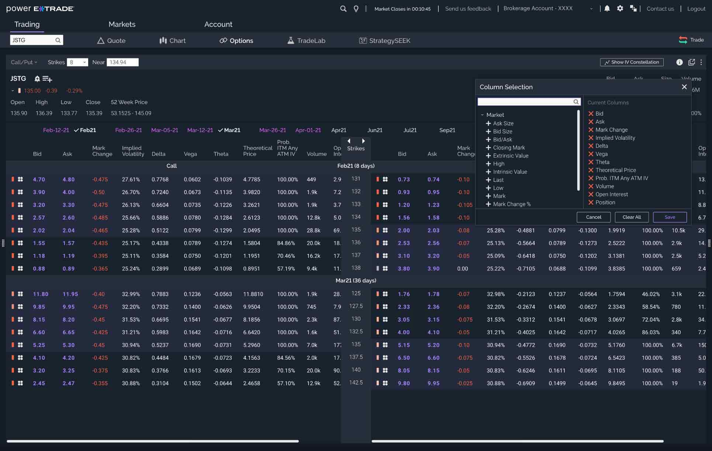

Options trading represents a dynamic segment of the financial markets, offering investors a wide array of strategies to manage risk and capitalize on price movements. E*TRADE stands out as a prominent platform that facilitates options trading, enabling traders to execute a variety of option-based strategies efficiently and effectively. E*TRADE, as a well-established brokerage, has built a reputation for providing a robust suite of tools and resources tailored specifically for options traders, making it a preferred choice for both novice and experienced investors.

Put options play a crucial role within the options trading ecosystem. Essentially, a put option grants the holder the right, but not the obligation, to sell a specified quantity of an underlying asset at a predetermined price, known as the strike price, before or at the expiration date. This type of option is typically used by traders who anticipate a decline in the price of the underlying asset, either for hedging purposes or for speculative gain. The strategic use of put options allows investors to mitigate potential losses in a bearish market or to speculate on downward price movements without directly short-selling the asset.



Algorithmic trading has revolutionized modern trading practices, introducing significant changes in how trades are executed. Algorithms employ sophisticated models and mathematical formulas to autonomously execute trades based on pre-set conditions and strategies. This technology enables traders to react to market changes at speeds and frequencies that human traders cannot match, optimizing the execution of trading strategies with high precision and low latency. In the options market, algorithmic trading has facilitated the automation of complex strategies, enhancing efficiency, and minimizing human error.

The purpose of this article is to explore E*TRADE's options trading platform, specifically focusing on the effective use of put options and the integration of algorithmic trading. By examining the features and tools available on E*TRADE, along with the advantages of algorithmic execution, traders can better understand how to harness these technologies to enhance their trading strategies. This exploration seeks to provide insight into how E*TRADE supports options traders in navigating the complexities of the market while leveraging the advancements of algorithm-driven decision-making.

## Table of Contents

## Understanding Put Options

Put options are financial derivatives that grant the holder the right, but not the obligation, to sell a specific amount of an underlying asset at a predetermined price, known as the strike price, before or at the contract's expiration date. These options serve as strategic tools for traders anticipating a decline in the price of the underlying asset. Essentially, when the market price of the asset drops below the strike price, the holder can exercise the option to sell at the higher strike price, effectively betting on the price decline.

**Use Cases for Put Options: Hedging and Speculation**

Put options are commonly used for two primary purposes: hedging and speculation. 

1. **Hedging**: Put options provide a form of insurance against adverse price movements. For example, an investor holding a portfolio of stocks might purchase put options to protect against a potential market downturn. If the market declines, the loss in the portfolio can be offset by the gains from the put options, as they increase in value when the price of the underlying asset falls. This strategy ensures that the investor's losses are limited to the premium paid for the options.

2. **Speculation**: Traders aiming to profit from anticipated declines in asset prices use put options for speculative purposes. By purchasing put options, they can achieve significant gains if their prediction of a price drop is correct. This form of trading allows speculators to leverage their investment, as the potential profit from the option exceeds the initial cost relative to directly shorting the asset.

**Comparing Puts with Calls**

Put options are often contrasted with call options, which give the holder the right to buy an asset at a specified strike price before expiration. While put options are used when expecting a decrease in asset prices, call options are utilized when anticipating an increase. The differing objectives of these options arise from their opposing mechanics: puts provide a safety net against falling prices, whereas calls offer the potential for profit from rising prices. This fundamental difference makes them versatile tools in the broader landscape of options trading.

**Key Terms to Know**

- **Strike Price**: The fixed price at which the holder of the option can sell (for puts) or buy (for calls) the underlying asset. The strike price is pivotal in determining the value and profitability of an option.

- **Expiration**: The date by which the option must be exercised. Options lose their value after this date if they remain unexercised. The expiration date is crucial for strategies involving timing the market accurately.

- **Time Value Decay**: The concept that the value of an option decreases as it approaches its expiration date, all else being equal. This phenomenon, known as "theta decay," results from the diminishing time for the underlying asset to reach the strike price. Time value is a critical factor in options trading, influencing decisions about when to buy or sell an option.

In understanding put options, traders can harness these instruments to pursue strategic financial objectives, whether it's achieving risk management through hedging or capitalizing on market predictions through speculation. These functions are integral to crafting comprehensive trading strategies that balance potential rewards with inherent risks.

## E*TRADE's Options Trading Platform

To begin trading options on E*TRADE, setting up an account involves several key steps. First, potential traders need to open a brokerage account, with the option of choosing between a cash account and a margin account. A margin account is typically required for more advanced trading strategies, including options trading, as it allows traders to borrow funds to increase their buying power. Once the account type is selected, the applicant must complete an options trading application, which evaluates their trading experience, financial status, and risk tolerance to determine the appropriate level of trading approval.

E*TRADE's options trading platform is equipped with a robust suite of tools and resources designed to assist traders in analyzing market movements and executing trades efficiently. The platform includes a set of analytical tools, such as the Options Analyzer, which helps evaluate strategies by modeling different scenarios. Additionally, it offers a Strategy Scanner to identify potential trades, and educational resources to enhance traders' knowledge and skills.

Executing put options on E*TRADE is streamlined for user convenience. For example, if a trader anticipates a decline in the stock price of a particular asset, they might employ a put option as a strategic move. The process involves selecting the desired stock, determining the number of contracts, setting the strike price and expiration date, and then placing the order via the platform. E*TRADE also provides real-time data to facilitate informed decision-making throughout this process.

When compared to other trading platforms, E*TRADE offers significant advantages for options trading. Its platform stands out with comprehensive educational content, intuitive design, and powerful tools, making it accessible for both novice and experienced traders. Moreover, E*TRADE's customer service and educational offerings provide added support, thus fostering a conducive environment for effective trading practices. These features collectively position E*TRADE as a competitive choice for those seeking to engage in options trading.

## Algorithmic Trading in the Options Market

Algorithmic trading, often referred to as algo trading, leverages computer algorithms to execute trades based on pre-defined conditions and criteria without human intervention. These algorithms are programmed to consider a variety of factors such as price movements, timing, and [volume](/wiki/volume-trading-strategy), enabling them to make rapid decisions. This sophistication allows algo trading to achieve efficiency, accuracy, and speed unattainable through manual trading methods.

In the context of options trading, algorithmic methods optimize the execution of strategies by ensuring perfect timing and minimizing the impact of market fluctuations. By automating the trading process, traders can efficiently handle complex strategies that involve multiple options and underlying assets.

### Common Algorithmic Trading Strategies in Options Markets

1. **Momentum Trading**: This strategy involves algorithms that identify the direction of market movements and place trades that align with the detected trends. In options markets, momentum trading can be used to capitalize on sustained movements in the price of the underlying asset.

2. **Mean Reversion**: Based on the assumption that prices will revert to their historical averages, algorithms following this strategy look for deviations from the norm and execute trades expecting a price correction. This can involve buying undervalued puts or selling overvalued ones.

3. **Volatility Trading**: This strategy capitalizes on the changes in the implied volatility of options. Algorithms can dynamically adjust positions to profit from volatility shifts, buying options when volatility is expected to increase and selling when it's likely to decrease.

### Benefits of Automation in Trading Put Options

Automated trading provides several advantages when applied to put options:

- **Speed and Efficiency**: Algorithms can process information and execute orders in milliseconds, reducing latency and taking advantage of fleeting opportunities in volatile markets.

- **Risk Mitigation**: Automated systems can be programmed to include risk management techniques, such as stop-loss orders and dynamic hedging, to protect positions against adverse market movements.

- **Consistency and Discipline**: By eliminating emotional bias, algorithmic trading ensures that trades are executed based on logic and strategy consistency, rather than impulse decisions.

- **Scalability**: Automation enables traders to handle multiple strategies and large portfolios simultaneously, increasing the potential scope and depth of their market participation.

For instance, Python, with its extensive libraries such as NumPy for numerical calculations and pandas for data manipulation, is a popular choice for developing trading algorithms. Consider the following simplified example of a Python script for a basic [momentum](/wiki/momentum) strategy:

```python
import pandas as pd
import numpy as np

# Load historical data
data = pd.read_csv('options_data.csv')
data['Returns'] = data['Price'].pct_change()

# Define moving averages
data['Short_MA'] = data['Price'].rolling(window=5).mean()
data['Long_MA'] = data['Price'].rolling(window=20).mean()

# Generate buy/sell signals
data['Signal'] = np.where(data['Short_MA'] > data['Long_MA'], 1, -1)

# Execute trades based on signals
data['Position'] = data['Signal'].shift(1)
```

This code calculates short and long moving averages to generate trading signals based on their crossover, implementing a simple momentum-based strategy. The "Signal" column denotes whether to buy or sell a put option: '1' suggests buying, while '-1' indicates selling.

In conclusion, [algorithmic trading](/wiki/algorithmic-trading) revolutionizes options markets by executing trades efficiently and effectively, harnessing strategies designed for various market conditions, and providing robust risk management frameworks. This automation empowers traders to approach their strategies with precision and confidence, significantly transforming the landscape of modern trading practices.

## Integrating Put Options with Algorithmic Trading

Integrating put options with algorithmic trading involves developing automated systems that can execute trades based on predefined criteria. The first step in setting up such an algorithm involves identifying specific goals, such as hedging or speculative objectives, and defining the conditions under which put options should be bought or sold. This process requires a clear understanding of both options trading mechanics and programming skills for algorithm development.

### Key Considerations

1. **Data Analysis**: Effective algorithms rely heavily on comprehensive data analysis. Traders must utilize historical data to backtest strategies and assess their viability. This involves statistical methods to identify trends, patterns, and potential anomalies in the price movements of an underlying asset. 

   For instance, Python libraries such as Pandas and NumPy can be employed for data manipulation, while libraries like scikit-learn offer advanced statistical tools. An algorithm might use historical [volatility](/wiki/volatility-trading-strategies) data as an input to forecast potential future price swings, helping it determine optimal strike prices and expiration dates for put options.

2. **Market Conditions**: Algorithms should account for varying market conditions. This includes recognizing bullish and bearish trends, interest rates, and macroeconomic indicators that might influence asset prices. An adaptive algorithm might adjust its trading strategy based on these conditions, opting to engage in put options trading when signals suggest a downturn.

3. **Timing**: Precision in timing is critical in options trading due to the time-decay nature of options. Algorithms must be capable of reacting to market signals swiftly to capitalize on opportunities and minimize exposure. Using real-time data feeds and low-latency execution systems can enhance the performance of the trading algorithm.

4. **Risk Management**: Effective risk management strategies are crucial, particularly when dealing with put options. To mitigate risks, algorithms can integrate stop-loss orders and position-sizing techniques. Additionally, diversifying the portfolio by incorporating various underlying securities can reduce exposure to a single asset's volatility.

### Potential Challenges and Solutions

One significant challenge is the overfitting of algorithms to historical data, which can lead to strategies that perform well in [backtesting](/wiki/backtesting) but fail in real-world scenarios. To counter this, traders can use cross-validation techniques and stress test algorithms against different market conditions.

Another challenge is the risk of algorithmic glitches or market anomalies that could lead to substantial losses. Incorporating fail-safes and monitoring systems can help detect and rectify unexpected issues promptly. Traders should also regularly update algorithms to adapt to changing market dynamics and regulatory requirements.

### Case Studies

E*TRADE's platform offers capabilities that allow traders to successfully implement algorithmic trading strategies involving put options. One illustrative case is the use of E*TRADE's API, which enables custom script integration for executing algorithmic trades. By utilizing E*TRADE's data analytics tools, traders have developed algorithms that monitor market volatility and execute put option trades when volatility spikes—a common indicator of potential price declines.

In another instance, a trader used [machine learning](/wiki/machine-learning) models to predict price trends and integrated these predictions into their algorithmic trading strategy on E*TRADE. The model was programmed to execute put options when it identified a significant probability of a downward trend, leading to successful trades during periods of market correction.

Overall, integrating put options with algorithmic trading on E*TRADE's platform requires a thorough understanding of market dynamics, sound programming skills, and robust strategies for data analysis and risk management.

## Risk Management Strategies

Effective risk management is essential in options trading due to the leverage and volatility involved, especially with put options. Put options, which provide the right to sell an asset at a predetermined price, can offer significant opportunities for hedging against price declines but also come with their own set of risks. Therefore, utilizing algorithmic trading strategies to manage these risks becomes paramount.

### Techniques for Managing Risk Using Algorithmic Trading

1. **Stop-Loss Orders**: One basic algorithmic risk management technique is the use of stop-loss orders. These orders automatically sell an option or underlying asset once it reaches a certain price level, thereby limiting potential losses. By using algorithms, traders can predefined conditions under which these stop-loss orders should be triggered, optimizing the timing and precision of the execution.

2. **Hedging**: Algorithms can also facilitate hedging strategies that help offset potential losses in options trading. For instance, using a delta-neutral strategy, traders can balance the overall portfolio delta to zero. This involves holding positions in both puts and calls such that the value of the portfolio remains unchanged from small movements in the underlying asset's price.

   ```python
   def calculate_delta_neutral_position(call_delta, put_delta, stock_position):
       # Example function to calculate delta-neutral position
       total_delta = call_delta + put_delta - stock_position
       if total_delta < 0:
           return "Buy more stock to hedge"
       elif total_delta > 0:
           return "Sell stock to neutralize"
       else:
           return "Position is delta-neutral"
   ```

3. **Diversifying Strategies**: Algorithms can automate the implementation of diversifying strategies across different asset classes and market conditions. By analyzing historical data and market indicators, algorithms can suggest optima mix of puts and other securities to spread risk.

### E*TRADE Tools for Risk Management

E*TRADE offers a suite of tools designed to help traders manage risks associated with options trading. These tools include:

- **Options Analyzer**: This tool allows users to simulate different trading scenarios and visualize potential outcomes, aiding in informed decision-making.
- **Probability Calculator**: By calculating the likelihood of various outcomes, this tool helps traders assess risk and adjust their strategies accordingly.
- **Portfolio Risk Tracker**: This feature provides an overview of a trader's portfolio risk and suggests diversification strategies to mitigate significant exposure.

### Addressing Common Risks and Pitfalls in Put Options Trading

- **Time Decay (Theta Risk)**: One inherent risk in trading put options is time decay, which reduces the value of an option as it approaches expiration. To manage this risk, traders can use algorithms to adjust their positions dynamically as expiration nears, strategically exiting or rolling over positions.

- **Market Volatility**: Volatility can significantly impact option pricing. Algorithms can monitor market conditions in real-time and adjust strategies to capitalize on or protect against sudden volatility spikes.

- **Liquidity Risk**: The ability to execute trades without affecting the asset's market price is crucial. By implementing algorithms, traders can optimize trade sizes and timing to minimize liquidity risks.

In summary, algorithmic trading provides robust mechanisms for managing the multifaceted risks associated with put options. By leveraging E*TRADE's comprehensive tools and resources, traders can enhance their risk management strategies, potentially leading to more consistent and secure trading performance.

## Conclusion

E*TRADE's platform stands out as a valuable tool for those interested in options trading, particularly with put options and algorithmic trading. Throughout the article, we explored the significance of put options, which serve as vital instruments for hedging and speculation in a market that often witnesses price declines. Understanding key terms like strike price, expiration, and time value decay is imperative for traders navigating the complex world of options.

E*TRADE's options trading platform provides robust tools and features, making it accessible for both novice and seasoned traders. The ease of setting up an account and the breadth of resources available endorse E*TRADE as a competitive choice among other platforms. This advantage is further enhanced by the platform's capability to seamlessly integrate algorithmic trading strategies, enabling traders to execute trades based on pre-set conditions. These algorithms not only optimize the execution of options strategies but also play a crucial role in risk mitigation.

The landscape of options trading is rapidly changing, driven by technological advancements. The future of trading is likely to see greater reliance on algorithmic strategies, allowing for more efficient and strategic positioning in the market. While algorithmic trading offers numerous benefits, including reduced human error and increased speed, it also demands careful attention to associated risks and challenges.

Traders are encouraged to explore the potential of algorithmic trading through platforms like E*TRADE while being mindful of the inherent risks. Approaching trading with a strategic mindset—taking advantage of the educational resources, webinars, and support provided by E*TRADE—can help mitigate these risks and enhance trading outcomes. 

For those ready to elevate their trading experience, E*TRADE offers an opportunity to harness the power of technology in options trading. Signing up to explore E*TRADE's platform, with a well-thought-out approach to options trading, could be the first step towards mastering the evolving landscape of financial markets.

## Additional Resources

For individuals seeking to deepen their understanding of options trading and algorithmic strategies, a variety of resources are available both online and through E*TRADE’s educational offerings.

### Links to Further Reading on Options Trading and Algorithmic Strategies
1. **Investopedia**: Provides comprehensive articles on options trading strategies, the functioning of put and call options, and the intricacies of algorithmic trading. A useful starting point for both novice and advanced traders. [Investopedia Options](https://www.investopedia.com/options-basics-tutorial-4583012)

2. **CME Group's Education Center**: Offers a wide array of resources tailored to options trading, including market insights and webinars focused on derivatives. [CME Group Education](https://www.cmegroup.com/education/courses/fundamentals-of-options/index.html)

3. **MIT OpenCourseWare**: Features free courses in quantitative finance, covering fundamentals that underpin algorithmic trading systems, suitable for those interested in the mathematical aspects. [MIT OpenCourseWare](https://ocw.mit.edu/courses/sloan-school-of-management/15-457-laboratory-in-quantitative-finance-fall-2013/)

4. **Quantitative Finance Books**: Recommended readings such as "Options, Futures, and Other Derivatives" by John C. Hull, which is a staple for understanding derivatives and algorithmic applications.

### Suggestions for Educational Programs and Webinars Hosted by E*TRADE
E*TRADE provides a series of educational programs and webinars aimed at empowering traders with knowledge about the markets, trading tools, and advanced strategies. Some notable offerings include:

- **E*TRADE’s Options Education Center**: Contains video tutorials, articles, and interactive courses designed to enhance the trader's knowledge of the options market, tailored to all skill levels.

- **Webinars and Live Events**: Regularly scheduled live webinars cover a range of topics from the basics of options trading to advanced strategies involving algorithmic trading. These sessions are often led by seasoned traders and financial experts.

- **Market Research and Analysis Tools**: E*TRADE’s platform includes various analysis tools and daily market reports that offer insights beneficial for making informed trading decisions.

### Contact Information for E*TRADE’s Customer Support and Financial Advisors
Traders in need of personalized support or financial advice can reach out to E*TRADE’s customer service and advisory teams:

- **Customer Support**: Available 24/7 to assist with trading queries and platform navigation. Reach them at 1-800-387-2331 (U.S.) or visit the E*TRADE website for international contact numbers.

- **Financial Advisors**: E*TRADE offers access to licensed professionals who can provide in-depth financial advice tailored to individual trading objectives. For an appointment, you can call or set up a consultation through the E*TRADE online client portal.

These resources serve as a foundation for traders looking to refine their skills and adopt more sophisticated trading methodologies, such as those involving put options and algorithmic trading.

## References & Further Reading

[1]: Bergstra, J., Bardenet, R., Bengio, Y., & Kégl, B. (2011). ["Algorithms for Hyper-Parameter Optimization."](https://dl.acm.org/doi/10.5555/2986459.2986743) Advances in Neural Information Processing Systems 24.

[2]: ["Advances in Financial Machine Learning"](https://www.amazon.com/Advances-Financial-Machine-Learning-Marcos/dp/1119482089) by Marcos Lopez de Prado

[3]: ["Evidence-Based Technical Analysis: Applying the Scientific Method and Statistical Inference to Trading Signals"](https://www.amazon.com/Evidence-Based-Technical-Analysis-Scientific-Statistical/dp/0470008741) by David Aronson

[4]: ["Machine Learning for Algorithmic Trading"](https://github.com/stefan-jansen/machine-learning-for-trading) by Stefan Jansen

[5]: ["Quantitative Trading: How to Build Your Own Algorithmic Trading Business"](https://www.amazon.com/Quantitative-Trading-Build-Algorithmic-Business/dp/1119800064) by Ernest P. Chan