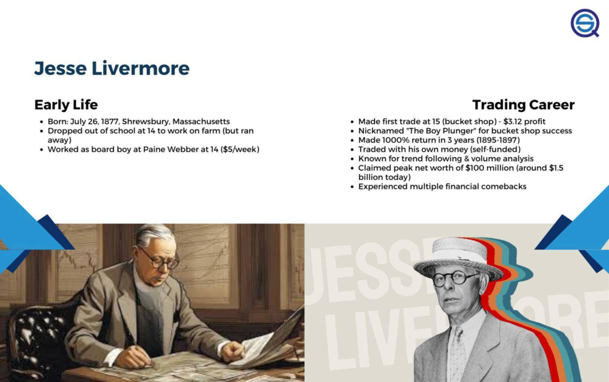

Algorithmic trading, commonly referred to as algo trading, is reshaping financial markets by enabling the automation of trading decisions through pre-set criteria. By utilizing sophisticated algorithms, traders can capitalize on market opportunities with speed and precision that surpasses human capability. Central to this innovative approach are trading quotes—principles distilled from the experiences of seasoned traders. These quotes not only encapsulate the essence of successful trading but also offer a framework for developing effective trading algorithms. 

This article explores impactful trading quotes and their applications within algo trading strategies. It provides insights into how timeless human wisdom can be encoded into precise machine logic. In the ever-evolving landscape of financial markets, these guiding quotes function as important tools in algorithmic development. They support strategic, disciplined, and informed decision-making processes that are crucial for navigating dynamic market environments.



By integrating human insights with computational dexterity, algo traders can bridge the gap between qualitative understanding and quantitative execution. This synthesis allows for the creation of robust trading algorithms that adhere to proven market principles while leveraging technology to optimize outcomes.

## Table of Contents

## The Importance of Trading Quotes in Algorithmic Trading

Trading quotes, accumulated over decades by renowned traders, encapsulate enduring principles that are vital for algorithmic trading. These aphorisms are not merely words of wisdom but foundational guidelines that can be translated into concrete rules for automated systems, shaping how decisions are made in the fast-paced markets.

In algorithmic trading, the translation of these trading quotes into algorithmic logic serves as a blueprint for creating strategies that overcome common trading pitfalls. Emotional bias, a frequent adversary in trading, is often mitigated by algorithms that adhere to predefined, objective rules. For instance, by codifying principles from trading quotes, traders can develop systems that execute trades based on quantifiable data rather than emotions. This approach ensures that emotional volatility is replaced by psychological resilience, enhancing decision-making quality and consistency.

Moreover, strategic thinking is embedded into algorithms by leveraging these quotes to set clear parameters for trading operations. Over-trading, a typical issue faced by many traders, can be controlled by incorporating insights that encourage disciplined trading practices. For example, an algorithm might employ quotes that prioritize quality over quantity, executing trades only when certain criteria align, thus maintaining focus and reducing unnecessary risks.

Risk management, another crucial component of successful trading, benefits significantly from the application of trading quotes. By embedding principles that emphasize calculated risk-taking and capital preservation, algo trading systems can be designed to implement features such as stop-losses and position-size limits. These features act as safeguards, aligning with legendary traders' insights on protecting capital before pursuing profits. 

By basing algorithmic strategies on these trading quotes, traders ensure their systems are reflective of established market practices, promoting not only profitability but also long-term viability. This approach fosters the development of trading algorithms that are not only efficient but also sustainable, striking a balance between automated precision and human-driven strategic foresight.

## Key Trading Quotes and Their Algorithmic Applications

1. **"Where you want to be is always in control, never wishing, always trading, and always, first and foremost protecting your butt." - Paul Tudor Jones**

   The essence of this quote by Paul Tudor Jones is risk management and control over trading activities, a critical aspect of [algorithmic trading](/wiki/algorithmic-trading). In practice, algo trading strategies embracing this principle prioritize risk management and capital preservation. Algorithms can incorporate features such as stop-loss orders, which automatically sell a security when its price falls below a predetermined level, thus limiting potential losses. Additionally, position sizing limits can be enforced to prevent excessive allocation of capital to any single trade, thereby reducing the exposure to any one market scenario. Below is an example of how a stop-loss can be implemented in Python using a basic trading framework:

   ```python
   def execute_trade(position, entry_price, stop_loss_pct):
       stop_loss_price = entry_price * (1 - stop_loss_pct)
       if position['current_price'] <= stop_loss_price:
           position['status'] = 'close'
           print(f"Stop-loss triggered. Closing position at {position['current_price']}")
   ```

2. **"What is most important isn’t knowing the future — it is knowing how to react appropriately to the information available at each point in time." - Ray Dalio**

   Ray Dalio emphasizes the importance of adaptability and timely response to market information. Algorithmic trading strategies can be designed to be responsive and adaptable by using real-time data feeds and predictive analytics. This involves developing algorithms that can process incoming market data and adjust trading strategies dynamically rather than relying solely on predictions of future market movements. A Fibonacci retracement or moving average crossover strategy could be adjusted dynamically by recalculating levels or using [machine learning](/wiki/machine-learning) models to learn from historical data patterns and anticipate potential outcomes.

   ```python
   def dynamic_strategy(market_data):
       # Use moving averages to generate signals
       short_window = 40
       long_window = 100
       signals = pd.DataFrame(index=market_data.index)
       signals['signal'] = 0.0
       signals['short_mavg'] = market_data['close'].rolling(window=short_window, min_periods=1, center=False).mean()
       signals['long_mavg'] = market_data['close'].rolling(window=long_window, min_periods=1, center=False).mean()
       # Generate buy/sell signals
       signals['signal'][short_window:] = np.where(signals['short_mavg'][short_window:] > signals['long_mavg'][short_window:], 1.0, 0.0)   
       signals['positions'] = signals['signal'].diff()
       return signals
   ```

3. **"The markets are the same now as they were five or ten years ago because they keep changing-just as they did then." - Ed Seykota**

   Ed Seykota's insight points to the perpetual evolution of markets, necessitating robust and adaptive trading systems. Algorithmic trading systems must be built to withstand and adapt to varying market conditions. This requires resilience and flexibility, often achieved through continuous monitoring and adjustment. Benefit can also be gained from diversification across multiple trading strategies or markets. 

   For instance, using robust optimization techniques or [reinforcement learning](/wiki/reinforcement-learning), one can design algorithms that evolve over time with the changing market conditions. This proactively anticipates potential market shifts without the need for frequent overhauls of the trading algorithms. Implementing a Kalman filter update for trend prediction is one example:

   ```python
   def kalman_filter_predict(A, B, u, Q, x, P):
       x = A @ x + B @ u
       P = A @ P @ A.T + Q
       return x, P

   def kalman_filter_update(H, R, z, x, P):
       y = z - H @ x
       S = H @ P @ H.T + R
       K = P @ H.T @ np.linalg.inv(S)
       x = x + K @ y
       P = (np.eye(len(K)) - K @ H) @ P
       return x, P
   ``` 

These applications show how foundational trading principles can be programmed into algorithmic strategies to enhance trading performance by maintaining control, adaptability, and robustness against evolving markets.

## Backtesting Trading Quotes: Lessons for Algo Traders

Backtesting is an essential component in the development and refinement of algorithmic trading strategies. It allows traders to simulate the performance of a trading algorithm using historical market data before deploying it in live markets. By integrating trading quotes into this process, algorithms can be aligned with time-tested trading philosophies, enhancing their potential for success.

In [backtesting](/wiki/backtesting), strategies are evaluated under varied market conditions to assess both their effectiveness and robustness. For instance, testing an algorithm across different time periods, asset classes, or economic cycles helps identify its strengths and weaknesses. This approach is crucial for validating that an algorithm can not only perform well with historical data but also withstand the unpredictability of future market conditions. Consider the following Python pseudo-code to illustrate a simple backtesting framework:

```python
import pandas as pd

def backtest_strategy(data, strategy_function):
    initial_capital = 100000  # Initial capital
    positions = strategy_function(data)  # Generates buy/sell signals
    portfolio = initial_capital

    for date, position in positions.iterrows():
        # Calculate returns
        if position['Signal'] == 'Buy':
            qty = portfolio / data.loc[date]['Price']  # Buy shares
            portfolio = qty * data.loc[date + 1]['Price']  # Update portfolio based on next day price
        elif position['Signal'] == 'Sell':
            qty = portfolio / data.loc[date]['Price']  # Sell shares
            portfolio = qty * data.loc[date + 1]['Price']  # Update portfolio based on next day price

    return portfolio - initial_capital

# Example usage
historical_data = pd.read_csv('market_data.csv')
final_return = backtest_strategy(historical_data, your_strategy_function)

print(f"Backtest return: {final_return}")
```

Incorporating insights from successful traders into backtesting involves more than historical data verification; it infuses the qualitative lessons from trading quotes into algorithm logic. For example, adopting Paul Tudor Jones' emphasis on risk management, a backtesting framework could include mechanisms for evaluating the impact of stop-loss and position-sizing rules on overall strategy performance. By simulating how these risk control measures would have protected capital in adverse conditions, traders can enhance the resilience of their strategies.

Backtesting also allows for the refinement and optimization of algorithms. As algorithms are tested, feedback from performance metrics informs developers of necessary adjustments. This iterative process is akin to learning from the market; trading quotes serve as guiding principles, challenging algorithmic assumptions and fostering improvements in strategic application. For example, Ray Dalio's quote on the importance of reacting to available information rather than predicting outcomes can inform the development of adaptive strategies that adjust parameters based on the latest data inputs.

Ultimately, integrating trading quotes into backtesting ensures that trading algorithms are aligned with proven principles, driving the creation of strategies that are not only profitable but also sustainable over the long term. This symbiotic relationship between historical insight and algorithmic precision ensures optimal performance, preparing algo traders for unexpected market dynamics.

## Risk Management in Algo Trading Guided by Trading Quotes

Effective risk management is essential for successful algorithmic trading. The wisdom encapsulated in trading quotes from renowned traders underscores the importance of this aspect. These insights can be systematically integrated into algorithmic strategies, fostering disciplined approaches that prioritize capital preservation.

Algorithms should be designed with adaptive mechanisms to adjust position sizes in response to market [volatility](/wiki/volatility-trading-strategies). This approach aligns with the principle of protecting one's capital, a core tenet expressed in quotes from experienced traders like Paul Tudor Jones. By dynamically scaling positions, algorithms can mitigate potential losses during volatile market phases. The formula for position sizing might involve calculating the appropriate trade size based on the account's risk tolerance and the current volatility level:

$$
\text{Position Size} = \frac{\text{Risk Per Trade}}{\text{Volatility} \times \text{Account Balance}}
$$

Stop-loss mechanisms are also crucial in ensuring risk is contained. By setting pre-determined thresholds where a trade will automatically [exit](/wiki/exit-strategy) a position, traders can minimize losses in adverse market situations. An example of implementing a stop-loss feature in Python could involve the following code snippet:

```python
def apply_stop_loss(current_price, entry_price, stop_loss_percentage):
    stop_loss_price = entry_price * (1 - stop_loss_percentage/100)
    if current_price <= stop_loss_price:
        return "Exit Position"
    return "Hold Position"
```

Recognizing scenarios with heightened risk is another critical component of risk management. Algorithms can incorporate logic to identify when market conditions exceed established risk levels, prompting either reduced exposure or complete withdrawal from trades. This proactive approach aids in safeguarding assets and maintaining portfolio stability.

The overarching philosophy reiterated in trading quotes – prioritizing capital protection over potential profits – should be embedded in the very architecture of trading algorithms. Ensuring that risk management takes precedence provides a robust foundation for long-term trading success, adapting the lessons from seasoned traders into the strategic frameworks executed by machines.

## The Future of Algorithmic Trading: Wisdom Meets Technology

As algorithmic trading continues to advance, the symbiosis between human wisdom and technological prowess presents significant opportunities for enhancing both trade execution and strategy development. This fusion ensures that trading algorithms not only become more efficient but are also imbued with the nuanced understanding required for long-term success in the market.

The capacity of technology to process vast amounts of data with speed and precision is unparalleled. Algorithms can execute trades in milliseconds, analyze historical data, identify patterns, and respond to market changes with minimal human intervention. However, this computational proficiency does not replace the strategic acumen and foresight of experienced traders. Instead, these human insights are becoming increasingly appreciated as essential components in crafting sophisticated trading systems. The art of trading requires a deep understanding of market psychology, behavioral patterns, and the ability to anticipate movements based on non-quantifiable factors. These elements, gathered through years of trading experience, provide a layer of strategic foresight that purely data-driven models may lack.

Looking ahead, we can expect algorithmic trading systems to integrate these two facets more deeply. Future advancements in this field will likely entail the development of hybrid models, where algorithms are designed not just to operate autonomously, but to enrich their functionality with human-inspired strategies. This could involve incorporating machine learning algorithms that continuously learn from market data, while also adapting based on predefined principles derived from successful trading philosophies.

For example, reinforcement learning—a method where algorithms learn optimal actions through trial and error in dynamic environments—can be employed to simulate and adapt to changing market conditions. By implementing a reward system based on historical trading strategies augmented with trader insights, algorithms can evolve to make decisions that align with human expert evaluations.

```python
import numpy as np
import tensorflow as tf

# Hypothetical example of a simple reinforcement learning model for an adaptive trading strategy

class TradingEnv:
    def __init__(self):
        self.state_space = 3  # Example state space
        self.action_space = 2  # Example action space

    def reset(self):
        return np.zeros(self.state_space)

    def step(self, action):
        next_state = np.random.rand(self.state_space)
        reward = np.random.rand() if action == np.argmax(next_state) else 0
        done = False
        return next_state, reward, done

env = TradingEnv()
model = tf.keras.models.Sequential([
    tf.keras.layers.Dense(24, input_shape=(env.state_space,), activation='relu'),
    tf.keras.layers.Dense(24, activation='relu'),
    tf.keras.layers.Dense(env.action_space, activation='linear')
])

# Implement training loop here for the reinforcement learning model
```

Such systems would go beyond rigid rule-based frameworks, becoming dynamic and adaptive in nature, capturing the best of both [artificial intelligence](/wiki/ai-artificial-intelligence) and human market wisdom. They embody a blend of efficiency and intelligence, where technology facilitates execution while human wisdom guides strategy formulation.

In summary, the future of algorithmic trading lies in a seamless integration of technology with human experience, producing systems that are not only operationally efficient but also strategically insightful and adaptable to an ever-evolving market landscape.

## Conclusion

Trading quotes are invaluable resources that encapsulate the essence of successful trading strategies, drawing from the collective wisdom of seasoned traders. These quotes serve as timeless pieces of guidance, which, when integrated into algorithmic frameworks, significantly enhance the effectiveness and robustness of trading algorithms. The fusion of these quotes with algorithmic design ensures that human intuition, with its nuanced understanding of market dynamics, complements the computational efficiency that technology provides.

By embedding these core principles into the fabric of algorithmic trading, traders can create systems that are not only responsive and adaptive but also grounded in time-tested market wisdom. This combination allows for the construction of algorithms that can skillfully navigate the complex and often volatile market conditions, by retaining a strategic focus on risk management and adaptive responsiveness, principles often emphasized by trading legends.

The future of algorithmic trading lies in the harmonious integration of quantitative techniques and qualitative insights. This ongoing dialogue between numerical analysis and human experience will be the driving force behind the development of increasingly sophisticated, resilient, and successful trading systems. As algorithmic solutions advance, they will continue to reflect this blend, marrying analytical precision with the instinctual experience of human traders to achieve sustainable success in the markets.

## References & Further Reading

[1]: Bergstra, J., Bardenet, R., Bengio, Y., & Kégl, B. (2011). ["Algorithms for Hyper-Parameter Optimization."](https://papers.nips.cc/paper/4443-algorithms-for-hyper-parameter-optimization) Advances in Neural Information Processing Systems 24.

[2]: ["Advances in Financial Machine Learning"](https://www.amazon.com/Advances-Financial-Machine-Learning-Marcos/dp/1119482089) by Marcos Lopez de Prado

[3]: ["Evidence-Based Technical Analysis: Applying the Scientific Method and Statistical Inference to Trading Signals"](https://www.amazon.com/Evidence-Based-Technical-Analysis-Scientific-Statistical/dp/0470008741) by David Aronson

[4]: ["Machine Learning for Algorithmic Trading"](https://github.com/stefan-jansen/machine-learning-for-trading) by Stefan Jansen

[5]: ["Quantitative Trading: How to Build Your Own Algorithmic Trading Business"](https://books.google.com/books/about/Quantitative_Trading.html?id=j70yEAAAQBAJ) by Ernest P. Chan