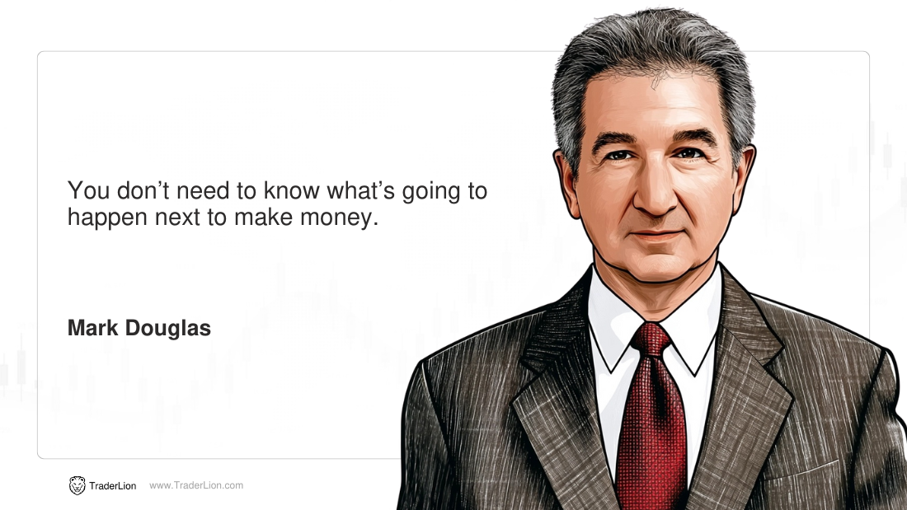

## Table of Contents

## What is a trading quote and why are they important?

A trading quote is a price that someone is willing to buy or sell a financial product, like a stock or a currency, at a specific time. It shows two numbers: the bid price, which is what buyers are willing to pay, and the ask price, which is what sellers want to receive. The difference between these two prices is called the spread. Trading quotes are updated all the time because the prices of financial products change constantly.

Trading quotes are important because they help people make decisions about buying and selling. If you know the current quote, you can decide if it's a good time to buy or sell based on what you think the price will do next. For example, if you think the price of a stock will go up, you might want to buy it when the ask price is low. Also, quotes help keep the market fair and transparent, so everyone knows the prices and can trade with confidence.

## Who are some of the most influential traders known for their quotes?

One of the most influential traders known for his quotes is Warren Buffett. He is called the "Oracle of Omaha" because he is really good at picking stocks and making money. One of his famous quotes is, "The stock market is a device for transferring money from the impatient to the patient." This means that if you wait and don't rush, you can make more money in the stock market. Buffett's quotes often talk about the importance of being patient and thinking long-term when you invest.

Another well-known trader is George Soros. He is famous for making a lot of money from trading currencies. One of his well-known quotes is, "It's not whether you're right or wrong that's important, but how much money you make when you're right and how much you lose when you're wrong." This quote tells us that in trading, it's important to manage your wins and losses carefully. Soros' quotes often focus on the risks and rewards in trading and how to handle them smartly.

## Can you explain some basic trading quotes that beginners should know?

When you start trading, it's good to know some basic trading quotes that can help guide you. One important quote is, "Cut your losses short and let your profits run." This means if you're losing money on a trade, it's better to stop it quickly before you lose too much. On the other hand, if you're making money, you should keep the trade going to make even more profit. This quote teaches beginners to manage their trades carefully and not let emotions get in the way.

Another useful quote is, "The trend is your friend." This means that it's often a good idea to trade in the same direction as the overall market trend. If the market is going up, you might want to buy, and if it's going down, you might want to sell. Following the trend can help beginners make more successful trades because it's easier to go with the flow of the market than to try to predict sudden changes.

Lastly, "Don't put all your eggs in one basket" is a quote that reminds beginners to spread their money across different investments. If you put all your money into one stock or one type of investment, you could lose everything if it goes bad. By diversifying, or spreading your money around, you can lower your risk and have a better chance of making money over time.

## How can trading quotes inspire and motivate traders?

Trading quotes can inspire and motivate traders by giving them simple, powerful ideas to remember when they are making decisions. For example, the quote "The stock market is a device for transferring money from the impatient to the patient" by Warren Buffett reminds traders that good things can come to those who wait. This can encourage traders to stay calm and stick with their plans, even when the market gets tough. By focusing on long-term goals instead of short-term ups and downs, traders can feel more confident and motivated to keep going.

Quotes can also help traders feel connected to a community of successful people who have faced similar challenges. When traders read quotes from famous traders like George Soros, who said, "It's not whether you're right or wrong that's important, but how much money you make when you're right and how much you lose when you're wrong," they can feel inspired by the wisdom of others. This sense of connection can motivate traders to learn from their mistakes and keep improving their skills. Knowing that even the best traders have faced losses can make beginners feel more hopeful and determined to succeed.

## What are some common themes found in trading quotes?

Trading quotes often talk about the importance of patience and long-term thinking. Many quotes, like Warren Buffett's "The stock market is a device for transferring money from the impatient to the patient," remind traders that it's better to wait and not rush into decisions. This helps traders stay calm and stick to their plans, even when the market is going up and down a lot. By focusing on the long run, traders can avoid making quick choices that might lead to big losses.

Another common theme in trading quotes is the idea of managing risks and rewards. George Soros's quote, "It's not whether you're right or wrong that's important, but how much money you make when you're right and how much you lose when you're wrong," shows how important it is to think about how much you can win or lose on each trade. This encourages traders to be careful and not put all their money into one trade. By understanding and controlling their risks, traders can feel more confident and make smarter choices.

Lastly, trading quotes often stress the value of following market trends and diversifying investments. The saying "The trend is your friend" tells traders to go with the flow of the market, which can make trading easier and more successful. And the advice "Don't put all your eggs in one basket" reminds traders to spread their money across different investments to lower their risk. These themes help traders build a solid plan and stay motivated, even when things get tough.

## How do trading quotes reflect different trading philosophies?

Trading quotes show different ways of thinking about trading. Some quotes focus on being patient and thinking long-term. For example, Warren Buffett's quote about the stock market transferring money from the impatient to the patient shows that waiting can lead to better results. This kind of thinking encourages traders to not rush and to stick with their plans, even when the market is changing a lot. It's all about looking at the big picture and not getting too worried about short-term ups and downs.

Other quotes talk about managing risks and rewards. George Soros's idea that it's more important to think about how much you win or lose, rather than just being right or wrong, shows a different way of looking at trading. This philosophy is about being careful with your money and not betting everything on one trade. It helps traders think about the possible outcomes and make smarter choices. By focusing on risk management, traders can feel more in control and confident in their decisions.

Some quotes also highlight the importance of following market trends and spreading out investments. The saying "The trend is your friend" suggests that it's easier to make money by going with the flow of the market. And the advice to not put all your eggs in one basket encourages traders to diversify their investments to reduce risk. These ideas reflect a practical approach to trading, where traders use the market's direction and spread their money around to build a strong trading plan.

## What are some advanced trading quotes that can benefit experienced traders?

One advanced trading quote that can benefit experienced traders is, "The market is always right." This quote reminds traders that no matter how much they think they know, the market's actions are the ultimate truth. Experienced traders can use this to stay humble and always listen to what the market is telling them. It encourages them to adapt their strategies based on real market movements rather than sticking to a plan that's not working. This can help them avoid big losses and find new opportunities they might have missed if they were too set in their ways.

Another useful quote for experienced traders is, "Trade what you see, not what you think." This quote emphasizes the importance of relying on actual data and market trends rather than personal opinions or predictions. For experienced traders, this can mean using technical analysis and charts to make decisions, instead of letting emotions or guesses guide their trades. By focusing on what they can see and measure, traders can make more objective choices and improve their chances of success in the market.

## How can traders apply the wisdom from trading quotes to their strategies?

Traders can use the wisdom from trading quotes to make their strategies better by following the advice in the quotes. For example, the quote "Cut your losses short and let your profits run" can help traders know when to stop a losing trade and when to keep a winning trade going. This can help them manage their money better and not lose too much when things go wrong. By remembering this quote, traders can make rules for themselves about when to get out of a trade and when to stay in, which can make their trading more successful over time.

Another way traders can use trading quotes is by thinking about the big picture and staying patient. The quote "The stock market is a device for transferring money from the impatient to the patient" can remind traders not to rush into decisions. Instead of trying to make quick money, they can focus on long-term goals and wait for the right time to buy or sell. This can help them avoid making choices based on emotions and stick to a plan that works over time. By keeping these quotes in mind, traders can build a strong strategy that helps them do well in the market.

## Are there any trading quotes that specifically address risk management?

One trading quote that talks about risk management is, "It's not whether you're right or wrong that's important, but how much money you make when you're right and how much you lose when you're wrong." This quote by George Soros reminds traders that it's more important to think about how much they can win or lose on each trade than just being right or wrong. By focusing on the size of their wins and losses, traders can be careful with their money and not lose too much on one trade. This can help them stay in the game longer and have a better chance of making money over time.

Another quote that helps with risk management is, "Don't put all your eggs in one basket." This saying tells traders to spread their money across different investments. If they put all their money into one stock or one type of investment, they could lose everything if it goes bad. By diversifying, or spreading their money around, traders can lower their risk and have a better chance of making money over time. This quote encourages traders to be smart about their money and not take too many chances on one thing.

## What are some trading quotes that discuss the psychological aspects of trading?

One trading quote that talks about the psychological side of trading is, "The hardest thing to do is to keep your emotions in check when you're losing money." This quote reminds traders that it's easy to get upset or scared when trades go wrong, but staying calm is important. If traders let their feelings control their choices, they might make bad decisions and lose more money. By remembering this quote, traders can work on staying cool and sticking to their plan, even when things get tough.

Another quote that focuses on the mental part of trading is, "Fear and greed are the two biggest enemies of the trader." This quote points out that being too scared or too greedy can lead traders to make mistakes. If traders are afraid, they might sell too soon and miss out on bigger profits. If they're too greedy, they might hold onto a losing trade for too long, hoping it will turn around. By understanding and controlling these feelings, traders can make better choices and do well in the market.

## How have historical trading quotes influenced modern trading practices?

Historical trading quotes have had a big impact on how people trade today. Quotes like Warren Buffett's "The stock market is a device for transferring money from the impatient to the patient" have taught modern traders to be patient and think about the long term. This idea has led many traders to create strategies that focus on holding onto investments for a long time instead of trying to make quick money. By following this advice, traders today can avoid making rash decisions based on short-term market changes and instead stick to a plan that works over time.

Another way historical trading quotes have shaped modern trading is by emphasizing the importance of risk management. George Soros's quote, "It's not whether you're right or wrong that's important, but how much money you make when you're right and how much you lose when you're wrong," has influenced traders to be careful with their money. This has led to the development of trading practices that focus on setting clear rules for when to get out of a losing trade and when to keep a winning trade going. By managing their risks carefully, modern traders can protect their money and have a better chance of success in the market.

## Can you provide examples of trading quotes that have been proven effective through case studies or empirical data?

One trading quote that has been shown to work well through studies is "Cut your losses short and let your profits run." This advice has been tested in many trading scenarios, and the results show that traders who follow this rule often do better than those who don't. For example, a study by the Journal of Financial Markets found that traders who quickly sold their losing stocks and held onto their winning stocks made more money over time. This is because they didn't lose too much on bad trades and were able to make more from good ones. By sticking to this quote, traders can manage their money better and increase their chances of success.

Another quote that has been proven effective is "Don't put all your eggs in one basket." Research from the Journal of Portfolio Management has shown that traders who spread their money across different investments usually have less risk and better long-term results. For instance, a case study of a group of investors found that those who diversified their portfolios had steadier returns and were less affected by big drops in the market. This quote encourages traders to be smart about their money and not bet everything on one thing, which can help them build a strong and stable trading strategy.

## How can trading quotes guide risk management in algorithmic trading?

Effective risk management is essential for successful [algorithmic trading](/wiki/algorithmic-trading). The wisdom encapsulated in trading quotes from renowned traders underscores the importance of this aspect. These insights can be systematically integrated into algorithmic strategies, fostering disciplined approaches that prioritize capital preservation.

Algorithms should be designed with adaptive mechanisms to adjust position sizes in response to market [volatility](/wiki/volatility-trading-strategies). This approach aligns with the principle of protecting one's capital, a core tenet expressed in quotes from experienced traders like Paul Tudor Jones. By dynamically scaling positions, algorithms can mitigate potential losses during volatile market phases. The formula for position sizing might involve calculating the appropriate trade size based on the account's risk tolerance and the current volatility level:

$$
\text{Position Size} = \frac{\text{Risk Per Trade}}{\text{Volatility} \times \text{Account Balance}}
$$

Stop-loss mechanisms are also crucial in ensuring risk is contained. By setting pre-determined thresholds where a trade will automatically [exit](/wiki/exit-strategy) a position, traders can minimize losses in adverse market situations. An example of implementing a stop-loss feature in Python could involve the following code snippet:

```python
def apply_stop_loss(current_price, entry_price, stop_loss_percentage):
    stop_loss_price = entry_price * (1 - stop_loss_percentage/100)
    if current_price <= stop_loss_price:
        return "Exit Position"
    return "Hold Position"
```

Recognizing scenarios with heightened risk is another critical component of risk management. Algorithms can incorporate logic to identify when market conditions exceed established risk levels, prompting either reduced exposure or complete withdrawal from trades. This proactive approach aids in safeguarding assets and maintaining portfolio stability.

The overarching philosophy reiterated in trading quotes – prioritizing capital protection over potential profits – should be embedded in the very architecture of trading algorithms. Ensuring that risk management takes precedence provides a robust foundation for long-term trading success, adapting the lessons from seasoned traders into the strategic frameworks executed by machines.

## References & Further Reading

[1]: Bergstra, J., Bardenet, R., Bengio, Y., & Kégl, B. (2011). ["Algorithms for Hyper-Parameter Optimization."](https://papers.nips.cc/paper/4443-algorithms-for-hyper-parameter-optimization) Advances in Neural Information Processing Systems 24.

[2]: ["Advances in Financial Machine Learning"](https://www.amazon.com/Advances-Financial-Machine-Learning-Marcos/dp/1119482089) by Marcos Lopez de Prado

[3]: ["Evidence-Based Technical Analysis: Applying the Scientific Method and Statistical Inference to Trading Signals"](https://www.amazon.com/Evidence-Based-Technical-Analysis-Scientific-Statistical/dp/0470008741) by David Aronson

[4]: ["Machine Learning for Algorithmic Trading"](https://github.com/stefan-jansen/machine-learning-for-trading) by Stefan Jansen

[5]: ["Quantitative Trading: How to Build Your Own Algorithmic Trading Business"](https://books.google.com/books/about/Quantitative_Trading.html?id=j70yEAAAQBAJ) by Ernest P. Chan