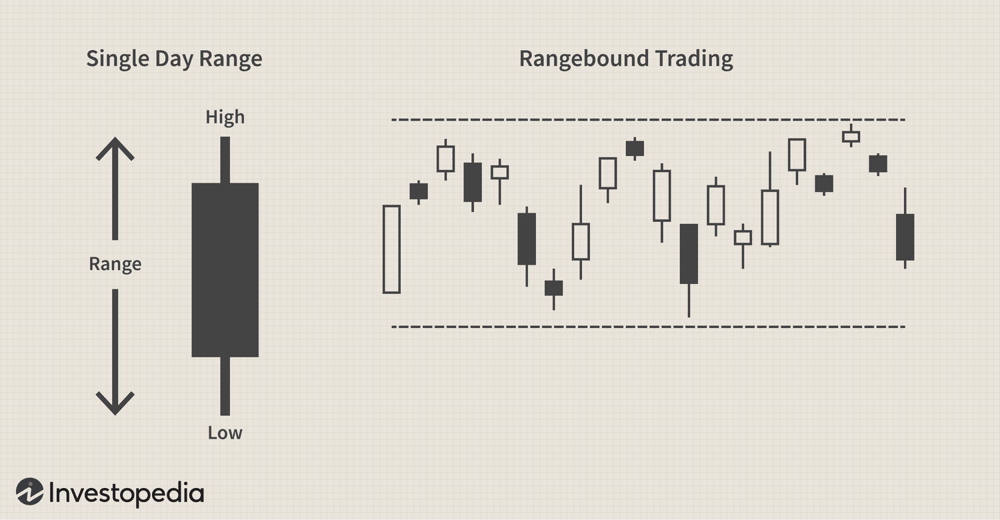

In the pursuit of understanding financial markets, it is crucial for traders and investors to grasp the dynamics that drive these markets. Technical analysis plays a pivotal role in this understanding, as it involves evaluating and predicting market movements based on historical price patterns and various technical indicators. This approach allows market participants to make informed decisions by examining charts and identifying trends that may influence future price movements.

Range trading is one strategic approach within technical analysis that is particularly popular among traders. It revolves around the concept of buying and selling within a sideways market, characterized by price oscillations between defined support and resistance levels. This method is effective in identifying periods when prices remain relatively stable, allowing traders to capitalize on predictable price movements within a trading range.



Algorithmic trading, often referred to as algo trading, marks a significant evolution in trading practices by utilizing computer algorithms to execute trades at remarkable speeds and volumes. These algorithms are often designed to employ technical indicators and strategies, including range trading, to optimize trading performance. With the integration of technology, traders can enhance their ability to exploit fleeting market opportunities, ensuring precision and efficiency in their trades.

This article explores the intersection of technical analysis, range trading, and algorithmic trading in financial markets. By shedding light on these interconnected strategies and methodologies, we aim to provide insights into how they collectively contribute to better-informed trading decisions. Understanding these elements and how they relate to one another offers a comprehensive perspective on navigating the complexities of contemporary financial markets.

## Table of Contents

## Understanding Trading Ranges

A trading range, also known as a sideways market, is characterized by price fluctuations within a specific upper and lower boundary, typically denoted as resistance and support levels, respectively. In such markets, prices oscillate between these established levels instead of showing a clear upward or downward trend. This pattern is a common phenomenon where the forces of supply and demand reach equilibrium, resulting in a period of consolidation.

**Identifying Support and Resistance Levels**

Traders identify support and resistance levels through technical analysis of historical price data. Support is a price level where a downtrend can be expected to pause due to a concentration of demand, while resistance is where an uptrend may stall due to a concentration of supply. Traders often use historical price charts to spot these levels, where a significant number of price touches or reversals have occurred. Horizontal trendlines are typically drawn along the high and low points of the period to visually represent these levels. Such levels are not always precise and can be seen as zones rather than fixed lines.

**Significance in Different Financial Instruments**

Trading ranges are significant across various financial instruments, including stocks, [forex](/wiki/forex-system), and commodities. In the stock market, ranges might indicate periods of consolidation in individual equities as investors await new information. In forex, trading ranges often occur due to minimal economic announcements, leading to reduced [volatility](/wiki/volatility-trading-strategies). In commodities, range-bound trading can reflect periods of market balance between producers and consumers. Understanding trading ranges helps traders tailor their strategies to capitalize on small price movements common in such markets.

**Advantages and Challenges of Range Trading**

Range trading offers several advantages. It allows traders to capitalize on repetitive price swings between established levels, providing numerous opportunities to enter and [exit](/wiki/exit-strategy) trades. The strategy can be less risky compared to trend-following strategies, as it does not rely on predicting the [breakout](/wiki/breakout-trading) direction. However, challenges include the potential for false breakouts, where prices appear to break range boundaries but reverse shortly after. Moreover, trading ranges can contract, reducing potential profit margins.

**Technical Indicators for Identifying Trading Ranges**

Several technical indicators assist in the identification and validation of trading ranges. The Relative Strength Index (RSI) is commonly used to determine overbought or oversold conditions, helping traders anticipate potential reversals at support or resistance levels. Bollinger Bands, which encompass market volatility, can indicate range boundaries as the prices consistently touch the bands during a sideways market. Moving averages can also provide insight, with prices hovering near these averages indicating a range-bound market.

In conclusion, understanding trading ranges is crucial for exploiting price stability in markets lacking a distinct trend. By recognizing support and resistance levels through various technical indicators, traders can formulate strategies that navigate the oscillations within a trading range, while remaining vigilant of the associated challenges.

## The Role of Technical Analysis

Technical analysis is a method used to evaluate and forecast the direction of prices through the study of past market data, primarily price and [volume](/wiki/volume-trading-strategy). Unlike [fundamental analysis](/wiki/fundamental-analysis), which focuses on assessing a company's intrinsic value based on financial statements, economic indicators, and management effectiveness, technical analysis solely considers historical price movements and trading volume. This approach operates under the premise that all known information is already reflected in the price, and that price movements are not entirely random, meaning patterns can often be identified.

Chart patterns, trend lines, and candlestick patterns form the crux of technical analysis. Chart patterns help identify potential trend reversals and continuations. These include formations such as head and shoulders, triangles, and flags. Trend lines, drawn on charts to connect key price points, facilitate the visualization of price trends, allowing traders to recognize support and resistance levels more clearly. Candlestick patterns, dating back to Japanese rice traders, provide detailed insights into market sentiment and potential reversals by depicting the high, low, open, and close prices within a specific time frame.

Technical indicators are mathematical calculations based on price, volume, or open interest, which analysts use to predict future price movements. Moving Averages (MA), one of the most commonly used indicators, smooth out price data to identify trends over a set period. For instance, a crossover of the short-term MA above a long-term MA might signal a bullish market trend. The Relative Strength Index (RSI) measures the speed and change of price movements, oscillating between 0 and 100, to determine overbought or oversold conditions. The Moving Average Convergence Divergence (MACD) indicator compares short-term and long-term EMAs to identify bullish and bearish [momentum](/wiki/momentum).

Technical analysis can be effectively applied to both trending and ranging markets. In trending markets, tools like moving averages and trend lines can aid in identifying the strength and direction of trends. In ranging markets, where prices fluctuate between defined levels of support and resistance, oscillators like RSI are more useful, as they help identify potential reversal points when the market is overbought or oversold.

Despite its widespread use, technical analysis has limitations and faces criticism. It is often deemed subjective; different analysts might interpret the same chart patterns differently. Furthermore, technical analysis assumes that history tends to repeat itself, potentially neglecting unprecedented market conditions or anomalies. Critics argue that, at times, it may lead to over-reliance on historical data without considering broader macroeconomic factors. Additionally, some studies suggest that markets exhibit a level of efficiency that limits the predictive power of technical analysis.

In conclusion, technical analysis remains a prevalent tool in the arsenal of traders and investors, providing insights that complement other forms of market analysis. However, its effectiveness is often contingent on the user's ability to interpret patterns and indicators within the context of current market conditions.

 to Algorithmic Trading

Algorithmic trading, often referred to as algo trading, involves using computer algorithms to automate trading decisions and execute orders in financial markets. This approach has transformed modern trading by enabling trades to be executed at high speeds and volumes previously unattainable by human traders. Algo trading started in the 1970s with the advent of electronic trading systems and evolved into a sophisticated strategy with the help of technological advancements and increasing computational power.

Algorithms in trading are designed to perform a variety of functions, such as analyzing market data, identifying trading opportunities, and executing orders. These algorithms can process complex mathematical models and make split-second decisions based on predefined criteria. The speed of execution is crucial, especially in markets where prices can change in milliseconds. High-frequency trading ([HFT](/wiki/high-frequency-trading-strategies)), a subset of algo trading, uses powerful computers to transact a large number of orders at extremely rapid speeds. It capitalizes on small price discrepancies in financial markets, acting faster than any human trader ever could.

Several strategies are implemented in [algorithmic trading](/wiki/algorithmic-trading), each with specific objectives:

1. **Arbitrage**: This strategy takes advantage of price discrepancies in different markets or instruments. Algorithmic arbitrage can quickly exploit these differences to generate profit, often before manual traders are even aware of the opportunity.

2. **Trend Following**: These strategies utilize technical indicators to identify and follow market trends. The algorithms are designed to automatically enter positions aligned with the current trend and exit when the trend shows signs of reversing.

3. **Range Trading**: As mentioned earlier, range trading algorithms operate by identifying levels of support and resistance within a trading range. They buy at the support level and sell at the resistance level, aiming to profit from the range-bound movement of asset prices.

The integration of [artificial intelligence](/wiki/ai-artificial-intelligence) (AI) and [machine learning](/wiki/machine-learning) into algorithmic trading has further enhanced its capabilities. AI-based models can learn from historical data, recognize complex patterns, and adapt to new information, thus refining trading strategies over time. Machine learning algorithms can automate the analysis of large datasets, providing insights that can lead to the creation of more robust trading models.

Despite its advantages, algorithmic trading is not without risks. The speed and volume of trades can lead to significant market impacts and exacerbate volatility. Additionally, algorithmic systems may malfunction or behave unpredictably due to programming errors or unforeseen market conditions. Flash crashes, attributable in part to HFT, are an example of potential disruptions caused by algo trading. Moreover, the competitive nature of algo trading requires substantial technological investment and continuous improvement to maintain an edge in the marketplace.

In summary, algorithmic trading is a prominent force in modern financial markets, characterized by its speed, precision, and efficient use of various trading strategies. It benefits from the integration of advanced technologies such as AI and machine learning, though it also poses certain risks that must be carefully managed by traders and institutions.

## Integrating Range Trading and Algo Trading

Range trading strategies can be effectively automated using algorithmic trading techniques, allowing traders to capitalize on price oscillations within defined levels of support and resistance with precision and speed. Automation enhances the efficiency of these strategies by eliminating human error and enabling consistent trade execution.

**Developing and Backtesting a Range Trading Algorithm**

The development of a range trading algorithm begins with the coding of rules that define the conditions under which trades will be executed. Key components include identifying support and resistance levels, and determining entry and exit points based on these levels. Traders often utilize technical indicators like Bollinger Bands or the Relative Strength Index (RSI) to assist in confirming signals within a specified range.

Backtesting is crucial in the development process to ensure the strategy's viability. It involves running the algorithm on historical data to simulate how it would have performed in past market conditions. This step helps in identifying potential adjustments needed to enhance the algorithm's performance. A simple [backtesting](/wiki/backtesting) framework in Python may look like the following:

```python
import pandas as pd
import numpy as np

# Sample function to backtest a range trading strategy
def backtest(data, entry_threshold, exit_threshold):
    data['Position'] = 0
    data['Position'] = np.where(data['RSI'] < entry_threshold, 1, data['Position'])
    data['Position'] = np.where(data['RSI'] > exit_threshold, -1, data['Position'])
    data['Position'].fillna(method='ffill', inplace=True)
    data['Returns'] = data['Price'].pct_change()
    data['Strategy'] = data['Position'].shift(1) * data['Returns']
    return data['Strategy'].cumsum()

# Simulated data would be loaded here
# e.g., df = pd.read_csv('historical_data.csv')
# strategy_performance = backtest(df, 30, 70)
```

**Commonly Used Algorithmic Range Trading Strategies**

Numerous strategies exist within the market, each exploiting different aspects of range-bound price movements. One popular method is the Bollinger Bands strategy, which trades based on price deviations from the band lines, assuming mean reversion. Similarly, strategies based on oscillators, such as trading when the RSI reaches overbought or oversold levels, are frequently employed.

**Technology and Platforms for Range Trading Algorithms**

To run range trading algorithms, traders require robust technology and platforms capable of processing large volumes of data in real-time. Platforms like MetaTrader 4/5, TradingView, or custom environments using APIs for data access and trade execution (such as [Interactive Brokers](/wiki/interactive-brokers-api) or Alpaca) are widely used. Additionally, programming languages like Python offer libraries (e.g., NumPy, Pandas, and TA-Lib) that facilitate the development and testing of trading algorithms.

**Optimization and Real-Time Adaptation in Algo-driven Range Trading**

The potential for optimization in algorithmic range trading is significant. Algorithms can be tuned to adapt to changing market conditions through machine learning techniques, allowing them to dynamically adjust parameters such as trade size, entry, and exit points based on real-time data. This adaptability enhances the robustness of the strategy, helping to maintain its effectiveness across varying market environments. Real-time adaptation is crucial for maximizing profitability and managing risk, as markets can swiftly transition from ranging to trending phases.

In conclusion, the integration of range trading with algorithmic trading offers numerous advantages by automating strategies for increased efficiency, accuracy, and adaptability. Employing a methodical approach to algorithm development and leveraging advanced technologies and platforms can significantly enhance trading outcomes.

## Challenges and Considerations

Implementing range trading strategies within an algorithmic framework presents several challenges that need to be carefully addressed to ensure effectiveness and profitability. 

### Common Challenges in Algorithmic Range Trading

1. **Market Volatility and Liquidity:**
   Market conditions can severely impact the success of algorithmic range trading strategies. High volatility may lead to rapid price changes, causing prices to break out of the identified range, leading to potential losses. Conversely, low [liquidity](/wiki/liquidity-risk-premium) can result in slippage and increased transaction costs, reducing profitability. Algorithms need to be designed to adapt quickly to changing market conditions and include mechanisms to handle liquidity constraints.

2. **Risk Management:**
   Effective risk management is crucial in algorithmic range trading to protect against unforeseen losses. Strategies such as stop-loss orders, position sizing, and diversification are vital in mitigating risk. Algorithms should also incorporate volatility-adjusted metrics to modulate exposure based on market conditions. For instance, the implementation of a volatility stop-loss, which adjusts the stop-loss level based on the market's volatility, can help traders avoid exiting trades prematurely or staying in losing positions for too long.

3. **Regulatory Environment:**
   The regulatory framework governing algorithmic trading is complex and varies significantly across jurisdictions. Compliance with requirements like reporting obligations, audit trails, and risk management standards is essential for traders. Regulations such as the EU’s MiFID II and the U.S. SEC’s rules on automated trading systems necessitate that trading algorithms are transparent, fair, and provide adequate safeguards to prevent market manipulation.

4. **Ethical Considerations:**
   The use of technology in trading raises ethical issues related to fairness and transparency. Algorithmic strategies must be designed to avoid manipulative practices such as spoofing or front-running. Furthermore, ensuring that algorithms are fair and do not exploit latent market inefficiencies at the expense of other market participants is paramount. This entails a consideration of the social and economic impacts of trading technologies, ensuring they contribute positively to market health and stability.

### Addressing the Challenges

To address these challenges effectively, traders must focus on developing robust algorithms that incorporate advanced risk management techniques and are compliant with relevant regulations. Backtesting strategies under various market conditions and stress-testing them can further enhance performance and risk mitigation. Additionally, maintaining transparency through regular audits and updates of algorithmic models ensures adherence to ethical standards and regulatory compliance.

By managing these challenges thoughtfully, traders can leverage algorithmic range trading strategies to execute transactions with precision and efficacy, navigating the complexities of the financial markets successfully.

## Conclusion

Technical analysis, range trading, and algorithmic trading form a triad that enables traders and investors to navigate financial markets with increased efficacy. Technical analysis provides the foundational tools for interpreting historical price data, making it possible to identify support and resistance levels crucial for range trading. Range trading, targeted at profiting from sideways market movements, benefits extensively from the patterns and indicators determined by technical analysis. With algorithmic trading, these strategies are propelled to a new dimension, automating the process and enabling rapid execution of trades, which is critical in the fast-paced environment of financial markets.

Looking forward, algorithmic trading is poised to undergo significant transformations driven by artificial intelligence and machine learning. These advancements promise greater precision and adaptability in trading strategies, potentially reshaping how markets operate. As algorithms become more sophisticated, they can process vast datasets, identifying patterns and making trading decisions with minimal human intervention. This evolution could lead to increased market efficiency but also introduces challenges related to market stability and regulation.

For traders and investors, continual learning and adaptation to technological progress are imperative. Embracing the dynamic nature of financial markets necessitates staying informed about emerging trends and technological advancements that could affect trading strategies. Regular reassessment and fine-tuning of strategies will be crucial in maintaining their relevance and effectiveness in an ever-evolving market landscape.

As technology continues to integrate deeply into financial markets, its influence is inevitable and profound. The evolving landscape, driven by innovations in algorithmic and automated trading, heralds a future where financial markets may become more accessible and efficient but also more complex. The journey for traders and investors is one of constant evolution, requiring them to be not only adept at their craft but also forward-thinking and adaptable to the changing tides of technology that define the financial markets.

## References & Further Reading

[1]: Bergstra, J., Bardenet, R., Bengio, Y., & Kégl, B. (2011). ["Algorithms for Hyper-Parameter Optimization."](https://papers.nips.cc/paper/4443-algorithms-for-hyper-parameter-optimization) Advances in Neural Information Processing Systems 24.

[2]: ["Advances in Financial Machine Learning"](https://www.amazon.com/Advances-Financial-Machine-Learning-Marcos/dp/1119482089) by Marcos Lopez de Prado

[3]: ["Evidence-Based Technical Analysis: Applying the Scientific Method and Statistical Inference to Trading Signals"](https://www.amazon.com/Evidence-Based-Technical-Analysis-Scientific-Statistical/dp/0470008741) by David Aronson

[4]: ["Machine Learning for Algorithmic Trading"](https://github.com/stefan-jansen/machine-learning-for-trading) by Stefan Jansen

[5]: ["Quantitative Trading: How to Build Your Own Algorithmic Trading Business"](https://www.amazon.com/Quantitative-Trading-Build-Algorithmic-Business/dp/1119800064) by Ernest P. Chan