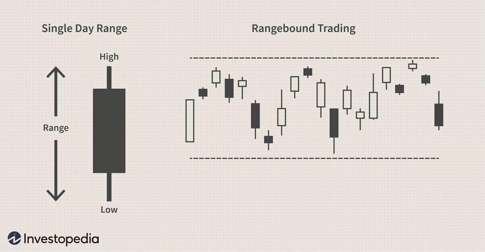

## Table of Contents

## What is a trading range in financial markets?

A trading range in financial markets is a period where the price of a stock, currency, or other financial instrument moves within a specific high and low price level. This range is created when the price bounces between these two levels without breaking out significantly in either direction. Traders often look for these ranges because they can provide opportunities to buy at the lower end of the range and sell at the higher end, making a profit from the predictable movement.

Understanding a trading range can help traders make better decisions. When a price stays within a trading range, it suggests that the market is in a state of equilibrium, with neither buyers nor sellers having enough power to push the price outside the range. However, if the price eventually breaks out of the range, it can signal a new trend. Traders watch these breakouts closely because they can lead to significant price movements and potential trading opportunities.

## How can you identify a trading range on a price chart?

To identify a trading range on a price chart, you need to look for a pattern where the price moves up and down between two clear levels. These levels are called the resistance (the top of the range) and the support (the bottom of the range). You can spot these levels by drawing horizontal lines on the chart. The resistance line goes across the highest points where the price has trouble going higher, and the support line goes across the lowest points where the price stops falling.

Once you have these lines drawn, you can see if the price keeps bouncing between them. If it does, and it stays within these lines for a while, you've found a trading range. It's important to watch how long the price stays in this range. If it keeps going back and forth without breaking out, the range is strong. But if the price suddenly moves above the resistance or below the support, the range might be over, and a new trend could start.

## What are the key components of a trading range?

A trading range has two main parts: support and resistance. Support is the lowest price level where the price stops going down and starts to go up again. It's like a floor that the price bounces off of. Resistance is the highest price level where the price stops going up and starts to go down again. It's like a ceiling that the price can't break through easily. When you look at a chart, you can draw lines at these levels to see the trading range clearly.

The trading range shows that the price is moving back and forth between these two levels without breaking out. This means that buyers and sellers are pretty balanced, and neither side is strong enough to push the price out of the range. Traders use this range to make decisions. They might buy when the price hits the support level and sell when it hits the resistance level, hoping to make a profit from the price moving up and down within the range. If the price does break out of the range, it could mean a new trend is starting, and traders need to be ready for that change.

## Why is understanding trading ranges important for traders?

Understanding trading ranges is important for traders because it helps them see where the price of a stock or other financial instrument might go next. When a price stays within a trading range, it means that the price is moving up and down between two levels, called support and resistance. Traders can use this information to make smart choices. They might buy when the price hits the bottom of the range (support) and sell when it hits the top (resistance). This can help them make money from the price moving back and forth.

But trading ranges are not just about making quick profits. They also tell traders about the balance between buyers and sellers. If the price stays in a range, it means that neither side is strong enough to push the price out of the range. This balance can change, though. If the price suddenly breaks out of the range, it might mean a new trend is starting. Traders need to watch for these breakouts because they can lead to big price moves. Knowing when a trading range might end helps traders get ready for new opportunities or risks.

## How does a trading range differ from a trend?

A trading range and a trend are two different ways that prices can move in the market. A trading range happens when the price of a stock or other financial instrument stays between two levels, called support and resistance. The price goes up to the resistance level and then falls back down to the support level, over and over again. This shows that buyers and sellers are pretty balanced, and neither side can push the price out of the range. Traders can use this to buy low at the support level and sell high at the resistance level, making money from the price moving back and forth.

A trend, on the other hand, is when the price keeps moving in one direction, either up or down, for a while. An uptrend means the price is going up, making higher highs and higher lows. A downtrend means the price is going down, making lower highs and lower lows. Trends show that one side, either buyers or sellers, is stronger and can keep pushing the price in that direction. Traders who spot a trend early can make money by buying in an uptrend or selling in a downtrend, hoping the price will keep moving that way.

The main difference between a trading range and a trend is the direction of the price movement. In a trading range, the price moves sideways, staying between the support and resistance levels. In a trend, the price moves in a clear direction, either up or down. Knowing whether the market is in a trading range or a trend helps traders decide when to buy or sell and how to manage their trades.

## What are common strategies for trading within a range?

When trading within a range, one common strategy is to buy at the support level and sell at the resistance level. This means you wait for the price to drop to the bottom of the range, where it usually stops falling and starts to go up again. That's when you buy, hoping the price will go back up to the top of the range. Once it gets close to the top, you sell, making a profit from the price moving up and down. This strategy works well if the range stays strong and the price keeps bouncing between the support and resistance levels.

Another strategy is to use stop-loss orders to manage risk. A stop-loss order is like a safety net that automatically sells your stock if the price drops too much. When you buy at the support level, you can set a stop-loss just below that level. This way, if the price suddenly breaks out of the range and goes down, you won't lose too much money. It's a good way to protect your investment while trying to make money from the range.

Some traders also use technical indicators to help them trade within a range. For example, they might use the Relative Strength Index (RSI) to see if the price is overbought or oversold. If the RSI shows the price is oversold when it's near the support level, it might be a good time to buy. If it shows the price is overbought near the resistance level, it might be a good time to sell. Using these indicators can help traders make better decisions and increase their chances of making money from the range.

## How can support and resistance levels be used within a trading range?

Support and resistance levels are key parts of a trading range. They help traders know when to buy and sell. The support level is the bottom of the range, where the price stops going down and starts to go up again. Traders can buy at this level, hoping the price will go back up to the top of the range. The resistance level is the top of the range, where the price stops going up and starts to go down again. Traders can sell at this level, making a profit from the price moving up and down.

Using these levels helps traders make money from the range. When the price hits the support level, it's a good time to buy because the price is likely to go up again. When it hits the resistance level, it's a good time to sell because the price is likely to go down again. But traders need to be careful. If the price breaks out of the range, it might mean a new trend is starting. So, they should always watch the price and be ready to change their plan if the range ends.

## What indicators are most effective for identifying and confirming trading ranges?

To identify and confirm trading ranges, traders often use a few key indicators. One of the most effective is the moving average. A moving average smooths out price data to show a clearer trend. When the price stays between two moving averages, it can show the top and bottom of a trading range. Another useful indicator is the Bollinger Bands. These bands show the price range based on how much the price moves up and down. If the price stays inside the Bollinger Bands, it can confirm a trading range.

Another helpful indicator is the Relative Strength Index (RSI). The RSI measures how fast and how much the price is changing. When the RSI stays between certain levels, like 30 and 70, it can show that the price is in a trading range. Traders also use [volume](/wiki/volume-trading-strategy) to confirm ranges. If the volume stays steady while the price moves between support and resistance, it can mean the range is strong. By using these indicators together, traders can better see and confirm trading ranges.

## How do market conditions affect the formation and duration of trading ranges?

Market conditions play a big role in how trading ranges form and how long they last. When the market is calm and there's not much news or big events happening, prices tend to move in a steady way. This can lead to a trading range because buyers and sellers are balanced, and neither side can push the price out of the range. If there's a lot of uncertainty or if people are waiting for important news, like a company's earnings report or a big economic announcement, the market might stay in a range until that news comes out.

But if something big happens, like a surprise news event or a sudden change in the economy, it can break the trading range. For example, if a company reports much better earnings than expected, the price might shoot up and break out of the range. Or if there's bad economic news, the price might drop below the range. How long a trading range lasts depends on how long these calm or uncertain conditions stay the same. If the market stays calm for a long time, the range can last for weeks or even months. But if something big happens, the range can end quickly.

## What are the psychological factors that contribute to the establishment of trading ranges?

Trading ranges are often influenced by the way people think and feel about the market. When traders see a price go up to a certain level and then come back down, they start to believe that this level is a kind of ceiling, or resistance. They might sell their stocks when the price gets close to this level because they think it won't go any higher. On the other hand, when the price drops to a certain level and then goes back up, traders start to see this as a floor, or support. They might buy more stocks at this level because they think the price won't go any lower. These beliefs create the trading range because many traders are making the same decisions at the same price levels.

But it's not just about what traders think will happen; it's also about how they feel. If traders are feeling unsure or worried about the market, they might not want to buy or sell too much. This can keep the price moving in a range because no one is pushing it strongly in one direction. But if something happens to make traders feel more confident or scared, like good or bad news, their feelings can change quickly. This can break the trading range as traders start buying or selling more, pushing the price out of the range. So, the way traders think and feel plays a big part in how trading ranges form and how long they last.

## How can advanced traders use volume analysis to enhance trading range strategies?

Advanced traders can use volume analysis to get a better understanding of trading ranges. Volume shows how many stocks or other financial instruments are being bought and sold. When the price is moving within a trading range, traders look at the volume to see if the range is strong or weak. If the volume stays steady while the price moves between the support and resistance levels, it means the range is strong. Traders can feel more confident buying at the support level and selling at the resistance level because the range is likely to continue.

But if the volume starts to change, it can give traders important clues. If the volume goes up a lot when the price hits the support or resistance level, it might mean the range is about to break. For example, if the volume is high when the price hits the resistance level, it could mean that many traders are trying to push the price higher, and the range might end soon. By watching the volume, advanced traders can make better decisions about when to enter or [exit](/wiki/exit-strategy) trades, helping them make more money from trading ranges.

## What are the potential pitfalls and how can they be mitigated when trading within a range?

Trading within a range can be tricky because there are some common problems that traders might face. One big problem is that the price might suddenly break out of the range, which can lead to losses if you're not ready. For example, if you buy at the support level hoping the price will go up, but it breaks down instead, you could lose money. Another problem is that the range might not be as clear as it seems. Sometimes, what looks like a range can be just a short pause in a bigger trend, and if you trade based on the range, you might miss out on a bigger move.

To avoid these problems, traders can use a few smart strategies. First, always use stop-loss orders to limit your losses. If you buy at the support level, set a stop-loss just below it so that if the price breaks down, you won't lose too much. Second, don't just rely on the range; use other tools like volume and technical indicators to check if the range is strong. If the volume is low or the indicators show the price might break out, be ready to change your plan. Lastly, keep an eye on the bigger picture. Look at longer time frames to see if the range is part of a bigger trend. This can help you decide if it's safe to trade within the range or if you should wait for a better opportunity.

## References & Further Reading

[1]: Bergstra, J., Bardenet, R., Bengio, Y., & Kégl, B. (2011). ["Algorithms for Hyper-Parameter Optimization."](https://papers.nips.cc/paper/4443-algorithms-for-hyper-parameter-optimization) Advances in Neural Information Processing Systems 24.

[2]: ["Advances in Financial Machine Learning"](https://www.amazon.com/Advances-Financial-Machine-Learning-Marcos/dp/1119482089) by Marcos Lopez de Prado

[3]: ["Evidence-Based Technical Analysis: Applying the Scientific Method and Statistical Inference to Trading Signals"](https://www.amazon.com/Evidence-Based-Technical-Analysis-Scientific-Statistical/dp/0470008741) by David Aronson

[4]: ["Machine Learning for Algorithmic Trading"](https://github.com/stefan-jansen/machine-learning-for-trading) by Stefan Jansen

[5]: ["Quantitative Trading: How to Build Your Own Algorithmic Trading Business"](https://www.amazon.com/Quantitative-Trading-Build-Algorithmic-Business/dp/1119800064) by Ernest P. Chan