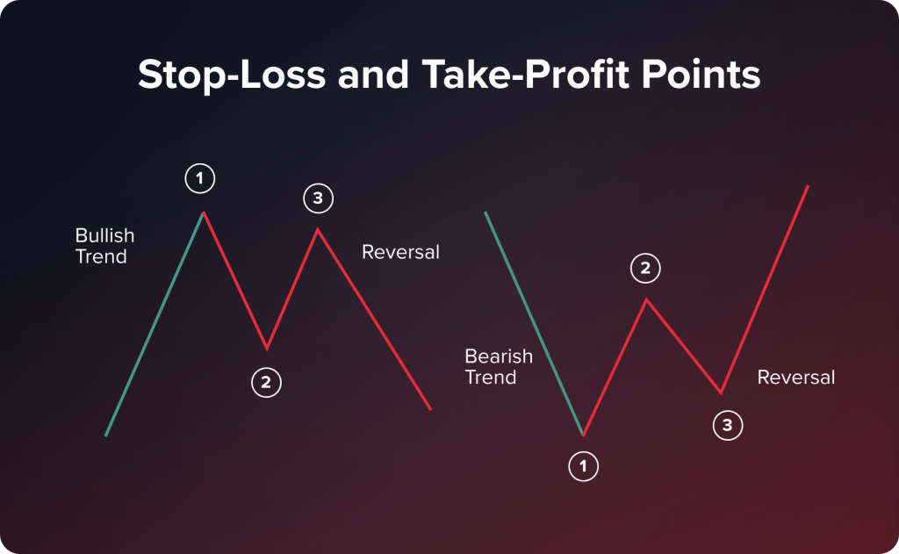

## Table of Contents

## What is trading risk management?

Trading risk management is about making smart choices to protect your money when you buy and sell things like stocks or cryptocurrencies. It's like having a safety plan that helps you decide how much money you can risk losing and setting rules to follow so you don't lose too much. This can include setting limits on how much you will spend on each trade and deciding when to stop trading if things are not going well.

A big part of risk management is knowing how much risk you are comfortable with. Some people like to take big risks hoping for big rewards, while others prefer to play it safe. By understanding your own comfort level, you can set up strategies that match your style. This might mean spreading your money across different types of investments to reduce the chance that one bad trade will hurt you a lot.

## Why is risk management important in trading?

Risk management is super important in trading because it helps you keep your money safe. When you trade, there's always a chance you could lose money. By using risk management, you set rules for yourself on how much money you're okay with losing. This way, you don't get caught up in the excitement and end up losing more than you can handle. It's like having a safety net that stops you from falling too far.

Another reason risk management is key is that it helps you make smarter decisions. When you know your limits and stick to them, you can think more clearly about your trades. You won't be as likely to make quick, emotional decisions that could lead to big losses. Instead, you'll be able to plan your trades carefully and have a better chance of making money over time. It's all about keeping your cool and staying in control.

## What are the basic principles of risk management for beginners?

Risk management for beginners starts with understanding how much money you can afford to lose. This is called your risk capital. You should only use money that you're okay with losing completely, so you don't end up in financial trouble if things go wrong. Once you know your risk capital, you can decide how much of it to use on each trade. A common rule is to risk no more than 1-2% of your total trading money on any single trade. This way, even if you lose, you won't lose too much at once.

Another important principle is setting stop-loss orders. A stop-loss is like a safety switch that automatically sells your investment if it drops to a certain price. This helps limit your losses and protects you from big drops in the market. It's also a good idea to diversify your investments. Instead of putting all your money into one thing, spread it out across different types of investments. This way, if one investment goes down, you won't lose everything. By following these simple rules, you can trade more safely and increase your chances of success over time.

## How can a beginner set up a risk management plan?

To set up a risk management plan, a beginner should first figure out how much money they can afford to lose. This is called risk capital. It's important to only use money that you're okay with losing completely, so you don't end up in financial trouble. Once you know your risk capital, decide how much of it you'll use on each trade. A good rule is to risk no more than 1-2% of your total trading money on any single trade. This way, even if you lose, you won't lose too much at once.

Next, set up stop-loss orders to protect your money. A stop-loss is like a safety switch that automatically sells your investment if it drops to a certain price. This helps limit your losses and keeps you safe from big market drops. It's also smart to spread your money across different types of investments. This is called diversification. By not putting all your money into one thing, you reduce the risk of losing everything if one investment goes down. Following these simple steps will help you trade more safely and increase your chances of success over time.

## What are common risk management tools and techniques?

Common risk management tools and techniques include stop-loss orders, which are like safety switches that automatically sell your investment if it drops to a certain price. This helps you limit your losses and keeps you safe from big market drops. Another tool is setting a risk-reward ratio, which means deciding how much you're willing to lose compared to how much you hope to gain. A common ratio is 1:2, where you're willing to risk $1 to make $2. This helps you make sure that your potential wins are bigger than your potential losses.

Another technique is diversification, which means spreading your money across different types of investments. This way, if one investment goes down, you won't lose everything. Position sizing is also important, where you decide how much of your total trading money to use on each trade. A good rule is to risk no more than 1-2% of your total money on any single trade. This helps you avoid losing too much at once.

Lastly, using a trading journal can help you manage risk. By writing down your trades, you can see what works and what doesn't, and adjust your strategy accordingly. This helps you learn from your mistakes and improve over time. Together, these tools and techniques help you trade more safely and increase your chances of success.

## How do stop-loss orders help in managing trading risks?

Stop-loss orders are like safety nets for your trades. They help you manage risks by automatically selling your investment if it drops to a certain price. This means you don't have to watch the market all the time. If the price starts to fall too much, the stop-loss order kicks in and sells your investment before you lose too much money. It's a way to set a limit on how much you're willing to lose on a single trade.

Using stop-loss orders helps you stick to your risk management plan. When you set a stop-loss, you're deciding ahead of time how much risk you're comfortable with. This helps you avoid making emotional decisions when the market gets scary. By setting a stop-loss, you can trade with more confidence, knowing that you have a plan to protect your money. It's a simple but powerful tool that can help you trade more safely and keep your losses under control.

## What is the difference between risk and volatility in trading?

Risk and [volatility](/wiki/volatility-trading-strategies) are two important ideas in trading, but they're not the same thing. Risk is about the chance that you might lose money. It's like the danger of your investment going down in value. When you trade, you're always taking some risk because there's no guarantee that you'll make money. Risk depends on many things, like how much you know about the market, how much money you're using, and what you're investing in.

Volatility, on the other hand, is about how much the price of an investment goes up and down. It's like how wild or calm the market is. If an investment's price moves a lot in a short time, it's considered high volatility. If it stays pretty steady, it's low volatility. Volatility can affect risk because if prices are moving a lot, there's a bigger chance that your investment could lose value quickly. But remember, high volatility doesn't always mean high risk; it just means the price is changing a lot.

## How can traders use diversification to manage risk?

Diversification is a way for traders to spread their money across different types of investments. Instead of putting all your money into one thing, you invest in a mix of stocks, bonds, or other assets. This helps lower the risk because if one investment goes down, you won't lose everything. It's like not putting all your eggs in one basket. By having a variety of investments, you can protect yourself from big losses if one part of the market does badly.

For example, if you only invest in tech stocks and the tech industry has a bad year, you could lose a lot of money. But if you also have some money in healthcare stocks, real estate, or even different countries' markets, those other investments might do well even if tech stocks fall. This way, your overall losses are smaller, and you have a better chance of making money over time. Diversification doesn't guarantee you won't lose money, but it helps manage risk by balancing out the ups and downs of different investments.

## What advanced strategies can be used for risk management in trading?

Advanced risk management strategies in trading include using options and futures to hedge your investments. Hedging is like buying insurance for your trades. For example, if you own a stock and you're worried it might go down, you can buy a put option. This gives you the right to sell the stock at a certain price, even if the market price drops lower. This way, you limit your potential losses. Futures contracts can also be used to lock in prices for commodities or currencies, helping you manage the risk of price changes.

Another advanced strategy is using [algorithmic trading](/wiki/algorithmic-trading) to manage risk. Algorithms can be programmed to follow strict rules for buying and selling, which helps take emotions out of trading. You can set up algorithms to automatically place stop-loss orders, adjust position sizes based on market conditions, and even diversify your portfolio across different assets. This can help you stick to your risk management plan more consistently and react quickly to market changes.

Lastly, using advanced risk metrics like Value at Risk (VaR) and stress testing can help you understand potential losses better. VaR tells you the maximum amount you could lose over a certain period with a given confidence level. Stress testing involves simulating how your portfolio would perform under extreme market conditions. By using these tools, you can get a clearer picture of your risk exposure and make more informed decisions about how to manage it.

## How do professional traders assess and manage their risk exposure?

Professional traders assess their risk exposure by looking at how much money they could lose on their trades. They use tools like Value at Risk (VaR) to figure out the most they might lose over a certain time, usually with a high level of confidence. They also do stress tests, which means they imagine what would happen to their investments if the market went crazy. By doing this, they can see how bad things could get and plan accordingly. They also keep an eye on how much they're investing in each trade, making sure it's not too much of their total money. This way, they can keep their losses small even if a trade goes wrong.

To manage their risk exposure, professional traders use a bunch of strategies. They might use options and futures to hedge their bets, which is like buying insurance for their trades. For example, if they own a stock and are worried it might drop, they can buy a put option to limit their losses. They also use algorithms to trade automatically, following strict rules to buy and sell. This helps them stick to their risk management plan without letting emotions get in the way. By combining these tools and strategies, professional traders can keep their risk under control and protect their money while trying to make profits.

## What role does psychological risk management play in trading?

Psychological risk management is all about keeping your emotions in check when you're trading. It's easy to get excited or scared when the market moves, and these feelings can make you do things you might regret later. For example, if you see your investment going up, you might want to keep it longer than you should, hoping for even more money. Or if it starts to drop, you might panic and sell too soon. By managing your emotions, you can stick to your trading plan and make better decisions.

One way to handle psychological risk is to set clear rules for yourself before you start trading. Decide how much you're willing to lose on each trade and stick to it, no matter what your feelings tell you. It can also help to take breaks and not watch the market all the time. This way, you won't get too caught up in the ups and downs. By staying calm and following your plan, you can trade more safely and increase your chances of success over time.

## How can one evaluate the effectiveness of their risk management strategy?

To evaluate the effectiveness of your risk management strategy, you need to look at how well it's helping you protect your money. One way to do this is by checking your trading results over time. Are you losing less money than before? Are your losses smaller when things go wrong? If your strategy is working, you should see that you're not losing as much as you used to, and your overall account balance is more stable. Another thing to look at is how often you're sticking to your rules. If you're following your stop-loss orders and not risking too much on each trade, that's a good sign that your strategy is effective.

Another way to evaluate your risk management strategy is by comparing it to your goals. Did you set out to reduce your risk and are you achieving that? For example, if your goal was to never lose more than 2% of your trading money on any single trade, are you meeting that goal? You can also use tools like a trading journal to track your progress. Write down each trade, what you did, and how it turned out. Over time, you'll see patterns and can tell if your strategy is helping you manage risk better. If you're meeting your goals and your trading journal shows improvement, then your risk management strategy is likely working well.

## References & Further Reading

[1]: Bergstra, J., Bardenet, R., Bengio, Y., & Kégl, B. (2011). ["Algorithms for Hyper-Parameter Optimization."](https://papers.nips.cc/paper/4443-algorithms-for-hyper-parameter-optimization) Advances in Neural Information Processing Systems 24.

[2]: ["Advances in Financial Machine Learning"](https://www.amazon.com/Advances-Financial-Machine-Learning-Marcos/dp/1119482089) by Marcos Lopez de Prado

[3]: ["Evidence-Based Technical Analysis: Applying the Scientific Method and Statistical Inference to Trading Signals"](https://www.amazon.com/Evidence-Based-Technical-Analysis-Scientific-Statistical/dp/0470008741) by David Aronson

[4]: ["Machine Learning for Algorithmic Trading"](https://github.com/stefan-jansen/machine-learning-for-trading) by Stefan Jansen

[5]: ["Quantitative Trading: How to Build Your Own Algorithmic Trading Business"](https://books.google.com/books/about/Quantitative_Trading.html?id=j70yEAAAQBAJ) by Ernest P. Chan