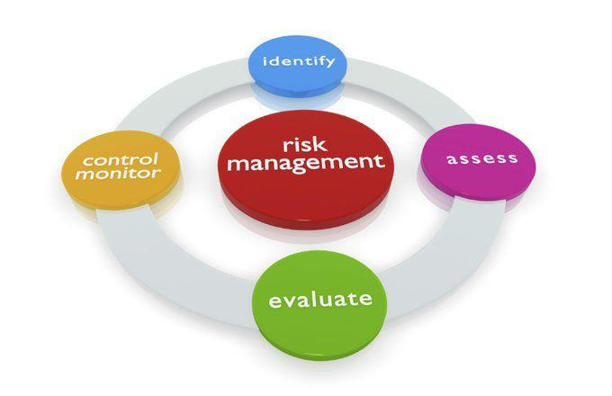

Algorithmic trading has revolutionized financial markets by employing computer algorithms to execute trades at unparalleled speed and efficiency. At its core, algorithmic trading seeks to optimize trade execution for better pricing, reduced market impact, and improved trading costs. However, a fundamental yet crucial component of this trading strategy is risk management. This essential practice involves deploying strategies and tools to manage potential losses while maximizing returns, ensuring that trading systems remain resilient even in volatile markets.

In algorithmic trading, risk management takes on particular importance due to the speed and volume at which trades are executed. The algorithms can process vast amounts of data and execute a multitude of trades in seconds, necessitating robust risk controls. Effective risk management helps to preserve trading capital and enhances the long-term success of trading portfolios. By incorporating comprehensive risk management strategies, traders not only minimize potential financial losses but also position themselves to capitalize on market opportunities with greater confidence.



Understanding risk management within the context of algorithmic trading is vital for traders seeking to improve their trading performance and sustainability. This article explores the intricacies of risk management in algorithmic trading and how traders can employ these strategies effectively in their trading systems, using technology-driven risk assessment and mitigation tools.

## Table of Contents

## Understanding Risk Management in Algo Trading

Risk management is integral to ensuring the stability and success of algorithmic trading operations. It involves a systematic approach to identifying, assessing, and determining strategies to manage potential risks that could lead to financial losses. In algorithmic trading, this process is automated, allowing for swift and precise actions to mitigate risks without the constant need for human intervention.

Automated systems play a crucial role in managing and preventing excessive losses in algorithmic trading. These systems are designed to execute pre-defined strategies programmed into the algorithm, which includes built-in controls to monitor and adjust trading positions in real-time. By analyzing market data continuously, the algorithm can detect unusual price movements or volatility that could indicate a potential risk for the trader.

Efficient risk management mechanisms are integrated into trading algorithms to ensure they maintain an up-to-date assessment of market conditions. These mechanisms involve various practices such as setting limits on the maximum allowable loss for a given trade or strategy, defining criteria for exiting trades that reach unfavorable thresholds, and using statistical models to estimate the potential impact of different risk factors on the trading portfolio.

For example, consider a simple Python script that might represent a component of a risk management system:

```python
def evaluate_risk(trade_position, max_risk_tolerance):
    # Assessing the current risk level of a trade
    current_risk = trade_position['potential_loss'] / trade_position['capital']
    # Decision-making based on risk assessment
    if current_risk > max_risk_tolerance:
        return "Reduce Position"
    else:
        return "Hold Position"

# Example usage
trade_position = {'potential_loss': 500, 'capital': 10000}
max_risk_tolerance = 0.05  # 5% of capital
decision = evaluate_risk(trade_position, max_risk_tolerance)
print(decision)  # Output: Hold Position
```

This code snippet represents a rudimentary function used to evaluate a trade's risk based on the potential loss relative to the total capital. If the calculated risk exceeds a specified tolerance level, such as 5%, the function suggests actions to adjust the trading position accordingly.

In conclusion, understanding and implementing risk management in [algorithmic trading](/wiki/algorithmic-trading) involves utilizing automated systems that continually assess and respond to market changes. This proactive and structured approach is essential for avoiding excessive losses and maintaining a robust trading strategy.

## Core Components of Risk Management in Algo Trading

Proper risk management in algorithmic trading relies on several key components, including stop-loss orders, diversification, and stress testing. These elements are essential for minimizing potential losses and ensuring algorithmic strategies operate within acceptable risk parameters.

Stop-loss orders are a critical part of automated trading programs. These are pre-determined instructions that trigger an [exit](/wiki/exit-strategy) from a trade when a specific loss threshold is reached. By doing so, stop-loss orders prevent further declines and help maintain capital. They act as a safety net, ensuring losses do not exceed a trader's risk tolerance. The implementation of stop-loss orders in algorithmic trading is often automated, which allows for instantaneous execution without human intervention.

Diversification is another fundamental risk management technique. By spreading investments across a variety of trading instruments or markets, traders can reduce the impact of adverse movements in any single investment. Diversification can be achieved through different strategies, such as investing in a broad range of asset classes or employing multiple algorithms that focus on distinct markets or sectors. This approach ensures that the overall portfolio is not excessively dependent on the performance of any one component, thus mitigating systemic risk.

Stress testing involves simulating the performance of trading algorithms under extreme market conditions to assess their resilience. It helps traders understand how their strategies would behave during periods of significant market [volatility](/wiki/volatility-trading-strategies), such as financial crises or sudden shocks. Stress testing can involve [backtesting](/wiki/backtesting) algorithms with historical data during tumultuous periods or utilizing scenario analysis to project potential future crises. This process ensures that algorithms are robust enough to withstand rare but impactful events.

Together, these core components form the backbone of effective risk management in algorithmic trading, providing traders with tools to safeguard their portfolios against unforeseen market dynamics. By integrating stop-loss mechanisms, promoting diversification, and conducting regular stress tests, traders can maintain a balanced approach to risk that aligns with their investment goals and risk appetite.

## Key Risk Management Techniques

Strategies such as diversification and hedging are vital for dispersing risk and safeguarding assets from unfavorable market movements. Diversification involves allocating capital across a range of assets, markets, or trading strategies to reduce the impact of adverse price movements in any single investment. By spreading risk, traders can minimize potential losses, ensuring that negative performance in one area does not significantly affect the entire portfolio.

Hedging, on the other hand, comprises strategic actions to offset potential losses by taking opposing positions in related markets. For example, holding long positions in stocks can be hedged by shorting stock index futures. This technique helps in mitigating the financial impact of adverse price directions and maintaining the overall stability of a trading portfolio.

Position sizing is another essential technique, enabling traders to decide the amount of capital to allocate for each trade. It involves calculating how much to invest in a particular asset based on factors like the trader's risk tolerance, the asset's volatility, and the overall size of the portfolio. Position sizing ensures that exposure to risk is maintained within acceptable limits, preventing over-investment in any single position. A common approach is the fixed-percentage method, where only a small proportion of the portfolio is risked per trade, often between 1% to 3%.

Advanced trading algorithms are increasingly incorporating real-time risk assessment techniques. These systems use data-driven approaches to continuously evaluate portfolio risk and adjust strategies dynamically in response to market shifts. The integration of [machine learning](/wiki/machine-learning) and big data analytics enables algorithms to process vast amounts of financial data, identify emerging patterns, and rapidly execute trades. This adaptability allows traders to swiftly alter or exit positions, thus preemptively mitigating risks as market conditions evolve.

Through the combination of diversification, hedging, position sizing, and advanced real-time risk assessment, algorithmic traders can efficiently manage risk, ensuring that trading activities remain resilient against market volatilities while optimizing returns.

## The Role of Technology in Risk Management

Technological advancements have significantly transformed risk management practices in algorithmic trading by offering enhanced capabilities in data analysis, real-time monitoring, and expedited execution of risk mitigation strategies. The integration of machine learning (ML) and [artificial intelligence](/wiki/ai-artificial-intelligence) (AI) into trading algorithms plays a pivotal role in improving these processes. These technologies leverage historical data to identify patterns that might indicate potential risks, thereby facilitating the development of predictive models.

Machine learning algorithms, for instance, employ techniques such as supervised and unsupervised learning to process large datasets. Supervised learning can be used to predict future price movements by training on historical market data, allowing for the anticipation of risk factors. Unsupervised learning, on the other hand, can help in identifying anomalies in trading patterns that may signify emerging risks. The ability to automatically adapt to new data patterns ensures that trading algorithms remain relevant amidst evolving market conditions.

The use of artificial intelligence extends beyond pattern recognition to include natural language processing and sentiment analysis. These AI applications can analyze news feeds, financial reports, or social media sentiment to gauge market volatility, providing a broader perspective on risk factors influencing asset prices.

Real-time data analysis is another cornerstone of technological innovation in risk management. High-frequency trading platforms often require algorithms capable of executing trades within milliseconds. Technologies such as distributed computing and in-memory data processing help achieve this by reducing latency and enhancing computational efficiency. By processing vast amounts of real-time data, trading algorithms can make immediate decisions based on current market conditions.

For example, consider a Python implementation of a simple moving average (SMA) crossover strategy for risk assessment:

```python
import numpy as np
import pandas as pd

def calculate_sma(data, window):
    return data.rolling(window=window).mean()

def sma_crossover_strategy(data, short_window, long_window):
    signals = pd.DataFrame(index=data.index)
    signals['price'] = data['Close']
    signals['short_mavg'] = calculate_sma(data['Close'], short_window)
    signals['long_mavg'] = calculate_sma(data['Close'], long_window)
    signals['signal'] = 0.0

    # Generate buy signals
    signals['signal'][short_window:] = np.where(
        signals['short_mavg'][short_window:] > signals['long_mavg'][short_window:], 1.0, 0.0)

    signals['positions'] = signals['signal'].diff()
    return signals

# Load data (e.g., from a CSV file)
data = pd.read_csv('market_data.csv', index_col='Date', parse_dates=True)

# Apply strategy
short_window = 40
long_window = 100
signals = sma_crossover_strategy(data, short_window, long_window)

# Output signals
print(signals)
```

This script demonstrates a risk assessment technique through the implementation of a simple moving average crossover strategy, providing traders with signals to enter or exit positions based on quantitative indicators.

In conclusion, leveraging technology in algorithmic trading enhances risk management by offering sophisticated tools for data analysis and decision-making. The continuous advancement in ML and AI capabilities provides traders with dynamic solutions to navigate complex market risks effectively.

## Case Studies Highlighting Risk Management

The 2008 Financial Crisis serves as a pivotal example of the significance of sound risk management in the field of algorithmic trading. During this period, the collapse of Lehman Brothers and the subsequent market turmoil underscored the vulnerabilities of financial systems lacking robust risk management practices. Firms with well-structured risk strategies were able to mitigate their losses and maintain stability amidst the financial meltdown. For instance, institutions that employed strategic diversification and advanced risk assessment tools managed to cushion the impact of collapsing asset values and market uncertainty. The crisis highlighted the necessity for automated systems capable of swiftly adjusting positions under rapidly changing conditions. 

The Flash Crash of May 6, 2010, further exemplifies the critical role of risk controls in high-frequency trading ([HFT](/wiki/high-frequency-trading-strategies)). On this day, U.S. stock markets experienced a dramatic and rapid decline within minutes, followed by an equally swift recovery. Investigations revealed that a massive sell order algorithm, lacking adequate risk mitigation measures, exacerbated the situation by flooding the market with too many orders in a short span. The absence of mechanisms such as throttling controls and dynamic risk assessment contributed to the unprecedented volatility during the flash crash. This event spurred regulatory bodies and trading firms to enhance their algorithmic systems, emphasizing real-time risk monitoring and establishing circuit breakers to prevent similar occurrences.

Analyzing these case studies helps develop trading systems resilient to extreme market conditions. Employing strategies that incorporate continuous stress testing of algorithms under various scenarios allows traders to anticipate and counteract potential disruptions. Moreover, integrating machine learning into risk assessment processes aids in recognizing patterns that may signal impending risks, thereby enabling preemptive measures. These historical insights foster a deeper understanding of the importance of risk management, driving the development of algorithms capable of enduring future financial upheavals.

## Conclusion

Risk management is an essential component of algorithmic trading, serving as a critical defense against severe financial losses. By employing a well-structured approach to risk management, traders can effectively shield their investments from unexpected market shifts. This structured approach involves the implementation of strategic techniques such as stop-loss orders, diversification, stress testing, and position sizing, which collectively work to mitigate risks and enhance trading outcomes. 

Stop-loss orders, for example, automatically exit a position when a predetermined loss threshold is reached, safeguarding capital from further decline. Diversification, on the other hand, spreads risk across various assets, reducing the impact of adverse movements in any single area. Stress testing challenges trading algorithms against extreme market conditions, examining their robustness and identifying potential vulnerabilities.

As technology advances, so do risk management strategies. The integration of machine learning and artificial intelligence in algorithmic trading systems is particularly noteworthy. These technologies allow systems to adapt to dynamic market conditions, offering predictive insights based on historical data and real-time analysis. This capability enables trading algorithms to adjust or exit positions promptly, responding efficiently to potential threats.

The evolution of technology continuously enhances the sophistication of risk management tools available to traders. These advancements are vital in navigating market risks, offering sophisticated and automated solutions that improve decision-making and safeguard investments. As the trading landscape evolves, adopting and refining these strategies remains crucial for achieving long-term trading success and capital preservation.

## References & Further Reading

[1]: Bergstra, J., Bardenet, R., Bengio, Y., & Kégl, B. (2011). ["Algorithms for Hyper-Parameter Optimization."](https://papers.nips.cc/paper/4443-algorithms-for-hyper-parameter-optimization) Advances in Neural Information Processing Systems 24.

[2]: ["Advances in Financial Machine Learning"](https://www.amazon.com/Advances-Financial-Machine-Learning-Marcos/dp/1119482089) by Marcos Lopez de Prado

[3]: ["Evidence-Based Technical Analysis: Applying the Scientific Method and Statistical Inference to Trading Signals"](https://www.amazon.com/Evidence-Based-Technical-Analysis-Scientific-Statistical/dp/0470008741) by David Aronson

[4]: ["Machine Learning for Algorithmic Trading"](https://github.com/stefan-jansen/machine-learning-for-trading) by Stefan Jansen

[5]: ["Quantitative Trading: How to Build Your Own Algorithmic Trading Business"](https://books.google.com/books/about/Quantitative_Trading.html?id=j70yEAAAQBAJ) by Ernest P. Chan