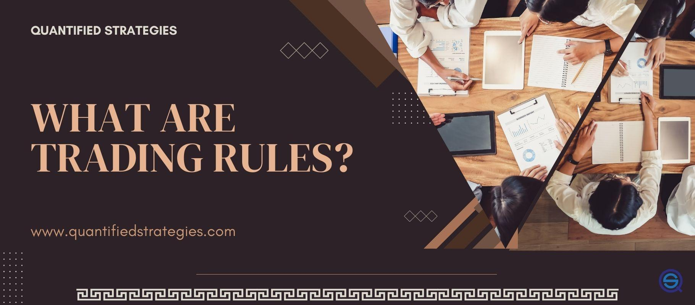

## Table of Contents

## What is trading and why is it important?

Trading is when people buy and sell things like stocks, currencies, or goods to make money. It happens in places like stock markets or through online platforms. People trade because they think the price of what they're buying will go up, so they can sell it later for more money. Or, they might sell something they own because they think its price will go down.

Trading is important because it helps the economy grow. When people trade, they move money and goods around, which helps businesses get the things they need to make more products. It also helps people invest their money and maybe earn more. Trading can make markets more active and help set fair prices for things. But it can also be risky, so people need to be careful and learn about it before they start trading.

## What are the basic principles of trading?

Trading is all about buying and selling things like stocks or currencies to make money. The main idea is to buy something when its price is low and sell it when the price goes up. To do this well, traders need to understand the market. They look at charts and numbers to guess where prices might go next. It's important to have a plan and stick to it, not just buy and sell things randomly.

Another big principle is managing risk. This means not putting all your money into one thing and being ready for prices to go down as well as up. Traders use tools like stop-loss orders to limit how much they can lose. It's also important to only trade with money you can afford to lose, because trading can be risky. Learning and practicing a lot before using real money can help traders get better at it.

Lastly, emotions play a big role in trading. It's easy to get excited or scared and make quick decisions that might not be smart. Good traders learn to control their feelings and stick to their plans. They know that losing some trades is normal and focus on making more good trades than bad ones over time. Patience and discipline are key to being successful in trading.

## How do I start trading as a beginner?

To start trading as a beginner, you first need to learn the basics. Trading means buying and selling things like stocks or currencies to make money. You should read [books](/wiki/algo-trading-books), watch videos, and maybe take a [course](/wiki/best-algorithmic-trading-courses) to understand how it works. It's also a good idea to practice with a demo account, which lets you trade without using real money. This way, you can get used to how trading works without risking any money.

Once you feel ready, choose a good trading platform or broker. Make sure it's trusted and easy to use. Start with a small amount of money that you can afford to lose. Don't use money you need for bills or other important things. When you start trading, set clear goals and stick to a plan. Don't let your feelings control your decisions. Remember, trading can be risky, so always be careful and keep learning as you go.

## What are the most common trading strategies for beginners?

One common trading strategy for beginners is called "buy and hold." This means you buy a stock or another asset and keep it for a long time, like months or years. You do this because you think the price will go up over time. It's a simple strategy that doesn't need you to watch the market all the time. It's good for beginners because it's less risky than trying to guess quick changes in the market.

Another strategy beginners often use is "[day trading](/wiki/day-trading-spy)." This means you buy and sell things within the same day. You try to make money from small changes in price. Day trading can be exciting, but it's also riskier because you need to watch the market closely and make quick decisions. It's important to learn a lot about the market and practice a lot before you start day trading with real money.

A third strategy is "swing trading." This is somewhere in between buy and hold and day trading. You hold onto your trades for a few days or weeks, trying to catch bigger price moves than day trading but not holding as long as buy and hold. Swing trading can be a good middle ground for beginners who want to learn more about trading without jumping straight into day trading. It still requires some watching of the market but not as much as day trading.

## What are the risks involved in trading and how can they be managed?

Trading can be risky because the prices of things you buy and sell can go up or down quickly. If the price goes down after you buy, you might lose money. Another risk is that you might not know enough about the market and make bad decisions. Sometimes, you might let your feelings, like fear or excitement, control your choices, which can lead to mistakes. Also, trading with money you can't afford to lose is very risky because if you lose it, it can cause big problems in your life.

To manage these risks, it's important to learn as much as you can about trading before you start. Practice with a demo account to get used to how trading works without losing real money. When you do start trading with real money, only use money you can afford to lose. Set clear goals and stick to a trading plan, so you don't make quick decisions based on your feelings. Using tools like stop-loss orders can help limit how much money you lose if the price goes down. Remember, losing some trades is normal, so focus on making more good trades than bad ones over time.

## How do technical analysis and fundamental analysis differ in trading?

Technical analysis and [fundamental analysis](/wiki/fundamental-analysis) are two different ways to look at the market when you're trading. Technical analysis is all about looking at charts and numbers to guess where prices might go next. Traders who use technical analysis look at patterns and trends in the past to make predictions. They use tools like moving averages and support and resistance levels to help them decide when to buy or sell. It's like trying to find clues in the price movements that can tell you what might happen soon.

On the other hand, fundamental analysis is about looking at the actual value of a company or asset. Traders who use fundamental analysis study things like a company's earnings, how much it's growing, and what's happening in the economy. They want to know if a stock or another asset is a good buy based on how the company is doing. It's like trying to see if a company is healthy and if its stock price is fair compared to how well it's doing. Both types of analysis can help traders make better decisions, but they look at different things to do it.

## What are some advanced trading techniques used by experienced traders?

Experienced traders often use advanced techniques like [algorithmic trading](/wiki/algorithmic-trading), where they use computer programs to buy and sell things automatically. These programs follow rules set by the trader to find the best times to trade. This can help traders make decisions faster than they could on their own and take advantage of small price changes that happen quickly. It's a bit like having a robot helper that watches the market all the time and acts when it sees an opportunity.

Another technique is called options trading, which involves buying and selling options contracts. An option gives you the right, but not the obligation, to buy or sell an asset at a certain price before a certain date. Experienced traders use options to bet on where they think the price will go, and they can use them to make money if the price goes up or down. Options trading can be complex, but it allows traders to manage risk in different ways and potentially make more money than just buying and selling stocks directly.

Some traders also use a technique called hedging to protect their investments. Hedging means making another trade that can help reduce the risk of losing money on your main trade. For example, if you own a stock and you're worried its price might go down, you could buy an option that makes money if the stock's price does go down. This way, even if you lose money on the stock, you might make some of it back with the option. Hedging can be tricky to get right, but it's a way for experienced traders to manage their risk better.

## How can algorithmic trading improve my trading performance?

Algorithmic trading can help you trade better by using computers to make decisions fast. When you use a computer program to trade, it can look at a lot of information and numbers really quickly. This means it can find the best times to buy or sell things without you having to watch the market all the time. The computer follows rules you set up, so it doesn't make mistakes because it's feeling excited or scared. This can help you make more money because the computer can act on small changes in prices that happen fast, which you might miss if you were trading on your own.

Another way algorithmic trading can improve your performance is by helping you manage risk better. The computer can keep track of many trades at once and make sure you're not putting too much money into one thing. It can also use tools like stop-loss orders automatically to limit how much you might lose if the price goes down. This means you can trade more safely and not worry as much about losing all your money. Over time, using a computer to trade can help you make more good trades than bad ones, which is the key to being successful in trading.

## What are the psychological aspects of trading and how do they affect decision-making?

Trading can be hard on your mind because it involves a lot of emotions. When you're trading, you might feel excited when prices go up and scared when they go down. These feelings can make you do things you wouldn't normally do, like selling too soon because you're afraid of losing money or buying more because you're feeling too confident. It's important to control these emotions because they can lead to bad decisions. For example, if you let fear take over, you might miss out on good opportunities because you're too scared to take risks. On the other hand, if you're too excited, you might take too many risks and lose money.

To be a good trader, you need to learn how to manage your emotions. This means sticking to a plan and not letting your feelings change your decisions. Experienced traders often talk about having discipline and patience. They know that losing some trades is normal and focus on making more good trades than bad ones over time. By keeping your emotions in check, you can make better choices and improve your chances of making money in trading. It's like playing a game where you need to stay calm and think clearly, even when things get tough.

## How do market trends and economic indicators influence trading decisions?

Market trends and economic indicators are like clues that help traders decide when to buy or sell. Market trends show the general direction that prices are moving, like if they're going up, down, or staying the same. Traders look at these trends to guess where prices might go next. For example, if a stock has been going up for a while, a trader might think it will keep going up and decide to buy it. On the other hand, if a stock has been going down, a trader might sell it or wait for a better time to buy. By watching these trends, traders can make smarter choices about when to trade.

Economic indicators are numbers that tell us how the economy is doing. Things like unemployment rates, inflation, and how much people are spending can all affect the prices of stocks and other things traders buy and sell. For example, if the unemployment rate goes down, it might mean more people have jobs and can spend more money, which could make stock prices go up. Traders use these indicators to understand what might happen in the market. By paying attention to these numbers, traders can make better decisions about what to buy or sell and when to do it.

## What are the best practices for risk management in trading?

Risk management is very important in trading because it helps you not lose too much money. One of the best ways to manage risk is to only use money you can afford to lose. This means you should not use money you need for bills or other important things. Another good practice is to use stop-loss orders. A stop-loss order is like a safety net that automatically sells your trade if the price goes down too much. This helps you limit how much money you can lose on one trade. Also, it's a good idea to not put all your money into one trade. Instead, spread it out over different trades so that if one goes bad, you won't lose everything.

Another important part of risk management is having a clear trading plan and sticking to it. Your plan should include when to buy, when to sell, and how much money you're willing to risk on each trade. By following your plan, you can avoid making quick decisions based on your feelings, like fear or excitement, which can lead to bad choices. It's also helpful to keep learning and practicing. The more you know about trading and the market, the better you can manage your risks. Remember, losing some trades is normal, so focus on making more good trades than bad ones over time.

## How can a trader continue to learn and adapt to the ever-changing market conditions?

To keep learning and adapt to the changing market, a trader should always be curious and willing to learn new things. Reading books, watching videos, and taking courses can help a trader understand more about how the market works. It's also good to join trading communities or forums where you can talk to other traders and learn from their experiences. Practicing with a demo account lets you try out new strategies without risking real money. This way, you can see what works and what doesn't, and get better at trading.

Another important way to adapt is by staying updated with the news and economic reports. The market can change quickly because of things happening in the world, like new laws, big company news, or changes in the economy. By keeping an eye on these things, a trader can make better decisions about when to buy or sell. It's also helpful to review your past trades and see what you did right or wrong. This can teach you a lot and help you improve your trading plan over time. Remember, the market is always changing, so being ready to learn and adapt is key to being a successful trader.

## How can one implement effective algorithmic trading strategies?

Implementing effective algorithmic trading strategies involves choosing well-defined approaches that cater to specific market conditions. Among these strategies, trend-following, [momentum](/wiki/momentum) strategies, and [arbitrage](/wiki/arbitrage) opportunities are widely utilized due to their ability to systematically exploit market inefficiencies.

1. **Trend-Following Strategies**: These strategies aim to profit from the persistence of asset prices moving in one direction. Traders using trend-following strategies typically rely on technical indicators such as moving averages or the Relative Strength Index (RSI) to identify and follow market trends. Moving averages are used to smooth out price data, providing a clearer indication of the direction in which an asset is moving. The simple moving average (SMA) is calculated as follows:
$$
   SMA = \frac{P_1 + P_2 + \cdots + P_n}{n}

$$

   where $P_1, P_2, \ldots, P_n$ are the closing prices over $n$ periods.

2. **Momentum Strategies**: These involve buying assets that are rising and selling those that are falling, based on the theory that trends can persist for some time. Momentum traders use indicators like RSI to assess the speed and change of price movements. An RSI value above 70 typically indicates that an asset is overbought, while a value below 30 suggests it is oversold, guiding traders on potential buy or sell decisions.

3. **Arbitrage Opportunities**: Arbitrage strategies capitalize on price discrepancies across different markets or instruments. The fundamental principle is to buy low in one market and simultaneously sell high in another, locking in the price difference. Arbitrage can be complex, requiring quick decision-making and precise execution given the brief window of opportunity before markets correct the discrepancies.

For each strategy mentioned, precision and rapid execution are crucial. Employing high-speed algorithms allows traders to capitalize on these fleeting opportunities. Automation through algorithms reduces the delay between signal identification and trade execution, enhancing profitability and reducing risk exposure.

Selecting suitable indicators and refining the algorithm to act based on these indicators form the cornerstone of successful algo trading strategies. By actively monitoring market conditions and tweaking strategies using historical data and simulations, traders can maintain a competitive edge, ensuring that their trading activities remain aligned with market dynamics and risk management protocols.

## References & Further Reading

[1]: Bergstra, J., Bardenet, R., Bengio, Y., & Kégl, B. (2011). ["Algorithms for Hyper-Parameter Optimization."](https://proceedings.neurips.cc/paper/2011/file/86e8f7ab32cfd12577bc2619bc635690-Paper.pdf) Advances in Neural Information Processing Systems 24.

[2]: ["Advances in Financial Machine Learning"](https://www.amazon.com/Advances-Financial-Machine-Learning-Marcos/dp/1119482089) by Marcos Lopez de Prado

[3]: ["Evidence-Based Technical Analysis: Applying the Scientific Method and Statistical Inference to Trading Signals"](https://www.amazon.com/Evidence-Based-Technical-Analysis-Scientific-Statistical/dp/0470008741) by David Aronson

[4]: ["Machine Learning for Algorithmic Trading"](https://github.com/stefan-jansen/machine-learning-for-trading) by Stefan Jansen

[5]: ["Quantitative Trading: How to Build Your Own Algorithmic Trading Business"](https://books.google.com/books/about/Quantitative_Trading.html?id=j70yEAAAQBAJ) by Ernest P. Chan