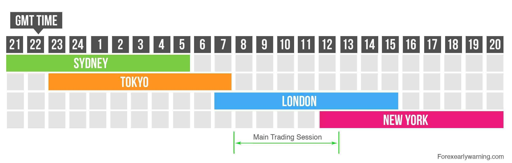

Financial markets form the backbone of the global economy, facilitating the exchange of financial instruments such as stocks, bonds, currencies, and commodities. They enable capital allocation and risk management across borders, playing a crucial role in economic development. These markets are diverse, including stock markets, where equity trading occurs; bond markets, where debt securities are transacted; foreign exchange markets, crucial for currency conversion; and commodity markets, dealing with raw materials. The smooth functioning of these markets ensures liquidity, price discovery, and efficient capital distribution worldwide.

Market open times are pivotal for traders and investors as they mark periods of heightened activity, influencing trading strategies and decisions. During these hours, the volume of trades often spikes, leading to increased volatility and price movements. Understanding the schedule can be especially beneficial for traders who seek to exploit these fluctuations for profit. Different global regions have their market hours, typically categorized into Asian, European, and American sessions, each with unique characteristics and trading opportunities.



Algorithmic trading, or algo trading, involves using computer programs to automate trading activities based on pre-defined criteria. This approach leverages speed, efficiency, and the ability to eliminate emotional biases from trading. Algorithms can execute trades in fractions of a second, capitalizing on small price changes that may be imperceptible to human traders.

The purpose of this article is to examine how market hours influence trading strategies, with a particular focus on algorithmic trading. By understanding the timing of market openings and how they interact with trading techniques, investors and traders can enhance their strategies to maximize returns and minimize risks.

## Table of Contents

## Understanding Financial Markets

Financial markets are platforms that facilitate the buying and selling of financial assets, providing a structured ecosystem for the exchange of securities. There are several types of financial markets, each serving unique functions and involving different asset classes. The primary types include stock markets, bond markets, forex markets, and commodities markets.

**Stock Markets:** Stock markets are venues where shares of publicly held companies are issued and traded. They are fundamental to economic development, offering companies a means to raise capital while providing investors opportunities for potential financial gain through ownership stakes. The New York Stock Exchange (NYSE) and NASDAQ are prominent examples.

**Bond Markets:** Bond markets, also known as debt markets, are where participants can issue new debt, known as the primary market, or buy and sell debt securities, known as the secondary market. Government bonds, corporate bonds, and municipal bonds are common assets in this market. The bond market plays a crucial role in determining interest rates and is integral for public and private sector financing.

**Forex Markets:** The foreign exchange (forex) market is the largest and most liquid financial market globally, enabling the exchange of different national currencies. It operates on a global scale through a decentralized system, with currencies traded in pairs. The forex market significantly impacts global trade and investment flows by influencing exchange rates.

**Commodities Markets:** In commodities markets, raw materials or primary agricultural products are traded. These markets can be divided into two categories: hard commodities, which include natural resources like oil and gold, and soft commodities, which are agricultural products such as coffee and wheat. The pricing and trading of commodities influence global supply chains and economies worldwide.

**Role of Financial Markets in the Global Economy:** Financial markets play a pivotal role in the functioning of a healthy economy. They provide a platform for the allocation of capital and resources, facilitating growth and project development. By enabling risk sharing among various participants and enhancing liquidity, these markets help stabilize the financial system and support economic progress.

**Key Participants:** Various actors engage in financial markets, each contributing to market dynamics. Retail investors, typically individual traders, seek to grow personal wealth. Institutional investors, such as pension funds, insurance companies, and mutual funds, operate on behalf of larger entities and manage substantial portfolios. Lastly, trading firms, including brokerage houses and market makers, facilitate transactions and provide liquidity.

In conclusion, understanding the structure and function of these diverse financial markets allows traders and investors to navigate the financial landscape more effectively, optimizing their investment strategies to align with market conditions and their financial goals.

## Market Open Times: A Global Overview

Financial markets operate across various time zones, creating distinct trading sessions that are important for investors and traders to consider. Understanding these market hours is crucial for executing effective trading strategies.

### Explanation of Market Open and Close Times Across Different Regions

Financial markets are organized into sessions based on geographical regions, each with specific open and close times. These times are influenced by the standard working hours of the respective regions and their time zones. Most markets follow a typical Monday to Friday trading week, although there are exceptions based on local holidays.

#### Asian Session

The Asian trading session begins in the financial hubs of Tokyo, Hong Kong, and Singapore. The Tokyo Stock Exchange, for instance, operates from 09:00 to 15:00 Japan Standard Time (JST), with a lunch break typically from 11:30 to 12:30. The Hong Kong Stock Exchange, similarly, trades from 09:30 to 16:00 Hong Kong Time (HKT), with a midday break. This session sets the initial tone for the day and provides early insights into market sentiment and potential [volatility](/wiki/volatility-trading-strategies) drivers.

#### European Session

The European session takes over as the Asian session winds down. Key markets include the London Stock Exchange and the Frankfurt Stock Exchange. The London Stock Exchange opens at 08:00 and closes at 16:30 Greenwich Mean Time (GMT), while Frankfurt operates from 09:00 to 17:30 Central European Time (CET). This session is known for higher [liquidity](/wiki/liquidity-risk-premium) and volatility, partly due to the overlap with both the Asian and American sessions.

#### American Session

The American session encompasses the activity on the New York Stock Exchange (NYSE) and NASDAQ. These markets open at 09:30 and close at 16:00 Eastern Standard Time (EST). The American trading hours are significant due to the extensive participation of global investors and traders, influencing market trends and movements.

### Impact of Time Zones on Financial Market Trading Hours

Time zones play a critical role in determining the operational hours of financial markets. They influence not only the local trading times but also the global trading dynamics. For example, the overlap between the European and American sessions occurs from approximately 13:00 to 16:00 GMT, a period known for heightened trading activity and increased market volatility. This is when traders and investors across these regions simultaneously engage with the markets, leading to greater liquidity.

Furthermore, the opening and closing of major sessions can cause shifts in trading volumes and price movements. For instance, the transition from the Asian to European session often sees an increase in trading activity as European investors react to overnight developments. Similarly, the opening of the American session can lead to significant market fluctuations due to new macroeconomic data releases or corporate earnings announcements.

In conclusion, understanding the global market open and close times is fundamental for anyone engaged in financial trading. These timings affect liquidity, volatility, and overall market behavior, necessitating strategies that account for regional and temporal variations. By aligning trading strategies with market hours, traders can better position themselves to take advantage of opportunities and mitigate risks.

## The Impact of Open Times on Trading

Financial markets around the world are structured in such a way that trading activities are conducted during specific open and close times. These times significantly influence trading [volume](/wiki/volume-trading-strategy) and volatility throughout the market sessions. Generally, the trading day is divided into major sessions corresponding to the prominent financial centers across Asia, Europe, and America. Each session exhibits unique patterns in terms of trading volume and price volatility.

Trading volume, which refers to the total quantity of shares or contracts traded for a specified period, often peaks during market open and close times. This is attributable to the influx of buy and sell orders as traders respond to news and adjust their positions in anticipation of the trading day's developments. Volatility, which measures the degree of variation in trading prices, is similarly heightened during these times due to rapid changes in supply and demand.

Overlap periods, when two major markets are open simultaneously, play a particularly significant role in shaping trading dynamics. For example, the overlap between the European and American sessions typically results in higher trading volumes and increased volatility. This period is characterized by heightened activity as traders in both regions react to news and events, which can result in more pronounced price movements.

From a strategic perspective, traders often seek to exploit these characteristics by aligning their trading activities with market open and close times. One common approach is to engage in [day trading](/wiki/day-trading-spy), which involves executing multiple trades within a single day to capitalize on short-term price movements. During market open and close, the increased activity provides opportunities for traders to enter and [exit](/wiki/exit-strategy) positions rapidly, potentially yielding profits from the price fluctuations.

Another strategy is to take advantage of the increased liquidity during overlap periods. Traders may look for [arbitrage](/wiki/arbitrage) opportunities, where they can profit from price discrepancies in different markets, or employ [scalping](/wiki/gamma-scalping) techniques, which involve capturing small price changes over short time frames. Both strategies rely on the heightened activity and liquidity present during these overlapping sessions.

In summary, the timing of market opens and closes, along with the periods when major markets overlap, significantly influences trading volume and volatility. Traders utilize strategies designed to exploit these dynamics, whether through increased liquidity, rapid trade execution, or by leveraging the heightened price movements during these pivotal times. Understanding and adapting to these patterns enables traders to potentially maximize their opportunities for success within global financial markets.

 to Algorithmic Trading

Algorithmic trading, often referred to as algo trading, is the utilization of computer algorithms to execute trading orders. These algorithms are designed based on predetermined criteria, including timing, price, or quantity, and are essential for executing large trade orders without significant market impact. At its core, [algorithmic trading](/wiki/algorithmic-trading) involves programming computers to follow a specific set of instructions, which can involve complex mathematical models and statistical analyses.

The key advantage of using algorithms in trading is speed. Computers can process market data and execute orders much faster than human traders, often in milliseconds or microseconds. This speed is crucial in financial markets, where prices can change dramatically in a short period, providing a competitive edge to those capable of quick responses. 

Efficiency is another significant benefit. Algorithms can analyze myriad market conditions simultaneously, optimizing the execution of trades based on a wide array of factors such as market conditions, news events, and historical data. This comprehensive analysis allows for more informed and timely trading decisions.

The use of algorithms also reduces emotional involvement in trading, which can be a significant advantage. Human traders can often make impulsive decisions based on fear or greed, particularly during periods of high volatility. Algorithmic systems, in contrast, adhere strictly to their programmed strategies, removing the potential for emotion-driven errors. 

Integration with market open times is a critical component of algorithmic trading. Many algorithms are specifically designed to capitalize on the unique characteristics of market open and close times, where volatility and trading volumes are typically higher. These times can offer opportunities for price movement that algorithms can exploit through strategies like [statistical arbitrage](/wiki/statistical-arbitrage) or [trend following](/wiki/trend-following).

Moreover, due to the global nature of financial markets, different regions have distinct open times, and algorithms can be programmed to participate in these overlapping sessions to maximize trading opportunities. For instance, an algorithm could be set to start trading when the New York Stock Exchange (NYSE) opens and shift focus when the London Stock Exchange is active, or handle simultaneous activity when both are open.

By leveraging the speed and precision of algorithmic trading, traders can effectively harness market open times to execute strategies with precision and efficiency, capitalizing on short-term market movements to potentially enhance profitability.

## Strategies in Algo Trading Related to Market Hours

Algo trading, or algorithmic trading, leverages automation and computational power to execute trades with precision and speed, often in response to specific market conditions such as market open times. These periods are characterized by heightened trading activity and volatility, making them ripe for strategic algorithmic trading.

### Common Algo Trading Strategies

1. **Market Opening Algorithms**: These algorithms are designed to exploit the volatility and increased liquidity at market open. Typically, they focus on capturing price movements at the start of the trading day when new information from overnight markets is being absorbed. Mean reversion and momentum strategies are prevalent during these times. For instance, price volatility can be monitored, and trades can be executed in anticipation of or response to expected directional moves.

   **Example**: A simplified Python snippet for a mean reversion strategy during market open might look like:

   ```python
   import numpy as np

   def mean_reversion(data, window=20):
       mean = np.mean(data[-window:])
       if data[-1] > mean:
           return "Sell"
       elif data[-1] < mean:
           return "Buy"
       return "Hold"
   ```

2. **High-Frequency Trading (HFT)**: HFT during volatile periods such as market open involves executing a large number of orders at extremely high speeds, often within milliseconds. HFT firms capitalize on small price inefficiencies that occur due to the flurry of orders at market open. These strategies often involve arbitrage, where tiny price differences between markets or securities are exploited.

3. **Session-specific Strategies**: Some algorithms are tailored to specific market sessions, such as the overlap between the London and New York markets, known for high liquidity and volatility. These strategies account for the unique characteristics of each session, including typical trading patterns and economic news releases that could cause rapid price changes.

### Examples of Algorithms for Specific Sessions

1. **Arbitrage Algorithms**: During session overlaps, cross-market or triangular arbitrage strategies can be implemented. These algorithms exploit price inconsistencies between related markets or currency pairs. For example, if the EUR/USD exchange rate between New York and London differs slightly, an arbitrage algorithm can quickly buy in one market and sell in another.

2. **Statistical Arbitrage**: This strategy uses statistical models to identify the probability of a return to equilibrium between related securities or market indices, taking advantage of deviations at specific times, such as the opening of major exchanges.

3. **VWAP and TWAP Algorithms**: Volume Weighted Average Price (VWAP) and Time Weighted Average Price (TWAP) algorithms are particularly effective during the transition between sessions. They are employed to minimize market impact by executing large orders over time, spreading trades evenly over a specified period, or aligning trades with the daily trading volume pattern.

Algorithmic strategies that harness market open times allow traders to systematically and efficiently respond to market dynamics. These algorithms leverage patterns and statistical models to optimize trade execution and capitalize on short-lived opportunities that arise with the influx of information and trading orders at the start of each session.

## Challenges and Considerations

Market open trading strategies, while potentially lucrative, come with several challenges and considerations that traders need to be aware of. One of the primary risks is the increased volatility typically observed at market open times. This volatility can lead to rapid price movements, which, while offering opportunities for quick profits, can also result in substantial losses. Therefore, traders must implement robust risk management practices, such as setting appropriate stop-loss and take-profit orders, to protect their investments.

Another significant challenge arises from unexpected market events. These events, which include economic announcements, geopolitical developments, or significant corporate news, can cause sudden market shifts. Such events often have an amplified impact during the opening hours when liquidity might still be low compared to peak trading hours, making markets more susceptible to sharp price swings. Trading algorithms designed to operate during these times must be equipped to handle such unpredictability. This necessitates the integration of sentiment analysis tools or the use of news feeds to detect and adapt to such events promptly.

Continuous monitoring and adjustment of trading strategies are critical to ensure long-term success in market open trading. Algorithms should not be set and forgotten; instead, they require constant optimization to adapt to changing market conditions. This can involve recalibrating parameters based on historical data or real-time market feedback. For example, the volatility parameter in a trading strategy might be adjusted daily to reflect the recent market behavior, enhancing the algorithm's responsiveness.

Additionally, traders and algorithm developers must consider the implications of trading costs, which can be higher during market open times due to wider bid-ask spreads. These costs can erode the profitability of trades if not managed properly. It is vital to incorporate transaction cost analysis into strategy development to understand the impact of these costs on overall performance.

An example Python function to adjust the volatility parameter in an algorithm might look like this:

```python
def adjust_volatility_parameter(historical_data, current_volatility):
    # Compute average volatility over a specific period
    rolling_volatility = historical_data['price'].pct_change().rolling(window=20).std()
    new_volatility = rolling_volatility.iloc[-1]

    # Update strategy parameter if significant change is observed
    if abs(new_volatility - current_volatility) > 0.01:  # Example threshold
        return new_volatility
    return current_volatility

# Example usage
current_vol = 0.02  # current volatility parameter
adjusted_vol = adjust_volatility_parameter(historical_data, current_vol)
```

In conclusion, while market open trading strategies offer unique opportunities, they also require traders to navigate a landscape filled with risks. By understanding the potential challenges and actively managing them through careful strategy adjustment and real-time monitoring, traders can harness the potential of market open times effectively.

## Conclusion

The relationship between market hours, trading strategies, and algorithmic trading is integral to understanding financial markets' dynamics. Each market opens and closes at different times globally, creating unique opportunities and challenges for traders. These varying hours affect trading volumes and volatility levels, providing distinct periods where strategic trading can yield significant returns. By leveraging these market open times, traders can optimize their strategies, maximize profits, and manage risks effectively.

Algorithmic trading offers traders a formidable tool to navigate these diverse market conditions. By employing algorithms, traders can execute orders with remarkable speed and precision, reducing the emotional biases that often impact decision-making in traditional trading. These algorithms can be programmed to recognize patterns during market open and close times, enabling traders to capitalize on peak trading periods.

As the financial markets continue to evolve, traders must remain adaptable. The ability to continuously learn and adjust strategies in response to new market conditions is crucial for sustained success. The advancement of technology and the increasing accessibility of data mean that market conditions can change rapidly, underscoring the importance of ongoing education and refinement of trading tactics.

In conclusion, understanding the interplay between market hours and trading strategies is fundamental for traders aiming to succeed in an ever-changing financial environment. By integrating algorithmic trading into their strategies and staying informed about market developments, traders can harness the full potential of market open times to achieve their financial objectives. Continued education and adaptability are vital, ensuring traders remain resilient amidst the complexities of global financial markets.

## References & Further Reading

[1]: Bergstra, J., Bardenet, R., Bengio, Y., & Kégl, B. (2011). ["Algorithms for Hyper-Parameter Optimization."](https://papers.nips.cc/paper/4443-algorithms-for-hyper-parameter-optimization) Advances in Neural Information Processing Systems 24.

[2]: ["Advances in Financial Machine Learning"](https://www.amazon.com/Advances-Financial-Machine-Learning-Marcos/dp/1119482089) by Marcos Lopez de Prado

[3]: ["Evidence-Based Technical Analysis: Applying the Scientific Method and Statistical Inference to Trading Signals"](https://www.amazon.com/Evidence-Based-Technical-Analysis-Scientific-Statistical/dp/0470008741) by David Aronson

[4]: ["Machine Learning for Algorithmic Trading"](https://github.com/stefan-jansen/machine-learning-for-trading) by Stefan Jansen

[5]: ["Quantitative Trading: How to Build Your Own Algorithmic Trading Business"](https://www.amazon.com/Quantitative-Trading-Build-Algorithmic-Business/dp/1119800064) by Ernest P. Chan