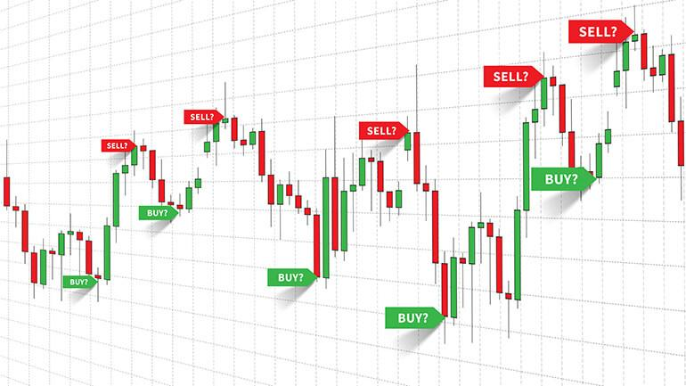

## Table of Contents

## What is a trading signal?

A trading signal is a suggestion to buy or sell a financial asset, like a stock or a currency. It helps traders decide when to enter or exit a trade. These signals are often generated by analyzing market data, like price movements and trading volumes, using special tools or computer programs.

People use trading signals because they can make trading easier and less time-consuming. Instead of watching the market all the time, traders can follow these signals to make decisions. However, it's important to remember that no signal is perfect. Traders should always do their own research and not rely only on signals.

## How are trading signals generated?

Trading signals are created by looking at lots of information about the market. This information can include the price of a stock or currency, how many people are buying or selling it, and other things like news or economic reports. Special computer programs, called algorithms, use this information to find patterns or signs that suggest it might be a good time to buy or sell. These programs can look at the data in many different ways, like using math formulas or comparing it to past market behavior.

There are also people who create trading signals by hand. These people, called analysts, study the market closely and use their experience to decide when to suggest buying or selling. They might use charts and graphs to help them see trends or important changes in the market. Sometimes, they combine their own ideas with what the computer programs suggest to make their signals.

Both computer-generated and human-made signals try to help traders make better choices. But, it's important to know that no signal is always right. The market can be unpredictable, and what worked before might not work again. So, traders should use signals as a helpful tool, but also think for themselves and do their own research before making decisions.

## What are the different types of trading signals?

Trading signals come in different types, mainly based on how they are made and what they suggest. One type is technical signals, which come from looking at charts and numbers about how prices move. These signals use things like moving averages, which are lines on a chart that show the average price over time, or other math tools to find good times to buy or sell. Another type is fundamental signals, which are based on news or reports about a company or the economy. These signals might suggest buying a stock if a company is doing well or selling if there's bad news.

There are also sentiment signals, which look at what people are feeling about the market. These signals use things like surveys or social media to see if people are feeling happy or worried about their investments. If a lot of people are feeling good, it might be a sign to buy, and if they're feeling bad, it might be a sign to sell. Each type of signal can help traders in different ways, but they all try to make it easier to decide when to buy or sell.

Using these signals can be helpful, but it's important to remember that no signal is perfect. Sometimes, the market can do unexpected things, and what the signals suggest might not always work out. That's why it's good to use signals along with your own research and thinking to make the best trading decisions.

## How can trading signals be used in trading strategies?

Trading signals can be a big help in making trading strategies. They give traders ideas about when to buy or sell, which can be used to make rules for trading. For example, a trader might decide to buy a stock when a signal says it's a good time, and then sell it when another signal says the price might go down. This way, the trader can use signals to set up a plan that tells them what to do at different times. It's like having a map that shows when to start and stop a journey.

But, it's important not to just follow signals without thinking. Traders should use signals as part of a bigger plan. They can mix signals with their own ideas and research to make better choices. For example, if a signal says to buy a stock, the trader might also look at news about the company or check if the price seems right before deciding. By using signals smartly and not relying on them too much, traders can make strategies that work well and help them do better in the market.

## What are the benefits of using trading signals?

Using trading signals can make trading easier and less time-consuming. Instead of watching the market all day, traders can use signals to help them decide when to buy or sell. This can save a lot of time and effort. Signals can also help traders spot good opportunities they might miss otherwise. By following signals, traders can take advantage of market trends and make better decisions.

Another benefit of trading signals is that they can help traders be more disciplined. It's easy to let emotions like fear or excitement affect trading decisions, but signals can help traders stick to a plan. This can lead to more consistent results over time. However, it's important to remember that signals are not perfect. Traders should use them as a tool, along with their own research and thinking, to make the best choices.

## What are the potential risks associated with trading signals?

Using trading signals can be risky because they are not always right. The market can change in ways that are hard to predict, and what worked before might not work again. If traders rely too much on signals without doing their own research, they might make bad decisions and lose money. It's important to remember that signals are just suggestions, not guarantees.

Another risk is that some signals might be based on old or wrong information. If the data used to make the signal is not up-to-date or accurate, the signal might lead traders in the wrong direction. Also, some people might try to trick others by selling fake signals that don't really work. Traders need to be careful and check where the signals are coming from before using them.

Lastly, using too many signals can make things confusing. If traders follow a lot of different signals, it can be hard to know which ones to trust. This can lead to overtrading, where traders buy and sell too often, which can also lead to losses. It's best to use signals carefully and as part of a bigger plan, not as the only thing guiding trading decisions.

## How can one evaluate the reliability of a trading signal?

To evaluate the reliability of a trading signal, it's important to look at its past performance. This means checking how often the signal has been right in the past. You can do this by looking at old data and seeing if the signal's suggestions would have made money or lost money. It's also good to see if the signal works well in different market conditions, like when the market is going up or down. If a signal only works well sometimes, it might not be very reliable.

Another way to check a signal's reliability is to understand how it's made. Some signals come from computer programs that use math to find patterns in the market. Others are made by people who study the market closely. Knowing how the signal is created can help you decide if it's trustworthy. Also, it's important to see if the people or companies giving out the signals are honest and have a good reputation. If they have been around for a long time and other traders trust them, the signals might be more reliable.

Lastly, it's a good idea to use more than one signal and compare them. If different signals are saying the same thing, it might be a stronger sign that it's a good time to buy or sell. But if the signals disagree, it's a warning to be careful and do more research. Remember, no signal is perfect, so always use them along with your own thinking and research to make the best trading decisions.

## What tools and platforms provide trading signals?

Many tools and platforms offer trading signals to help traders make decisions. Some popular ones include MetaTrader 4 and 5, which are software programs that let traders see charts and use signals to buy or sell. These platforms have built-in tools that can create signals based on math formulas and market data. There are also websites like TradingView, where people share their own signals and ideas about the market. These sites often have communities where traders can talk and learn from each other.

Another type of platform is signal services, like those offered by companies like eToro or Trading Central. These services send signals directly to traders through email, text messages, or apps. They use special computer programs to look at the market and find good times to buy or sell. Some of these services are free, while others need a subscription. It's important to check if the service has a good track record and if other traders trust it before using it.

Lastly, social media and forums can also be sources of trading signals. Platforms like Twitter or Reddit have groups where traders share their signals and discuss the market. While these can be helpful, it's important to be careful because not all signals from these places are reliable. Always do your own research and think about the signals before using them in your trading.

## How do professional traders use trading signals differently from beginners?

Professional traders use trading signals in a more careful and smart way than beginners. They don't just follow signals without thinking. Instead, they use signals as one part of a bigger plan. Professionals look at many different signals and compare them to see if they agree. They also do a lot of their own research and use their experience to decide if a signal is worth following. They know that the market can be unpredictable, so they don't rely too much on any one signal. They might use signals to help them find good times to buy or sell, but they always think about other things like news and the overall market before making a decision.

Beginners, on the other hand, might use trading signals more simply. They might follow signals without doing much of their own research because they are new to trading and don't know as much yet. Beginners might see a signal and think it's a sure thing, so they buy or sell right away. This can be risky because they might not understand all the reasons behind the signal. Over time, as beginners learn more about the market, they start to use signals more like professionals do, mixing them with their own ideas and research to make better trading choices.

## What are some advanced techniques for optimizing trading signals?

Professional traders often use advanced techniques to make their trading signals work better. One way they do this is by using something called "signal filtering." This means they look at many different signals and only use the ones that agree with each other. If a lot of signals are saying the same thing, it might be a stronger sign that it's a good time to buy or sell. They also use "[backtesting](/wiki/backtesting)," which is when they check how well a signal would have worked in the past. By looking at old data, they can see if the signal is reliable and make changes to make it better.

Another technique is "signal optimization," where traders change the settings of the signals to make them more accurate. They might adjust the math formulas or the time periods the signals look at to find the best way to use them. Professionals also use "risk management" to make sure they don't lose too much money if a signal is wrong. They might set limits on how much they are willing to lose on a trade or use other ways to protect their money. By using these advanced techniques, traders can make their signals more useful and make better trading decisions.

## How can trading signals be integrated with other forms of analysis?

Trading signals can be used along with other ways of looking at the market to make better trading choices. One way to do this is by using technical analysis, which looks at charts and numbers to find patterns in how prices move. Traders can use signals to help them see when these patterns might be happening. For example, if a signal says it's a good time to buy, traders can check the charts to see if the price is at a low point or if it's about to go up. By mixing signals with technical analysis, traders can get a clearer picture of what might happen next in the market.

Another way to use signals is with [fundamental analysis](/wiki/fundamental-analysis), which looks at news and reports about a company or the economy. If a signal suggests buying a stock, traders can also look at the company's financial reports or news to see if it's doing well. This can help them decide if the signal is a good one to follow. By combining signals with fundamental analysis, traders can make sure they are not just following a signal blindly but are also thinking about the bigger picture. This can lead to smarter trading decisions and better results over time.

## What future trends might impact the use of trading signals?

In the future, technology will play a big role in how trading signals are used. Computers and [artificial intelligence](/wiki/ai-artificial-intelligence) (AI) are getting better at looking at lots of data quickly. This means they can find patterns and make signals that are more accurate. Traders might start using AI to make their own signals or to check if the signals they get from other places are good. Also, more people might use apps and online platforms to get signals, making it easier to trade from anywhere. But, as technology gets better, there might also be more fake signals, so traders will need to be careful and check where their signals come from.

Another trend that could change how trading signals are used is the way people share information. Social media and online communities are becoming more important for traders. They can share signals and talk about the market in real-time. This can help traders find good signals faster and learn from each other. But, it can also be risky because not all information on social media is true. Traders will need to be smart about which signals to trust and do their own research. Overall, the future of trading signals will be about using technology and being part of a community to make better trading choices.

## References & Further Reading

[1]: ["Advances in Financial Machine Learning"](https://www.amazon.com/Advances-Financial-Machine-Learning-Marcos/dp/1119482089) by Marcos Lopez de Prado

[2]: ["Evidence-Based Technical Analysis: Applying the Scientific Method and Statistical Inference to Trading Signals"](https://www.amazon.com/Evidence-Based-Technical-Analysis-Scientific-Statistical/dp/0470008741) by David Aronson

[3]: ["Machine Learning for Algorithmic Trading"](https://github.com/stefan-jansen/machine-learning-for-trading) by Stefan Jansen

[4]: ["Quantitative Trading: How to Build Your Own Algorithmic Trading Business"](https://www.amazon.com/Quantitative-Trading-Build-Algorithmic-Business/dp/1119800064) by Ernest P. Chan

[5]: Latency. (2019). ["Algorithmic Trading and Computational Finance: Tools and Techniques for the Emerging Markets."](https://medium.com/@brett_17026/how-fast-is-it-really-1a7928c58888) 

[6]: Kissell, R. (2013). ["The Science of Algorithmic Trading and Portfolio Management"](https://www.sciencedirect.com/book/9780124016897/the-science-of-algorithmic-trading-and-portfolio-management) by Robert Kissell