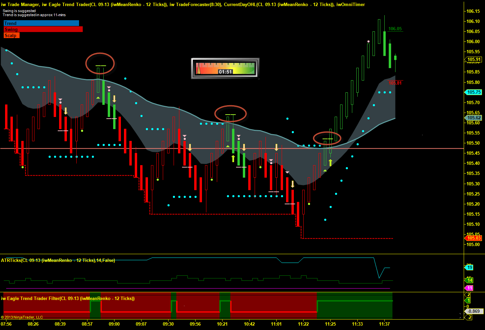

In the fast-paced world of online trading, access to reliable and effective trading signals can significantly impact a trader's success. Algo Trading signals have emerged as a critical resource for both novice and experienced traders. These signals streamline trading strategies and enhance profitability by using advanced computational algorithms to identify optimal trading opportunities.

Trading signals generated through algorithmic trading systems have transformed how trades are executed, especially in Forex and cryptocurrency markets. The integration of sophisticated algorithms allows these systems to process vast amounts of market data in real-time, identifying patterns and predicting market movements with remarkable accuracy. This enables traders to respond swiftly to evolving market conditions, minimizing risks and maximizing returns.



Moreover, Algo Trading signals eliminate emotional biases from trading decisions. By relying on data-driven insights, traders can make informed decisions based on objective analysis, free from the common pitfalls of emotional trading. This strategic advantage is invaluable, particularly in the volatile environments of currency and crypto markets, where sudden price fluctuations are the norm.

As traders increasingly recognize the benefits of automated trading, the reliance on Algo Trading signals continues to grow. Whether you're a beginner seeking to gain confidence and competence in the market or an experienced trader looking to refine your strategies, these signals offer a pathway to a more comprehensive understanding of market dynamics.

Prepare to explore the myriad advantages of trading signals and discover how they can revolutionize your trading journey. Through this comprehensive guide, you will unlock the potential of using automated signals to redefine your approach to financial markets, paving the way for a more informed and successful trading experience.

## Table of Contents

## Understanding Trading Signals

Trading signals serve as precise recommendations for when to engage in trades concerning currency pairs, commodities, stocks, or indices. Typically, these recommendations specify an optimal price and time, guiding traders in executing transactions efficiently. The generation of these signals can occur through manual examination by seasoned analysts or, more commonly in contemporary financial markets, through algorithms powered by real-time market data evaluation.

In the context of [algorithmic trading](/wiki/algorithmic-trading), trading signals are produced by deploying complex algorithms designed to recognize patterns and trends within vast datasets. These algorithms apply mathematical models and statistical techniques to predict potentially advantageous trades, thus obviating the necessity for labor-intensive manual analysis. The strength of algorithm-generated signals lies in their ability to process and interpret large volumes of market data with speed and accuracy, identifying opportunities that might elude human traders.

For traders aiming for precision, efficiency, and scalability, these trading signals prove invaluable. The integration of algorithms ensures that the signals remain devoid of emotional bias, a common pitfall in manual trading. Consequently, traders can exploit increased trading volumes facilitated by automated systems that efficiently manage transactions round-the-clock. 

To illustrate the operational framework of algo trading signals, consider a Python-based example where a simple moving average (SMA) is calculated to identify potential entry points:

```python
import numpy as np
import pandas as pd

# Load market data into a DataFrame
data = pd.read_csv('market_data.csv')

# Compute simple moving averages
data['SMA_20'] = data['Close'].rolling(window=20).mean()
data['SMA_50'] = data['Close'].rolling(window=50).mean()

# Generate buy/sell signals
data['Signal'] = 0
data['Signal'][data['SMA_20'] > data['SMA_50']] = 1  # Buy
data['Signal'][data['SMA_20'] < data['SMA_50']] = -1 # Sell

# Field to store positions
data['Position'] = data['Signal'].diff()

# Display signals
print(data[['Close', 'SMA_20', 'SMA_50', 'Signal', 'Position']].dropna())
```

In this code snippet, simple moving averages are computed over 20-day and 50-day periods. When the short-term average (SMA_20) crosses above the long-term average (SMA_50), the algorithm generates a 'buy' signal. Conversely, a downward cross signals a 'sell' recommendation. Such automation enables traders to leverage statistical insights, enhancing their strategy's precision and profitability potential.

## Why Choose Algo Trading Signals?

Algo Trading signals provide traders with automated, real-time insights, enabling them to capitalize on market opportunities while eliminating emotional biases often associated with manual trading decisions. This automation allows for precise, objective analysis, ensuring that trading actions are governed by data rather than emotional responses. Traders, irrespective of their experience level, can significantly enhance their trading strategies by integrating these algorithm-driven signals into their decision-making processes.

One of the key features of Algo Trading is its demo account option, which permits traders to practice using $1,500 in virtual funds. This feature provides a safe, risk-free environment to experiment and learn the dynamics of algorithmic signals without the pressure of financial loss. It allows beginners to gain confidence and experienced traders to refine their strategies and adapt to the automated environment.

Additionally, Algo Trading offers customizable settings, enabling traders to tailor their experiences to align with individual risk tolerance and strategy preferences. These settings include options for signal probability adjustments and automated decision triggers, which can be modified to suit different trading styles and market conditions. This flexibility ensures that traders can optimize their strategies to achieve their financial objectives effectively.

## Features and Benefits of Algo Trading

Algo Trading offers a comprehensive platform tailored to meet the needs of traders across various experience levels. The user-friendly trading room is designed to provide seamless execution of trades while incorporating effective trading features, ensuring that both novice and experienced traders can navigate the system effortlessly.

One of the standout elements of Algo Trading is its extensive selection of assets. Traders have access to a diverse range of options, which span Forex and [cryptocurrency](/wiki/cryptocurrency) markets, allowing for broad diversification of trading portfolios. This variety not only helps to mitigate risk but also maximizes the potential for profitable trades as different markets often move independently.

Moreover, Algo Trading emphasizes the importance of safety and adaptability by partnering with licensed and regulated brokers. This collaboration safeguards the interests of traders by ensuring their investments are managed within legal and industry-approved frameworks. Additionally, traders retain the flexibility to switch between brokers, enabling them to respond swiftly to market movements and capitalize on new opportunities as they arise.

To enhance the trading experience further, Algo Trading provides professional customer support services available 24 hours a day, five days a week. This ensures immediate assistance is at hand for any trading-related inquiries or technical issues, facilitating efficient resolutions and allowing traders to focus on their core activities without disruption. This robust support network is critical for maintaining trader confidence, particularly in fast-paced trading environments where time is of the essence.

In conclusion, the features of Algo Trading are orchestrated to deliver a streamlined and efficient trading experience. By providing a diverse range of assets, ensuring regulatory compliance through licensed brokers, and offering steadfast customer support, Algo Trading positions itself as a valuable partner for traders aiming to optimize their financial ventures.

## Testimonials from Satisfied Traders

Michael K from Sydney experienced a remarkable increase in profitability, attributing a 124% growth to the use of Algo-Signals. This significant gain has afforded him more leisure time, highlighting the efficiency and reliability of automated trading systems. 

Alex J from Birmingham regards Algo-Signals as an essential tool for income supplementation. He commends the platform for facilitating a smooth transition to successful trading, underscoring the user-friendly nature of Algo-Signals and its impact on enhancing trading outcomes effectively.

Samantha M from London benefits from the accuracy and precise timing of Algo-Signals. These well-timed trading signals have enabled her to settle debts and indulge in personal luxuries, demonstrating the platform's potential to provide users with the financial freedom and satisfaction they seek.

## How to Get Started with Algo Trading Signals

To embark on the journey of using Algo Trading Signals, the initial step is to open a free demo account. This account offers a risk-free environment, allowing novice and experienced traders alike to practice using Algo-Signals without any financial commitment. It serves as a training ground to familiarize oneself with the various features and functionalities offered by the platform, providing hands-on experience that is crucial for mastering the art of algorithmic trading.

Transitioning from a demo account to a live account is a straightforward and seamless process. This shift enables traders to engage in real-time trading, capitalizing on immediate market opportunities. The live account maintains the user-friendly interface of the demo account, ensuring that the switch is smooth and does not disrupt the trading experience.

The enrollment procedure to access Algo Trading Signals is uncomplicated, designed to accommodate users of all expertise levels. Upon registration, users have the opportunity to customize signal probabilities and automate their trading decisions, tailoring the platform's operations to match their specific risk preferences and strategic objectives.

This customization feature is integral, as it allows traders to set parameters according to their desired level of risk tolerance and market engagement strategies. By doing so, Algo-Signals can facilitate a personalized trading experience, ensuring that the insights and signals generated align with the trader’s goals.

The automation of trading decisions is a significant aspect of Algo Trading Signals. Such automation leverages advanced algorithmic systems to execute trades based on predefined criteria, minimizing the manual effort traditionally required in trading. Automation not only enhances efficiency but also reduces the impact of emotional biases, thereby contributing to more consistent and objective trading outcomes.

As traders embark on using Algo Trading Signals, they are equipped with state-of-the-art tools designed to optimize their trading strategies and maximize potential returns. The step-by-step setup process ensures that users can easily navigate both the demo and live trading phases, providing them with the confidence and competence needed to excel in the dynamic environment of financial markets.

## Conclusion

Algo Trading signals provide invaluable tools for traders seeking to make informed and profitable decisions in dynamic and fluctuating markets. By leveraging advanced algorithms, these signals analyze vast amounts of market data, offering real-time insights into potential trading opportunities. This technological advancement eliminates the emotional biases that often hinder trading success, thus facilitating more reliable trading outcomes. Regardless of whether you are an experienced trader looking to refine and enhance your strategies or a beginner embarking on your trading journey, Algo-Signals offer a comprehensive and satisfying trading experience. 

These automated signals simplify trading by providing accurate predictions, which are critical in making well-timed market entries and exits. As trading continues to evolve in the digital age, stepping into the world of automated trading with Algo-Signals presents an opportunity to maximize your potential in the financial markets. The ability to customize signal parameters also means that traders can tailor their trading activities to align with personal risk appetites and strategy preferences, enabling a more controlled and strategic approach to trading. Embrace the future of trading with Algo-Signals and unlock the full potential of your trading ambitions.

## References & Further Reading

[1]: ["Advances in Financial Machine Learning"](https://www.amazon.com/Advances-Financial-Machine-Learning-Marcos/dp/1119482089) by Marcos Lopez de Prado

[2]: ["Evidence-Based Technical Analysis: Applying the Scientific Method and Statistical Inference to Trading Signals"](https://www.amazon.com/Evidence-Based-Technical-Analysis-Scientific-Statistical/dp/0470008741) by David Aronson

[3]: ["Machine Learning for Algorithmic Trading"](https://github.com/stefan-jansen/machine-learning-for-trading) by Stefan Jansen

[4]: ["Quantitative Trading: How to Build Your Own Algorithmic Trading Business"](https://www.amazon.com/Quantitative-Trading-Build-Algorithmic-Business/dp/1119800064) by Ernest P. Chan

[5]: Latency. (2019). ["Algorithmic Trading and Computational Finance: Tools and Techniques for the Emerging Markets."](https://medium.com/@brett_17026/how-fast-is-it-really-1a7928c58888) 

[6]: Kissell, R. (2013). ["The Science of Algorithmic Trading and Portfolio Management"](https://www.sciencedirect.com/book/9780124016897/the-science-of-algorithmic-trading-and-portfolio-management) by Robert Kissell