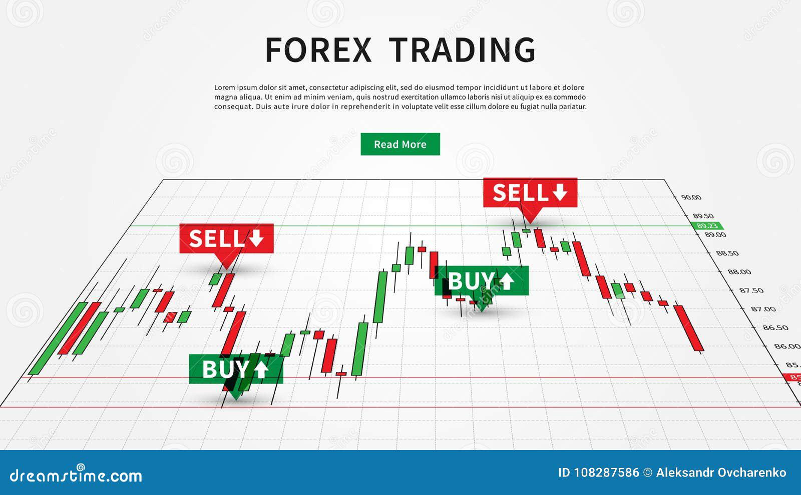

Trading signals have increasingly become a vital component for traders navigating the complexities of financial markets. These indicators enable traders to make well-informed decisions by leveraging real-time data and analysis, thus allowing for more precise entry and exit points in trades. In particular, trading signals play a significant role in algorithmic trading, also known as Algo Trading—a method of executing trading orders using automated, pre-programmed trading instructions accounting for variables such as time, price, and volume.

With the advancement of technology, trading signals have become more sophisticated, enabling traders to enhance their strategies by incorporating a variety of factors, including but not limited to market trends and technical analysis algorithms. The integration of these signals into trading platforms has notably influenced both forex and cryptocurrency trading sectors. Platforms like Algo-Signals have emerged as revolutionary tools that offer traders a streamlined and efficient approach to execute trades. These platforms provide access to a plethora of signals and customize options that are designed to cater to the needs of both novice and experienced traders.



By using trading signals in conjunction with algorithmic trading systems, traders can harness the power of automation to potentially increase their profitability while minimizing emotional and subjective elements that often influence trading decisions. Ultimately, the utilization of trading signals, coupled with the cutting-edge capabilities of platforms like Algo-Signals, equips traders with the necessary tools to optimize their trading performance and stay competitive in ever-evolving financial markets.

## Table of Contents

## Understanding Trading Signals

Trading signals serve as crucial indicators or prompts for executing buy or sell orders in financial markets. These signals are derived from various analytical methods that help traders make data-driven decisions. Fundamentally, trading signals result from a thorough analysis of diverse data sets and can be rooted in several factors, such as market trends, economic announcements, and technical analyses.

Market trends refer to the general movement of the market, which can be identified through different technical analysis tools like moving averages or relative strength indices. These tools help traders understand the prevailing direction of market movements, such as bullish or bearish trends, and make informed predictions about future market behavior.

Economic announcements also significantly impact trading signals. Key economic indicators, such as employment reports, gross domestic product (GDP) figures, or [interest rate](/wiki/interest-rate-trading-strategies) statements from central banks, can create [volatility](/wiki/volatility-trading-strategies) in the markets. Traders take these announcements into consideration, as they often lead to shifts in asset prices.

Technical analysis algorithms, meanwhile, play a vital role in the generation of trading signals. These algorithms apply statistical techniques to historical market data to forecast future price movements. For example, a simple moving average (SMA) can be calculated using the formula:

$$

\text{SMA} = \frac{\sum_{i=1}^{n} \text{price}_i}{n} 
$$

where $n$ is the number of time periods considered, and $\text{price}_i$ is the price at each time interval. Such computations inform traders about potential entry and exit points in the market by analyzing price trends and volatility.

The role of technology in generating these signals is indispensable and primarily relies on advanced computational capabilities. With the advent of high-frequency trading systems and [artificial intelligence](/wiki/ai-artificial-intelligence), it is now possible to process extensive volumes of market data in real-time. This rapid analysis facilitates the identification of optimal trading opportunities by recognizing patterns that might be imperceptible to the human eye. These technologies enable traders to gain a competitive edge, as they can react promptly to market changes and capitalize on profitable opportunities with minimal delay.

In summary, trading signals amalgamate various analytical methodologies supported by advanced technology to provide traders with reliable insights. By synthesizing market trends, economic data, and technical algorithms, trading signals guide traders in making informed and timely decisions, enhancing their overall trading strategy.

## The Role of Algorithmic Trading (Algo Trading)

Algorithmic Trading, commonly referred to as Algo Trading, utilizes computers to automate trading decisions based on predefined strategies. This method leverages algorithms—sets of rules or instructions for calculations or problem-solving—to analyze vast amounts of data and execute trades with precision and speed that surpass human capabilities.

The primary advantage of Algo Trading is its capacity to minimize human emotions and errors typically associated with manual trading. By automating the decision-making process, trading strategies become more disciplined, consistent, and less influenced by irrational behavior, such as fear or greed. This automation facilitates quicker reactions to market changes and improves the efficiency of trade execution.

Algo Trading allows traders to tailor their strategies to specific market conditions and personal risk appetites. Using custom algorithms, traders can program specific criteria for entering and exiting trades. These criteria can be based on a variety of factors, such as price movements, technical indicators, chart patterns, or even [machine learning](/wiki/machine-learning) models that predict future market behavior.

A typical algorithm might look like this in Python:

```python
def moving_average(candles, window_size):
    return sum(candles[-window_size:]) / window_size

def should_buy(current_price, short_window, long_window):
    if moving_average(price_history, short_window) > moving_average(price_history, long_window):
        return True
    return False

price_history = [/* historical price data */]
current_price = price_history[-1]

if should_buy(current_price, short_window=50, long_window=200):
    print("Execute Buy Order")
```

This hypothetical trading algorithm uses a simple moving average crossover strategy to decide when to enter a buy position. If the short-term moving average (e.g., 50-day) surpasses the long-term moving average (e.g., 200-day), the algorithm triggers a buy order.

By integrating various data inputs and computational models, Algo Trading platforms enable traders to manage their portfolios more effectively. These platforms offer advanced tools for [backtesting](/wiki/backtesting) strategies against historical data, optimizing parameters before live execution. The ability to simulate strategies in a controlled environment helps refine their performance and manage risk more efficiently.

In summary, Algo Trading revolutionizes market participation by automating complex decisions through predefined rules and data analysis. This not only enhances the precision and speed of trading activities but also empowers traders to maintain control over their strategies while minimizing psychological biases.

## Advantages of Using Trading Signals in Algo Trading

Trading signals in [algorithmic trading](/wiki/algorithmic-trading) present a substantial benefit by instituting a structured framework for decision-making. This structured approach significantly reduces the reaction times to market fluctuations, enhancing the efficiency and precision of trading activities. By employing algorithmically-derived trading signals, traders can automate their decision-making processes, allowing for rapid execution of trades in response to dynamic market conditions. This automation mitigates the delays associated with human decision-making, which is crucial in volatile markets where timing is often the key determinant of success.

These signals provide traders with actionable insights derived from a comprehensive analysis of market data. By analyzing historical data, market trends, and various economic indicators, trading signals can identify potentially profitable opportunities with greater accuracy. This capability of distilling vast amounts of data into simplified actionable strategies increases the probability of successful trades. Traders can thus rely on these insights to make informed decisions without the need for constant manual analysis.

Platforms such as Algo-Signals enhance the utility of trading signals by offering customizable interfaces tailored to the preferences and strategies of both novice and seasoned traders. Such platforms facilitate a variety of trading strategies through an extensive array of tools and resources. They typically provide users the ability to modify trading parameters, backtest strategies against historical data, and utilize real-time data feeds, which collectively enhance the trader's capacity to adapt to market changes.

A key feature of platforms like Algo-Signals is the extensive resources they offer, including tutorials, market analysis, and customer support, all designed to aid traders in effectively leveraging trading signals. These resources ensure that traders, regardless of their experience level, have access to vital information that can enhance their trading performance.

In summary, the integration of trading signals into algorithmic trading frameworks offers clear advantages by streamlining decision-making processes, providing precise and actionable market insights, and supporting a wide range of customizable strategies. This approach not only improves the speed and accuracy of trades but also empowers traders with the tools necessary for navigating the complexities of financial markets.

## How Algo-Signals Facilitates Effective Trading

Algo-Signals is a platform designed to enhance the trading experience by offering real-time access to top-rated trading signals. The platform is crafted to be intuitive, allowing traders to seamlessly navigate its offerings and make informed decisions. One of its significant features is the provision of a risk-free demo account. This option allows traders to test their strategies without the need for an initial financial commitment, thereby minimizing potential losses while gaining practical experience.

The platform supports a diverse array of assets, accommodating traders with interests in different financial markets. From [forex](/wiki/forex-system) to cryptocurrencies, Algo-Signals covers a broad spectrum, ensuring that users have the flexibility to trade in areas they find most profitable or have expertise in. Moreover, the inclusion of regulated brokers within the platform enhances security for its users. Regulated brokers adhere to strict compliance standards, providing a safe and trustworthy trading environment.

In addition to its fundamental capabilities, Algo-Signals integrates sophisticated technological tools that empower traders by providing insights based on data analysis. These insights are pivotal in formulating strategies that can lead to profitable outcomes. The user-friendly nature of the platform, coupled with its comprehensive suite of features, makes it an attractive choice for both novice and seasoned traders aiming to optimize their trading strategies.

## Testimonials and Success Stories

Many traders have reported increased profitability and reduced analysis time using Algo-Signals. This feedback is consistent among both new and seasoned traders, highlighting the platform's effectiveness in streamlining the trading process. Users frequently emphasize how the integration of automated trading systems has transformed trading from a task once laden with stress and unpredictability into a more enjoyable activity. Automation helps eliminate the emotional rollercoaster typical in manual trading, resulting in more consistent outcomes.

The transition from demo to live trading with Algo-Signals is often a focal point in user testimonials. Many traders commend the straightforward transition process. The demo accounts provided by Algo-Signals offer a risk-free environment where traders can familiarize themselves with the platform’s functionalities and test various trading strategies. As they gain confidence, users can seamlessly move to live trading, capitalizing on real-time market data with more assurance and competency.

A recurring theme in success stories is the dramatic reduction in time spent on market analysis. Algorithmic strategies execute trades based on pre-defined criteria, allowing users to rely on the platform’s advanced technological capabilities. This reduces the necessity for constant market monitoring, thereby freeing up time for other activities or further strategy refinement.

Overall, these positive user experiences underscore the effectiveness of Algo-Signals in making trading more accessible, less time-consuming, and potentially more profitable. The platform empowers its users by providing tools that not only enhance trading performance but also contribute to a more balanced trading experience.

## Conclusion

Trading signals represent a pivotal tool for traders aiming to gain a competitive edge in the dynamic financial markets. These signals are particularly advantageous when integrated into algorithmic trading (Algo Trading), offering traders real-time insights and customizable solutions to refine their trading strategies. The efficiency of platforms like Algo-Signals lies in their ability to provide access to a wealth of market data and analytic capabilities, significantly enhancing the decision-making process.

By utilizing trading signals, traders, regardless of their level of experience, can significantly streamline their trading activities and optimize their strategies. Novice traders benefit from the structured guidance that these signals provide, helping them navigate the complexities of trading with greater ease. Experienced professionals, on the other hand, can use these signals to refine their strategies further, leading to a potential increase in their profitability.

Incorporating trading signals into Algo Trading allows for a disciplined approach that minimizes emotion-driven decisions, enabling traders to react swiftly and effectively to market changes. This structured decision-making process is crucial in today’s fast-paced market environment, as it empowers traders to capitalize on fleeting trading opportunities. Through platforms like Algo-Signals, both new and seasoned traders can harness these advancements to boost their trading outcomes and achieve greater financial success.

## Call to Action

Explore the potential of trading signals by signing up for a demo account with Algo-Signals today. By doing so, you gain access to a robust platform equipped with advanced tools and resources designed to optimize trading strategies. The demo account allows you to practice and refine your skills without the financial risk, providing a seamless transition to live trading.

Algo-Signals offers a comprehensive suite of features, from real-time data analysis to customizable trading interfaces, enabling traders to execute informed decisions quickly and efficiently. Leveraging these tools, traders can enhance their ability to respond to market fluctuations and maximize their trading performance.

Join the growing community of successful traders who are taking advantage of Algo Trading's benefits. Harness the power of trading signals to streamline your trading process, enhance your decision-making, and potentially increase your profitability. Sign up for a demo account today and start your journey towards more effective trading strategies.

## References & Further Reading

[1]: Aronson, D. R. (2007). ["Evidence-Based Technical Analysis: Applying the Scientific Method and Statistical Inference to Trading Signals"](https://onlinelibrary.wiley.com/doi/book/10.1002/9781118268315). Wiley.

[2]: Chan, E. P. (2009). ["Quantitative Trading: How to Build Your Own Algorithmic Trading Business"](https://github.com/ftvision/quant_trading_echan_book). Wiley.

[3]: Jansen, S. (2020). ["Machine Learning for Algorithmic Trading, 2nd Edition"](https://github.com/stefan-jansen/machine-learning-for-trading). Packt Publishing.

[4]: Lopez de Prado, M. (2018). ["Advances in Financial Machine Learning"](https://www.amazon.com/Advances-Financial-Machine-Learning-Marcos/dp/1119482089). Wiley.

[5]: Kaminski, K. M., & Lo, A. W. (2014). ["Algorithmic Trading: The Great Equalizer?"](https://econpapers.repec.org/RePEc:eee:finmar:v:18:y:2014:i:c:p:234-254) Lecture series. Coursera.

[6]: Narang, R. K. (2013). ["Inside the Black Box: A Simple Guide to Quantitative and High-Frequency Trading"](https://onlinelibrary.wiley.com/doi/book/10.1002/9781118662717). Wiley.

[7]: Aldridge, I. (2013). ["High-Frequency Trading: A Practical Guide to Algorithmic Strategies and Trading Systems"](https://www.amazon.com/High-Frequency-Trading-Practical-Algorithmic-Strategies/dp/1118343506). Wiley.