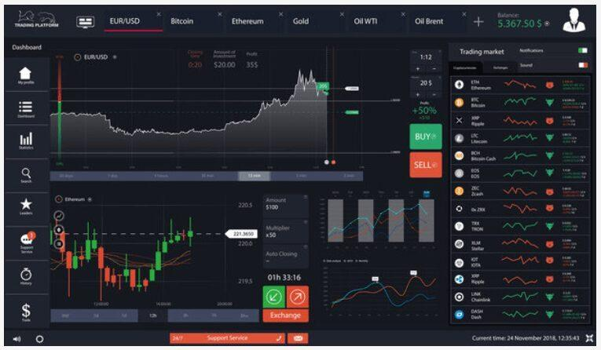

## Table of Contents

## What is trading software?

Trading software is a type of computer program that helps people buy and sell things like stocks, cryptocurrencies, and other financial products. It makes trading easier by showing real-time prices, charts, and other important information. People use trading software to make quick decisions and manage their investments better.

There are many different kinds of trading software, and they can be used by both beginners and experts. Some software is simple and easy to use, while other types have more advanced features for experienced traders. Many trading platforms also let you practice trading with fake money before you start using real money, which can be very helpful for learning.

## Why is trading software important for traders?

Trading software is important for traders because it makes trading easier and faster. It shows real-time prices and charts, so traders can see what is happening in the market right away. This helps them make quick decisions about buying or selling. Without trading software, traders would have to do a lot of work by hand, which would take more time and could lead to mistakes.

Another reason trading software is important is that it helps traders manage their investments better. The software can keep track of all their trades and show them how well they are doing. It can also help them try out different trading strategies without using real money, which is great for learning. This way, traders can get better at trading and make smarter choices with their money.

## What are the basic features of trading software?

Trading software usually has some basic features that help traders do their work. One important feature is real-time data. This means the software shows the latest prices of stocks, cryptocurrencies, and other things traders want to buy or sell. It also shows charts and graphs that help traders see how prices are changing over time. Another basic feature is the ability to place orders. Traders can use the software to tell the market they want to buy or sell something at a certain price. This makes trading quick and easy.

Another important feature of trading software is the ability to keep track of trades. The software keeps a record of all the buys and sells a trader makes, so they can see how well they are doing. It also often includes tools for analyzing past trades to help traders learn from their mistakes and improve their strategies. Some trading software also lets traders practice trading with fake money before they start using real money. This is very helpful for beginners who want to learn how to trade without risking their own money.

## How does trading software help in analyzing market trends?

Trading software helps traders analyze market trends by showing them charts and graphs that make it easy to see how prices are changing over time. These charts can show different time periods, like hours, days, or even years. Traders can use these charts to spot patterns and trends in the market. For example, if a stock's price keeps going up over several days, the software can help traders see this trend and decide if they want to buy the stock.

The software also has tools that help traders do more detailed analysis. These tools can draw lines on the charts to show where prices might go next, or they can calculate things like moving averages, which help traders see the overall direction of the market. By using these tools, traders can make better guesses about what the market will do in the future. This helps them make smarter decisions about when to buy or sell.

## What are the different types of trading software available?

There are different types of trading software that traders can use. One type is called a desktop application. This is a program that you download and install on your computer. Desktop applications are often used by traders who need a lot of advanced features and tools. They can be very powerful and let you do things like make detailed charts and use complex trading strategies. Another type of trading software is a web-based platform. This is a program that you use through your web browser, so you don't need to download anything. Web-based platforms are easy to use and you can access them from any computer with an internet connection. They are good for traders who want to trade from different places.

Another type of trading software is a mobile app. This is a program that you download on your smartphone or tablet. Mobile apps are great for traders who want to keep an eye on the market while they are away from their computer. They let you check prices, place orders, and get alerts about what is happening in the market. Some trading software also comes as a combination of these types. For example, you might have a desktop application and a mobile app that work together, so you can switch between them easily. This way, you can use the powerful features of the desktop application when you are at your computer, and the convenience of the mobile app when you are on the go.

## Can you explain the difference between automated and manual trading software?

Automated trading software lets a computer do the trading for you. You set up some rules, like when to buy or sell, and the software follows those rules automatically. This can be good because the computer can trade faster than a person and doesn't get tired or make mistakes. But, you need to be careful because if the rules you set up are not good, the software might make bad trades. Also, the market can change in ways you didn't expect, and the software might not be able to handle that.

Manual trading software, on the other hand, lets you make all the decisions yourself. You look at the charts and data, and then you decide when to buy or sell. This can be good because you can use your own judgment and change your mind if the market does something unexpected. But, it can be hard work because you have to watch the market all the time and make quick decisions. Also, if you get tired or make a mistake, it can cost you money. So, it's important to know which type of software is best for you and your trading style.

## What should beginners look for in trading software?

Beginners should look for trading software that is easy to use and understand. The software should have a simple design with clear buttons and menus, so you don't get confused. It should also have good tutorials or guides that explain how to use it. This way, you can learn how to trade without feeling overwhelmed. Another important thing is that the software should let you practice trading with fake money before you start using real money. This helps you get used to the software and learn how to trade without risking your own money.

Another thing beginners should look for is good customer support. If you have questions or run into problems, it's helpful to have someone you can talk to. The software should also have basic features like real-time prices and simple charts. These help you see what is happening in the market and make decisions. It's also good if the software has tools that help you keep track of your trades and see how well you are doing. This way, you can learn from your mistakes and get better at trading.

## How do advanced features in trading software benefit experienced traders?

Advanced features in trading software help experienced traders by giving them more tools to analyze the market and make better decisions. These features include things like complex charting tools, which let traders see more details about price movements. They can also use technical indicators, like moving averages and relative strength index (RSI), to spot trends and predict where prices might go next. This helps experienced traders find good times to buy or sell, and it can make their trading strategies more successful.

Another way advanced features help experienced traders is by letting them automate their trading. With automated trading, traders can set up rules for the software to follow, so it can buy or sell without them having to watch the market all the time. This saves time and can help traders make quick decisions when the market changes. Also, advanced software often has backtesting tools, which let traders test their strategies using past market data. This helps them see if their strategies would have worked well in the past, so they can improve them before using real money.

## What are some popular trading software platforms for different types of trading?

For stock trading, one popular platform is Robinhood. It's easy to use and doesn't charge you to trade stocks. Another popular one is E*TRADE, which has more advanced tools for people who know a lot about trading. Both of these platforms let you practice trading with fake money before you start using real money, which is good for beginners.

For cryptocurrency trading, Coinbase is a well-known platform. It's simple to use and good for people who are new to trading cryptocurrencies. For more experienced traders, Binance is popular because it has a lot of different cryptocurrencies and advanced trading tools. Both platforms let you buy and sell cryptocurrencies easily.

For forex trading, MetaTrader 4 (MT4) and MetaTrader 5 (MT5) are very popular. They have a lot of advanced features and tools that help traders analyze the market and make good decisions. These platforms are used by both beginners and experienced traders because they are powerful and easy to use.

## How can trading software be integrated with other financial tools?

Trading software can be connected with other financial tools to make trading easier and more effective. For example, many trading platforms can be linked to accounting software. This helps traders keep track of their money and see how much they are making or losing from their trades. Another way trading software can be integrated is with portfolio management tools. These tools help traders see all their investments in one place and make decisions about what to buy or sell next. By connecting trading software with these tools, traders can manage their money better and make smarter choices.

Another important way trading software can be integrated is with risk management tools. These tools help traders understand how much risk they are taking with their trades and set limits to protect their money. For example, some trading software can be connected to stop-loss orders, which automatically sell a stock if its price drops too much. This can help traders avoid big losses. By using trading software with these other financial tools, traders can have a complete system that helps them trade more safely and successfully.

## What are the security considerations when choosing trading software?

When choosing trading software, it's important to think about security. You want to make sure your money and personal information are safe. One thing to look for is if the software uses strong encryption. This means your information is turned into a secret code that only you and the trading platform can understand. Another thing to check is if the software has two-factor authentication. This means you need to enter a special code, usually sent to your phone, to log in. This makes it harder for someone else to get into your account.

Also, you should see if the trading software is regulated by a financial authority. This means it has to follow certain rules to keep your money safe. It's good to read reviews and see what other people say about the software's security. If a lot of people say it's safe, that's a good sign. Remember, choosing secure trading software helps protect your money and keeps your trading information private.

## How do you evaluate the performance and reliability of trading software?

To evaluate the performance and reliability of trading software, you should first look at how fast it works. Good trading software should show you the latest prices and let you place orders quickly. If the software is slow, you might miss good chances to buy or sell. You can also check if the software crashes a lot or has problems. Reliable software should work well all the time without stopping or making mistakes. Reading reviews from other users can help you see if the software is fast and reliable.

Another way to evaluate trading software is by looking at its features and how easy it is to use. The software should have all the tools you need to trade well, like good charts and the ability to set up automatic trades. If you are new to trading, the software should be simple and easy to understand. You can try the software with fake money to see if it works well for you. Also, good customer support is important. If you have problems, you should be able to get help quickly. By checking these things, you can find out if the trading software is good and reliable.

## References & Further Reading

[1]: Bergstra, J., Bardenet, R., Bengio, Y., & Kégl, B. (2011). ["Algorithms for Hyper-Parameter Optimization."](https://dl.acm.org/doi/10.5555/2986459.2986743) Advances in Neural Information Processing Systems 24.

[2]: ["Advances in Financial Machine Learning"](https://www.amazon.com/Advances-Financial-Machine-Learning-Marcos/dp/1119482089) by Marcos Lopez de Prado

[3]: ["Evidence-Based Technical Analysis: Applying the Scientific Method and Statistical Inference to Trading Signals"](https://www.amazon.com/Evidence-Based-Technical-Analysis-Scientific-Statistical/dp/0470008741) by David Aronson

[4]: ["Machine Learning for Algorithmic Trading"](https://github.com/stefan-jansen/machine-learning-for-trading) by Stefan Jansen

[5]: ["Quantitative Trading: How to Build Your Own Algorithmic Trading Business"](https://www.amazon.com/Quantitative-Trading-Build-Algorithmic-Business/dp/1119800064) by Ernest P. Chan