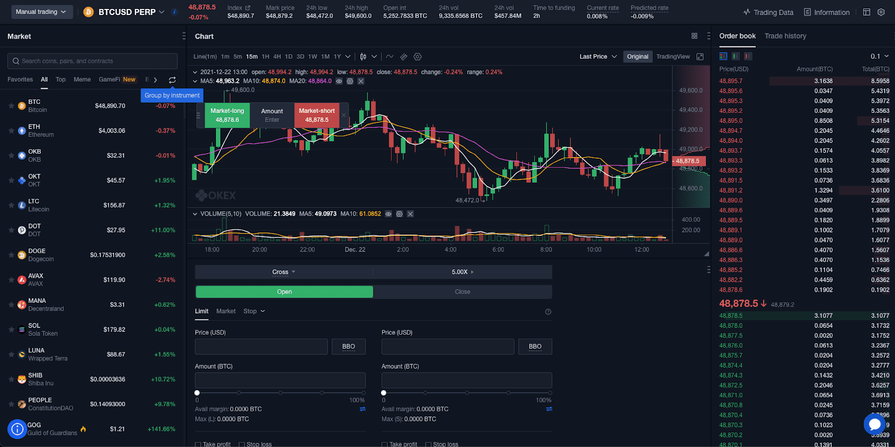

The rise of financial technology has significantly transformed the way individuals and institutions engage with today's financial markets. The introduction and proliferation of advanced trading platforms and software have facilitated a seamless and efficient trading environment, enhancing operational effectiveness and execution speed. Central to this technological evolution is algorithmic trading, commonly referred to as algo trading, which employs sophisticated computer algorithms to execute trades with remarkable speed and precision. This technological approach allows for high-frequency trading that far surpasses the capabilities of traditional manual trading methods.

Algorithmic trading is a key component of the modern trading ecosystem, operating on pre-defined conditions and utilizing complex mathematical models to make trading decisions. This methodology minimizes human error and emotional bias, providing a more objective approach to executing trades. The precision and efficiency inherent in algo trading have made it a preferred choice for many traders and financial institutions seeking to optimize their trading strategies.



This article aims to explore the extensive landscape of financial technology trading platforms and software, along with the nuanced mechanisms of algo trading. It seeks to provide insights into how these technologies are reshaping the trading industry and how they can offer a competitive edge to traders and investors navigating the complexities of financial markets. Understanding the capabilities and potential of these technologies is crucial for anyone looking to thrive in the rapidly evolving trading environment.

## Table of Contents

## What Is Financial Technology in Trading?

Financial technology, commonly referred to as fintech, signifies a broad array of technological advancements designed to streamline financial services. The advent of fintech in trading has revolutionized how transactions occur, providing a seamless interface between traders and the intricate web of financial markets. By incorporating advanced software and sophisticated platforms, fintech enhances market accessibility, offering traders vital tools for analyzing data, executing trades, and managing portfolios efficiently.

One of the primary impacts of fintech in trading is the democratization of market access. Previously, powerful trading tools and platforms were predominantly accessible to large institutions with significant capital. However, fintech has leveled the playing field by making these tools available to individual traders. This accessibility has been facilitated by sophisticated software solutions that provide real-time market data, advanced charting, and algorithmic trading capabilities, allowing individual traders to compete in markets once dominated by large financial entities.

In practical terms, fintech in trading encompasses a variety of platforms and software solutions that cater to different market needs. These include stock trading platforms, forex trading platforms, and [cryptocurrency](/wiki/cryptocurrency) exchanges, each offering unique features tailored to their specific markets. For instance, many platforms offer technical analysis tools, which are invaluable for traders utilizing historical data to forecast market trends. These tools often include indicators such as moving averages, Bollinger Bands, and Relative Strength Index (RSI), enabling traders to make well-informed decisions.

Fintech also significantly enhances transaction efficiency by automating diverse aspects of trading. This automation ranges from the execution of trades to the sophisticated analysis of market data using algorithms. Such advancements reduce the time and effort required for manual trading, minimize human errors, and optimize transaction costs.

The incorporation of fintech into trading practices has been pivotal in the transition towards a more inclusive financial ecosystem. By granting individual traders access to cutting-edge tools and platforms, fintech not only empowers these traders but also fosters a more competitive and efficient market environment. As technology evolves, the role of fintech in trading will likely continue to expand, offering new opportunities and challenges for traders across the globe.

## Types of Trading Platforms

Trading platforms are essential tools that allow traders to place transactions and monitor their investments across various financial markets. These platforms are designed to cater to different types of trading activities, each with its specific features and functionalities.

Stock trading platforms are tailored for trading securities like stocks and options. They typically offer features such as real-time quotes and market data, which are crucial for making informed trading decisions. Advanced charting tools allow traders to perform technical analysis, identifying potential trends and market movements. Additionally, news feeds are integrated to provide timely information that may impact stock prices. These platforms often support different order types, including market, limit, and stop orders, providing flexibility in trading strategies.

Forex trading platforms are specialized for currency trading and offer tools specific to the [forex](/wiki/forex-system) market. Key features include access to interbank market rates, real-time execution of trades, and leverage options that allow traders to control large positions with a relatively small amount of capital. Forex platforms often include charting software to analyze currency pair movements and may offer [algorithmic trading](/wiki/algorithmic-trading) capabilities through automated trading scripts like Expert Advisors (EAs) in MetaTrader.

Crypto exchanges are platforms for trading digital assets like cryptocurrencies. These exchanges provide features tailored to the unique characteristics of crypto markets, such as support for a wide range of cryptocurrencies, secure wallet integrations, and real-time price tracking. Some crypto platforms offer peer-to-peer trading, while others function more like traditional exchanges, matching buy and sell orders. Advanced exchanges might include futures and options trading on cryptocurrencies, further expanding the trading possibilities.

In addition to these market-specific platforms, many trading platforms have begun incorporating more robust features to meet the needs of sophisticated traders. These advanced features include algorithmic trading capabilities, where users can design, test, and deploy custom trading algorithms. Algorithmic trading allows for precision in trade execution and the ability to capitalize on market opportunities faster than manual trading.

Overall, the choice of a trading platform depends on the trader's specific needs, market focus, and desired features. The integration of real-time data, analytics tools, and news feeds makes these platforms indispensable in the fast-paced world of financial trading.

## Understanding Trading Software

Trading software provides essential tools and functionalities for traders, enabling them to analyze markets and execute trades efficiently. These platforms empower traders by offering a suite of features that facilitate both technical and [fundamental analysis](/wiki/fundamental-analysis), which are crucial for making informed trading decisions.

Most trading software packages are equipped with order placement options. This functionality allows traders to execute buy or sell orders quickly, and often includes advanced order types like limit orders, stop orders, and trailing stops. This variety helps traders implement precise entry and [exit](/wiki/exit-strategy) strategies, which is vital for managing risk and optimizing returns.

In addition to order placement, trading software typically includes tools for technical analysis. These tools might consist of various charting options, trend lines, moving averages, and indicators such as the Relative Strength Index (RSI) or Moving Average Convergence Divergence (MACD). These tools assist traders in identifying patterns and trends in market data, which can help predict future price movements.

Fundamental analysis tools are another staple of trading software. They provide access to economic calendars, news feeds, and financial reports, allowing traders to evaluate the intrinsic value of an asset based on broader economic and industry-specific factors.

Automated trading capabilities are also a feature in many trading software platforms. These capabilities enable traders to design and deploy algorithms that automatically execute trades based on pre-defined criteria. This can remove the emotional component of trading, ensure consistency, and operate at speeds beyond human capability.

Brokers may offer proprietary trading software tailored to their platforms, providing seamless integration with their services. Alternatively, many brokers support integration with third-party software solutions like MetaTrader, NinjaTrader, or TradingView. These platforms are renowned for their advanced analytical tools and large user communities, which often share insights and strategies.

For example, MetaTrader offers a programming language called MQL, allowing traders to develop custom indicators and automated trading strategies. Similarly, TradingView provides a social aspect, where traders can publish scripts and share ideas, making it a valuable resource for both new and experienced traders.

Overall, trading software is a cornerstone of modern trading strategies, combining efficient execution with powerful analytical tools to aid traders in navigating complex financial markets.

## Algorithmic Trading: A Deep Dive

Algorithmic trading, often referred to as algo trading, leverages computer algorithms to automate the execution of trades based on predefined criteria such as price movements, timing, or trading [volume](/wiki/volume-trading-strategy). This approach allows for the rapid and precise execution of trades, frequently surpassing the speed and efficiency of human traders. By automating decision-making, algo trading minimizes the impact of emotions that can affect human trading strategies, thereby enhancing the consistency of outcomes.

The core advantage of algorithmic trading lies in its ability to process vast amounts of market data and execute trades in real-time, functioning within milliseconds. This high-speed capability is particularly beneficial in markets characterized by high [volatility](/wiki/volatility-trading-strategies), where timely execution is crucial for capitalizing on price discrepancies.

From a cost perspective, algorithmic trading can considerably reduce transaction costs by optimizing trade timings and reducing market impact. By breaking large orders into smaller, strategically timed trades, algo systems can prevent noticeable shifts in the market that typically accompany significant trades made manually.

Moreover, algorithmic trading facilitates the [backtesting](/wiki/backtesting) of trading strategies. Backtesting involves applying a trading system to historical market data to evaluate its effectiveness without risking actual capital. This process helps in refining strategies by determining their potential profitability and identifying possible adjustments needed to optimize performance. Here's an example in Python demonstrating a basic backtesting setup with historical price data:

```python
import pandas as pd

# Sample historical data frame with 'Date' and 'Price'
data = pd.DataFrame({
    'Date': pd.date_range(start='2022-01-01', periods=100),
    'Price': pd.Series(range(100))
})

def moving_average_strategy(data, window=5):
    # Calculate moving average
    data['Moving_Average'] = data['Price'].rolling(window=window).mean()
    # Buy signal: Price crosses above the moving average
    data['Signal'] = (data['Price'] > data['Moving_Average']).astype(int)
    return data

# Apply strategy
results = moving_average_strategy(data)

# Analyze results
profitable_trades = results[(results['Signal'] == 1) & (results['Price'].shift(-1) > results['Price'])]
print("Number of profitable trades:", len(profitable_trades))
```

This concept of backtesting plays a substantial role in assessing the validity of algorithmic models before they are deployed in live trading environments. It establishes a foundation of trust in the predictive capabilities of trading algorithms.

Overall, algorithmic trading's combination of speed, precision, cost-effectiveness, and capability to backtest strategies renders it a dominant force in modern financial markets, continually reshaping the landscape by providing traders with technologically advanced tools to gain a competitive advantage.

## Choosing the Right Trading Software

Selecting the right trading software is a pivotal decision for traders, as it can significantly impact their ability to analyze markets effectively and execute trades efficiently. The choice of software should be tailored to the trader's specific needs, with considerations spanning multiple aspects.

One of the primary factors is the fee structure of the trading software. Fee structures can vary considerably between platforms; some might charge a one-time license fee, while others could have a subscription-based model or charge fees per trade. Understanding the cost implications is crucial for traders, especially those with high trading volumes, to ensure the fees do not erode their profits.

The user interface is another critical element to consider. An intuitive and user-friendly interface can greatly enhance a trader's experience, enabling quick access to necessary tools and information. Efficient navigation and customizable layouts can help traders respond swiftly to market changes.

Available tools for analysis are also vital. Comprehensive analytical tools, including technical indicators, charting capabilities, and backtesting functionalities, provide traders with essential insights needed for effective decision-making. Trading software that offers robust analytical capabilities can empower traders to develop and optimize their strategies meticulously.

Customer support cannot be overlooked when choosing trading software. Quality customer support can assist in resolving technical issues promptly, thereby minimizing downtime and potential trading disruptions. Traders should look for platforms with reliable support services, ideally available 24/7, to accommodate different time zones and trading hours.

Lastly, traders must consider the software's compatibility with other tools and Application Programming Interfaces (APIs). Integration capabilities can enhance a trading platform's functionality by allowing traders to connect additional tools or data sources. For instance, software that supports custom APIs enables traders to automate trades or incorporate third-party analytical tools seamlessly. Integration with popular programming languages like Python can also facilitate the development of bespoke trading algorithms.

In summary, the right trading software aligns with a trader's operational needs, offering a balanced combination of cost-effectiveness, usability, analytical prowess, reliable support, and integration flexibility. Making an informed choice requires thorough evaluation of these factors to ensure a productive trading environment.

## Popular Trading Platforms and Their Features

MetaTrader 4 (MT4) and MetaTrader 5 (MT5) have established themselves as dominant platforms in the forex trading sector. These platforms are renowned for their comprehensive suite of technical analysis tools, which allow traders to assess market trends and patterns through various indicators and charting options. The built-in capability for automated trading via Expert Advisors (EAs) sets MetaTrader platforms apart, providing users with the opportunity to implement algorithmic trading strategies that can operate independently of manual input. Such features enhance trading efficiency and potentially increase profitability for users familiar with coding and backtesting strategies.

Thinkorswim, offered by TD Ameritrade, is a favored platform among stock traders. It distinguishes itself with robust research tools and a user-friendly interface, making it accessible to both novice and experienced traders. The platform provides extensive data analysis options, real-time streaming quotes, and customizable charts, giving traders a detailed understanding of the stock market dynamics. Thinkorswim also supports paper trading, which is valuable for beginners who wish to practice strategies without financial risk.

For traders focused on algorithmic trading, [Interactive Brokers](/wiki/interactive-brokers-api) and TradeStation are often preferred choices due to their sophisticated APIs (Application Programming Interfaces) and low-latency execution capabilities. Interactive Brokers offers an API that allows for custom algorithmic strategies while supporting a broad range of asset classes beyond equities, such as futures and fixed income. This flexibility, combined with high-speed execution, makes it particularly attractive to professional traders and institutions.

TradeStation similarly caters to algorithmic and high-frequency trading needs with its powerful suite of trading tools and EasyLanguage®, a proprietary programming language that facilitates the development of custom indicators and trading strategies. The platform's architecture supports seamless backtesting and optimization, allowing users to refine and validate their trading algorithms before live deployment.

These platforms, each with unique strengths, offer traders tailored solutions depending on their market focus and technical requirements. Whether prioritizing technical analysis and automation, user experience, or advanced algorithmic capabilities, these platforms provide a comprehensive trading environment suited to the diverse needs of today's market participants.

## The Future of Algo Trading and Fintech

The future of algorithmic trading is increasingly intertwined with the rapid advancements in [machine learning](/wiki/machine-learning) and [artificial intelligence](/wiki/ai-artificial-intelligence) technologies. These advancements have the potential to significantly refine trading strategies, allowing for more sophisticated models that can incorporate complex datasets and variables. Machine learning algorithms, such as neural networks and [reinforcement learning](/wiki/reinforcement-learning), have shown promise in identifying patterns and predicting market movements with greater accuracy. By using techniques like supervised learning, traders can train models on historical financial data to recognize profitable trading opportunities that are not immediately obvious to the human eye.

Fintech innovations continue to break down barriers to market entry for retail traders. These innovations have democratized access to advanced trading tools and insights, once the exclusive domain of institutional traders. Platforms are increasingly offering real-time data analytics, risk management tools, and seamless integration with other financial services. This expanded accessibility is empowering a new generation of traders with the ability to deploy complex strategies without the need for extensive infrastructure investments.

Regulatory developments will play a crucial role in shaping the trajectory of algo trading and fintech. As these technologies evolve, regulatory bodies are tasked with ensuring that the markets remain fair and transparent. Regulations may adapt to address concerns related to high-frequency trading, market manipulation, and data privacy. Ensuring compliance with evolving regulations will be essential for traders and trading platforms aiming to leverage these advanced technologies effectively.

Technological breakthroughs, such as quantum computing, may also impact the future of algorithmic trading. Quantum computing has the potential to perform complex calculations at unprecedented speeds, opening up new possibilities for real-time data analysis and decision-making in trading. However, practical applications of quantum computing in finance are still in their infancy, and substantial research and development are necessary before these technologies become mainstream.

As these advancements unfold, collaboration between financial institutions, technology providers, and regulatory authorities will be key to integrating algorithmic trading and fintech innovations into global financial markets seamlessly. The ongoing evolution shaped by machine learning, AI, and regulatory frameworks will require traders and institutions to stay informed and agile, ready to adapt to the changing landscape of financial markets.

## Conclusion

Financial technology continues to reshape market operations, leading to increased accessibility and efficiency through the utilization of advanced trading platforms and software. These technologies empower both individual and institutional traders by providing them with sophisticated tools that facilitate a deeper understanding and management of market activities. A pivotal component in this transformation is algorithmic trading, which automates trading processes using computer algorithms. The benefits of algorithmic trading include improved precision, the elimination of human emotional biases, and reduced transaction costs. However, its implementation necessitates careful consideration of various risks such as system failures or algorithmic errors, alongside the technical requirements to ensure optimal performance.

As the landscape of financial technology evolves, staying informed becomes critical for traders and investors seeking to capitalize on these innovations efficiently. Future developments in machine learning and artificial intelligence promise to augment the capabilities of trading algorithms, creating more dynamic and adaptive trading strategies. To leverage these advancements effectively, market participants must remain vigilant about technological trends and regulatory shifts. This proactive approach will enable them to harness the full potential of financial technology, ensuring that they maintain a competitive edge in an increasingly complex and competitive market environment.

## References & Further Reading

[1]: Bergstra, J., Bardenet, R., Bengio, Y., & Kégl, B. (2011). ["Algorithms for Hyper-Parameter Optimization."](https://dl.acm.org/doi/10.5555/2986459.2986743) Advances in Neural Information Processing Systems 24.

[2]: ["Advances in Financial Machine Learning"](https://www.amazon.com/Advances-Financial-Machine-Learning-Marcos/dp/1119482089) by Marcos Lopez de Prado

[3]: ["Evidence-Based Technical Analysis: Applying the Scientific Method and Statistical Inference to Trading Signals"](https://www.amazon.com/Evidence-Based-Technical-Analysis-Scientific-Statistical/dp/0470008741) by David Aronson

[4]: ["Machine Learning for Algorithmic Trading"](https://github.com/stefan-jansen/machine-learning-for-trading) by Stefan Jansen

[5]: ["Quantitative Trading: How to Build Your Own Algorithmic Trading Business"](https://www.amazon.com/Quantitative-Trading-Build-Algorithmic-Business/dp/1119800064) by Ernest P. Chan