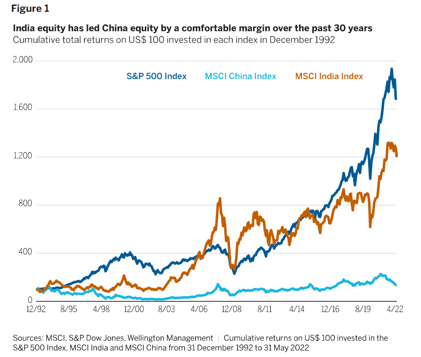

## Table of Contents

## What are the basic requirements for trading stocks in China and India from the United States?

To trade stocks in China from the United States, you need to open an account with a brokerage firm that offers international trading. Some well-known brokerages in the U.S. provide access to Chinese markets, but you should check if they support trading on the Shanghai and Shenzhen stock exchanges. You will also need to complete the necessary paperwork and meet the brokerage's requirements, which may include a minimum account balance. Keep in mind that trading in China involves understanding the local market rules and regulations, as well as any restrictions on foreign investors. It's a good idea to stay informed about economic and political developments in China, as these can impact the stock market.

Trading stocks in India from the United States follows a similar process. You'll need to find a U.S. brokerage that allows trading on Indian stock exchanges like the Bombay Stock Exchange (BSE) and the National Stock Exchange of India (NSE). After opening an account and meeting the brokerage's requirements, you can start trading. It's important to be aware of the different trading hours in India, which can affect when you can buy and sell stocks. Just like with China, understanding the Indian market's rules, regulations, and economic conditions is crucial. Also, be mindful of any taxes or fees that might apply to your trades in India.

## How can a beginner start trading stocks in these countries?

For a beginner looking to trade stocks in China from the United States, the first step is to find a U.S. brokerage firm that offers access to the Chinese stock market. Once you choose a brokerage, you'll need to open an account with them. This usually involves filling out some forms and possibly meeting a minimum balance requirement. After your account is set up, you can start buying and selling stocks on the Shanghai and Shenzhen stock exchanges. It's important to learn about the Chinese market, as it can be different from what you're used to in the U.S. Keep an eye on news and economic reports from China, as they can affect stock prices.

If you want to start trading stocks in India from the United States, the process is similar. You'll need to find a U.S. brokerage that allows trading on Indian stock exchanges like the Bombay Stock Exchange (BSE) and the National Stock Exchange of India (NSE). After opening an account and meeting any requirements, you can begin trading. Remember that India has different trading hours, so you'll need to plan your trades accordingly. It's also a good idea to learn about the Indian market and stay updated on news and economic conditions there. Both China and India have their own rules and regulations for foreign investors, so make sure you understand these before you start trading.

## What are the major stock exchanges in China and India?

In China, there are two main stock exchanges where people can buy and sell stocks. The first one is the Shanghai Stock Exchange, which is the bigger of the two. It's where many big Chinese companies are listed. The second one is the Shenzhen Stock Exchange, which is a bit smaller but still very important. It's known for having more technology and smaller companies listed on it.

In India, there are also two main stock exchanges. The first one is the Bombay Stock Exchange (BSE), which is the oldest stock exchange in Asia. It's where a lot of big Indian companies trade their stocks. The second one is the National Stock Exchange of India (NSE), which is newer but has become very popular. It's known for being more technology-driven and having more trading volume than the BSE.

## What are the key differences between trading stocks in China and India?

Trading stocks in China and India has some big differences. In China, you trade on the Shanghai and Shenzhen stock exchanges. The Shanghai exchange is bigger and has more big companies, while the Shenzhen exchange is known for tech and smaller companies. China has rules about how much foreign investors can buy, so you need to know these rules before you start trading. Also, the Chinese market can be affected a lot by what the government does, so it's important to keep an eye on news from China.

In India, you trade on the Bombay Stock Exchange (BSE) and the National Stock Exchange of India (NSE). The BSE is older and has a lot of big companies, but the NSE is newer and has more trading happening on it. India's trading hours are different from China's, so you need to plan your trades around that. India also has its own rules for foreign investors, and the market can be influenced by things like elections and economic news. Both countries have their own ways of doing things, so it's good to learn about them before you start trading.

## How do time zones affect trading activities between the US, China, and India?

Time zones can make trading stocks between the US, China, and India a bit tricky. The US stock market is open during the day, but when it's daytime in the US, it's nighttime in China and India. This means that if you want to trade stocks in China or India from the US, you'll have to do it at night or early in the morning. For example, the Shanghai and Shenzhen stock exchanges in China are open from 9:30 AM to 3:00 PM local time, which is 9:30 PM to 3:00 AM Eastern Time in the US. So, if you're in the US, you might have to stay up late or wake up early to trade in China.

The same goes for trading in India. The Bombay Stock Exchange (BSE) and the National Stock Exchange of India (NSE) are open from 9:15 AM to 3:30 PM local time, which is 10:45 PM to 5:00 AM Eastern Time in the US. This means you'll need to be awake during the night or very early in the morning to trade stocks in India. Because of these time differences, it's important to plan your trading times carefully and make sure you're getting enough rest, so you can make good decisions when you're trading.

## What are the tax implications for US residents trading stocks in China and India?

When US residents trade stocks in China, they need to think about taxes. In the US, you have to pay capital gains tax on any profit you make from selling stocks. This tax can be different depending on how long you held the stock before selling it. China also has a tax on dividends, which is money companies pay to shareholders. But, there's a treaty between the US and China that can help lower this tax. It's a good idea to talk to a tax advisor to understand exactly how much you'll need to pay and how to report it on your US taxes.

Trading stocks in India from the US also involves taxes. Just like with China, you'll need to pay capital gains tax in the US on any profits. India has its own tax on capital gains and dividends too. There's a treaty between the US and India that can help reduce the tax on dividends, but you still need to report everything on your US tax return. Because tax rules can be complicated, it's smart to get advice from a tax professional to make sure you're doing everything right and not paying more than you need to.

## What are the regulatory considerations and compliance requirements for trading in these markets?

Trading stocks in China from the US involves understanding the rules set by the China Securities Regulatory Commission (CSRC). They have rules about how much foreign investors can buy, and you need to follow these rules. There's also something called the Qualified Foreign Institutional Investor (QFII) program, which lets foreign investors buy more stocks in China, but you need to get approval for this. It's important to know these rules because if you don't follow them, you could get in trouble. Also, the US has its own rules through the Securities and Exchange Commission (SEC), so you need to make sure you're following both sets of rules when you trade in China.

Trading stocks in India from the US also has its own set of rules. The Securities and Exchange Board of India (SEBI) is in charge of making sure the stock market in India works fairly. They have rules about how foreign investors can trade, and you need to follow these rules too. There's a program called the Foreign Portfolio Investor (FPI) that lets foreign investors buy stocks in India, but you need to register for this. Just like with China, you also need to follow the SEC rules in the US. It's a good idea to learn about these rules and maybe talk to a professional to make sure you're doing everything right when you trade in India.

## How can one use technology and trading platforms to facilitate trading in China and India from the US?

To trade stocks in China and India from the US, you can use special trading platforms and technology that make it easier. Many US brokerages have online platforms where you can buy and sell stocks in these countries. These platforms let you see real-time prices, make trades, and keep track of your investments all from your computer or phone. Some platforms even have tools like charts and news feeds that help you make better trading decisions. It's important to choose a brokerage that has a good platform and supports trading in China and India.

Using technology also means you can set up alerts and automatic trades. For example, you can set an alert to tell you when a stock reaches a certain price, so you don't have to watch the market all the time. Some platforms let you set up automatic trades, which means the platform will buy or sell stocks for you based on rules you set. This can be really helpful if you're trading at night because of the time difference. Just make sure you understand how to use these tools and that they fit with the rules in China and India.

## What are the common strategies used by experienced traders in these markets?

Experienced traders in China often use a strategy called "momentum trading." This means they look for stocks that are going up quickly and try to buy them before they go up even more. They also pay close attention to news and government policies because these can make the stock market move a lot. Another common strategy is "value investing," where traders look for stocks that they think are priced too low and hold onto them until the price goes up. Because the Chinese market can be unpredictable, many traders also use "stop-loss orders" to limit their losses if a stock starts to fall.

In India, experienced traders often use "technical analysis" to make trading decisions. This means they look at charts and patterns to guess where the stock price might go next. They also use "fundamental analysis," which means they study a company's financial health to decide if it's a good investment. Many traders in India use "swing trading," where they hold stocks for a few days or weeks to take advantage of short-term price movements. Just like in China, traders in India also use "stop-loss orders" to protect their money if the market turns against them.

## How do geopolitical factors influence stock trading in China and India?

Geopolitical factors can have a big impact on stock trading in China. For example, if there's tension between China and another country, like the US, it can make investors worried. They might sell their stocks because they're afraid the tension could hurt the Chinese economy. Also, the Chinese government can make new rules or change old ones, which can make the stock market go up or down. Traders need to keep an eye on the news and understand how these things might affect the stocks they're trading.

In India, geopolitical factors also play a big role in the stock market. Elections can make the market move a lot because people might think a new government will change the economy. Also, if there's tension with a neighboring country like Pakistan, it can make investors nervous and cause them to sell their stocks. Traders in India need to stay updated on what's happening in the country and around the world because these things can change how the stock market behaves.

## What are the advanced tools and analytics available for expert traders focusing on these markets?

Expert traders focusing on the Chinese market can use advanced tools like Bloomberg Terminal, which gives them real-time data, news, and analytics. This tool helps them see how stocks are doing and what's happening in the economy. They can also use software like MetaTrader 4 or 5, which lets them make automatic trades based on rules they set. These platforms have charts and indicators that help traders see patterns and make better decisions. Another useful tool is the China Stock Market & Finance database, which gives detailed information about companies and the market.

For traders interested in the Indian market, tools like the NSE's NEAT (National Exchange for Automated Trading) system are very helpful. This system gives traders real-time data and lets them make trades quickly. They can also use platforms like Zerodha's Kite, which has advanced charts and analytics to help them understand the market better. Another important tool is the CMIE Prowess database, which provides detailed financial data on Indian companies. These tools help expert traders make smart decisions and stay ahead in the fast-moving Indian stock market.

## How can one mitigate risks associated with trading stocks in China and India from the US?

To reduce the risks of trading stocks in China from the US, it's important to understand the market and keep up with news about China. The Chinese market can be affected a lot by what the government does, so staying informed about new rules or policies can help you make better decisions. Using stop-loss orders can also help protect your money if a stock starts to fall. Diversifying your investments, which means not putting all your money into one stock or one type of investment, can also lower your risk. It's a good idea to talk to a financial advisor who knows about the Chinese market to get more tips on how to trade safely.

Trading stocks in India from the US also comes with risks, but there are ways to manage them. Like with China, staying updated on news and economic reports from India can help you understand what might affect the stock market. Using tools like stop-loss orders can limit your losses if a stock price drops suddenly. It's also smart to spread your investments across different stocks and sectors to reduce risk. Since India's trading hours are different from the US, planning your trades carefully and maybe using automatic trading tools can help you manage the time difference better. Talking to a financial advisor who knows about the Indian market can give you more ideas on how to trade safely.

## References & Further Reading

[1]: ["Advances in Financial Machine Learning"](https://www.amazon.com/Advances-Financial-Machine-Learning-Marcos/dp/1119482089) by Marcos Lopez de Prado

[2]: ["Machine Learning for Algorithmic Trading"](https://www.amazon.com/Machine-Learning-Algorithmic-Trading-alternative/dp/1839217715) by Stefan Jansen

[3]: ["Quantitative Trading: How to Build Your Own Algorithmic Trading Business"](https://github.com/LucindaYa/quant-resources/blob/master/Quantitative%20Trading%20How%20to%20Build%20Your%20Own%20Algorithmic%20Trading%20Business.pdf) by Ernest P. Chan

[4]: ["The Intelligent Investor: The Definitive Book on Value Investing"](https://www.amazon.com/Intelligent-Investor-3rd-Ed/dp/0063356724) by Benjamin Graham

[5]: Sengupta, J. K. (2011). "[India's Financial Markets: An Insider's Guide to How the Markets Work](https://searchworks.stanford.edu/view/13662242)." Springer.