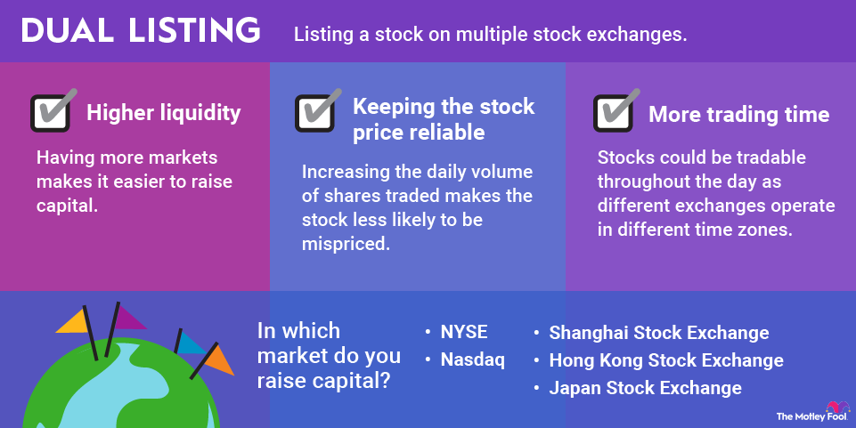

## Table of Contents

## What are stock exchanges and why are they important for trading?

Stock exchanges are places where people buy and sell shares of companies. These shares represent a small piece of ownership in a company. When you buy a share, you become a part-owner of that company. Stock exchanges make it easy for people to trade these shares with each other. Some famous stock exchanges are the New York Stock Exchange and the NASDAQ.

Stock exchanges are important for trading because they help companies raise money. When a company wants to grow, it can sell shares to the public through a stock exchange. People buy these shares, giving the company money to use for new projects or expansion. Also, stock exchanges help people invest their money. By buying and selling shares, people can try to make more money. This makes the economy more active and helps it grow.

## How can a beginner start trading stocks on multiple exchanges?

To start trading stocks on multiple exchanges, a beginner first needs to open a brokerage account. A brokerage account is like a special bank account that lets you buy and sell stocks. You can choose a broker that allows you to trade on different exchanges, like the New York Stock Exchange, NASDAQ, and others. Once you have your account set up, you'll need to deposit some money into it. This money will be used to buy stocks.

After setting up your account and adding money, you can start trading. You'll need to do some research to decide which stocks you want to buy. You can use the tools and resources provided by your broker to learn about different companies and their stocks. When you're ready, you can place an order to buy stocks on the exchanges you're interested in. Remember, trading stocks can be risky, so it's important to start small and learn as you go.

## What are the key differences between major stock exchanges like NYSE, NASDAQ, and LSE?

The New York Stock Exchange (NYSE), NASDAQ, and the London Stock Exchange (LSE) are three major stock exchanges, but they have some key differences. The NYSE is the oldest and largest stock exchange in the world, known for its physical trading floor where traders buy and sell stocks in person. It's often seen as more traditional and is home to many big, established companies. On the other hand, NASDAQ is fully electronic, meaning all trading happens through computers. It's known for being more modern and is popular with technology and internet companies. The LSE, based in London, is one of the oldest stock exchanges and is known for its international focus, with many companies from around the world listed there.

Another difference is in the types of companies listed on each exchange. The NYSE tends to have more large, well-known companies, often called "blue-chip" stocks. NASDAQ, however, is famous for having many tech companies, like Apple and Microsoft. The LSE has a mix of companies, but it's especially known for its strong presence of financial and mining companies. Each exchange also has its own set of rules and listing requirements, which can affect which companies choose to list there.

## What are the advantages of trading stocks on multiple exchanges?

Trading stocks on multiple exchanges can give you more choices. When you trade on different exchanges, you can buy and sell stocks from all over the world. This means you can find more companies to invest in, not just the ones listed on one exchange. For example, you might find a good company on the New York Stock Exchange, but another great one on the London Stock Exchange. By trading on multiple exchanges, you can spread your investments and maybe find better deals.

Another advantage is that you can take advantage of different market times. Stock exchanges in different countries open and close at different times. If you trade on multiple exchanges, you can keep trading even when one market is closed. This can help you react quickly to news or changes in the market. Plus, it can help you manage risk better. If one market is doing badly, you might still make money in another market. This way, you can keep your investments more balanced and possibly make more money.

## What are the potential risks and challenges of trading on multiple exchanges?

Trading on multiple exchanges can be tricky because it's more complicated than trading on just one. You have to keep track of different time zones and market hours. For example, if you're trading on the New York Stock Exchange and the Tokyo Stock Exchange, you need to know when each one is open and closed. This can be hard to manage, especially if you have a regular job or other responsibilities. Also, each exchange has its own rules and fees, so you need to learn about all of them. This can be confusing and might lead to mistakes if you're not careful.

Another risk is that trading on multiple exchanges can be more expensive. You might have to pay more fees because you're using different brokers or platforms for each exchange. These extra costs can add up and eat into your profits. Plus, there's more risk because you're spreading your money across different markets. If one market crashes or has a big drop, it could affect your whole investment plan. So, while trading on multiple exchanges can give you more options, it also means you need to be more careful and do more research to manage the risks.

## How do time zones affect trading on global stock exchanges?

Time zones can make trading on global stock exchanges tricky. Each stock exchange has its own opening and closing times, which are based on the local time where the exchange is located. For example, the New York Stock Exchange opens at 9:30 AM Eastern Time, while the Tokyo Stock Exchange opens at 9:00 AM Japan Standard Time. This means that if you want to trade on both exchanges, you need to be awake and ready to trade at different times of the day or night. It can be hard to keep track of all these different times, especially if you have a regular job or other things to do during the day.

Another way time zones affect trading is by creating gaps in trading hours. When one exchange is closed, another might be open, which can be good because it lets you keep trading even when your main market is closed. But it can also be bad because big news or events that happen when your market is closed can cause the price of stocks to change a lot when it opens again. This is called a "gap," and it can be risky if you're not ready for it. So, trading across different time zones means you need to be more careful and plan your trades carefully to handle these gaps and changes in the market.

## What are the regulatory considerations when trading on multiple exchanges?

When you trade on multiple exchanges, you need to know about the rules in different countries. Each country has its own laws about trading stocks. For example, the rules in the United States might be different from the rules in Japan or the United Kingdom. You have to follow all these rules, which can be hard because they might not be the same. Some countries might have strict rules about who can trade and how much money you need to start. Others might have different rules about what you have to report and how you can buy and sell stocks.

Another thing to think about is that different exchanges have their own rules too. For example, the New York Stock Exchange and the NASDAQ have different listing requirements and trading rules. You need to understand these rules for each exchange you trade on. This can be a lot of work, but it's important to make sure you're doing everything right. If you don't follow the rules, you could get in trouble or lose money. So, it's a good idea to learn about the regulations in each place and maybe even talk to a lawyer or a financial advisor to help you understand them better.

## How can technology and trading platforms facilitate trading across multiple exchanges?

Technology and trading platforms make it easier to trade on different stock exchanges around the world. These platforms let you see and trade stocks from many exchanges all in one place. You don't have to go to different websites or use different apps for each exchange. Instead, you can use one platform to buy and sell stocks from the New York Stock Exchange, the NASDAQ, the London Stock Exchange, and others. This saves time and makes it simpler to manage your investments.

These platforms also give you tools to help you trade better. They can show you real-time prices, charts, and news from different markets. This helps you make smart choices about when to buy and sell stocks. Some platforms even let you set up automatic trades, so you can buy or sell stocks at certain times or prices without having to watch the market all the time. This can be really helpful if you're trading on exchanges that are open at different times because of time zones.

## What strategies should be employed to manage a diversified portfolio across different exchanges?

To manage a diversified portfolio across different exchanges, you need to spread your investments across various markets and types of stocks. This means buying stocks from different countries and industries. For example, you might invest in tech companies on the NASDAQ, big companies on the New York Stock Exchange, and mining companies on the London Stock Exchange. By doing this, you reduce the risk of losing all your money if one market or industry does badly. It's like not putting all your eggs in one basket. You also need to keep an eye on how each part of your portfolio is doing and make changes if needed. If one stock or market is doing really well, you might want to sell some of it and buy more of something else to keep your investments balanced.

Another important strategy is to use technology to help you manage your portfolio. Trading platforms can show you all your investments in one place, even if they're on different exchanges. These platforms can give you real-time information about your stocks, so you can make quick decisions. You can also set up alerts to tell you when a stock reaches a certain price or when there's big news about a company. This helps you stay on top of your investments without having to watch the markets all the time. Remember, managing a diversified portfolio takes time and effort, but it can help you make more money and reduce your risk.

## How do currency fluctuations impact trading on international exchanges?

When you trade on international exchanges, you have to deal with different currencies. If you buy stocks in another country, you need to change your money into that country's currency. The value of currencies can go up and down, and this can affect how much money you make or lose. For example, if you buy stocks in Japan with US dollars, and the Japanese yen gets stronger compared to the US dollar, your stocks will be worth more when you change them back to dollars. But if the yen gets weaker, you'll get less money back.

This can make trading more complicated because you have to think about both the stock prices and the currency rates. If a stock goes up, but the currency it's in goes down a lot, you might still lose money when you change it back to your own currency. To manage this, some people use special financial tools called currency hedges. These can help protect your money from big changes in currency rates, but they can also be complicated and might cost extra money. So, it's important to understand how currency fluctuations work and plan your trades carefully.

## What advanced trading techniques can be used to take advantage of arbitrage opportunities across exchanges?

Arbitrage is when you buy something in one place and sell it in another place for a higher price. When trading stocks on different exchanges, you can use [arbitrage](/wiki/arbitrage) to make money if the same stock is priced differently on different exchanges. For example, if a stock is cheaper on the New York Stock Exchange than on the London Stock Exchange, you can buy it in New York and sell it in London at the same time. This way, you make money from the difference in price. To do this, you need to be fast because the price difference might not last long. You also need to think about the costs of buying and selling, like fees and taxes, to make sure you still make a profit.

One advanced technique for arbitrage is called triangular arbitrage. This is when you use three different currencies to make money from small differences in exchange rates. For example, you might change US dollars to euros, then euros to British pounds, and then British pounds back to US dollars. If the exchange rates are just right, you can end up with more US dollars than you started with. This can be tricky because you need to do all these trades very quickly and the differences in rates are usually very small. But if you can do it right, it can be a good way to make money from trading on different exchanges.

## How can one analyze and compare the performance of stocks across different exchanges?

To analyze and compare the performance of stocks across different exchanges, you need to look at some key numbers. One important number is the stock's price. You can see how the price has changed over time on different exchanges. Another number to look at is the stock's return, which shows how much money you would have made or lost if you bought the stock. You can compare the returns of the same stock on different exchanges to see where it did better. Also, you can look at the stock's [volatility](/wiki/volatility-trading-strategies), which tells you how much the price goes up and down. If a stock is more volatile on one exchange, it might be riskier to trade there.

Another way to compare stocks across exchanges is by using financial ratios. These are numbers that help you understand how well a company is doing. For example, the price-to-earnings (P/E) ratio shows how much you're paying for a company's earnings. You can compare the P/E ratios of the same stock on different exchanges to see if it's a better deal in one place. Other useful ratios include the dividend yield, which shows how much money the company pays out to shareholders, and the price-to-book (P/B) ratio, which compares the stock's price to the company's net assets. By looking at these ratios, you can get a better idea of which exchange might be a better place to buy the stock.

## References & Further Reading

[1]: Lo, A. W. (2012). ["The origin of bubbles and crashes: Models of manias, panics, and crashes."](https://books.google.com/books/about/Manias_Panics_and_Crashes.html?id=SBmyEAAAQBAJ) Princeton University Press.

[2]: Harris, L. (2002). ["Trading and Exchanges: Market Microstructure for Practitioners"](https://www.acsu.buffalo.edu/~keechung/MGF743/Readings/Trading-Exchanges-Market-Microstructure-Practitioners%20Draft%20Copy.pdf). Oxford University Press.

[3]: Aldridge, I. (2013). ["High-Frequency Trading: A Practical Guide to Algorithmic Strategies and Trading Systems"](https://www.wiley.com/en-us/High+Frequency+Trading%3A+A+Practical+Guide+to+Algorithmic+Strategies+and+Trading+Systems%2C+2nd+Edition-p-9781118343500). Wiley Finance.

[4]: Hull, J. C. (2021). ["Options, Futures, and Other Derivatives"](https://books.google.com/books/about/Options_Futures_and_Other_Derivatives_Gl.html?id=sdg2EAAAQBAJ). Pearson.

[5]: Gomber, P., Arndt, B., Lutat, M., & Uhle, T. (2011). ["Highly Fragmented Markets: Evidence from the European Stock Market"](https://papers.ssrn.com/sol3/papers.cfm?abstract_id=1858626). Social Science Research Network.