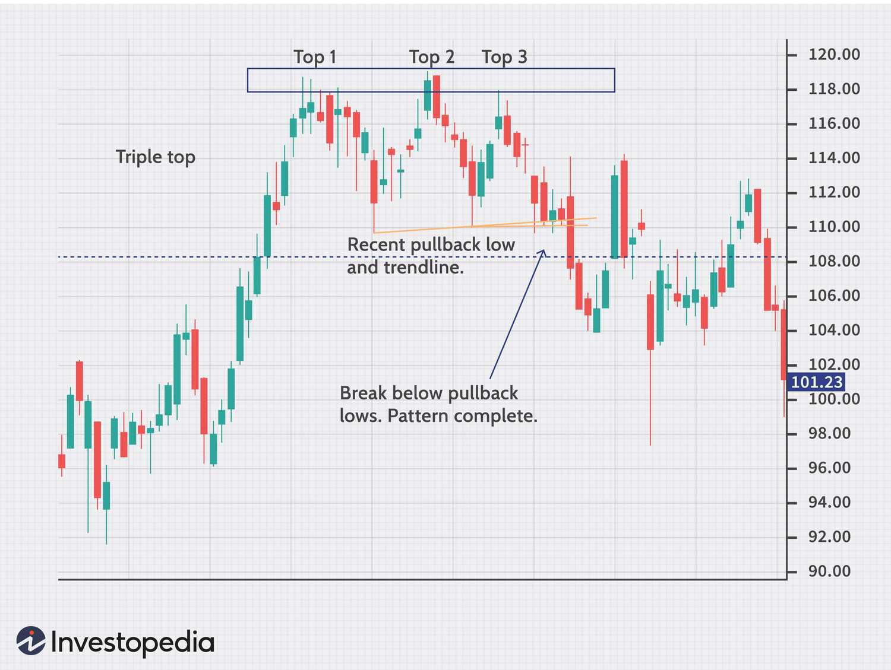

Stock trading, at its core, involves the buying and selling of company shares with the aim of generating profits. Traditionally, traders would buy stocks in person through stock exchanges, engaging in transactions that were labor-intensive and often time-consuming. The evolution of technology, however, has significantly transformed this landscape. The advent of internet-based platforms, high-frequency trading, and advanced analytical tools has facilitated faster and more efficient trades. One noteworthy development is the emergence of algorithmic trading—automated trading strategies that execute pre-set orders at high speed and volume. 

Dual-listed stocks represent an intriguing facet of modern trading. These are shares of a company that are listed on more than one stock exchange. This multi-exchange presence allows companies to increase their visibility, attract a wider investor base, and improve liquidity. For traders, dual-listed stocks offer diverse arbitrage opportunities—the chance to profit from price discrepancies between different markets. Due to differences in time zones, market sentiment, and currency exchange rates, prices of dual-listed stocks can vary between exchanges, creating potential profit channels.



Algorithmic trading plays a vital role in exploiting these opportunities. Armed with sophisticated algorithms, traders can quickly identify and capitalize on price differences across markets. This approach enhances market efficiency and provides liquidity, benefiting both traders and the exchanges. The growing interest in arbitrage opportunities through dual-listed stocks underscores the importance of these technological advancements in contemporary stock trading.

This article will explore the concept of dual-listed stocks, examining their significance and operational dynamics. It will further discuss how algorithmic trading enhances the trading of these stocks and highlight the challenges that arise in trading across multiple exchanges. Finally, potential future trends and developments in this area will be addressed. Through this, the piece aims to provide a comprehensive understanding of the opportunities and intricacies associated with dual-listed stocks and algorithmic trading.

## Table of Contents

## Understanding Dual-Listed Stocks

Dual-listed stocks refer to shares of a company that are simultaneously listed on two different stock exchanges. This strategic choice enables a corporation to access a broader investor base and enhance its liquidity. By operating on multiple exchanges, dual-listed stocks provide both the issuing company and investors with numerous advantages, albeit with certain challenges.

### Definition and Operation

Dual-listed stocks function by maintaining listings on two separate exchanges in different geographic locations. This setup requires compliance with the regulatory frameworks of both jurisdictions. A pivotal aspect of dual-listing is the mechanism that allows shares to be traded in local currencies and time zones, thereby catering to diverse market participants. 

### Reasons for Dual Listing

**1. Access to Capital:**
   Listing on multiple exchanges allows a company to tap into a larger pool of capital, attracting investors who might otherwise be restricted from investing in foreign markets. For example, European firms listing on North American exchanges gain exposure to North American institutional and retail investors, thus broadening their capital sources.

**2. Enhanced Liquidity and Shareholder Base:**
   Dual listing increases the [liquidity](/wiki/liquidity-risk-premium) of a company's stock by providing more trading venues. With shares available in multiple markets, trading volumes typically rise, which can lead to narrower bid-ask spreads and improved stock price stability.

**3. Market Visibility and Prestige:**
   Companies gain elevated global visibility and prestige through dual listings. Being listed on renowned exchanges like the New York Stock Exchange (NYSE) or the London Stock Exchange (LSE) can boost a company's international profile and credibility.

**4. Risk Diversification:**
   By accessing diverse financial landscapes, companies can partially hedge against economic or political [volatility](/wiki/volatility-trading-strategies) specific to one country. This diversification mitigates the risk associated with being tied to a single economic environment.

### Benefits and Risks for Investors

Investors trading in dual-listed stocks can enjoy benefits such as:

- **Arbitrage Opportunities:** Price discrepancies between exchanges allow arbitrageurs to capitalize on short-term inefficiencies, although the opportunities diminish quickly due to rapid information dissemination and trading activity.

- **Diverse Investment Options:** By engaging with dual-listed stocks, investors gain exposure to foreign markets and industries, potentially enhancing their portfolio diversity.

However, there are risks involved:

- **Complex Regulations:** Navigating through the regulatory requirements of multiple jurisdictions can be complex, increasing the legal and compliance burden on investors.

- **Currency Fluctuations:** Dual-listing entails trading in different currencies, posing potential risks from exchange rate volatility which can affect returns when converting profits back to an investor's base currency.

- **Market Sychronicity:** A lack of market synchronization can lead to volatility, where news or events in one region impact stock prices in another, causing misalignment in expected versus actual stock performance.

### Examples of Popular Dual-Listed Stocks

Several notable companies trend towards dual-listing to leverage the above benefits:

- **Unilever NV/PLC:** One of the oldest dual-listed companies, Unilever maintains listings on Euronext Amsterdam and the LSE. This structure enables Unilever to effectively manage its extensive global operations.

- **Rio Tinto Group:** A prominent Anglo-Australian multinational, dual-listed in the LSE and Australian Securities Exchange (ASX), allows Rio Tinto to harness capital from both European and Asia-Pacific markets.

- **Royal Dutch Shell:** Maintains dual listings on Euronext Amsterdam and the LSE, appealing to investors across Europe by trading in both euros and pounds sterling.

Dual-listed stocks offer significant opportunities and challenges for both companies and investors. While they provide enhanced liquidity, capital access, and market prestige, they also present complexities rooted in regulatory compliance and market volatility. Understanding these dynamics is crucial for participants engaging with dual-listed securities.

## Multiple Exchanges and Their Dynamics

Stocks can be dual-listed on various exchanges around the world, each presenting unique opportunities and challenges for traders. These exchanges differ significantly in terms of trading hours, regulations, and market influences, which collectively impact the dynamics of dual-listed stocks.

### Overview of Exchanges

1. **New York Stock Exchange (NYSE) and NASDAQ**:
   These two major U.S. exchanges facilitate the trading of many dual-listed stocks. Their large market capitalizations and diverse listings make them attractive options for companies seeking dual listings. NYSE operates from 9:30 AM to 4:00 PM Eastern Time (ET), while NASDAQ follows similar hours.

2. **London Stock Exchange (LSE)**:
   The LSE is another popular venue for dual listing, particularly due to London's strategic position as a global financial hub. It operates from 8:00 AM to 4:30 PM GMT, allowing overlap with both Asian and American markets.

3. **Hong Kong Stock Exchange (HKEX)**:
   This exchange serves as a gateway for Western companies to access Chinese investors and vice versa. Its operating hours are from 9:30 AM to 4:00 PM HKT.

4. **Toronto Stock Exchange (TSX)**:
   Canada's largest exchange operates from 9:30 AM to 4:00 PM ET, sharing time zone similarities with the eastern United States.

### Differences Across Exchanges

- **Trading Hours**: A significant challenge arises from different time zones, leading to non-overlapping trading hours. This can limit a trader's ability to react simultaneously on multiple exchanges.

- **Regulatory Frameworks**: Exchanges have varying regulations concerning listing requirements, financial disclosures, and trading practices. For instance, the U.S. markets have strict reporting standards enforced by the Securities and Exchange Commission (SEC), while other exchanges might have differing requirements.

- **Market Influences**: Each exchange is influenced by its local economic conditions, political stability, and investor behavior, which can lead to discrepancies in the pricing of dual-listed stocks. Exchange rates and geopolitical factors also play pivotal roles in this variance.

### Challenges in Trading Dual-Listed Stocks

1. **Arbitrage Limitations**: The differences in trading hours mean that arbitrage opportunities need to be executed rapidly, often within narrow time windows, necessitating advanced algorithms and strategies.

2. **Currency Risk**: Dual-listing involves currency fluctuations that can affect the stock prices on different exchanges. Traders must hedge against such risks to maintain profitability.

3. **Data Integration**: Gathering and verifying real-time data from different exchanges can be technologically and logistically demanding. Discrepancies in data formats and reporting lags can hinder effective decision-making.

4. **Latency Issues**: Navigating latency in executing trades across different global locations can impact the effectiveness of algorithmic trading strategies. Traders often need to colocate their systems to minimize latency.

5. **Compliance and Regulatory Challenges**: Keeping abreast of and complying with the regulations of multiple jurisdictions presents an ongoing challenge, requiring significant resource investments in compliance and legal advisory services.

In conclusion, while trading dual-listed stocks on multiple exchanges offers opportunities such as access to broader capital pools and enhanced liquidity, the inherent challenges demand sophisticated strategies and technological solutions. Balancing these dynamics is crucial for traders looking to profit from these markets.

 to Algorithmic Trading

Algorithmic trading is the use of computer programs to execute trades at high speeds and volumes, dictated by complex algorithms. These algorithms process information from various sources, enabling traders to swiftly evaluate market conditions and execute trades more efficiently than traditional human-led methods. This technology significantly influences modern stock markets, providing a competitive edge by minimizing the time gap between the identification of trading opportunities and their execution.

There are several distinct types of algorithms utilized in trading:

1. **Arbitrage Algorithms**: These are designed to exploit price differentials of the same asset in different markets or forms. For dual-listed stocks, arbitrage algorithms can identify and act on inconsistencies in pricing between exchanges. An arbitrage opportunity arises when a stock is listed at different prices on two exchanges, allowing traders to buy at the lower price and sell at the higher price.

2. **Market Making Algorithms**: These are used by traders to provide liquidity by continuously quoting buy and sell prices. The strategy aims to capture the spread between the buy and sell prices, thus profiting from the bid-ask spread. In the context of dual-listed stocks, market-making algorithms can help stabilize the price across exchanges and capture small spreads arising from temporary imbalance of supply and demand.

3. **Trend-Following Algorithms**: These algorithms analyze market trends to make purchasing decisions. They leverage historical data to predict asset movements, focusing on consistent trends rather than minor price fluctuations. For dual-listed stocks, trend-following algorithms can adapt to patterns in trading volumes and price movements across different exchanges, capitalizing on established price trends.

Algorithmic trading presents distinct advantages in the context of dual-listed stocks. One key advantage is the ability to swiftly identify and exploit [arbitrage](/wiki/arbitrage) opportunities across exchanges. Given the continuous nature of such trading, algorithms can monitor multiple markets simultaneously, executing trades more efficiently than human traders. Additionally, algorithms enhance liquidity and price stability by implementing market-making strategies, thereby reducing volatility.

Furthermore, [algorithmic trading](/wiki/algorithmic-trading) minimizes human error and reduces emotional biases in trading decisions, which is crucial when navigating the complexities of multiple exchanges. The precision and speed of these programs ensure cost-effective trading, lowering the transaction costs associated with delayed or manual trades.

In summary, algorithmic trading is indispensable in managing dual-listed stocks, optimizing both execution speed and cost-effectiveness. By harnessing the advantages of these algorithms, traders can more effectively capitalize on opportunities across various exchanges while maintaining a competitive stance in the stock market.

## Algorithmic Trading and Dual-Listed Stocks

Algorithmic trading has increasingly become a staple in financial markets, including the realm of dual-listed stocks. Dual-listed stocks, by their nature, present arbitrage opportunities that algorithms are adept at identifying. Arbitrage, the simultaneous buying and selling of the same asset in different markets to profit from unequal prices, becomes feasible when a stock is available on multiple exchanges with price discrepancies due to market inefficiencies or time lags. 

To exploit arbitrage opportunities, an algorithmic trading system monitors prices of dual-listed stocks across various exchanges. When a price disparity is detected, the algorithm executes buy and sell orders simultaneously to capitalize on this difference. For example, if Stock X is dual-listed on the New York Stock Exchange (NYSE) and the London Stock Exchange (LSE) and is trading at $100 on NYSE but $102 on LSE, an algorithm can automatically purchase the stock on NYSE and sell it on LSE, securing a profit before transaction costs and fees.

Algo trading plays a crucial role in enhancing liquidity and efficiency across exchanges. By executing trades based on real-time data, algorithms help tighten bid-ask spreads and fill liquidity gaps that may exist due to asynchronous market operations. This continuous adjustment contributes to market stability and efficiency, allowing for more accurate reflections of a stock's intrinsic value.

An example of algorithmic strategies optimizing trading costs and profits lies in the implementation of smart order routing (SOR). SOR algorithms intelligently navigate multiple exchanges to fulfill orders in a manner that minimizes costs and maximizes execution quality. Consider a Python-based SOR algorithm:

```python
import requests
from datetime import datetime

def fetch_market_data(ticker):
    # Placeholder function for fetching market data for different exchanges
    data = requests.get(f'https://api.example.com/market_data/{ticker}')
    return data.json()

def check_arbitrage_opportunity(market_data):
    # Simple arbitrage detection logic
    prices = [exchange['price'] for exchange in market_data]
    return max(prices) - min(prices)

ticker = "DUAL-LISTED STOCK"
market_data = fetch_market_data(ticker)
price_difference = check_arbitrage_opportunity(market_data)

if price_difference > threshold:
    execute_trade(market_data)
```

This simple logic loop can be enhanced with complex [machine learning](/wiki/machine-learning) models to predict market movements and optimize timing for order execution. 

In summary, algorithmic trading systems optimize trading costs by reducing human latency and managing large volumes of trades at speeds unattainable by manual processes. Such efficiency gains are paramount in the context of dual-listed stocks, where quick manipulation of price changes across disparate markets can yield significant financial advantages. As technology progresses, the enhancement of algorithms will further refine the exploitation of arbitrage opportunities, ensuring that traders maintain a competitive edge.

## Challenges in Algo Trading Across Multiple Exchanges

Algorithmic trading across multiple exchanges presents several technological and logistical challenges, particularly when dealing with dual-listed stocks. One primary challenge is latency, the time delay in the transmission of data between different locations. Traders aim to execute trades in milliseconds; however, geographical distances between exchanges can cause significant delays. For instance, a dual-listed stock in New York and Tokyo involves a considerable time lag due to the physical distance and data transmission speed limits. To mitigate latency, traders use co-location services, which involve placing trading systems physically close to exchange servers, reducing the time it takes for data to travel.

Data integration is another significant challenge. Dual-listed stocks require real-time data synchronization across exchanges. Any discrepancy in data, such as price, [volume](/wiki/volume-trading-strategy), or currency exchange rates, can lead to erroneous trading decisions. Advanced data management systems are essential to ensure accurate and timely information. These systems often involve sophisticated data parsing and integration algorithms to harmonize data from various sources.

Moreover, the advanced technology needed to synchronize information across exchanges includes complex network infrastructure and high-frequency trading ([HFT](/wiki/high-frequency-trading-strategies)) systems. HFT relies on algorithms capable of making split-second trading decisions based on rapidly changing data inputs. These systems must be robust enough to handle different data formats, protocols, and time zones seamlessly.

Regulatory challenges add an additional layer of complexity. International exchanges operate under diverse regulatory frameworks, which can affect how trades are executed. For example, a strategy legal in one jurisdiction may violate trading regulations in another. This necessitates a comprehensive understanding of the regulatory environments across all exchanges involved. Compliance with regulations involves ensuring that trading algorithms adhere to the rules on market manipulation, insider trading, and reporting requirements. 

Here is a simple example of how a Python code snippet might look to handle some of these challenges, focusing on data synchronization:

```python
import requests

def fetch_data(exchange_url):
    response = requests.get(exchange_url)
    return response.json()

def synchronize_data(exchanges):
    data = {}
    for exchange in exchanges:
        data[exchange] = fetch_data(exchange)
    # Implement a data harmonization algorithm here
    harmonized_data = harmonize(data)
    return harmonized_data

def harmonize(data):
    # Placeholder for data harmonization logic
    # This may involve complex transformations and latency adjustments
    return data

# Example usage:
exchanges = ['https://api.exchange1.com/stocks', 'https://api.exchange2.com/stocks']
synced_data = synchronize_data(exchanges)
```

Finally, traders must also adapt to the constraints posed by time zone differences, which affect market opening and closing times. This requires careful timing of trade orders to coincide with market hours on various exchanges, further complicating the execution strategies for dual-listed stocks. Addressing these challenges involves leveraging cutting-edge technology, robust compliance frameworks, and continuous system improvements to maintain a competitive edge in global markets.

## Future Trends and Developments

As the landscape of stock trading continues to evolve, advancements in [artificial intelligence](/wiki/ai-artificial-intelligence) (AI) and machine learning (ML) are poised to significantly influence the trading of dual-listed stocks. These technologies are becoming integral to identifying and capitalizing on price disparities across different exchanges more efficiently. AI-driven analytical tools are increasingly adept at processing large volumes of financial data quickly, making them invaluable in the search for arbitrage opportunities in dual-listed stocks. The use of machine learning algorithms enables traders to predict market trends and price movements by analyzing historical data and recognizing patterns that are not immediately apparent to human analysts.

Emerging technologies, such as quantum computing, blockchain, and advanced data analytics, also hold promise for transforming algorithmic trading strategies. Quantum computing could drastically increase computational power, enabling the analysis of complex datasets that include multiple variables affecting stock prices on various exchanges. Blockchain technology, known for its security and transparency, could streamline transactions and settlement processes, minimizing the risks of discrepancies between exchanges. Furthermore, real-time data analytics powered by AI can help traders make more informed decisions by providing insights derived from diverse sources such as news, social media, and economic indicators.

The evolving landscape of algorithmic trading of dual-listed stocks will likely be influenced by new regulations and market changes. Regulatory bodies may implement stricter guidelines to ensure the fairness and transparency of high-frequency trading practices. These regulations could involve overseeing the use of AI and ML in trading to prevent market manipulation and ensure that all market participants have a level playing field. Additionally, the increasing interconnection of global financial markets might lead to harmonization of trading regulations, easing the process of trading dual-listed stocks across different jurisdictions.

Market changes, including shifts in global economic dynamics and investor behavior, will also shape the trading of dual-listed stocks. As emerging markets grow, there may be increased opportunities for dual listing, providing investors access to broader markets. Changes in geopolitical conditions and trade relationships could affect currency exchange rates, impacting the profitability of arbitrage activities for dual-listed stocks.

In summary, the future of trading dual-listed stocks looks to be heavily influenced by technological advancements and regulatory developments. Traders equipped with cutting-edge AI and ML tools will likely have a competitive advantage in capturing value from these complex, multi-market opportunities. As the market continues to change, it is essential for traders to stay informed and adapt to new technologies and regulations to optimize their trading strategies.

## Conclusion

Dual-listed stocks play a significant role in global financial markets, offering traders and investors a unique opportunity to capitalize on price discrepancies across different exchanges. These stocks, by being available on more than one exchange, provide diversification and liquidity, while also facilitating cross-border investments. The ability to trade on multiple platforms enables market participants to hedge against currency risks and leverage different regulatory environments, thus enhancing their overall trading strategy.

Algorithmic trading has become crucial in managing the complexities associated with dual-listed stocks. By utilizing sophisticated algorithms, traders can efficiently identify and exploit arbitrage opportunities that arise from price differences in these stocks across various exchanges. Algorithms also introduce speed and precision to the trading process, addressing the challenges of varying market conditions and enhancing liquidity. This approach not only optimizes trading costs but also increases the potential for profit, making algorithmic trading an indispensable tool for investors navigating dual-listed stocks.

Given the fast-paced nature of today's financial markets, it is imperative for traders to embrace technology and integrate advanced tools into their strategies. Algorithmic trading offers a competitive edge by processing vast amounts of data and executing trades at a speed and scale beyond human capability. By leveraging these technological advancements, traders can better manage risks and enhance their ability to respond to market fluctuations.

In conclusion, dual-listed stocks offer lucrative opportunities, and the adoption of algorithmic trading presents a pathway to maximize these opportunities effectively. As financial markets continue to evolve, a proactive approach to learning and adapting to new technologies and regulatory environments is essential. Traders are encouraged to continuously update their knowledge and refine their strategies, ensuring they remain at the forefront of market developments and fully capitalize on the potential of dual-listed stocks.

## References & Further Reading

[1]: Lo, A. W. (2012). ["The origin of bubbles and crashes: Models of manias, panics, and crashes."](https://books.google.com/books/about/Manias_Panics_and_Crashes.html?id=SBmyEAAAQBAJ) Princeton University Press.

[2]: Harris, L. (2002). ["Trading and Exchanges: Market Microstructure for Practitioners"](https://www.acsu.buffalo.edu/~keechung/MGF743/Readings/Trading-Exchanges-Market-Microstructure-Practitioners%20Draft%20Copy.pdf). Oxford University Press.

[3]: Aldridge, I. (2013). ["High-Frequency Trading: A Practical Guide to Algorithmic Strategies and Trading Systems"](https://www.wiley.com/en-us/High+Frequency+Trading%3A+A+Practical+Guide+to+Algorithmic+Strategies+and+Trading+Systems%2C+2nd+Edition-p-9781118343500). Wiley Finance.

[4]: Hull, J. C. (2021). ["Options, Futures, and Other Derivatives"](https://books.google.com/books/about/Options_Futures_and_Other_Derivatives_Gl.html?id=sdg2EAAAQBAJ). Pearson.

[5]: Gomber, P., Arndt, B., Lutat, M., & Uhle, T. (2011). ["Highly Fragmented Markets: Evidence from the European Stock Market"](https://papers.ssrn.com/sol3/papers.cfm?abstract_id=1858626). Social Science Research Network.