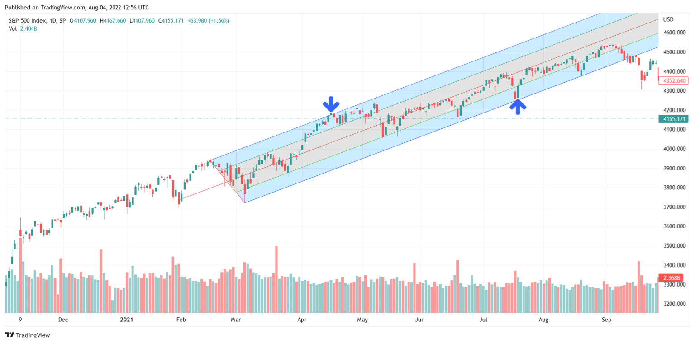

Technical analysis is a pivotal discipline in trading, leveraging historical price and volume data to forecast future market trends. Its significance lies in providing traders with actionable insights to inform their buying and selling decisions. Among the diverse array of tools available for technical analysis, Andrews' Pitchfork is notable for its straightforward application and robust predictive capacity in identifying potential market movements.

Andrews' Pitchfork, conceptualized by Dr. Alan Andrews, is a method that combines simplicity with potent analytical power. It comprises three parallel trendlines that help delineate potential support and resistance levels through which traders can determine optimal entry and exit points. Its strength lies in its ability to chart possible market trajectories based on historical price patterns, thus enabling traders to anticipate likely future trends.



This article will explore the practical application of Andrews' Pitchfork in trading. It is particularly effective in algorithmic trading strategies, where precision and automation play critical roles. By understanding its structure and how to draw it, traders can harness it to optimize their trades. Algorithms can incorporate Andrews' Pitchfork to streamline decision-making, analyzing extensive datasets to spot possible breakouts or confirm market trends with greater accuracy.

Importantly, integrating Andrews' Pitchfork into algorithmic trading systems can usher in a more efficient, automated approach to trading. When correctly applied, it can enhance the performance of algorithmic strategies significantly, providing traders with a robust framework for making informed decisions. Through careful study and application, traders and programmers alike can develop systems that respond more agilely to market movements.

By the conclusion of this article, readers will possess a thorough understanding of how to incorporate Andrews' Pitchfork into their trading strategies. The insights provided here aim to equip traders with the knowledge needed to employ this tool effectively, in both traditional and algorithmic trading contexts, enhancing their chances of achieving profitable outcomes.

## Table of Contents

## Understanding Andrews' Pitchfork

Andrews' Pitchfork is a technical analysis tool devised by Dr. Alan Andrews, primarily used for identifying potential trend channels within financial markets. This method relies on interpreting historical price data to infer future market movements, which can be crucial for making informed trading decisions.

### Structure and Functionality

The Andrews' Pitchfork consists of three parallel lines: a central median line and two outer lines. These lines are constructed using three critical points on a price chart, typically identified as follows:

1. **Point A:** An initial significant high or low.
2. **Point B:** A subsequent low if Point A is a high, or a high if Point A is a low.
3. **Point C:** Another high if Point B is a low, or a low if Point B is a high.

From these points, the median line is drawn starting at Point A and extending through the midpoint of Points B and C. The outer lines, often referred to as the channel lines, are parallels to the median line and are drawn from Points B and C. This creates a pitchfork-like structure on the chart.

### Application in Trading

Traders utilize these lines to pinpoint potential support and resistance levels. The central median line acts as a dynamic axis towards which prices are expected to gravitate. This tendency for prices to return to the median line highlights potential reversal points, offering valuable signals for traders to execute buy or sell decisions.

Understanding and executing the principles behind the pitchfork are fundamental to enhancing accuracy in predicting price movements. The median line can be seen as a target path along which price action may travel, while the outer lines encapsulate the acceptable boundaries of price fluctuation.

### Theoretical Foundation

The effectiveness of Andrews' Pitchfork is rooted in the principle of reversion to the mean, suggesting that prices will revert back to a mean value over time. This is visualized through the alignment of the median line, suggesting it as a point of equilibrium amidst market fluctuations.

In practice, this reversion concept aligns with statistical measures where the mean provides a central tendency marker. Mathematically, if $P(t)$ represents the price at time $t$, and $M$ is the mean, a simple model could be:

$$
P(t+1) = M + \epsilon
$$

where $\epsilon$ is an error term capturing volatility or external effects.

The balance that the Andrews' Pitchfork seeks to identify is crucial in trading strategies, allowing traders to delineate predictable paths and potential turning points for asset prices based on historical data trends. Understanding these foundational concepts equips traders with a strategic tool to better navigate the complexities of the financial markets.

## The Andrews Pitchfork Trading Strategy

The Andrews Pitchfork trading strategy is a method widely employed by traders to anticipate future price movements in financial markets. At the heart of this strategy is the use of three parallel lines, known colloquially as the "prongs" of the pitchfork, that form a price channel—comprising a central median line flanked by two outer lines. These lines assist traders in identifying key price channel boundaries, where the price of an asset is expected to oscillate, and potential [breakout](/wiki/breakout-trading) points, where the price may exceed these bounds and signal a shift in trend.

The median line of the Andrews Pitchfork serves as a focal point, acting as a gravitational axis towards which prices tend to revert. This feature can guide traders in forecasting price movements, establishing it as a predictive tool. The outer lines of the pitchfork offer valuable insights into possible reversal points, where the price might change direction, making them critical in formulating entry and [exit](/wiki/exit-strategy) strategies.

To augment the effectiveness of the Andrews Pitchfork, traders often integrate it with other technical indicators such as oscillators, which measure market [momentum](/wiki/momentum). Indicators like the Relative Strength Index (RSI) or the Moving Average Convergence Divergence (MACD) can corroborate signals from the pitchfork, enhancing the overall robustness of the strategy. This combination can help filter out false signals and provide a clearer understanding of market conditions.

The Andrews Pitchfork strategy is particularly advantageous for trend-following traders, who aim to capitalize on sustained market movements. Its adaptability allows it to be employed across various time frames, catering to both short-term traders looking to exploit immediate market opportunities and long-term investors focused on enduring trends. By adjusting the length of the time frame on the price chart, traders can customize the pitchfork to align with their specific trading goals and risk tolerance.

In summary, the Andrews Pitchfork trading strategy offers a systematic approach to analyzing market trends and identifying potential trading opportunities. By leveraging this tool in conjunction with other indicators, traders can enhance their decision-making process and improve their capacity to forecast market movements effectively.

## Implementing Algorithmic Trading with Andrews' Pitchfork

Algorithmic trading, also known as algo trading, leverages automated systems to execute buy and sell decisions in financial markets. The integration of Andrews' Pitchfork into these systems allows traders to automate decisions based on trend channels and breakout patterns identified by the pitchfork.

Andrews' Pitchfork involves drawing three parallel lines on a price chart: the median line and two channel lines. These lines act as dynamic support and resistance levels. In [algorithmic trading](/wiki/algorithmic-trading), these lines can be programmed as conditions that trigger buy or sell signals. As asset prices interact with these lines, the algorithm determines whether conditions for trade execution are met. For example, a simple algorithm might execute a buy order when the price touches the lower channel line and sell when it reaches the median line or higher channel line.

Python is often used for developing such algorithms due to its extensive libraries for financial analysis. The following Python snippet demonstrates a basic framework for implementing Andrews' Pitchfork in an algorithmic trading strategy using a library like `numpy` and `pandas`:

```python
import numpy as np
import pandas as pd

def calculate_pitchfork(df):
    # Assume df is a DataFrame with columns 'high', 'low', 'close'
    point_1 = (df.index[0], df['close'].iloc[0])
    point_2 = (df.index[int(len(df)/2)], df['close'].iloc[int(len(df)/2)])
    point_3 = (df.index[-1], df['close'].iloc[-1])

    median_slope = (point_3[1] - point_1[1]) / (point_3[0] - point_1[0])
    median_line = [point_1[1] + median_slope * (x - point_1[0]) for x in df.index]

    upper_line = [2 * p2 - m for p2, m in zip(df['high'], median_line)]
    lower_line = [2 * m - up for m, up in zip(median_line, df['low'])]

    df['median_line'] = median_line
    df['upper_line'] = upper_line
    df['lower_line'] = lower_line

    return df

# Example usage with a DataFrame `data`
# data = pd.read_csv('market_data.csv')
# data_with_pitchfork = calculate_pitchfork(data)
```

The efficiency of algorithmic trading is significantly enhanced by involving Andrews' Pitchfork, as the system processes voluminous datasets rapidly, pinpointing precise entry and exit points. The more refined the parameters, such as adjusting the alpha in the line equations to best fit historical data, the higher the potential profitability.

However, the dynamic nature of financial markets necessitates that algorithms be adaptable. Market conditions can shift, rendering static strategies less effective. Hence, traders often incorporate [machine learning](/wiki/machine-learning) techniques to dynamically adjust the parameters of Andrews' Pitchfork to better align with the prevailing market trends. Algorithms must be rigorous in confirming trade signals with the pitchfork alongside other technical indicators to minimize the chances of false breakouts.

In conclusion, efficient coding practices and rigorous [backtesting](/wiki/backtesting) are vital when integrating Andrews' Pitchfork into algorithmic systems. Traders should continuously fine-tune their algorithms, making sure they incorporate mechanisms to dynamically adapt to ever-evolving market conditions. This adaptability ensures that the use of Andrews' Pitchfork in algorithmic trading strategies remains robust, profitable, and sustainable over time.

## Drawing Andrews' Pitchfork: A Step-by-Step Guide

To draw Andrews' Pitchfork, the fundamental process is to identify three key points on a price chart, commonly referred to as pivot points. These points typically consist of a significant high or low, followed by a subsequent low or high. The selection of these points is critical as they determine the accuracy of the pitchfork’s lines in predicting potential support and resistance levels.

### Step-by-Step Guide:

1. **Select Pivot Points**:
   - Identify the first pivot point, which is a significant high or low on the chart. This point acts as the origin of the pitchfork.
   - The second pivot point should be a peak or trough occurring before the first point. This might be either a lower high or a higher low, depending on the market trend.
   - Choose the third pivot point, which should be a high or low following the first pivot point, opposite in trend to the second pivot.

2. **Draw the Median Line**:
   - Connect the first pivot point to the midpoint of the line segment joining the second and third pivot points.
   - Extend this line forward in time. This forms the median line, which serves as a central axis along which price is expected to gravitate.

3. **Create Parallel Lines**:
   - Draw parallel lines from the second and third pivot points. These lines are equidistant from the median line, forming the pitchfork's outer boundaries, often regarded as lines of potential support and resistance.

4. **Line Extension**:
   - Extend all lines infinitely into the future. This foresight offers insights into potential future price movements, aiding traders in strategic market positioning.

The ability of Andrews' Pitchfork to represent potential support and resistance zones makes it a valuable visual tool in market analysis. By understanding and applying this step-by-step guide, traders can integrate Andrews' Pitchfork into their evaluation of price movements, potentially enhancing their decision-making in both trending and consolidating markets. 

The effectiveness of Andrews' Pitchfork largely hinges on the correct identification of the initial pivot points, highlighting the need for traders to be meticulous in their chart analysis. Adjustments may be necessary as new data emerges, allowing for dynamic adaptation to evolving market conditions.

## Case Studies: Successful Application of Andrews' Pitchfork

Numerous traders have found Andrews' Pitchfork to be an invaluable tool, enhancing their trading decisions and profitability. This section presents various instances where Andrews' Pitchfork has been effectively applied to real-world trading scenarios.

One notable example is in the [forex](/wiki/forex-system) market, where a trader successfully utilized Andrews' Pitchfork to navigate significant currency pair movements. By selecting three pivotal points on the EUR/USD chart—a prominent low followed by a high and a subsequent low—the trader constructed a pitchfork that identified a price channel. Over several weeks, the median line served as a magnet for price movements, providing multiple opportunities for profitable trades as the currency pair oscillated around this median. The outer lines identified reversal points, allowing the trader to anticipate potential breakout movements and adjust positions accordingly. This strategic application of Andrews' Pitchfork enabled the trader to realize substantial gains during periods of market [volatility](/wiki/volatility-trading-strategies).

In equities, a different case illustrated the versatility of Andrews' Pitchfork when applied to a technology stock. Here, the trader identified a downtrend by selecting three significant price points: a peak followed by a lower trough and then a smaller peak. The pitchfork constructed from these points effectively guided the trader's sell and short-sell decisions. As the stock price adhered to the pitchfork's descending channel, the trader could capitalize on the stock's decline, with the median and outer lines providing reliable profit targets and stop-loss points.

An intriguing application of Andrews' Pitchfork was observed in commodities trading. A trader focusing on [crude oil](/wiki/crude-oil) prices utilized the tool to identify key support and resistance levels amidst a highly volatile market. By connecting a series of points representing a notable low, a subsequent high, and another lower trough, the pitchfork accurately charted the price's fluctuating path. During periods when the price approached the upper line, bearish positions were executed, whereas bullish stances were initiated when the price neared the lower line. This strategic use of Andrews' Pitchfork allowed the trader to effectively manage risks and optimize returns amidst unpredictable commodity price swings.

These case studies not only demonstrate the effectiveness of Andrews' Pitchfork across different markets—forex, equities, and commodities—but also highlight the tool's adaptability to various trading strategies. The ability to forecast price movements and strategically place trades based on well-defined channels provides traders with a significant edge. As with any technical analysis tool, combining Andrews' Pitchfork with other indicators can enhance its reliability, allowing traders to make informed decisions and maximize their trading success.

## Challenges and Considerations in Using Andrews' Pitchfork

Andrews' Pitchfork is recognized for its straightforward application in technical analysis, yet it demands a comprehensive understanding to wield it effectively. A primary challenge is accurately selecting the initial three pivot points that form the basis of the pitchfork. These points consist of a major high or low (Point A) and two subsequent turning points (Points B and C) for drawing the median and parallel lines. Misidentification can significantly skew trend lines, affecting analysis precision and trading decisions. For example, in a volatile market, a wrong selection might present misleading channel boundaries.

Projecting trend lines accurately also presents difficulties, particularly in volatile markets. The assumption that price action will gravitate towards the median line might not hold during erratic market swings, leading to false signals. Such false signals can lead traders to make unprofitable decisions. To counter this, many traders opt to confirm signals using other technical indicators, such as moving averages or oscillators, to bolster their analysis. This can be crucial in enhancing the reliability of the pitchfork's signals.

Another consideration is the inherently dynamic nature of financial markets. Markets do not remain static, and price behaviors are influenced by numerous factors causing shifts in trend directions, volatility, and momentum. Traders employing Andrews' Pitchfork must maintain flexibility, periodically reassessing the validity of their pivot points and adjusting the pitchfork accordingly. An initial configuration may become obsolete as new market data becomes available.

For those integrating pitchfork analysis into algorithmic trading, programming these dynamic adjustments into the algorithm is vital. Algorithms should be capable of recalibrating the pitchfork setup in real-time, based on updated market information, to ensure trade decisions are timely and relevant.

In conclusion, while Andrews' Pitchfork provides valuable insights into potential support and resistance levels, adept handling and confirmations with supplementary indicators are necessary to mitigate inherent challenges and adapt to ever-evolving market conditions.

## Conclusion

Andrews' Pitchfork serves as a robust tool for traders seeking to identify market trends and potential reversals effectively. By plotting three parallel lines based on historical price data, traders gain insights into potential support and resistance levels. This visual guide can be seamlessly integrated into both manual and algorithmic trading strategies, offering a systematic approach to predicting price movements. The incorporation of Andrews' Pitchfork in algorithmic systems is particularly advantageous, enabling automated detection of trend channels and breakouts. This automation not only enhances trading performance but also allows for quicker responses to market changes.

An essential aspect of maximizing the utility of Andrews' Pitchfork is the continual refinement of techniques. Traders should validate signals with complementary technical indicators, such as moving averages or oscillators, to mitigate the possibility of false signals caused by volatility. Regular adjustments ensure the tool adapts to shifting market conditions, improving decision-making accuracy.

Furthermore, mastery of Andrews' Pitchfork requires ongoing practice and education. Traders should engage with historical data to test the efficacy of the tool under various market scenarios. Through consistent effort, coupled with the integration of additional analytical tools, traders can enhance their ability to secure more profitable trading outcomes. The combination of this technical tool with a disciplined approach to learning and practice significantly bolsters a trader's strategic arsenal in navigating complex markets.

## References & Further Reading

[1]: ["Technical Analysis Explained: The Successful Investor's Guide to Spotting Investment Trends and Turning Points"](https://www.amazon.com/Technical-Analysis-Explained-Fifth-Successful/dp/0071825177) by Martin J. Pring

[2]: ["An Introduction to Algorithmic Trading: Basic to Advanced Strategies"](https://onlinelibrary.wiley.com/doi/book/10.1002/9781119206033) by Edward Leshik and Jane Cralle

[3]: ["Technical Analysis of the Financial Markets: A Comprehensive Guide to Trading Methods and Applications"](https://www.amazon.com/Technical-Analysis-Financial-Markets-Comprehensive/dp/0735200661) by John J. Murphy

[4]: ["Python for Finance: Analyze Big Financial Data"](https://books.google.com/books/about/Python_for_Finance.html?id=E93SBQAAQBAJ) by Yves Hilpisch

[5]: ["Intermarket Technical Analysis: Trading Strategies for the Global Stock, Bond, Commodity, and Currency Markets"](https://www.amazon.com/Intermarket-Technical-Analysis-Strategies-Commodity/dp/0471524336) by John J. Murphy