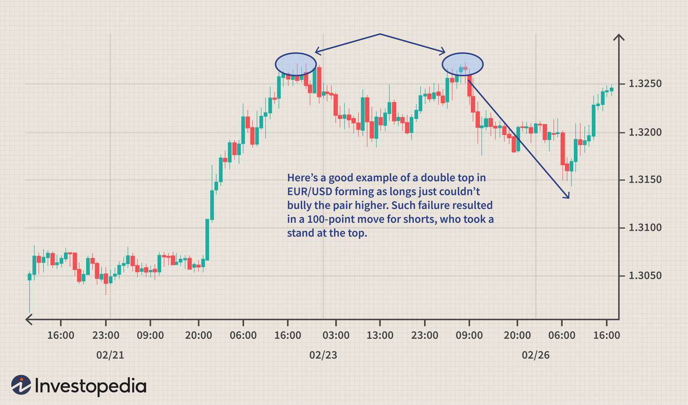

Double tops and double bottoms are essential concepts in technical analysis, representing significant patterns that occur in financial markets. A double top typically indicates a possible reversal during an upward trend, forming when the price reaches a high point, declines, and then ascends to a similar high before falling again. Conversely, a double bottom suggests a reversal in a downward trend, characterized by two comparable lows with a moderate rise in between. Technical analysts rely on these patterns to predict potential movements and identify entry and exit points in trading.

Algorithmic trading, often referred to as algo trading, involves using computer algorithms to execute trades based on predefined criteria. This approach has revolutionized modern financial markets by significantly enhancing the speed and precision of transactions while simultaneously reducing human errors and emotional biases. Algo trading is particularly valuable in processing complex data sets and managing high-frequency trading operations, offering competitive advantages in today's fast-paced market environment.



The primary goal of this article is to explore how double tops and double bottoms can be integrated into algorithmic trading strategies. By embedding these technical patterns within trade algorithms, traders and analysts can potentially enhance decision-making processes, automate executions, and refine risk management strategies. The integration of these patterns can offer a more holistic approach to trading, blending traditional technical analysis with cutting-edge technological advancements.

Understanding double tops and bottoms is crucial for traders and analysts, as these patterns can significantly impact trading decisions. They serve as tools to gauge market sentiment, potentially guiding traders in anticipating shifts in momentum. This strategic insight can improve timing in market entries and exits, ultimately influencing profitability.

Readers can expect to learn about the foundational elements of double tops and bottoms, their psychological and technical underpinnings, and how these patterns can be seamlessly incorporated into algorithmic trading strategies. Additionally, the article will provide insights into the practical applications, potential benefits, and challenges of integrating these patterns into algo trading frameworks, equipping readers with the knowledge needed to advance their trading practices in an increasingly algorithm-driven market.

## Table of Contents

## Understanding Double Tops and Double Bottoms

Double tops and double bottoms are two prominent chart patterns in technical analysis used to identify potential reversals in market trends. These patterns appear on price charts as shapes identified by their two distinct peaks (double tops) or troughs (double bottoms).

A double top pattern occurs after an uptrend and is characterized by the following sequence: first, the price reaches a peak and then retreats to a certain support level. The price then rises again to a similar peak level before declining again. This pattern suggests a potential reversal of an upward trend into a downward trend. The psychological underpinning of a double top is rooted in bullish market sentiment that is waning. Investors fail to push the price past a previous high, indicating weakening buying interest and a potential shift towards selling.

Conversely, a double bottom appears after a downtrend and features two nearly equal lows separated by a moderate peak. This pattern signifies a possible reversal from a downtrend to an uptrend. This reversal suggests that bears have failed to press the price below a certain support level on two occasions, which may embolden buyers and shift [momentum](/wiki/momentum) towards a rise in price.

Confirmation of these patterns is critical for reducing false signals. For double tops, the confirmation is often seen when the price falls below the support level established at the base between the peaks. In the case of double bottoms, confirmation occurs when the price rises above the resistance level formed by the peak between the troughs. Indicators such as [volume](/wiki/volume-trading-strategy) can also aid in confirming these patterns, with decreasing volume on the second peak (double top) or increasing volume on the rise after the second trough (double bottom) lending credence to the potential reversal.

Upon completion of a double top, the expected price movement generally aligns with a downward trend, with the price projected to fall by approximately the difference between the peak and the support level. For double bottoms, the anticipated movement is upward, with projections equal to the height between the low and the peak.

To visualize these patterns, imagine a simple line chart. For a double top, envision the letter "M" where the two peaks represent the high points. For a double bottom, picture the letter "W" with two low points. These visual examples aid traders in quickly identifying potential reversal patterns from historical price data.

The recognition and understanding of these patterns are fundamental for traders aiming to predict potential inflection points in market trends. Established rules for pattern confirmation assist in minimizing risks associated with false breakouts, which can lead to substantial financial losses.

## Algorithmic Trading: An Overview

Algorithmic trading, a practice that leverages computer algorithms to automate and execute trading strategies, has revolutionized financial markets since its inception in the late 20th century. The roots of [algorithmic trading](/wiki/algorithmic-trading) trace back to the 1970s when the New York Stock Exchange (NYSE) introduced Designated Order Turnaround (DOT) systems for automating stock order processing. As computing power and data processing capabilities advanced, the 1980s and 1990s saw significant growth in algorithmic trading, particularly with the rise of electronic communication networks (ECNs).

Algorithms are employed to automate trading strategies by executing trades based on predefined criteria without the need for human intervention. These strategies can range from simple moving average crossover systems to complex statistical [arbitrage](/wiki/arbitrage) models. Typically, an algorithm comprises a set of rules for entering and exiting trades, which are programmed into a trading system. For example, a basic algorithm might be structured as:

```python
def moving_average_strategy(prices, short_window, long_window):
    short_ma = prices.rolling(window=short_window).mean()
    long_ma = prices.rolling(window=long_window).mean()
    signal = (short_ma > long_ma).astype(int)  # Buy signal when short MA crosses above long MA
    return signal.diff()  # Signal conversion to trades
```

The advantages of algorithmic trading are manifold. It enables traders to execute trades at optimal speeds, minimizing latency in order execution. Algorithms can process vast amounts of data rapidly, making them adept at identifying and exploiting market inefficiencies that may be invisible to human traders. Additionally, algorithmic trading eliminates human emotional biases, leading to more disciplined and consistent trading performance.

However, algorithmic trading is not devoid of challenges and risks. Market conditions can change rapidly, rendering an algorithm ineffective if it is not updated regularly to reflect new information. There is also the risk of overfitting, where an algorithm is tailored too closely to historical data, reducing its adaptability to future market dynamics. The use of high-frequency trading ([HFT](/wiki/high-frequency-trading-strategies)) has also raised concerns about market stability, as it may contribute to events such as the 2010 Flash Crash.

Integrating technical patterns like double tops and double bottoms into automated strategies introduces an additional layer of complexity to algorithmic trading. These patterns, which embody market sentiment shifts, can be encoded into algorithms to signal potential market reversals. Automating the detection of these patterns requires advanced techniques such as pattern recognition algorithms and [machine learning](/wiki/machine-learning) models to analyze price data in real-time. By incorporating such technical patterns, traders can create more robust strategies that are informed by both quantitative analysis and market sentiment indicators.

## Combining Double Tops/Bottoms with Algo Trading

Double tops and bottoms are significant technical patterns that traders aim to exploit for potential market reversals. In algorithmic trading, their integration can provide systematic and unbiased trading decisions. Encoding these patterns into trading algorithms involves representing specific conditions and criteria that define double tops and bottoms, then using these criteria to make real-time trading decisions based on market data.

### Encoding Patterns into Algorithms

To encode double tops and bottoms into algorithms, one begins by defining the geometrical and time-based criteria that these patterns typically exhibit. For a double top, this might include two peaks of similar price levels separated by a moderate trough, usually following an uptrend. The double bottom would be analogous but inverted. Using these definitions, an algorithm can be structured to scan historical price data to detect potential double tops or bottoms. 

A basic algorithm could involve:

1. **Identifying Price Extremes:** Detecting local maxima and minima over a specified timeframe.
2. **Pattern Validation:** Applying constraints to ensure peaks and troughs meet certain criteria in terms of price differential and time separation.
3. **Triggering Conditions:** Establishing a breakout confirmation, such as a support or resistance level breach, to trigger trading decisions.

### Real-Time Pattern Detection

Real-time analysis necessitates algorithms that continuously evaluate incoming market data. A common practice involves using technical indicators like the Relative Strength Index (RSI) or moving averages to support pattern recognition. These indicators help confirm the pattern's validity by providing additional context about market momentum or overbought/oversold conditions.

For example, using Python's data analysis libraries, such as pandas and NumPy, traders can implement:

```python
def detect_double_top(prices, window):
    peaks = find_peaks(prices, distance=window)
    if len(peaks) >= 2 and verify_price_conditions(prices, peaks):
        return True
    return False
```

This snippet hypothetically identifies peaks using a predefined window and checks additional conditions through a helper function.

### Backtesting Strategies

Backtesting assesses how well strategies based on these patterns would have performed over historical data. Implemented strategies can be evaluated using statistical measures like the Sharpe ratio, win-loss ratio, or maximum drawdown to gauge their efficacy. High-frequency [backtesting](/wiki/backtesting) can also simulate real-time conditions to refine pattern detection algorithms.

### Potential Pitfalls

Integrating these patterns has its challenges:
- **False Signals:** Double tops and bottoms may occasionally appear but fail to deliver expected price reversals, leading to false signals.
- **Data Overfitting:** Tailoring algorithms too closely to historical data may not generalize well to future market conditions.
- **Latency:** Delays in data processing or order execution could affect the strategy's profitability, especially in high-frequency environments.

### Case Studies of Successful Implementation

Some firms have successfully integrated these patterns, combining algorithmic detection with machine learning models to enhance prediction accuracy. For example, [hedge fund](/wiki/hedge-fund-trading-strategies) firms may deploy machine learning algorithms trained to identify complex pattern variations, optimizing entry and [exit](/wiki/exit-strategy) points beyond basic criteria.

In conclusion, with careful design and validation, algorithms can effectively integrate double tops and bottoms into trading systems, potentially offering traders a robust method to capitalize on market reversals. However, continuous monitoring and adaptation to evolving market conditions are crucial for sustained success.

## Tools and Platforms for Algo Trading with Chart Patterns

Algorithmic trading has become increasingly accessible with the availability of various platforms and tools designed to support the integration of technical patterns, such as double tops and double bottoms, into trading strategies. This section introduces some of the most popular tools and platforms, discusses their features, and outlines criteria for choosing the right one to implement algorithms that focus on chart patterns.

### Popular Tools and Platforms

1. **MetaTrader 4/5 (MT4/5):**

   Widely used by traders for [forex](/wiki/forex-system), indices, and commodities, MetaTrader offers a powerful platform for algorithmic trading with a focus on chart patterns. MT4 and MT5 provide a user-friendly interface, a comprehensive set of trading tools, and the ability to program custom indicators and automated trading strategies using MQL4 and MQL5 scripting languages.

   - **Pros:** Extensive historical data and charting tools, large community, customizable.
   - **Cons:** Primarily focused on forex, limited to brokers offering the platform.

2. **TradingView:**

   TradingView is a highly versatile web-based platform known for its real-time data and superior charting capabilities. It allows traders to develop, backtest, and deploy trading strategies using Pine Script—a proprietary scripting language.

   - **Pros:** Intuitive interface, wide range of indicators, strong community for sharing scripts.
   - **Cons:** Limited in-depth backtesting capabilities compared to dedicated platforms.

3. **QuantConnect:**

   QuantConnect offers a powerful cloud-based platform using the Lean Algorithm Framework, which supports multiple asset classes including equities, forex, and cryptocurrencies. It accepts algorithms written in Python and C# and provides extensive documentation and APIs.

   - **Pros:** Supports multi-asset trading, rigorous backtesting environment, open-source.
   - **Cons:** Steeper learning curve for beginners, reliance on coding proficiency.

4. **NinjaTrader:**

   Known for its advanced charting and analytics, NinjaTrader is a desktop application that offers automated trading capabilities for futures and forex. It allows building custom strategies using C#.

   - **Pros:** High-quality data feeds, sophisticated analytics, personalized support.
   - **Cons:** Primarily targets futures markets, paid licensing model.

### Criteria for Choosing the Right Platform

Selecting the right trading platform depends on several factors:

- **Asset Class Focus:** Ensure the platform supports the asset classes you intend to trade.

- **Ease of Use:** Consider the platform’s user interface and ease of setting up automated strategies.

- **Coding Language:** Determine your proficiency with the platform’s supported scripting language.

- **Community Support:** A strong user community can be invaluable for learning and troubleshooting.

- **Backtesting Capabilities:** Ensure robust historical testing capabilities to validate strategies before live trading.

### Guide to Setting Up a Simple Algo Trading Strategy

For implementing a basic double top/bottom strategy using Python, platforms like QuantConnect enable users to deploy the following sample strategy:

```python
class DoubleTopBottomAlgorithm(QCAlgorithm):
    def Initialize(self):
        self.SetStartDate(2020, 1, 1)
        self.SetCash(10000)
        self.AddEquity("SPY", Resolution.Daily)
        self.window = RollingWindow[TradeBar](3)

    def OnData(self, data):
        self.window.Add(data["SPY"])

        if self.window.IsReady:
            if self.IsDoubleTop():
                self.SetHoldings("SPY", -0.5)
            elif self.IsDoubleBottom():
                self.SetHoldings("SPY", 0.5)

    def IsDoubleTop(self):
        return (self.window[2].Close < self.window[1].High > self.window[0].Close)

    def IsDoubleBottom(self):
        return (self.window[2].Close > self.window[1].Low < self.window[0].Close)
```

This illustrative code checks for simple double top and bottom patterns in daily data for the SPY [ETF](/wiki/etf-trading-strategies) and adjusts holdings accordingly.

### Community and Online Resources

Numerous resources are available to assist traders in learning and mastering algo trading with chart patterns:

- **Online Forums and Communities:** Websites like Stack Overflow, QuantConnect Community, and TradingView Ideas offer forums to discuss strategies and troubleshoot issues.

- **Educational Content:** Numerous online courses, blogs, and tutorials cover the basics to advanced strategies in algorithmic trading.

Choosing the right platforms and leveraging community resources is crucial for successfully integrating chart patterns like double tops and bottoms into algorithmic trading strategies. By carefully considering available options, traders can maximize their strategies' potential effectiveness and reliability.

## Benefits and Challenges of Algo Trading with Double Tops and Bottoms

Algorithmic trading strategies that incorporate technical patterns such as double tops and double bottoms offer several distinct advantages. These include enhanced accuracy in trade execution, minimizing emotional decision-making biases often encountered in manual trading. Algorithms can precisely identify and react to patterns, executing trades at optimal moments and potentially increasing profitability.

However, the integration of double tops and bottoms into algorithmic trading is not without its challenges. One major risk is overfitting, where an algorithm becomes too closely tailored to past data, reducing its effectiveness in real-time market conditions. Market [volatility](/wiki/volatility-trading-strategies) poses another challenge, as rapid price fluctuations can distort pattern recognition, leading to false signals. Limitations in pattern recognition algorithms may also fail to account for nuances in market behavior, leading to erroneous trades.

Mitigating these risks necessitates several strategies. Firstly, the use of robust backtesting procedures can help assess the reliability of an algorithm across various market conditions. It's crucial that backtests are conducted on out-of-sample data to verify the strategy's adaptability and avoid overfitting. A key statistical approach is employing cross-validation techniques to ensure the algorithm's predictions are not overly specific to the training data. 

Continuous monitoring and adjustment are vital. Algo-trading systems should be regularly updated and recalibrated with fresh data to maintain their relevance in changing markets. This could involve adaptive algorithms that can learn and adjust their parameters in response to new data without requiring manual intervention. 

Moreover, diversification across multiple strategies and asset classes can help offset risks associated with any single pattern failing to perform as expected. Implementing stop-loss orders and other risk management techniques can safeguard against significant losses due to unexpected market movements.

To thrive in this domain, traders need to ensure rigorous testing and validation of algorithms, alongside the development of systems capable of dynamic adaptation. Keeping abreast of market developments and advancements in algorithmic technology can also contribute to sustained trading success.

## Conclusion

In conclusion, this article has explored the integration of double tops and bottoms into algorithmic trading strategies, highlighting their potential to enhance trade accuracy and decision-making. Double tops and bottoms are significant patterns in technical analysis, representing vital shifts in market sentiment. By programming algorithms to recognize these patterns, traders can automate operations potentially leading to more precise entry and exit points and minimizing emotional biases.

Algorithmic trading, with its advantages of speed and efficiency, offers a promising future in leveraging chart patterns for strategic trading. As technology continues to evolve, the ability to process complex data sets to identify patterns like double tops and bottoms in real-time could revolutionize trading strategies. It is essential for traders to remain proactive in refining their algorithms, ensuring they accommodate market changes and avoid pitfalls such as overfitting or false pattern recognition.

Traders are encouraged to expand their understanding and continuously experiment with these strategies, as the potential benefits are substantial. The integration of technical pattern recognition within trading algorithms is evolving, and its future holds promise for more refined and lucrative trading practices.

As a call to action, traders should explore toolkits and platforms that support the automation of these strategies while remaining engaged with communities and resources for learning and innovation. Adapting to market dynamics and technological advancements will be crucial for success in this innovative and rapidly developing field of trading.

## References & Further Reading

[1]: Pring, M. J. (2002). ["Technical Analysis Explained"](https://www.amazon.com/Technical-Analysis-Explained-Fifth-Successful/dp/0071825177). McGraw Hill Professional.

[2]: Bulkowski, T. N. (2005). ["Encyclopedia of Chart Patterns"](https://books.google.com/books/about/Encyclopedia_of_Chart_Patterns.html?id=zZAsEAAAQBAJ). Wiley.

[3]: Lopez de Prado, M. (2018). ["Advances in Financial Machine Learning"](https://www.amazon.com/Advances-Financial-Machine-Learning-Marcos/dp/1119482089). Wiley.

[4]: Aronson, D. R. (2006). ["Evidence-Based Technical Analysis: Applying the Scientific Method and Statistical Inference to Trading Signals"](https://www.amazon.com/Evidence-Based-Technical-Analysis-Scientific-Statistical/dp/0470008741). Wiley.

[5]: Chan, E. P. (2008). ["Quantitative Trading: How to Build Your Own Algorithmic Trading Business"](https://github.com/ftvision/quant_trading_echan_book). Wiley.