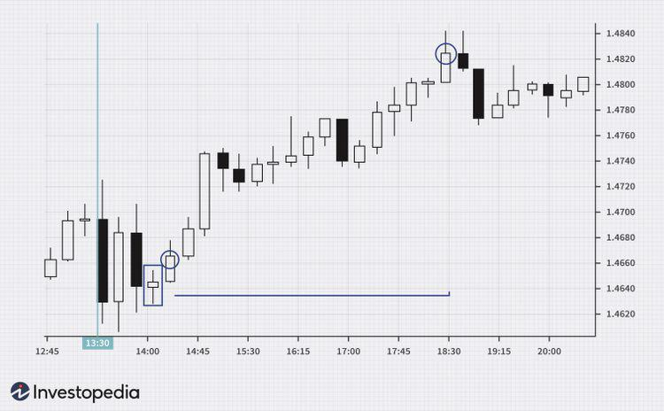

The relationship between financial markets and economic indicators is complex, with economic data heavily influencing market dynamics. Among these indicators, the Nonfarm Payroll (NFP) report holds substantial significance for traders. Released monthly by the U.S. Department of Labor, the NFP report measures the number of jobs added or lost in the economy, excluding certain sectors such as agriculture. Its importance stems from its ability to provide insights into economic health, which in turn affect currency values, stock market trends, and monetary policy. Positive NFP data typically suggests economic expansion, leading to potential increases in currency values and stock prices. Conversely, negative data might indicate economic stagnation, creating a ripple effect across various markets.

This article focuses on strategies for trading around the NFP report, specifically through algorithmic trading approaches. Algorithmic trading, which involves using automated systems to execute trades based on programmed criteria, offers distinct advantages in handling the rapid market movements often triggered by NFP releases. The discussion will cover how NFP data impacts markets and present strategies that traders can employ to navigate this information effectively. By understanding the influence of NFP data and employing sophisticated trading strategies, market participants can better position themselves to capitalize on the opportunities provided by these significant economic insights.



## Table of Contents

## Understanding Nonfarm Payroll (NFP)

The Nonfarm Payroll (NFP) report serves as a critical barometer for gauging the health of the U.S. labor market by detailing the number of jobs added each month, excluding farm employees, government workers, private household employees, and employees of nonprofit organizations. This report, a monthly release from the U.S. Department of Labor, plays a significant role in shaping investor sentiment and driving market movements.

Higher NFP numbers typically signal economic expansion, highlighting an increase in job creation, which can correlate with rising industrial activity and overall economic growth. Conversely, lower NFP figures may indicate economic stagnation or downturn, suggesting that businesses are hiring fewer employees, potentially due to economic instability or anticipated slowdowns.

The forex market, which involves trading currencies like the U.S. dollar (USD), euro (EUR), and British pound (GBP), is particularly sensitive to NFP data. Traders and investors closely scrutinize these numbers to anticipate broader market trends. For example, a higher-than-expected NFP report can lead to an appreciation of the USD, as it boosts confidence in the U.S. economy, often resulting in significant volatility in currency pairs such as EUR/USD and GBP/USD.

Nevertheless, the impact of NFP data extends beyond forex, influencing other financial markets such as equities and fixed income. In the stock markets, positive NFP figures can drive stock prices higher as they signal economic strength, enhancing corporate earnings prospects. Conversely, a weak NFP report could depress stock prices by raising fears concerning economic growth.

In summary, understanding and analyzing the NFP report is crucial for market participants aiming to make informed trading decisions. This report not only provides insights into the U.S. employment landscape but also serves as a vital indicator for assessing future economic conditions and potential shifts in financial markets.

## Analyzing NFP Data

In the financial markets, the Nonfarm Payroll (NFP) report is a critical economic indicator, as it conveys vital insights into employment trends in the U.S. economy. The report's components, such as average hourly earnings and sector-specific employment data, allow traders and investors to gain a deeper understanding of economic performance and potential market trends. These insights are foundational in shaping trading strategies.

Market participants closely compare the reported NFP figures with pre-release forecasts to make strategic trading decisions. Discrepancies between expected and actual data often lead to significant market reactions. If the NFP numbers surpass expectations, indicating robust employment growth, the U.S. dollar typically appreciates. This appreciation impacts key [forex](/wiki/forex-system) pairs, such as the EUR/USD and GBP/USD, leading to shifts in currency market dynamics.

To effectively utilize NFP data in trading, it is crucial to examine the economic context of its release. Factors such as prevailing economic conditions, recent economic data, and geopolitical events can influence how markets respond to the NFP report. For example, in a period of economic uncertainty, positive NFP data might have an amplified positive effect on market sentiment, bolstering confidence in the economy's trajectory.

Moreover, understanding the broader implications of the NFP report on monetary policy is essential for anticipating central bank actions. Strong employment data can signal potential rate hikes by the Federal Reserve, as sustained job growth might lead to inflationary pressures. Conversely, weak NFP numbers could suggest easing measures to stimulate economic activity.

In summary, the diverse components of the NFP report, combined with careful analysis of expectations and economic context, provide a robust framework for understanding and predicting market movements. Traders who adeptly interpret this data can better anticipate shifts in market sentiment and central bank policies, leading to more informed and strategic trading decisions.

## Impact of NFP on Financial Markets

Nonfarm Payroll (NFP) releases are known for triggering significant [volatility](/wiki/volatility-trading-strategies) in the forex, equity, and fixed income markets. As a comprehensive indicator of U.S. employment health, NFP data provides traders and investors with vital clues about the state of the economy and potential monetary policy adjustments. 

Positive NFP data, indicating robust job creation, typically signals economic growth. This perception can boost investor confidence, often leading to a rise in equity markets as businesses are expected to perform better in a growing economy. Higher NFP figures also tend to increase demand for the U.S. dollar (USD), as stronger economic activity might prompt the Federal Reserve to consider tightening monetary policy, including raising interest rates. This potential for higher yields attracts foreign investment, further strengthening the USD against other currencies. Additionally, rising NFP numbers may lead to increased bond yields, as investors anticipate future rate hikes.

Conversely, negative NFP data—indicative of lower job creation or above-normal unemployment levels—often results in a weaker USD. This scenario may create favorable conditions for foreign currencies in relation to the USD, as investors might seek higher returns elsewhere or anticipate central bank action, such as cutting interest rates or introducing stimulus measures. A weaker NFP report can apply downward pressure on equities, reflecting concerns about economic stagnation or recession.

Traders closely analyze NFP data as it enables them to predict potential [interest rate](/wiki/interest-rate-trading-strategies) changes. If the NFP report suggests that the labor market is strengthening, it might lead to expectations of monetary tightening (rate hikes), prompting traders to adjust their currency and asset holdings accordingly. On the other hand, disappointing NFP data may lead to speculation about potential monetary easing (rate cuts), guiding investment decisions in anticipation of changing interest rate landscapes.

The influence of NFP data is further amplified when considered alongside other economic indicators, such as Gross Domestic Product (GDP) growth rates, inflation data, and consumer spending trends. The interaction between these indicators provides a broader economic context that can help traders refine their predictions about future market dynamics. For example, a high GDP growth rate combined with strong NFP data may correlate with increased market confidence, reinforcing currency strength and shaping bond yield expectations.

In summary, NFP data plays a critical role in shaping financial market movements by affecting forex rates, equity valuations, and fixed income yields. Traders leverage this information to forecast interest rate shifts and make well-informed investment choices, ensuring they remain responsive to evolving economic conditions.

## Algorithmic Trading Strategies for NFP

Algorithmic trading, when applied to Nonfarm Payroll (NFP) data, offers a systematic and precise approach to navigate the volatility associated with NFP releases. By executing trades based on predefined criteria and patterns, such strategies can optimize decision-making and enhance trade execution speed.

One popular algorithmic strategy is the range [breakout](/wiki/breakout-trading). This method involves identifying a price range that forms before an NFP release. Traders anticipate that the price will break out of this range once the data is released, due to increased volatility. Algorithms are programmed to detect these breakouts and execute trades accordingly. This strategy capitalizes on the assumption that prices will continue to move in the direction of the breakout after initial volatility subsides.

Moving average crossovers also play a significant role in NFP trading algorithms. This strategy involves two different moving averages: a short-term and a long-term average. When the short-term moving average crosses above the long-term average, it generates a buy signal, while a cross below generates a sell signal. This approach can be automated to respond immediately to NFP data, as trades can be executed the moment a crossover is detected.

Momentum following is another strategy employed during NFP announcements. This strategy relies on identifying the [momentum](/wiki/momentum) or the speed of price movements following the release of NFP data. By programming algorithms to follow the momentum, traders aim to capture the main thrust of price direction, adjusting positions as new data modifies market sentiment.

Integrating [machine learning](/wiki/machine-learning) models can greatly enhance the adaptability and precision of trading systems reacting to NFP data. Machine learning models can analyze vast amounts of historical NFP data to identify patterns and predict future price movements. By continually learning from new data inputs, these models can adapt to changing market conditions, thus improving the robustness of trading strategies.

Backtesting is a crucial step in validating [algorithmic trading](/wiki/algorithmic-trading) strategies. It involves testing the strategy against historical NFP data to assess its potential performance. This process helps in understanding the effectiveness and risk involved with the strategy, allowing traders to optimize settings for real-time trading. The [backtesting](/wiki/backtesting) process can be implemented using Python as shown below:

```python
import pandas as pd

# Load historical NFP data
nfp_data = pd.read_csv('historical_nfp_data.csv')

# Sample strategy: Moving Average Crossover
def moving_average_crossover(data, short_window, long_window):
    data['short_mavg'] = data['price'].rolling(window=short_window, min_periods=1).mean()
    data['long_mavg'] = data['price'].rolling(window=long_window, min_periods=1).mean()

    data['signal'] = 0
    data['signal'][short_window:] = \
        np.where(data['short_mavg'][short_window:] > data['long_mavg'][short_window:], 1, -1)

    data['positions'] = data['signal'].diff()

    return data

# Apply strategy to historical data
strategy_results = moving_average_crossover(nfp_data, short_window=40, long_window=100)

# Analyze performance
profit = np.sum(strategy_results['positions'] * strategy_results['price'])
print(f"Total Profit from Strategy: {profit}")
```

In conclusion, algorithmic trading strategies offer considerable advantages when trading the NFP release by ensuring prompt, data-driven decisions are made amidst market uncertainty. Such strategies, with controlled risk and enhanced adaptability through machine learning, can significantly boost trading precision and outcomes during NFP volatility.

## Best Practices and Risk Management

Effective risk management is crucial when trading during high-volatility events such as Nonfarm Payroll (NFP) releases. The NFP report often leads to significant market fluctuations, necessitating robust strategies to protect capital and optimize gains.

A primary component of risk management is the use of limit orders and stop-loss strategies. Limit orders specify the maximum price a trader is willing to pay or the minimum price they are willing to accept, which helps in controlling entry and [exit](/wiki/exit-strategy) points effectively. Stop-loss orders automatically close a position at a predetermined price, thus minimizing potential losses if the market moves against the trader's expectations. Proper leverage controls are also vital. Leverage amplifies both gains and losses, and using excessive leverage during volatile periods can lead to substantial financial risk. Therefore, adjusting leverage to maintain an appropriate risk-to-reward ratio is fundamental.

Adapting trading strategies to the dynamics of NFP releases is another critical practice. Markets can react unpredictably, and strategies should be flexible to accommodate sudden changes. For instance, employing dynamic stop-loss adjustments or using volatility-based indicators can better adapt strategies to market shifts. Furthermore, staying informed with real-time market news and economic analyses enhances a trader’s understanding of potential market movements, allowing for more informed decision-making.

Disciplined trading and constant evaluation of strategies play a significant role in long-term success. Traders should engage in regular performance reviews and be ready to revise strategies in light of past trading outcomes. Utilizing trading journals to document trades, outcomes, and emotional responses can provide beneficial insights over time. 

Ultimately, a disciplined approach combined with effective risk management and adaptive strategies can significantly boost the likelihood of achieving trading objectives during NFP events. Emphasizing these best practices not only safeguards against potential losses but also positions traders to capitalize on market opportunities presented by NFP data.

## Conclusion

Mastering Nonfarm Payroll (NFP) trading necessitates a comprehensive grasp of market dynamics and the flexibility to modify strategies based on evolving data. Algorithmic trading plays a crucial role, offering the precision and speed required to seize opportunities generated by NFP releases. These automated systems can quickly process large amounts of data and execute trades based on predefined criteria, thus taking advantage of the high volatility often associated with NFP announcements.

Continuous learning and strategy refinement are essential to dealing with the intricate responses of financial markets to economic indicators. Given the unpredictable nature of market reactions, traders must constantly evaluate and update their strategies to improve performance and minimize risks. Backtesting, which involves running trading algorithms on historical data, is an effective way to validate the effectiveness of strategies and ensure they are well-suited to handle potential market scenarios.

An informed approach to NFP trading should be paired with robust risk management practices. Using mechanisms such as stop-loss orders can help limit potential losses in the volatile environment following an NFP release. Similarly, employing proper leverage controls and planning positions carefully can mitigate exposure to adverse market movements.

The strategic application of NFP data holds significant potential for achieving financial objectives, provided that traders adopt a disciplined and informed approach. As financial markets continue to evolve with technological advancements, NFP trading remains a vital area of focus for traders aiming to optimize returns. By leveraging algorithmic trading and maintaining a thorough understanding of market intricacies, traders can harness the power of NFP data to gain a competitive edge in the constantly changing landscape of financial markets.

## References & Further Reading

[1]: Perritt, H. H., & Pettit, W. V. (2001). ["Trading the Non-Farm Payroll Release."](https://chicagounbound.uchicago.edu/uclf/vol2001/iss1/8/)1097-4571(200001)51:1<9::AID-ASI2>3.0.CO;2-P) Wiley Trading.

[2]: ["Algorithmic Trading: Winning Strategies and Their Rationale"](https://www.wiley.com/en-us/Algorithmic+Trading%3A+Winning+Strategies+and+Their+Rationale-p-9781118460146) by Ernie Chan

[3]: Cartea, A., Jaimungal, S., & Penalva, J. (2015). ["Algorithmic and High-Frequency Trading."](https://assets.cambridge.org/97811070/91146/frontmatter/9781107091146_frontmatter.pdf) Cambridge University Press.

[4]: Aikman, L. (2020). ["The Nonfarm Payroll Report: Relevance and Market Impact."](https://www.sofi.com/learn/content/nonfarm-payroll-explained/) Reuters.

[5]: Lopez de Prado, M. (2018). ["Advances in Financial Machine Learning."](https://www.amazon.com/Advances-Financial-Machine-Learning-Marcos/dp/1119482089) Wiley.