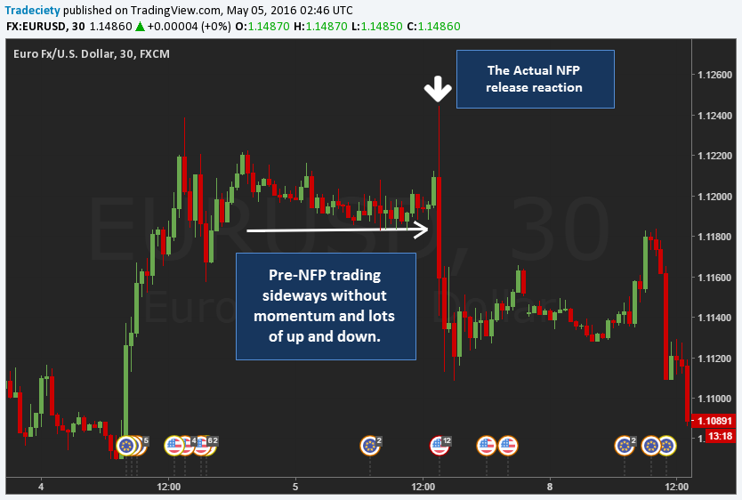

## Table of Contents

## What is the Nonfarm Payroll (NFP) report and why is it important for traders?

The Nonfarm Payroll (NFP) report is a monthly report released by the U.S. Bureau of Labor Statistics that shows how many jobs were added or lost in the United States, excluding farm workers, government employees, private household employees, and employees of nonprofit organizations. It gives a snapshot of the health of the job market and the overall economy. The report includes important details like the unemployment rate, average hourly earnings, and the labor force participation rate.

Traders pay close attention to the NFP report because it can cause big movements in the financial markets. When the report shows more jobs were added than expected, it can make people feel more confident about the economy, which can lead to higher stock prices and a stronger U.S. dollar. On the other hand, if the report shows fewer jobs were added than expected, it can make people worry about the economy, which can lead to lower stock prices and a weaker U.S. dollar. Because the NFP report can cause such big reactions in the markets, traders often adjust their investments based on the information in the report.

## How often is the NFP report released and at what time?

The NFP report comes out once a month. It is released on the first Friday of every month.

The report is made public at 8:30 AM Eastern Time. This is when traders and investors can see the new data and start making decisions based on it.

## What are the key components of the NFP report that traders should focus on?

The NFP report has several important parts that traders should pay attention to. The first key component is the number of jobs added or lost. This number tells traders how many people got new jobs or lost their jobs in the last month. If more jobs were added than expected, it can make people feel good about the economy. If fewer jobs were added than expected, it can make people worry.

Another important part of the NFP report is the unemployment rate. This is the percentage of people who want to work but can't find a job. A lower unemployment rate usually means the economy is doing well, which can make stock prices go up and the U.S. dollar stronger. A higher unemployment rate can mean the economy is struggling, which can make stock prices go down and the U.S. dollar weaker.

The last key component is average hourly earnings. This shows how much money workers are making on average each hour. If average hourly earnings go up, it can mean that workers are getting paid more, which can make people spend more money and help the economy grow. If average hourly earnings go down, it can mean that workers are getting paid less, which can make people spend less money and hurt the economy.

## How can beginners prepare for trading the NFP report?

Beginners can prepare for trading the NFP report by first understanding what the report is and why it matters. The NFP report tells us how many jobs were added or lost in the U.S. each month, not counting farm workers and some other groups. It's important because it can make the stock market and the value of the U.S. dollar go up or down. Beginners should read about the report and learn what the numbers mean. They can find simple explanations online or in books about trading.

Next, beginners should practice trading without real money. Many trading platforms let you use fake money to buy and sell stocks or currencies. This is a good way to see how the NFP report can affect the markets without risking any real money. Beginners can try trading around the time the report comes out to see how the markets move. They should also watch videos or read articles about how other traders prepare for the NFP report. This can give them ideas on what to do when the report is released.

Finally, beginners should have a plan before the NFP report comes out. They should decide what they will do if the report is better or worse than expected. For example, if more jobs are added than people thought, they might want to buy stocks or the U.S. dollar. If fewer jobs are added, they might want to sell. Having a plan can help beginners stay calm and make smart choices when the report is released.

## What are some common trading strategies used during the NFP release?

One common trading strategy during the NFP release is called "fade the move." This means that traders wait for the initial big move in the market after the report comes out, and then they trade in the opposite direction. For example, if the report is better than expected and the market goes up a lot, traders using this strategy would sell, expecting the market to come back down. This strategy works because the first big move after the NFP report can be too strong and often reverses later.

Another strategy is "breakout trading." Here, traders look for the market to move strongly in one direction after the NFP report and then keep going that way. If the report is good and the market goes up, breakout traders would buy, hoping the market will keep going up. If the report is bad and the market goes down, they would sell, hoping the market will keep going down. This strategy works well when the market keeps moving in the same direction after the initial reaction to the report.

A third strategy is "straddles and strangles." These are options trading strategies where traders buy both a call option and a put option at the same time. A straddle uses the same strike price, while a strangle uses different strike prices. The idea is to make money no matter which way the market moves after the NFP report. If the market moves a lot in either direction, the profit from one option can be bigger than the loss from the other option. This strategy can be good for traders who think the market will move a lot but aren't sure which way.

## How does the NFP report affect different financial markets, such as forex, stocks, and commodities?

The NFP report can have a big impact on the forex market. When the report shows more jobs were added than expected, it can make people feel good about the U.S. economy. This can make the U.S. dollar stronger because more people want to buy it. On the other hand, if the report shows fewer jobs were added than expected, it can make people worry about the U.S. economy. This can make the U.S. dollar weaker because fewer people want to buy it. Forex traders watch the NFP report closely because it can cause big changes in currency values.

In the stock market, the NFP report can also cause big moves. If the report is better than expected, it can make people feel more confident about the economy. This can make stock prices go up because more people want to buy stocks. If the report is worse than expected, it can make people worry about the economy. This can make stock prices go down because fewer people want to buy stocks. Stock traders often adjust their investments based on the NFP report because it can give them clues about where the economy is headed.

The NFP report can affect commodity markets too. Commodities like gold and oil can be influenced by the strength of the U.S. dollar. If the NFP report makes the U.S. dollar stronger, it can make commodities priced in dollars more expensive for people using other currencies. This can make demand for commodities go down, which can lower their prices. If the NFP report makes the U.S. dollar weaker, it can make commodities cheaper for people using other currencies. This can make demand for commodities go up, which can raise their prices. Commodity traders watch the NFP report to understand how it might change the value of the U.S. dollar and affect commodity prices.

## What are the risks associated with trading the NFP report, and how can they be managed?

Trading the NFP report can be risky because the market can move a lot and very quickly. When the report comes out, the numbers might be different from what people expected. This can make the market go up or down a lot in a short time. If traders are not ready for these big moves, they can lose money. Also, the market can be very busy and hard to predict right after the report comes out. This can make it hard for traders to make good choices and can lead to more losses.

To manage these risks, traders can use a few strategies. First, they can set stop-loss orders. These are orders that automatically sell a trade if it loses too much money. This can help limit how much money a trader can lose. Second, traders can use smaller trade sizes. By trading less money at a time, they can lose less if the market moves against them. Finally, traders can wait a little bit after the report comes out before making trades. This can give them time to see how the market is reacting and make better choices. By using these strategies, traders can lower their risks when trading the NFP report.

## How can traders use technical analysis in conjunction with the NFP report to make trading decisions?

Traders can use technical analysis to help them make better decisions when trading the NFP report. Technical analysis looks at past price movements and patterns on charts to predict what might happen next. Before the NFP report comes out, traders can look at these charts to see where the market might be heading. They can find important levels like support and resistance, which are prices where the market often stops moving up or down. If the NFP report is better than expected and the market breaks through a resistance level, traders might decide to buy, thinking the market will keep going up. If the report is worse than expected and the market breaks through a support level, traders might decide to sell, thinking the market will keep going down.

After the NFP report is released, traders can use technical analysis to see how the market is reacting. They can look for patterns like a breakout, where the price moves strongly in one direction, or a reversal, where the price changes direction after a big move. If the market moves a lot after the report, traders can use technical indicators like moving averages or the Relative Strength Index (RSI) to see if the market is overbought or oversold. This can help them decide if it's a good time to buy or sell. By combining the information from the NFP report with what they see on the charts, traders can make smarter trading decisions and manage their risks better.

## What are some advanced strategies for trading the NFP report, including options and futures?

One advanced strategy for trading the NFP report is using options, specifically straddles and strangles. A straddle involves buying both a call option and a put option at the same strike price, while a strangle involves buying them at different strike prices. The idea is to profit from big moves in the market no matter which way it goes. If the NFP report causes a big move up or down, the profit from one option can be bigger than the loss from the other. This strategy can be good for traders who think the market will move a lot but aren't sure which way. It's important to understand that options trading can be risky and requires a good understanding of how options work.

Another advanced strategy is trading futures, which are contracts to buy or sell an asset at a set price in the future. Futures can be used to trade the NFP report because they let traders take big positions with less money upfront. For example, if a trader thinks the NFP report will be good and the U.S. dollar will go up, they can buy dollar futures. If the report is good and the dollar goes up, they can make money. If the report is bad and the dollar goes down, they can lose money. Futures trading can be very risky because the market can move a lot, so traders need to be careful and use stop-loss orders to limit their losses.

Combining technical analysis with these strategies can help traders make better decisions. Before the NFP report comes out, traders can look at charts to find important levels like support and resistance. After the report is released, they can use technical indicators to see if the market is overbought or oversold. This can help them decide when to enter or exit their trades. By using options, futures, and technical analysis together, traders can take advantage of the big moves that often happen after the NFP report comes out, but they need to be careful and manage their risks well.

## How can historical NFP data be used to predict market movements and refine trading strategies?

Historical NFP data can help traders predict how the market might move after a new report comes out. By looking at past NFP reports, traders can see how the market reacted to different numbers. For example, if the report was better than expected and the market went up a lot, traders can guess that the market might do the same thing if the next report is also better than expected. They can also look at how the market reacted to different parts of the report, like the unemployment rate or average hourly earnings. This can help them understand which parts of the report are most important for the market.

Traders can use this information to make their trading strategies better. If they see that the market usually goes up when the NFP report is good, they might decide to buy stocks or the U.S. dollar right after a good report comes out. If the market usually goes down when the report is bad, they might decide to sell. Traders can also use historical data to set their stop-loss orders at the right levels. By looking at how much the market moved in the past, they can guess how much it might move after the next report and set their stop-loss orders to limit their losses. This way, they can be more ready for the big moves that often happen after the NFP report comes out.

## What are the psychological aspects of trading the NFP report, and how can traders maintain discipline?

Trading the NFP report can be very exciting and stressful because the market can move a lot and very quickly. When the report comes out, traders might feel a rush of emotions like excitement, fear, or greed. These feelings can make it hard for them to stick to their trading plan. For example, if the market goes up a lot after a good report, traders might feel greedy and want to keep buying even if it's not a good idea. Or if the market goes down a lot after a bad report, they might feel scared and want to sell everything, even if it's not the best choice. These emotions can lead to bad decisions and big losses.

To stay disciplined, traders need to have a clear plan before the NFP report comes out. They should decide what they will do if the report is better or worse than expected and stick to that plan no matter how they feel. Using tools like stop-loss orders can help them follow their plan and limit their losses. It's also a good idea to take breaks and not watch the market too closely right after the report comes out. This can help traders stay calm and make better choices. By having a plan and sticking to it, traders can manage their emotions and trade the NFP report more successfully.

## How can algorithmic trading be applied to the NFP report, and what are the considerations for setting up such systems?

Algorithmic trading can be used to trade the NFP report by setting up computer programs that automatically buy or sell based on the numbers in the report. These programs can be made to look at the NFP data as soon as it comes out and make trades very quickly. For example, if the report shows more jobs were added than expected, the algorithm might buy stocks or the U.S. dollar. If the report shows fewer jobs were added, the algorithm might sell. This can help traders take advantage of the big moves that often happen right after the report comes out without having to make quick decisions themselves.

Setting up an algorithmic trading system for the NFP report needs careful planning. Traders need to think about what numbers in the report are most important and how the market usually reacts to them. They also need to decide how much money to trade and where to set stop-loss orders to limit losses. It's important to test the algorithm with past data to see how it would have worked before using it with real money. This can help traders find and fix any problems with the algorithm. By setting up the system carefully and testing it well, traders can use algorithmic trading to trade the NFP report more successfully.

## References & Further Reading

[1]: Perritt, H. H., & Pettit, W. V. (2001). ["Trading the Non-Farm Payroll Release."](https://chicagounbound.uchicago.edu/uclf/vol2001/iss1/8/)1097-4571(200001)51:1<9::AID-ASI2>3.0.CO;2-P) Wiley Trading.

[2]: ["Algorithmic Trading: Winning Strategies and Their Rationale"](https://www.wiley.com/en-us/Algorithmic+Trading%3A+Winning+Strategies+and+Their+Rationale-p-9781118460146) by Ernie Chan

[3]: Cartea, A., Jaimungal, S., & Penalva, J. (2015). ["Algorithmic and High-Frequency Trading."](https://assets.cambridge.org/97811070/91146/frontmatter/9781107091146_frontmatter.pdf) Cambridge University Press.

[4]: Aikman, L. (2020). ["The Nonfarm Payroll Report: Relevance and Market Impact."](https://www.sofi.com/learn/content/nonfarm-payroll-explained/) Reuters.

[5]: Lopez de Prado, M. (2018). ["Advances in Financial Machine Learning."](https://www.amazon.com/Advances-Financial-Machine-Learning-Marcos/dp/1119482089) Wiley.