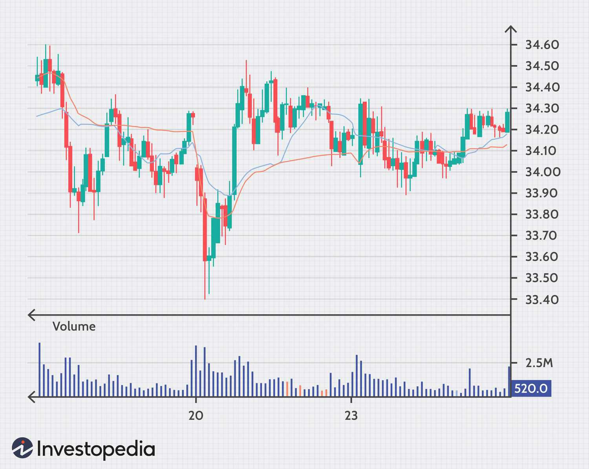

The world of trading involves a myriad of strategies and tools designed to maximize profit potential. Among the most prominent tools are the Volume Weighted Average Price (VWAP) and Moving Volume Weighted Average Price (MVWAP), which serve as pivotal indicators used to inform trading decisions. VWAP and MVWAP have become integral components in algorithmic trading strategies, finding favor among both retail and institutional traders seeking to enhance their market operations.

VWAP and MVWAP are distinct in their applications but share a common purpose: to provide traders with insights into price action dynamics. VWAP represents the average price a security has traded at throughout the day, weighted by volume, offering an intraday perspective crucial for ensuring that trades are executed at advantageous prices relative to the market average. On the other hand, MVWAP extends the VWAP calculation over multiple periods, offering a broader scope that aids in identifying longer-term trends.

In algorithmic trading, these indicators are particularly valuable due to their ability to provide real-time price analysis, which can be seamlessly integrated into automated trading systems. The adaptability of VWAP and MVWAP to various trading strategies makes them versatile tools for both short-term trades and more extended investment horizons.

This article provides an in-depth exploration of VWAP and MVWAP trading strategies, focusing on their definitions, calculations, and practical applications within algo trading. By understanding these indicators, traders can enhance their strategy development and improve their capacity to make informed trading decisions, ultimately optimizing their performance in the market.

## Table of Contents

## What is VWAP and MVWAP?

VWAP, or Volume Weighted Average Price, is a trading benchmark that represents the average price a security has traded at during the day, based on both price and volume. This metric combines price action with trading volume, allowing traders to assess whether they have bought or sold at a favorable price. The calculation involves summing the total traded value (price multiplied by volume) of a security over a specified period and dividing by the total trading volume during that period.

Mathematically, VWAP is calculated as:

$$
\text{VWAP} = \frac{\sum (\text{Price}_i \times \text{Volume}_i)}{\sum \text{Volume}_i}
$$

where $\text{Price}_i$ and $\text{Volume}_i$ are the price and volume at each trade $i$.

Moving VWAP (MVWAP) extends the concept of VWAP over multiple periods, such as days or weeks, smoothing out the data to produce a continuous average that assists traders in identifying longer-term trends. By calculating VWAP for each day and then averaging these values over a user-defined number of past days, MVWAP offers insights into price movements beyond the confines of a single trading session.

By providing a weighted average price that considers the volumes of each transaction, both VWAP and MVWAP are vital tools in trading strategies. They are especially useful in [algorithmic trading](/wiki/algorithmic-trading), where rapid, data-driven decisions are paramount. These tools help traders avoid entering trades at inflated prices, thereby optimizing trade execution and aligning with market flows.

VWAP and MVWAP support short-term analysis due to their precision in measuring price action relative to [volume](/wiki/volume-trading-strategy). In algorithmic trading programs, they serve as benchmarks that aid in executing trades aligned with prevailing market conditions. Their ability to offer an accurate snapshot of market activity makes them indispensable for both retail and institutional traders.

## Understanding VWAP and MVWAP

VWAP is an essential tool for intraday trading, offering a calculated average that resets at the start of each trading day. It incorporates both price and volume in real-time, providing a comprehensive view of a security's average price throughout the trading session. VWAP calculation involves determining the typical price for each period—usually at regular intervals like every minute—multiplying it by the trading volume for that period, accumulating this value throughout the day, and then dividing by the total volume. This ensures traders have a benchmark to assess how their executed trades fare against the day's average price. 

MVWAP builds on the VWAP by extending its calculation over multiple trading days. This approach creates a continuous series of average prices, offering traders a smoother and more balanced depiction of market trends. Unlike VWAP, which focuses on a singular day's metrics, MVWAP assists in monitoring price actions over extended periods, aiding traders in identifying longer-term trends and smoothing out market [volatility](/wiki/volatility-trading-strategies).

Both VWAP and MVWAP serve as benchmarks for evaluating the quality of trade executions. By comparing the price of a traded security against these averages, traders can determine the effectiveness of their trades—whether they are above or below the prevailing market trend. These indicators are especially useful in dynamic markets, where understanding the alignment of execution prices with overall price trends can be critical for optimizing trading outcomes. 

In dynamic markets, where price movements are frequent and sometimes abrupt, aligning execution with VWAP or MVWAP can offer traders a significant advantage. By ensuring trades are made in the context of average market conditions, these tools enable traders to refine their strategies, avoiding suboptimal trade entries and exits that might arise from short-lived price spikes or drops.

## Calculating VWAP

Calculating the Volume Weighted Average Price (VWAP) involves several systematic steps aimed at determining the average price a security has traded at, weighted by volume. The calculation starts by deciding on a time frame. Typical choices include a tick chart or intervals like 1-minute periods, where these intervals help break down the trading day into manageable segments for analysis.

1. **Calculate the Typical Price (TP):** For each chosen time interval, compute the typical price using the following formula:
$$
   TP = \frac{(High + Low + Close)}{3}

$$
   Here, "High", "Low", and "Close" refer to the high, low, and closing prices of the security during each interval.

2. **Determine the Time Period Volume (TPV):** Multiply the typical price by the volume for that period, yielding the Time Period Volume:
$$
   TPV = TP \times Volume

$$
   The TPV reflects the price movement's significance based on the traded volume during each specific interval.

3. **Compute Cumulative TPV and Volume:** Accumulate these TPV values over the trading day. Simultaneously, track the cumulative volume to ensure accuracy in weighting:
$$
   \text{Cumulative TPV} = \sum TPV_i

$$
$$
   \text{Cumulative Volume} = \sum Volume_i

$$

4. **Calculate VWAP:** The VWAP is obtained by dividing the cumulative TPV by the cumulative volume. This formula results in a weighted average price that reflects both price and volume for the trading day's duration:
$$
   VWAP = \frac{\text{Cumulative TPV}}{\text{Cumulative Volume}}

$$
   This figure represents the average price over the interval, weighted by the amount of trading activity.

For those seeking a broader temporal analysis, the Moving Volume Weighted Average Price (MVWAP) can be computed by averaging the VWAP values over several periods of interest, providing smoother trend information and extended insights into price movement. This approach enables traders to adjust to varying market conditions by extending the VWAP analysis over multiple trading days or predefined periods, adapting to both short-term market swings and longer-term trends.

## Application to Charts

Charting software plays a crucial role in the application of VWAP (Volume Weighted Average Price) and MVWAP (Moving Volume Weighted Average Price) by automating the complex calculations and presenting these indicators as overlays on price charts. By visualizing VWAP and MVWAP lines, traders can easily perceive the relationship between the current price and these volume-weighted averages. This graphical representation is invaluable for informing trading decisions.

Traders benefit from the flexibility of customizing the MVWAP indicator to suit specific strategies. By adjusting the number of periods over which the MVWAP is calculated, they can cater to different market conditions and trading time frames. Customization allows traders to fine-tune the sensitivity of the MVWAP, making it suitable for both short-term [scalping](/wiki/gamma-scalping) and longer-term position trading.

In practical terms, VWAP and MVWAP serve as robust tools for trend identification and [momentum](/wiki/momentum) confirmation. When the current price is above the VWAP or MVWAP line, it may indicate a bullish trend, providing a cue to enter long positions. Conversely, if the price falls below these lines, it might suggest a bearish trend, signifying potential shorting opportunities. These indicators are thus pivotal in executing trades, as they offer a quantitative basis for determining optimal entry and [exit](/wiki/exit-strategy) points.

The integration of VWAP and MVWAP in charting software equips traders with a comprehensive platform for analyzing price action. The ability to visualize these indicators ensures that market participants can make informed decisions that align with prevailing trends and market momentum. This operational synergy between technology and trading strategy enhances both the precision and effectiveness of trade execution.

## VWAP vs. MVWAP

While VWAP offers a distinct daily perspective by resetting at the commencement of each trading day, MVWAP facilitates continuous analysis over several days. This aspect of MVWAP allows for observing price trends beyond the confines of a single trading session, thus extending its applicability to a broader range of trading strategies, including those that target mid-term or long-term horizons.

VWAP, being a daily metric, is particularly effective at confirming trade execution quality relative to the day's average price. It serves as a benchmark to assess if trades were completed at advantageous prices by comparing the execution price against the VWAP for that day. Traders frequently use VWAP for intraday strategies, especially in high-frequency trading environments, given its alignment with daily pricing dynamics.

In contrast, MVWAP provides traders with a running average of VWAP values over multiple periods. This continuous flow renders MVWAP more suitable for strategies that benefit from extended price trend analysis, hence making it a valuable tool for trend-following strategies and market momentum assessments.

The primary distinction between VWAP and MVWAP lies in their calculation and application, offering distinct benefits depending on the trading strategy. While VWAP is calculated by the formula:

$$
VWAP = \frac{\sum_{1}^{n}(P_i \times V_i)}{\sum_{1}^{n}V_i}
$$

where $P_i$ represents the price of the i-th transaction and $V_i$ the volume, MVWAP extends this calculation over a series of days, effectively smoothing out short-term fluctuations for a consistent view of longer-term price trends.

This differentiation in approach grants traders enhanced flexibility in crafting and executing their strategies. Employing VWAP provides clear, immediate insights applicable to intraday tactics, whereas MVWAP equips traders with a nuanced understanding suitable for more extensive analyses and longer-term planning. Both indicators, therefore, play vital roles within a trader's toolkit, offering invaluable insight into market dynamics through their tailored applications.

## General Strategies

VWAP and MVWAP are integral in crafting various trading strategies, especially for pinpointing entry and exit points in relation to the average price line. These indicators help traders make informed decisions by offering insights into price trends and momentum.

In trending markets, VWAP and MVWAP serve as dynamic support or resistance levels. For instance, during an uptrend, traders might look to buy when the security's price dips towards the VWAP or MVWAP line, anticipating a potential bounce. This approach capitalizes on the likelihood of the price reverting to its average after short-term fluctuations. Conversely, in a downtrend, traders could position themselves to sell if prices rise towards the VWAP or MVWAP line, leveraging the potential for a downward reversal.

In ranging or sideways markets, VWAP and MVWAP can be used to set quick entry and exit points. These average lines indicate levels where prices are likely to oscillate around, enabling traders to capitalize on minor fluctuations. Entry points might be triggered when the price crosses above the VWAP or MVWAP, with exits shortly after when it crosses back below, and vice versa. Swift responses to these movements can optimize returns in environments characterized by low volatility.

However, employing VWAP and MVWAP in trading strategies requires caution. The strategies' effectiveness depends on a nuanced understanding of market dynamics, as well as supplementary indicators to confirm signals. Relying solely on VWAP and MVWAP can expose traders to risks, such as whipsaw market actions, where prices fluctuate sharply and unpredictably. To mitigate these risks, traders are advised to incorporate additional technical indicators like moving averages, RSI (Relative Strength Index), or MACD (Moving Average Convergence Divergence) to enhance the robustness of their strategies.

In summary, while VWAP and MVWAP offer powerful frameworks for trade execution, integrating these tools with a comprehensive market analysis approach can significantly enhance trading outcomes.

## Conclusion

Volume Weighted Average Price (VWAP) and Moving Volume Weighted Average Price (MVWAP) are indispensable in trading, especially for those utilizing both intraday and extended trading strategies. VWAP is highly beneficial for traders looking to gauge daily price averages, giving a snapshot of how a security has traded relative to its volume throughout a single trading day. This capability is particularly useful for intraday traders seeking to execute trades at average price points, minimizing market impact and price deviations.

On the other hand, MVWAP takes the foundational concept of VWAP a step further by incorporating multiple periods, thus offering a more comprehensive perspective on price trends over time. This feature makes it exceptionally suitable for longer-term decision-making and is favored by traders who require insights beyond a single day's movements. By averaging the VWAP values across selected days, MVWAP provides a smoother analytical curve that can help ascertain sustained price movements and trends.

When trading strategies incorporate these indicators, especially within automated and algorithmic frameworks, the potential for successful outcomes is significantly augmented. For instance, algorithmic trading systems can systematically leverage VWAP and MVWAP to optimize order execution times, ensuring trades occur at prices that align with or surpass market trends. This systematic application aids in avoiding inferior price points and maximizing potential profits.

In conclusion, VWAP and MVWAP enhance a trader's ability to interpret and respond to market conditions, making them powerful tools for those aiming to harness market trends effectively. By using these indicators, traders can optimize executions, reduce risks, and potentially increase profitability in both short-term and extended market environments. Understanding their intricacies and applications can equip traders with the flexibility and insight needed to navigate complex market landscapes.

## References & Further Reading

[1]: Afsaneh, A., & Gabardo, A. M. (2017). ["Using Volume Weighted Average Price in Portfolio Selection."](https://pubs.rsc.org/en/content/articlelanding/2018/ee/c8ee01684d) Decisions in Economics and Finance.

[2]: Chan, E. (2009). ["Quantitative Trading: How to Build Your Own Algorithmic Trading Business."](https://github.com/ftvision/quant_trading_echan_book) John Wiley & Sons.

[3]: Jansen, S. (2020). ["Machine Learning for Algorithmic Trading."](https://github.com/stefan-jansen/machine-learning-for-trading) Packt Publishing.

[4]: Lopez de Prado, M. (2018). ["Advances in Financial Machine Learning."](https://www.amazon.com/Advances-Financial-Machine-Learning-Marcos/dp/1119482089) John Wiley & Sons.

[5]: Tsai, C. F., & Hsiao, Y. C. (2010). ["Combining multiple feature selection methods for stock prediction: Union, intersection, and multi-intersection approaches."](https://www.sciencedirect.com/science/article/pii/S0167923610001521) Decision Support Systems, 50(1).