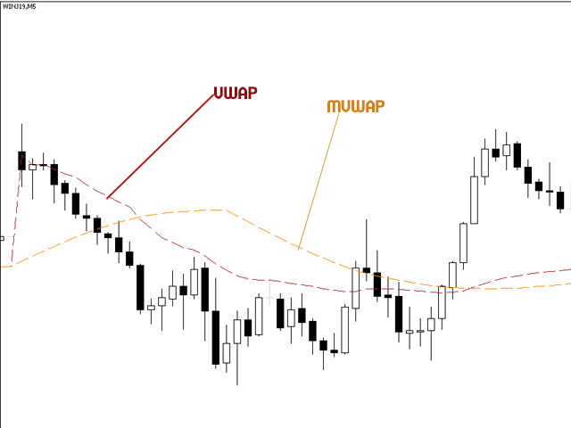

## Table of Contents

## What is VWAP and how is it calculated?

VWAP, or Volume Weighted Average Price, is a trading benchmark used by investors to determine the average price of a security over a specific time period, typically a trading day. It helps traders understand if they are getting a good deal on their trades by comparing their transaction prices to the VWAP. The main idea behind VWAP is that it gives more weight to the prices at which more shares were traded, making it a more accurate reflection of the market's movements.

To calculate VWAP, you start by multiplying the price of the security by the volume of shares traded at that price for each transaction throughout the day. You then add up all these values. Next, you add up the total volume of shares traded during the same period. Finally, you divide the total of the price-volume products by the total volume of shares traded. This gives you the VWAP, which traders can use to make more informed decisions about when to buy or sell a security.

## What is MVWAP and how does it differ from VWAP?

MVWAP stands for Moving Volume Weighted Average Price. It is similar to VWAP but includes a moving aspect, which means it keeps updating over time. Instead of calculating the average price for just one day, MVWAP can be set to cover multiple days or any other time period you choose. This makes MVWAP useful for traders who want to see trends over longer periods, not just a single day.

The main difference between MVWAP and VWAP is the time frame they cover. VWAP resets every day, so it's great for day traders who want to know the average price of a stock during that day. On the other hand, MVWAP can be adjusted to look at trends over several days or weeks. This can help traders who are looking at the bigger picture and want to understand how the price of a stock is moving over time. Both are useful, but they serve different purposes based on the time frame you're interested in.

## Why are VWAP and MVWAP important in trading?

VWAP and MVWAP are important tools for traders because they help them make better decisions about when to buy or sell a stock. VWAP shows the average price of a stock during a single day, taking into account the number of shares traded at each price. This helps day traders know if they are getting a good deal. If a trader buys a stock below the VWAP, it might be a good buy because it's cheaper than the average price that day. If they sell above the VWAP, it might be a good sell because it's more expensive than the average price.

MVWAP is also useful but looks at a longer period of time. It can be set to cover several days or even weeks, which helps traders see bigger trends. This is good for people who are not just trading for one day but want to understand how a stock's price is moving over time. By using MVWAP, traders can make more informed decisions about when to enter or [exit](/wiki/exit-strategy) a position based on longer-term trends. Both VWAP and MVWAP give traders important information that can help them trade smarter and possibly make more money.

## How can beginners use VWAP to make trading decisions?

Beginners can use VWAP to help them decide when to buy or sell a stock during the day. VWAP shows the average price of a stock, but it gives more importance to the prices where more shares were traded. If you're thinking about buying a stock, you can look at the VWAP. If the current price of the stock is below the VWAP, it might be a good time to buy because you're getting the stock for less than the average price that day. On the other hand, if you're thinking about selling a stock and the current price is above the VWAP, it could be a good time to sell because you're selling for more than the average price.

Using VWAP also helps beginners see how a stock is doing throughout the day. If the stock price stays above the VWAP, it might mean the stock is doing well and more people want to buy it. If the stock price stays below the VWAP, it might mean the stock is not doing so well and more people want to sell it. By watching how the stock price moves compared to the VWAP, beginners can get a better sense of the stock's performance and make smarter trading decisions.

## What are the basic trading strategies involving VWAP?

One basic trading strategy involving VWAP is to use it as a guide for buying and selling. If you want to buy a stock, you can wait for the price to go below the VWAP. This means you're getting the stock for less than the average price that day, which could be a good deal. On the other hand, if you want to sell a stock, you can wait for the price to go above the VWAP. This means you're selling the stock for more than the average price that day, which could also be a good deal.

Another strategy is to look at how the stock price moves around the VWAP during the day. If the stock price stays above the VWAP, it might mean that the stock is doing well and more people want to buy it. In this case, you might decide to buy the stock because it seems like it's going up. If the stock price stays below the VWAP, it might mean that the stock is not doing so well and more people want to sell it. In this case, you might decide to sell the stock or wait for a better time to buy.

A third strategy is to use VWAP to see if a stock is overbought or oversold. If the stock price moves far above the VWAP, it might be overbought, meaning it's gone up too much and might come back down soon. This could be a good time to sell. If the stock price moves far below the VWAP, it might be oversold, meaning it's gone down too much and might go back up soon. This could be a good time to buy. By watching how the stock price compares to the VWAP, you can make better trading decisions.

## How does MVWAP enhance trading strategies compared to VWAP alone?

MVWAP, or Moving Volume Weighted Average Price, helps traders look at trends over a longer time, not just one day like VWAP. This is good for people who are not just trading for one day but want to understand how a stock's price is moving over time. By using MVWAP, traders can make more informed decisions about when to buy or sell a stock based on bigger trends. For example, if the stock price stays above the MVWAP for a few days, it might mean the stock is doing well over time, and it could be a good time to buy.

Using MVWAP also lets traders see if a stock is overbought or oversold over a longer period. If the stock price moves far above the MVWAP for several days, it might mean the stock has gone up too much and could come back down soon. This could be a good time to sell. On the other hand, if the stock price moves far below the MVWAP for several days, it might mean the stock has gone down too much and could go back up soon. This could be a good time to buy. By looking at these longer trends with MVWAP, traders can make smarter decisions and possibly make more money.

## What are the common pitfalls when using VWAP and MVWAP in trading?

One common pitfall when using VWAP and MVWAP is relying on them too much. These tools are helpful, but they are not perfect. They can give you a good idea of where the average price is, but they don't tell you everything about the stock. Sometimes, the stock price can move away from the VWAP or MVWAP because of news or other things happening in the market. If you only look at VWAP or MVWAP and don't pay attention to other things, you might make a bad trading decision.

Another problem is that VWAP resets every day, so it's only good for [day trading](/wiki/day-trading-spy). If you're holding onto a stock for more than one day, VWAP won't help you as much. MVWAP can be better for longer periods, but you have to set the right time frame. If you set it too short, it won't show you the bigger trends. If you set it too long, it might not be helpful for making quick trading decisions. It's important to know what you're looking for and use the right tool for the right job.

## How can traders combine VWAP and MVWAP with other technical indicators?

Traders can combine VWAP and MVWAP with other technical indicators to get a better picture of the market. One way to do this is to use VWAP with moving averages. A moving average shows the average price of a stock over a certain number of days. If the stock price is above both the VWAP and the moving average, it might mean the stock is doing well and could be a good time to buy. If the stock price is below both, it might mean the stock is not doing well and could be a good time to sell. By looking at both VWAP and moving averages, traders can see if the stock is moving in the right direction.

Another way to use VWAP and MVWAP is with the Relative Strength Index (RSI). The RSI helps traders see if a stock is overbought or oversold. If the RSI is above 70, it might mean the stock is overbought and could go down soon. If the RSI is below 30, it might mean the stock is oversold and could go up soon. Traders can use VWAP or MVWAP to see where the average price is and then look at the RSI to see if the stock is overbought or oversold. This can help them decide if it's a good time to buy or sell the stock.

## What advanced trading strategies can be developed using VWAP and MVWAP?

One advanced trading strategy that uses VWAP and MVWAP is called the "VWAP Reversion Strategy." In this strategy, traders look for times when the stock price moves away from the VWAP and then comes back to it. They believe that if the stock price goes too far above or below the VWAP, it will eventually come back to the VWAP. So, if the stock price goes far above the VWAP, they might sell the stock, thinking it will come back down. If the stock price goes far below the VWAP, they might buy the stock, thinking it will come back up. By watching how the stock price moves around the VWAP, traders can try to make money from these price movements.

Another strategy is to use MVWAP to find longer-term trends and then use VWAP to make trades within those trends. For example, if the stock price is above the MVWAP for several days, it might mean the stock is in a long-term uptrend. Traders can use this information to decide to buy the stock. Then, they can use the VWAP to find the best time to buy within that day. If the stock price goes below the VWAP during the day, it might be a good time to buy because they're getting the stock for less than the average price that day. This way, traders can use both MVWAP and VWAP to make better trading decisions based on both long-term trends and short-term price movements.

## How can algorithmic trading leverage VWAP and MVWAP for better execution?

Algorithmic trading can use VWAP to help buy or sell stocks at the best prices during the day. When an algorithm wants to buy a lot of shares, it can spread out the buying throughout the day to get a price close to the VWAP. This helps the algorithm get a good average price for the shares. If the algorithm wants to sell a lot of shares, it can also spread out the selling to get a price close to the VWAP. This way, the algorithm can sell the shares for a good average price too. By using VWAP, the algorithm can make sure it's not buying or selling too much at once, which can help keep the price stable.

MVWAP can help algorithms look at longer-term trends and make better trading decisions over time. If an algorithm sees that the stock price is above the MVWAP for several days, it might decide to buy the stock because it's in a long-term uptrend. The algorithm can then use VWAP to find the best times to buy within each day. If the stock price goes below the VWAP during the day, the algorithm might buy more shares because it's getting them for less than the average price that day. By using both MVWAP and VWAP, the algorithm can make smarter trading decisions based on both long-term trends and short-term price movements.

## What are the statistical measures to evaluate the effectiveness of VWAP and MVWAP-based strategies?

To evaluate how well trading strategies using VWAP and MVWAP work, traders often look at the Sharpe Ratio. This measure compares the return of the strategy to the risk taken. A higher Sharpe Ratio means the strategy is doing a good job of making money without taking too much risk. Traders also look at the Sortino Ratio, which is similar to the Sharpe Ratio but focuses only on the bad risk, or downside risk. A higher Sortino Ratio means the strategy is good at avoiding big losses.

Another important measure is the Information Ratio. This tells traders how well the strategy is doing compared to a simple benchmark, like the market average. A higher Information Ratio means the strategy is beating the market by a lot. Traders also use the Maximum Drawdown to see the biggest loss the strategy had from its highest point to its lowest point. A smaller Maximum Drawdown means the strategy is not losing too much money at any one time. By looking at these measures, traders can see if their VWAP and MVWAP-based strategies are working well and making money safely.

## How do professional traders adapt VWAP and MVWAP strategies across different market conditions?

Professional traders use VWAP and MVWAP in different ways depending on what's happening in the market. In a bull market, where stock prices are going up, traders might use VWAP to buy stocks when the price dips below the VWAP during the day. They know the market is strong, so they see these dips as good chances to buy at a lower price. They might also use MVWAP to see if the stock is in a long-term uptrend. If the stock stays above the MVWAP for a while, they feel more confident that it's a good time to buy and hold onto the stock for longer.

In a bear market, where stock prices are going down, traders might use VWAP to sell stocks when the price goes above the VWAP. They know the market is weak, so they see these small rises as good chances to sell at a higher price. They might also use MVWAP to see if the stock is in a long-term downtrend. If the stock stays below the MVWAP for a while, they might decide to sell or short the stock, expecting the price to keep falling. By using VWAP and MVWAP, professional traders can make smart decisions no matter what the market is doing.

## What is VWAP and MVWAP?

VWAP, or Volume Weighted Average Price, is a trading benchmark that represents the average price a security has traded at during the day, based on both price and volume. This metric combines price action with trading volume, allowing traders to assess whether they have bought or sold at a favorable price. The calculation involves summing the total traded value (price multiplied by volume) of a security over a specified period and dividing by the total trading volume during that period.

Mathematically, VWAP is calculated as:

$$
\text{VWAP} = \frac{\sum (\text{Price}_i \times \text{Volume}_i)}{\sum \text{Volume}_i}
$$

where $\text{Price}_i$ and $\text{Volume}_i$ are the price and volume at each trade $i$.

Moving VWAP (MVWAP) extends the concept of VWAP over multiple periods, such as days or weeks, smoothing out the data to produce a continuous average that assists traders in identifying longer-term trends. By calculating VWAP for each day and then averaging these values over a user-defined number of past days, MVWAP offers insights into price movements beyond the confines of a single trading session.

By providing a weighted average price that considers the volumes of each transaction, both VWAP and MVWAP are vital tools in trading strategies. They are especially useful in [algorithmic trading](/wiki/algorithmic-trading), where rapid, data-driven decisions are paramount. These tools help traders avoid entering trades at inflated prices, thereby optimizing trade execution and aligning with market flows.

VWAP and MVWAP support short-term analysis due to their precision in measuring price action relative to [volume](/wiki/volume-trading-strategy). In algorithmic trading programs, they serve as benchmarks that aid in executing trades aligned with prevailing market conditions. Their ability to offer an accurate snapshot of market activity makes them indispensable for both retail and institutional traders.

## How do you calculate VWAP?

Calculating the Volume Weighted Average Price (VWAP) involves several systematic steps aimed at determining the average price a security has traded at, weighted by volume. The calculation starts by deciding on a time frame. Typical choices include a tick chart or intervals like 1-minute periods, where these intervals help break down the trading day into manageable segments for analysis.

1. **Calculate the Typical Price (TP):** For each chosen time interval, compute the typical price using the following formula:
$$
   TP = \frac{(High + Low + Close)}{3}

$$
   Here, "High", "Low", and "Close" refer to the high, low, and closing prices of the security during each interval.

2. **Determine the Time Period Volume (TPV):** Multiply the typical price by the volume for that period, yielding the Time Period Volume:
$$
   TPV = TP \times Volume

$$
   The TPV reflects the price movement's significance based on the traded volume during each specific interval.

3. **Compute Cumulative TPV and Volume:** Accumulate these TPV values over the trading day. Simultaneously, track the cumulative volume to ensure accuracy in weighting:
$$
   \text{Cumulative TPV} = \sum TPV_i

$$
$$
   \text{Cumulative Volume} = \sum Volume_i

$$

4. **Calculate VWAP:** The VWAP is obtained by dividing the cumulative TPV by the cumulative volume. This formula results in a weighted average price that reflects both price and volume for the trading day's duration:
$$
   VWAP = \frac{\text{Cumulative TPV}}{\text{Cumulative Volume}}

$$
   This figure represents the average price over the interval, weighted by the amount of trading activity.

For those seeking a broader temporal analysis, the Moving Volume Weighted Average Price (MVWAP) can be computed by averaging the VWAP values over several periods of interest, providing smoother trend information and extended insights into price movement. This approach enables traders to adjust to varying market conditions by extending the VWAP analysis over multiple trading days or predefined periods, adapting to both short-term market swings and longer-term trends.

## What are the differences between VWAP and MVWAP?

While VWAP offers a distinct daily perspective by resetting at the commencement of each trading day, MVWAP facilitates continuous analysis over several days. This aspect of MVWAP allows for observing price trends beyond the confines of a single trading session, thus extending its applicability to a broader range of trading strategies, including those that target mid-term or long-term horizons.

VWAP, being a daily metric, is particularly effective at confirming trade execution quality relative to the day's average price. It serves as a benchmark to assess if trades were completed at advantageous prices by comparing the execution price against the VWAP for that day. Traders frequently use VWAP for intraday strategies, especially in high-frequency trading environments, given its alignment with daily pricing dynamics.

In contrast, MVWAP provides traders with a running average of VWAP values over multiple periods. This continuous flow renders MVWAP more suitable for strategies that benefit from extended price trend analysis, hence making it a valuable tool for trend-following strategies and market [momentum](/wiki/momentum) assessments.

The primary distinction between VWAP and MVWAP lies in their calculation and application, offering distinct benefits depending on the trading strategy. While VWAP is calculated by the formula:

$$
VWAP = \frac{\sum_{1}^{n}(P_i \times V_i)}{\sum_{1}^{n}V_i}
$$

where $P_i$ represents the price of the i-th transaction and $V_i$ the volume, MVWAP extends this calculation over a series of days, effectively smoothing out short-term fluctuations for a consistent view of longer-term price trends.

This differentiation in approach grants traders enhanced flexibility in crafting and executing their strategies. Employing VWAP provides clear, immediate insights applicable to intraday tactics, whereas MVWAP equips traders with a nuanced understanding suitable for more extensive analyses and longer-term planning. Both indicators, therefore, play vital roles within a trader's toolkit, offering invaluable insight into market dynamics through their tailored applications.

## References & Further Reading

[1]: Afsaneh, A., & Gabardo, A. M. (2017). ["Using Volume Weighted Average Price in Portfolio Selection."](https://pubs.rsc.org/en/content/articlelanding/2018/ee/c8ee01684d) Decisions in Economics and Finance.

[2]: Chan, E. (2009). ["Quantitative Trading: How to Build Your Own Algorithmic Trading Business."](https://github.com/ftvision/quant_trading_echan_book) John Wiley & Sons.

[3]: Jansen, S. (2020). ["Machine Learning for Algorithmic Trading."](https://github.com/stefan-jansen/machine-learning-for-trading) Packt Publishing.

[4]: Lopez de Prado, M. (2018). ["Advances in Financial Machine Learning."](https://www.amazon.com/Advances-Financial-Machine-Learning-Marcos/dp/1119482089) John Wiley & Sons.

[5]: Tsai, C. F., & Hsiao, Y. C. (2010). ["Combining multiple feature selection methods for stock prediction: Union, intersection, and multi-intersection approaches."](https://www.sciencedirect.com/science/article/pii/S0167923610001521) Decision Support Systems, 50(1).