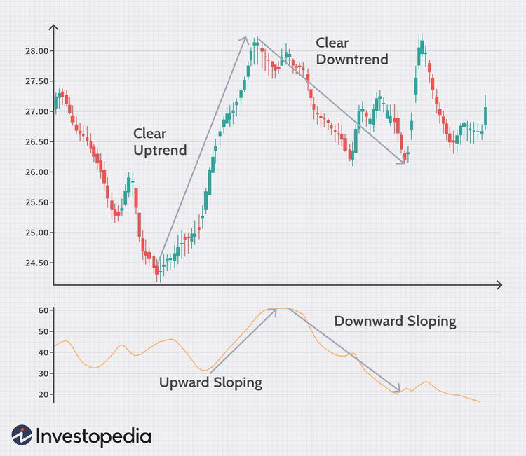

In today's fast-paced financial markets, traders and investors face an overwhelming deluge of information, commonly referred to as market noise. This influx of data, ranging from news releases and economic reports to social media activity and geopolitical events, can obscure critical trends and fundamental insights, making it challenging to make informed decisions. Market noise is not merely an inconvenience; it is a powerful force that can cloud judgment and obscure vital signals necessary for successful trading strategies.

This article aims to guide traders through this noisy landscape, presenting strategies to filter out unnecessary data and identify valuable signals effectively. A key focus will be on leveraging algorithmic trading, which utilizes computer programs to execute trades according to predefined criteria, ensuring precision and reducing human error. Algorithmic trading offers a pathway to operational efficiency, helping traders capitalize on lucrative opportunities without emotional interference.



The discussion will encompass understanding market noise, differentiating essential data from distractions, and employing algorithmic trading strategies that integrate noise reduction techniques. By grasping these concepts, traders can enhance their ability to navigate the complex and often turbulent waters of modern financial markets, leading to improved outcomes and greater profitability. This comprehensive approach aims to empower traders with the knowledge and tools needed to thrive amidst the constant cacophony of market information.

## Table of Contents

## Understanding Market Noise

Market noise encompasses the vast array of data points, news releases, and information that hinders clear market analysis. This noise is generated from a variety of sources including economic reports, social media chatter, geopolitical events, and unfounded rumors. These elements can obscure the essential signals that traders rely on to make informed decisions.

Economic reports often have the potential to create significant market movements. For instance, if the U.S. Federal Reserve releases an interest rate decision or unemployment figures are announced, these events generally attract notable market attention. However, not all reports hold substantial value, and distinguishing meaningful reports from inconsequential ones is a key challenge.

Social media has become another significant source of market noise. Platforms like Twitter and Reddit can quickly amplify rumors or speculative thoughts, impacting asset prices. The rapid dissemination of information, whether factual or not, can lead to volatile price swings and challenge traders in filtering the valuable from the trivial.

Geopolitical events introduce further complexity. Negotiations between nations, sanctions, and trade agreements can all cause abrupt changes in market sentiment, affecting investor decisions. Often, the uncertainty surrounding such events can lead to erratic market behavior, contributing to the noise.

High-frequency trading ([HFT](/wiki/high-frequency-trading-strategies)) and algorithmic systems have their influence as well. These methods can exacerbate market noise through the sheer [volume](/wiki/volume-trading-strategy) and speed at which trades are executed. Algorithms often react to patterns and trends dictated by the prevailing noise rather than the underlying fundamentals of an asset. This can lead to short-term [volatility](/wiki/volatility-trading-strategies) and complicate the task of identifying true market signals.

Effectively distinguishing valuable information from market noise remains essential for developing successful trading strategies and decision-making processes. A trader’s skill in filtering out this noise is pivotal in determining their capacity to make well-informed investments. While the noise cannot be entirely eliminated, traders employ various strategies to mitigate its impact and focus on data that aligns with their investment goals. By honing the ability to filter market noise, investors position themselves to improve their strategic decision-making and potentially enhance their trading outcomes.

## Techniques for Filtering Market Noise

Market noise, characterized by an overwhelming influx of information from varied sources, poses a significant challenge to traders seeking to make informed decisions. Effectively filtering this noise requires a systematic approach, beginning with a clear understanding of information sources and an emphasis on identifying credible influencers. Critical to this process is the application of [fundamental analysis](/wiki/fundamental-analysis), whereby traders focus on key economic indicators and earnings reports to isolate news that genuinely impacts market dynamics. For instance, when significant economic data such as GDP growth rates or unemployment figures are released, they often provoke substantial market reactions, indicating their importance over routine news stories.

The ability to discern meaningful developments from mere speculation is further enhanced by observing market reactions to news. Large movements in asset prices, for example, can highlight truly impactful news. To navigate speculative content, traders are advised to cross-verify information across multiple reputable sources. This practice reduces the risks associated with acting on potentially misleading data, thus diminishing the effect of false signals prevalent in market noise.

Retaining a long-term perspective also plays a crucial role in filtering market noise. Markets are inherently volatile, and short-term fluctuations can often be misleading. By staying focused on overarching trends and fundamental data, traders can avoid reactive decisions driven by short-lived market tremors. This disciplined approach not only aids in reducing the noise but also aligns with strategies designed for sustainable financial growth. Implementing these techniques requires patience and consistency, but they provide a solid foundation for traders aiming to achieve clarity in the noisy landscape of financial markets.

## Algorithmic Trading Strategies

Algorithmic trading, often referred to as algo trading, involves utilizing computer programs to execute trades based on specified criteria. This automated approach aids in eliminating human errors and emotional biases by allowing trades to be conducted based on precise parameters such as timing, price, and volume. The goal is to optimize trade execution, often achieving speeds and efficiencies that surpass human capabilities.

One of the principal strategies within algo trading is [trend following](/wiki/trend-following). This involves developing algorithms designed to identify and follow existing market trends, buying securities when their prices are trending upwards and selling them when they begin to fall. This strategy leverages [momentum](/wiki/momentum) and often uses indicators such as moving averages to determine entry and [exit](/wiki/exit-strategy) points.

Arbitrage is another common strategy, which seeks to exploit price differences of the same asset in different markets. For instance, if a stock is priced differently on two exchanges, an algorithm can be programmed to simultaneously buy at the lower price and sell at the higher price, thus securing a profit. This requires high-speed execution to capitalize on these fleeting opportunities.

Mean reversion strategies are based on the statistical assumption that an asset's price will revert to its mean or average level over time. Algorithms utilizing this strategy will identify when a security is overbought or oversold relative to its historical average and execute trades that anticipate a regression towards the mean.

Lastly, market timing strategies involve predicting future price movements of financial instruments based on analysis of historical data and trends. These algorithms attempt to outperform the market by determining the optimal times to enter or exit a position.

Python is often the programming language of choice for developing these algorithms due to its simplicity and the availability of libraries such as NumPy and pandas for numerical and data analysis. A simple example of a mean reversion strategy in Python might involve the following code:

```python
import numpy as np
import pandas as pd

# Create a simple moving average function
def calculate_sma(data, window):
    return data.rolling(window=window).mean()

# Example: Assume we have a DataFrame 'df' with a 'prices' column
df['sma_20'] = calculate_sma(df['prices'], window=20)

# Generate trading signals based on mean reversion
df['signal'] = 0
df.loc[df['prices'] < df['sma_20'], 'signal'] = 1  # Buy signal
df.loc[df['prices'] > df['sma_20'], 'signal'] = -1 # Sell signal

# Display the trading signals
print(df[['prices', 'sma_20', 'signal']])
```

This script calculates a 20-day simple moving average (SMA) and generates buy or sell signals based on whether the current price is below or above the SMA. This straightforward example illustrates how algorithmic strategies can be automated to make efficient and prompt trading decisions.

By leveraging such algorithms, traders can enhance the precision and speed of their operations, effectively capitalizing on market opportunities while minimizing risks associated with human intervention.

## Implementing Noise Reduction Techniques in Algo Trading

Combining noise reduction techniques with algorithmic strategies can significantly enhance trading efficacy. Utilizing specialized charts such as Renko, Heikin-Ashi, and Kagi in conjunction with algorithmic methods is an effective approach to improving trend analysis. These chart types filter out minor price fluctuations by focusing on larger price movements, thus providing a clearer view of the underlying trend. Renko charts, for instance, are constructed using fixed brick sizes, which highlight trends by eliminating smaller noise-induced price oscillations. Heikin-Ashi charts calculate and plot daily averages that smooth out price volatility, while Kagi charts emphasize shifts in supply and demand without being tied to time intervals.

Algorithms can be programmed to ignore minor market corrections and instead focus on identifying substantial trends. This is achieved by utilizing quantitative filters within the algorithm, which are designed to exclude insignificant price changes and emphasize more meaningful market movements. By focusing on larger trends, traders can reduce the number of false signals and improve decision-making accuracy.

Market indicators such as the directional movement index (DMI) are useful tools within algorithmic systems to measure trend strength. The DMI comprises two main components – the positive directional indicator (+DI) and the negative directional indicator (-DI). Together with the average directional index (ADX), the DMI helps assess the strength of the trend. Algorithms can be programmed to interpret these indicators, thus distinguishing between strong and weak trends and making more informed trading decisions.

By merging these noise reduction techniques with [algorithmic trading](/wiki/algorithmic-trading), traders can create robust strategies that minimize false signals and capitalize on genuine trends. This synergy enables traders to enhance market operations' efficiency and accuracy, fostering improved outcomes in trading performance. Consequently, the application of these integrated strategies equips traders with a powerful toolkit for navigating complex and often noisy financial landscapes.

## Managing Risks in Noisy Market Conditions

Risk management is essential in mitigating the impact of noisy market conditions, particularly for automated trading systems. Effective risk management techniques help protect against significant financial losses by systematically addressing the various uncertainties and volatilities in the market.

One fundamental approach to managing risk is the implementation of stop-loss and limit orders. Stop-loss orders automatically sell a security when its price falls below a predetermined level, thereby limiting potential losses. Likewise, limit orders control the price at which a trade is executed, ensuring that trades are made at desirable levels and preventing unforeseen swings from affecting the portfolio adversely.

Diversification of assets is another crucial strategy. By spreading investments across a range of asset classes, traders can reduce the impact of volatility in any single market segment. This approach balances the portfolio, thereby minimizing the risk associated with market fluctuations. Setting realistic risk thresholds for investments further enhances diversification efforts, allowing traders to strategically allocate resources according to individual risk tolerances.

Ongoing monitoring and adjustment of trading algorithms are critical for maintaining alignment with the current market conditions. Algorithms need regular updates to incorporate changes in market dynamics and ensure that they are operating effectively. This can involve modifying the parameters used in trading strategies to better fit shifting trends and emerging data.

Technological vulnerabilities also present substantial risks in noisy market environments. Trading systems must be fortified against potential disruptions, whether from cyber threats or system malfunctions. Regular updates and security enhancements are necessary to maintain the integrity and reliability of these systems.

To help illustrate these points, consider a basic example in Python that uses a dynamic stop-loss strategy. This script adjusts the stop-loss level based on the volatility of the asset:

```python
import numpy as np

def calculate_stop_loss(current_price, volatility, risk_tolerance):
    # Calculate stop-loss as a function of current price, market volatility, and risk tolerance
    return current_price - (volatility * risk_tolerance)

# Example usage
current_price = 100  # Current price of the asset
volatility = 2.5     # Estimated volatility
risk_tolerance = 3   # User-defined risk tolerance level

stop_loss = calculate_stop_loss(current_price, volatility, risk_tolerance)
print(f"The dynamic stop-loss level is set at: {stop_loss}")
```

This simple script demonstrates how risk thresholding may automate decision-making processes, adjusting in response to market conditions to maintain appropriate risk levels.

Through strategic risk management practices such as stop-loss implementation, diversification, vigilant algorithm monitoring, and addressing potential technological vulnerabilities, traders can strengthen their portfolios against the volatilities of noisy markets.

## Conclusion

Market noise is an unavoidable aspect of modern trading, but it can be effectively managed with the right tools and strategies. By leveraging algorithmic trading combined with noise reduction techniques, traders can enhance their market operations insights. The application of algorithmic trading allows for systematic execution based on precise criteria like timing, price, and volume, minimizing human error and emotional biases. Concurrently, filtering out market noise ensures that traders focus on substantial trends rather than temporary fluctuations.

Continual improvement and adaptation remain essential strategies because market conditions are always evolving. As new data sources and trading technologies emerge, traders must refine their algorithms and noise filtering methods. Regular updates and refinements align trading systems with current market dynamics, ensuring that traders stay competitive and informed.

Through the strategic use of algorithms and a disciplined approach, profitability and decision-making accuracy can be significantly increased. Algorithms designed to minimize noise effectively capture genuine market signals, allowing traders to make timely and informed decisions, thereby enhancing returns. A disciplined approach that involves monitoring, risk management, and strategy refinement further fortifies trading systems against volatility.

Traders equipped with these strategies are better positioned to prosper in dynamic and often tumultuous market environments. By integrating advanced algorithmic strategies with robust noise reduction techniques, traders can navigate market complexities more efficiently, ensuring that they capitalize on opportunities while mitigating risks. This comprehensive approach equips traders to thrive amidst the challenges of modern financial markets.

## References & Further Reading

[1]: Bergstra, J., Bardenet, R., Bengio, Y., & Kégl, B. (2011). ["Algorithms for Hyper-Parameter Optimization."](https://papers.nips.cc/paper/4443-algorithms-for-hyper-parameter-optimization) Advances in Neural Information Processing Systems 24.

[2]: ["Advances in Financial Machine Learning"](https://www.amazon.com/Advances-Financial-Machine-Learning-Marcos/dp/1119482089) by Marcos Lopez de Prado

[3]: ["Evidence-Based Technical Analysis: Applying the Scientific Method and Statistical Inference to Trading Signals"](https://www.amazon.com/Evidence-Based-Technical-Analysis-Scientific-Statistical/dp/0470008741) by David Aronson

[4]: ["Machine Learning for Algorithmic Trading"](https://github.com/stefan-jansen/machine-learning-for-trading) by Stefan Jansen

[5]: ["Quantitative Trading: How to Build Your Own Algorithmic Trading Business"](https://www.amazon.com/Quantitative-Trading-Build-Algorithmic-Business/dp/1119800064) by Ernest P. Chan