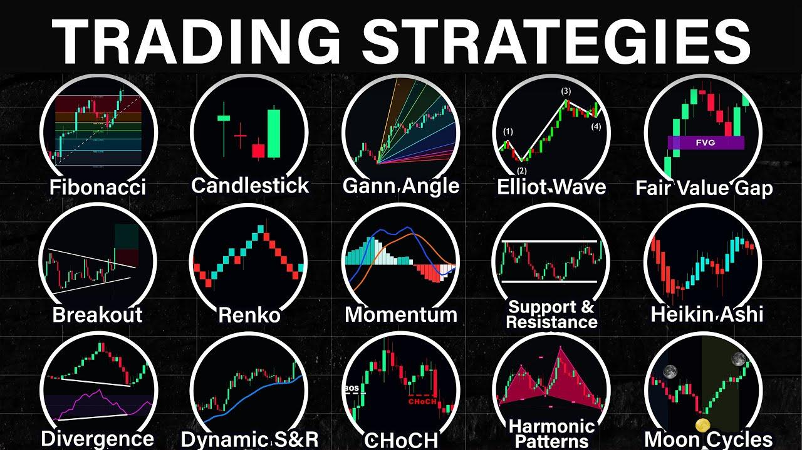

## Table of Contents

## What is a trading strategy?

A trading strategy is a set of rules and guidelines that a trader follows to make decisions about buying and selling assets like stocks, currencies, or commodities. It helps traders manage their investments by providing a structured approach to entering and exiting trades. A good trading strategy takes into account factors like market trends, risk management, and the trader's personal goals and risk tolerance.

Having a trading strategy is important because it helps traders stay disciplined and avoid making emotional decisions. For example, a strategy might include rules about when to buy a stock based on certain price levels or market conditions, and when to sell it to take profits or cut losses. By following a strategy, traders can make more consistent and rational decisions, which can lead to better long-term results in the markets.

## Why are trading strategies important for traders?

Trading strategies are important for traders because they help make trading easier and more organized. A trading strategy is like a plan that tells a trader when to buy and sell things like stocks or currencies. It helps traders know what to do without having to guess or make quick decisions based on feelings. By following a plan, traders can feel more confident and less stressed about their choices.

Another reason trading strategies are important is that they help traders manage risk. Every time someone trades, there's a chance they could lose money. A good strategy includes rules about how much money to risk on each trade and when to stop trading if things aren't going well. This helps traders protect their money and avoid big losses. Overall, a trading strategy makes trading safer and more predictable, which can lead to better results over time.

## What are the basic types of trading strategies?

There are several basic types of trading strategies that traders use. One common type is trend following. This strategy involves looking at the market to see if prices are going up or down over time. If prices are going up, a trend follower will buy, hoping the price will keep going up. If prices are going down, they might sell or short sell, hoping to make money as the price falls. Another type is mean reversion, where traders believe that prices will eventually return to their average levels. So, if a price goes too high, they might sell, expecting it to come back down, and if it goes too low, they might buy, expecting it to go back up.

Another basic type of trading strategy is [breakout](/wiki/breakout-trading) trading. This involves watching for prices to move outside of a certain range. When a price breaks out of its usual range, breakout traders will buy if it breaks to the upside or sell if it breaks to the downside, hoping the new trend will continue. Lastly, there's [scalping](/wiki/gamma-scalping), which is a strategy where traders make lots of small trades to take advantage of tiny price changes. Scalpers aim to make small profits many times throughout the day, adding up to a bigger total. Each of these strategies has its own way of trying to make money in the markets, and traders often pick the one that fits their style and goals best.

## How do you choose the right trading strategy for your goals?

Choosing the right trading strategy for your goals starts with understanding what you want to achieve. Are you looking to make quick profits, or are you in it for the long haul? Knowing your goals helps you decide if you want a strategy that focuses on short-term gains, like scalping, or one that looks at bigger trends over time, like trend following. It's also important to think about how much time you can spend trading. If you have a busy life, a strategy that requires constant attention might not be the best fit.

Next, consider how much risk you're willing to take. Some strategies, like breakout trading, can be riskier because they depend on big price moves that might not happen. If you don't like taking big risks, a strategy like mean reversion might be better because it aims for smaller, more predictable gains. It's also a good idea to test different strategies using a demo account or with small amounts of money to see which one works best for you. By matching your goals, time, and risk tolerance with the right strategy, you can trade more confidently and effectively.

## What is the difference between technical and fundamental analysis in trading?

Technical analysis and [fundamental analysis](/wiki/fundamental-analysis) are two different ways traders look at the market to decide when to buy or sell. Technical analysis is all about looking at charts and numbers to see patterns in how prices move. Traders who use technical analysis don't care much about the company or the economy. They focus on things like price trends, [volume](/wiki/volume-trading-strategy), and special indicators to guess where the price might go next. It's like trying to predict the future by looking at what has happened before.

On the other hand, fundamental analysis is about understanding the real value of what you're trading. It looks at things like a company's earnings, how much money it makes, and even bigger things like the economy or interest rates. Traders using fundamental analysis try to figure out if a stock or currency is a good deal by comparing its price to what they think it's really worth. It's more about digging into the details and making a decision based on the health and potential of the company or the economy.

## Can you explain the concept of trend following in trading?

Trend following in trading is a strategy where traders try to make money by following the direction that prices are moving. They look at charts and other data to see if prices are going up or down over time. If they see that prices have been going up, they will buy, hoping that the price will keep going up. If they see that prices have been going down, they might sell or short sell, hoping to make money as the price continues to fall. The idea is to jump on the trend and ride it as long as it lasts.

The key to trend following is patience and discipline. Traders need to wait for clear signs that a trend is starting before they make a move. Once they're in a trade, they have to stick with it, even if the price goes up and down a bit along the way. They only get out when there are clear signs that the trend might be over. This strategy can be good because it doesn't try to predict the future; it just follows what the market is doing. But it can also be risky because trends can change suddenly, and traders need to be ready to change their plans if the market does something unexpected.

## What are some common indicators used in technical trading strategies?

In technical trading, traders use different indicators to help them decide when to buy or sell. One common indicator is the moving average, which smooths out price data to show a trend over time. There are simple moving averages, which just average the price over a set number of days, and exponential moving averages, which give more weight to recent prices. Traders often use two moving averages, a short-term one and a long-term one, and watch for when they cross each other. If the short-term average goes above the long-term average, it might be a good time to buy, and if it goes below, it might be a good time to sell.

Another popular indicator is the Relative Strength Index (RSI), which measures how fast and how much a price is changing. It's shown on a scale from 0 to 100. If the RSI is above 70, it might mean the price is too high and could go down soon, which is called overbought. If it's below 30, it might mean the price is too low and could go up soon, which is called oversold. Traders use this to decide when to enter or exit a trade. Other indicators include the Moving Average Convergence Divergence (MACD), which looks at the difference between two moving averages, and Bollinger Bands, which show how much a price is moving around its average. Each of these helps traders see different parts of what's happening in the market.

## How do risk management techniques integrate with trading strategies?

Risk management techniques are a big part of trading strategies because they help traders keep their money safe. One way traders manage risk is by setting stop-loss orders. A stop-loss order tells the computer to sell a stock if it goes down to a certain price, so the trader doesn't lose too much money. Another way is by deciding how much money to risk on each trade. Traders might say they will only risk a small part of their money, like 1% or 2%, on any one trade. This way, even if they lose, they still have most of their money left to try again.

These risk management techniques fit into trading strategies by making rules that traders follow. For example, a trend following strategy might say to buy a stock if the price goes above a certain level, but also to set a stop-loss order just below that level. This way, the trader can try to make money if the price keeps going up, but they won't lose too much if the price goes down instead. By mixing risk management with trading strategies, traders can feel more secure and make better decisions without letting fear or greed take over.

## What are advanced trading strategies like algorithmic trading and how do they work?

Advanced trading strategies like [algorithmic trading](/wiki/algorithmic-trading) use computers to make trading decisions. Instead of a person deciding when to buy or sell, a computer program does it based on rules set by the trader. These rules can be very detailed and look at lots of data very quickly. For example, a program might be told to buy a stock if its price goes up by a certain amount and sell it if the price goes down by another amount. Because computers can do this much faster than people, algorithmic trading can be used to make many trades in a short time, like in scalping.

Algorithmic trading can also use more complex strategies. Some programs use [machine learning](/wiki/machine-learning), which means they can learn from past trades and get better over time. Others might look at lots of different information at once, like news, social media, and market data, to decide what to do. This can help traders find patterns and opportunities that are hard for people to see. Even though these strategies are advanced, they still need good risk management rules to keep the trading safe and profitable.

## How can traders backtest their trading strategies?

Backtesting is a way for traders to see how well their trading strategies would have worked in the past. They use a computer program to look at old market data and pretend to trade using their strategy rules. This helps them see if their strategy could have made money or if it would have lost money. By doing this, traders can find out if their strategy needs to be changed or if it's good enough to use in real trading.

To backtest a strategy, traders need to get historical data for the markets they want to trade in. They then set up their strategy rules in a backtesting software. The software will go through the data and apply the rules to see what would have happened. Traders can then look at the results to see how much money they would have made or lost, how often they would have won or lost, and other important information. This helps them make their strategy better before they start using real money.

## What are the psychological aspects of implementing a trading strategy?

When traders use a trading strategy, their feelings can really affect how well they do. It's easy to feel scared or excited when trading, and these feelings can make traders do things that aren't part of their plan. For example, if a trader sees their stock going down, they might feel scared and sell it too soon, even if their strategy says to wait. Or, if they see a stock going up fast, they might get too excited and buy more than they should. To stick to their strategy, traders need to stay calm and not let their feelings take over.

Another important part of the psychology of trading is being patient and disciplined. A good trading strategy might tell a trader to wait for the right time to buy or sell, but waiting can be hard. Traders need to trust their plan and not change it just because they feel impatient or want to do something different. It's also important for traders to learn from their mistakes and keep improving their strategy without getting too upset about losses. By staying focused and following their plan, traders can do better in the long run.

## How do market conditions affect the performance of different trading strategies?

Market conditions can change how well different trading strategies work. When the market is going up and everything is doing well, strategies like trend following can do really well because they follow the upward movement. But if the market is going down or is very unpredictable, trend following might not work as well because it's hard to find a clear trend to follow. On the other hand, strategies like mean reversion, which look for prices to go back to normal after big moves, can do better when the market is moving a lot but not in a clear direction.

Different strategies also work better in different types of markets. For example, breakout trading can be good in a market that's moving a lot and breaking out of its usual range. But if the market is calm and not moving much, breakout trading might not find many opportunities. Scalping, where traders make lots of small trades, can work well in a fast-moving market with lots of small price changes. But in a slow market, there might not be enough small moves to make scalping profitable. So, traders need to think about what the market is doing and pick a strategy that fits those conditions.

## What are Swing Trading Strategies?

Swing trading involves holding positions in financial instruments for a period ranging from a few days to several weeks, with the objective of capturing potential gains from anticipated upward or downward market shifts. This trading strategy capitalizes on short- to medium-term movements within a defined trend, whether in individual stocks or broader indices, providing traders an opportunity to achieve substantial returns within relatively brief time frames. 

A successful swing trading approach often leverages a combination of technical analysis tools designed to identify entry and exit points within prevailing market trends. Among the most prevalent technical indicators are moving averages and momentum indicators. Moving averages, such as the Simple Moving Average (SMA) and the Exponential Moving Average (EMA), are commonly employed to smooth out price data, thereby highlighting the direction and strength of a trend. For instance, the formula for calculating a simple moving average over a given window of $n$ days is:

$$
SMA = \frac{1}{n} \sum_{i=0}^{n-1} P_i
$$

where $P_i$ represents the price of the asset at day $i$. An EMA, which gives more weight to recent prices, is calculated using a smoothing factor $\alpha$:

$$
EMA_t = P_t \times \alpha + EMA_{t-1} \times (1-\alpha)
$$

where $\alpha = \frac{2}{n+1}$.

On the other hand, [momentum](/wiki/momentum) indicators, such as the Relative Strength Index (RSI), serve as vital tools for measuring the velocity and magnitude of price movements. The RSI is calculated using the formula:

$$
RSI = 100 - \left( \frac{100}{1 + \frac{\text{Average Gain}}{\text{Average Loss}}} \right)
$$

By analyzing these indicators, traders aim to detect overbought or oversold conditions that may precede reversals.

For execution, traders might employ trading platforms equipped with algorithmic capabilities to automate their strategies, reducing the influence of emotions and enhancing consistency. The integration of these technical indicators with a disciplined approach to risk management is critical for realizing the potential benefits of swing trading. By systematically applying these tools, traders can systematically capitalize on price fluctuations, aligning their trades with the natural ebb and flow of financial markets.

## What are Trend Following Strategies?

Trend following strategies are grounded in the principle of capitalizing on the momentum of asset price trends. By aligning trades with the prevailing market direction, traders aim to profit from sustained price movements. The fundamental tools central to this strategy are moving averages and trend lines.

Moving averages, such as the simple moving average (SMA) and the exponential moving average (EMA), help smooth out price data to identify the direction of the trend. The SMA is calculated by taking the arithmetic mean of a given set of prices over a defined period. The formula for an SMA over $n$ periods is given by:

$$
\text{SMA} = \frac{P_1 + P_2 + \ldots + P_n}{n}
$$

where $P_1, P_2, \ldots, P_n$ are the prices of the asset. On the other hand, the EMA gives more weight to recent prices, thus reacting more quickly to price changes, making it useful for trend identification.

Trend lines are another vital tool, helping traders visually capture the direction of the trend by connecting sequential highs (in a downtrend) or lows (in an uptrend). They serve as a psychological barrier where buying or selling pressures may occur, thus providing potential entry or [exit](/wiki/exit-strategy) points.

This strategy's popularity among traders is due to its simplicity and the famous market adage "the trend is your friend," which underscores the belief that following trends rather than predicting reversals often creates favorable trading opportunities. Although past performance is not an indicator of future results, [backtesting](/wiki/backtesting) over historical data has shown that [trend following](/wiki/trend-following) can work across various asset classes in different market conditions. Understanding these trends and aligning strategies accordingly can help mitigate risk while taking advantage of long-term price modifications.

## What are Mean Reversion Strategies?

Mean reversion strategies stem from the hypothesis that asset prices and returns will eventually revert to their long-term mean or average level. This concept is grounded in the belief that excessive deviations in asset prices are corrected over time, allowing for opportunities to buy low and sell high. Mean reversion trading can be particularly effective in markets characterized by periodic fluctuations, offering a systematic approach to identifying potential entry and exit points.

One of the core components of mean reversion strategies is statistical analysis, which helps in discerning when an asset is significantly overvalued or undervalued. By quantifying the extent of price deviations from the mean, traders can make informed decisions on whether an asset is likely to revert to its historical average. This approach often involves conducting analyses such as Bollinger Bands, which use standard deviation around a moving average to identify overbought or oversold conditions.

Oscillators play a crucial role in supporting mean reversion strategies. Tools like the Relative Strength Index (RSI) or the Stochastic Oscillator measure the magnitude of recent price changes to evaluate whether an asset is overbought or oversold. These indicators help traders determine optimal buy or sell points by signaling potential reversals in price trends. When an oscillator moves beyond certain threshold levels, it suggests that the asset price is far from its mean, providing an opportunity to execute mean-reverting trades.

Regression analysis offers another statistical method for mean reversion strategy. Linear regression can help model and forecast future price movements by analyzing the relationship between an asset's current price and its historical average. Traders use regression models to predict a reversion path and determine price targets for entering or exiting trades. For example, a simple linear regression model can be represented as:

$$
P_t = \alpha + \beta T + \epsilon_t
$$

Where $P_t$ is the price of the asset at time $t$, $\alpha$ is the intercept, $\beta$ is the slope of the regression line, $T$ represents the time variable, and $\epsilon_t$ is the error term. The fit of this model can inform traders of the potential for a mean reversion opportunity by indicating how far the current price is from the predicted mean price.

Python programming can further enhance the application of mean reversion strategies by automating the calculation of key indicators and executing trades based on predefined signals. A basic Python implementation might involve using libraries like NumPy and Pandas to calculate moving averages and oscillators, with automated alerts for potential trading opportunities.

In summary, mean reversion strategies leverage statistical analysis and technical indicators to capitalize on the natural tendency of asset prices to revert to the mean. This approach necessitates a disciplined application of analytical tools to identify overextended conditions and provides a structured framework for making trading decisions based on observed deviations from historical norms.

## What are Technical Indicator Strategies?

Technical indicator strategies in algorithmic trading rely on a systematic approach to forecasting future price movements by analyzing past market data. These strategies involve using a variety of technical indicators to make informed trading decisions. Common indicators include moving averages, the Moving Average Convergence Divergence (MACD), and stochastic oscillators.

Moving averages are one of the simplest and most widely used technical indicators. They smooth out price data by creating a constantly updated average price, which can help identify trends over a specified period. For example, the simple moving average (SMA) is calculated by adding the closing prices over a certain number of periods and then dividing by the number of periods:

$$
\text{SMA} = \frac{P_1 + P_2 + \cdots + P_n}{n}
$$

Where $P_i$ is the closing price for a given period, and $n$ is the number of periods.

The MACD is another popular indicator that measures the relationship between two exponential moving averages (EMAs) of a security’s price. The MACD line is derived by subtracting the 26-day EMA from the 12-day EMA, while a 9-day EMA of the MACD line, known as the "signal line," is often plotted alongside to identify buy or sell signals. The MACD formula is:

$$
\text{MACD} = \text{EMA}_{12} - \text{EMA}_{26}
$$

Stochastic oscillators assess the closing price relative to the price range over a certain period to generate overbought or oversold signals. This can help traders identify potential reversal points. The stochastic oscillator consists of two lines: the %K, which represents the current closing price, and the %D, which is a moving average of %K.

Integrating multiple indicators into a cohesive trading system can enhance decision-making. Traders often use a combination of indicators to confirm signals and reduce the likelihood of false positives. For example, a trader might use moving averages to identify the trend direction and stochastics to pinpoint entry and exit points within that trend.

Python provides tools for implementing these strategies programmatically, using libraries such as pandas for data handling and TA-Lib for technical analysis. Below is a simple Python code snippet that calculates the SMA and MACD using pandas and TA-Lib:

```python
import pandas as pd
import talib

# Assuming 'data' is a pandas DataFrame with a 'Close' column
data['SMA'] = data['Close'].rolling(window=20).mean()
data['MACD'], data['MACD_signal'], data['MACD_hist'] = talib.MACD(data['Close'], fastperiod=12, slowperiod=26, signalperiod=9)

# Display the result
print(data[['Close', 'SMA', 'MACD', 'MACD_signal']].tail())
```

By leveraging multiple technical indicators, traders can develop robust algorithmic trading strategies that capitalize on market trends and patterns, potentially enhancing trade accuracy and profitability.

## References & Further Reading

[1]: Bergstra, J., Bardenet, R., Bengio, Y., & Kégl, B. (2011). ["Algorithms for Hyper-Parameter Optimization."](https://papers.nips.cc/paper/4443-algorithms-for-hyper-parameter-optimization) Advances in Neural Information Processing Systems 24.

[2]: ["Advances in Financial Machine Learning"](https://www.amazon.com/Advances-Financial-Machine-Learning-Marcos/dp/1119482089) by Marcos Lopez de Prado

[3]: ["Evidence-Based Technical Analysis: Applying the Scientific Method and Statistical Inference to Trading Signals"](https://www.amazon.com/Evidence-Based-Technical-Analysis-Scientific-Statistical/dp/0470008741) by David Aronson

[4]: ["Machine Learning for Algorithmic Trading"](https://github.com/stefan-jansen/machine-learning-for-trading) by Stefan Jansen

[5]: ["Quantitative Trading: How to Build Your Own Algorithmic Trading Business"](https://books.google.com/books/about/Quantitative_Trading.html?id=j70yEAAAQBAJ) by Ernest P. Chan