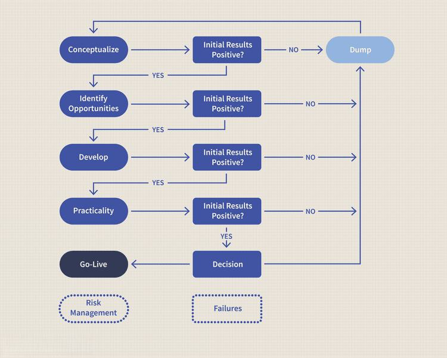

Investment strategies play a pivotal role in the financial markets, aiding investors in the pursuit of maximizing returns while simultaneously minimizing risks. These strategies are more important than ever in the context of a rapidly evolving landscape heavily influenced by technological advancements such as algorithmic trading. Algorithmic trading refers to the use of computer algorithms to execute trades based on pre-determined criteria, focusing on speed and efficiency. This development necessitates a deeper understanding of various trading strategies by investors to remain competitive and informed.

The exploration of investment strategy development encompasses not only the methods by which investors can formulate their strategies but also the various types of trading strategies that can be employed. This includes traditional approaches like growth investing and value investing, as well as more technologically driven strategies like those found in algorithmic trading. With the rapid rise of algorithmic trading, having a grasp of these concepts is essential for investors seeking to improve their portfolio performance.



A systematic approach to understanding these strategies involves examining strategic methodologies, critical trading considerations, and the significant impact of technology-driven algorithms on market dynamics. By adopting these strategies, investors can make informed decisions, assess potential risks, and unlock opportunities for growth. The ultimate objective is to equip both beginners and seasoned traders with a comprehensive guide that enhances their understanding and application of these strategies in achieving their financial goals.

## Table of Contents

## Understanding Investment Strategies

An investment strategy is a meticulously crafted plan aimed at achieving specific financial and investment objectives. By taking into account the risk tolerance and time horizons of individual investors, these strategies can be effectively customized. Growth investing, value investing, and income investing are among the most prevalent strategies employed by investors. 

Growth investing focuses on identifying companies with potential for above-average growth. Investors in growth stocks often prioritize capital appreciation, anticipating that the increased value of the company's share price will yield significant returns. Conversely, value investing involves identifying undervalued stocks that are trading below their intrinsic value, with the expectation that the market will eventually acknowledge the true worth of these assets, thereby increasing their value. Income investing, on the other hand, seeks to generate regular income through dividends or interest payments, often attracting investors interested in stable cash flow.

Diversification plays a critical role in optimizing investment outcomes. By allocating resources across different asset classes, industries, and geographic regions, investors can mitigate risks associated with market volatility. Regular rebalancing ensures that the portfolio maintains its intended risk profile and asset allocation, despite market fluctuations. This practice involves periodically adjusting the composition of the portfolio to align with the investor's long-term investment goals.

Strategic development of an investment plan necessitates a comprehensive understanding of economic indicators and market cycles. Economic indicators like GDP growth rates, unemployment figures, and inflation rates offer insights into the overall health of an economy and can inform investment decisions. Market cycles, characterized by periods of expansion and contraction, can significantly impact asset prices. Investors who understand these cycles can better time their investments to maximize returns.

Adaptability is crucial for long-term success in investing. Market conditions are dynamic and can shift due to a myriad of factors, including economic policy changes, geopolitical events, and technological advancements. An effective investment strategy is flexible, allowing investors to adjust their approach in response to changing market environments. This adaptability ensures that investors can capitalize on emerging opportunities while also navigating potential risks.

Overall, the development and implementation of a well-considered investment strategy can provide a framework for achieving financial goals while managing risks. By incorporating a thorough understanding of market dynamics and ensuring that strategies are tailored to individual needs, investors can enhance the performance of their portfolios over time.

## Developing Trading Strategies

A trading strategy provides a systematic approach for buying and selling assets in the markets. This approach is integral to navigate the complexities and volatilities inherent in financial trading. It primarily embodies a disciplined plan that is often grounded either in technical analysis or [fundamental analysis](/wiki/fundamental-analysis).

Technical analysis involves evaluating securities through statistical analyses generated by market activity, such as past prices and [volume](/wiki/volume-trading-strategy). It leverages chart patterns, indicators, and oscillators to inform trading decisions. For example, a moving average crossover strategy might signal a buy or sell opportunity when a short-term moving average crosses a long-term moving average.

In contrast, fundamental analysis focuses on evaluating underlying economic factors that might influence the asset's value. This includes examining financial statements, management, competitive advantages, industry health, and economic indicators to determine the intrinsic value of a security. 

Risk management and position sizing are pivotal components of a trading strategy. Calculating and managing potential losses can protect against unforeseen market movements. Position sizing determines the amount to invest in a single trade, often calculated as a percentage of the total portfolio. It's crucial to ensure trades do not excessively expose your portfolio to risk.

Backtesting, the process of testing a trading strategy on historical data, is essential for assessing its potential effectiveness. By simulating trades based on past market conditions, traders can gauge how the strategy would have performed and refine it before implementation in the live market. Backtesting can involve simple processes or complex algorithms, depending on the strategy specifics.

Strategies should be adaptable to different market conditions and asset classes. Market conditions can vary, with periods of [volatility](/wiki/volatility-trading-strategies) and tranquility, and each asset class may respond differently to external factors. Flexibility in strategy adaptation helps maintain continual effectiveness across diverse scenarios.

Successful trading essentially relies on discipline and adherence to a well-defined strategy. Emotional resilience to stick to predetermined rules and avoiding impulsive decisions in reaction to market fluctuations are crucial. This systematic adherence maintains consistency, which is often key to long-term success in financial markets.

Incorporating these principles ensures a structured approach to trading and can significantly enhance decision-making efficacy, thus optimizing trading operations in various market environments.

 to Algorithmic Trading

Algorithmic trading utilizes computer algorithms to execute trades at high speeds, fundamentally transforming the way trading is conducted in financial markets. These algorithms are designed to analyze vast amounts of market data swiftly, identifying trading opportunities that would be impossible to detect manually. By eliminating human intervention in trade execution, [algorithmic trading](/wiki/algorithmic-trading) significantly reduces emotional biases, thus enhancing decision-making efficiency.

Traditionally, trades executed manually are subject to delays and psychological influences, such as fear and greed. However, an algorithm follows predefined rules that ensure consistent and rational decision-making. This consistency is especially beneficial in strategies such as high-frequency trading ([HFT](/wiki/high-frequency-trading-strategies)), where fractions of a second can mean the difference between profit and loss. In HFT, algorithms rapidly enter and [exit](/wiki/exit-strategy) positions thousands of times a day, capitalizing on minute price changes. Similarly, statistical [arbitrage](/wiki/arbitrage)—a strategy relying on mathematical models to identify pricing inefficiencies between securities—benefits from the rapid execution capabilities of algorithmic trading.

The success of algorithmic trading relies heavily on sophisticated platforms and APIs that provide real-time access to market data. These platforms use data feeds that supply continual streams of financial information, allowing traders to make informed decisions in milliseconds. Python, with its robust libraries like NumPy and pandas, is often preferred for developing algorithms due to its ability to handle large datasets efficiently.

Key advantages of algorithmic trading include automation, speed, and the ability to manage large volumes of trades. Automation allows for continuous market monitoring and prompt reaction to opportunities without the need for constant human oversight. This continuous activity can lead to increased [liquidity](/wiki/liquidity-risk-premium) in markets, as algorithms perpetually provide buying and selling actions. The speed at which algorithms can operate means they can execute trades based on the slightest market fluctuations—an essential feature in volatile markets.

Algorithmic trading also accommodates scalability more efficiently than manual trading. As trading volumes increase, algorithms can handle the additional transactions with minimal changes to the underlying code, whereas manual trading would require proportional increases in human resources.

In summary, algorithmic trading leverages technology to enhance the speed, efficiency, and rationality of trading activities, providing a robust framework for conducting high-frequency and [statistical arbitrage](/wiki/statistical-arbitrage) trades. Its ability to process significant quantities of data and execute trades in milliseconds positions it as a pivotal component in the modern trading infrastructure.

## Types of Trading Strategies in Algo Trading

Algorithmic trading encompasses a variety of strategies designed to automate and enhance trading efficiency. These strategies leverage computer algorithms to identify and exploit market opportunities, often operating at speeds beyond human capability. The following outlines some prevalent algo trading strategies:

### Trend-following Strategies

Trend-following strategies aim to benefit from sustaining market [momentum](/wiki/momentum) by capitalizing on existing price trends. These strategies typically involve algorithms that analyze historical pricing data to forecast future price movements. The concept relies on the adage that trends persist over time, allowing traders to buy assets in an upward trend and sell in a downward trend. An example of a trend-following system may involve using moving averages, such as the Simple Moving Average (SMA) or Exponential Moving Average (EMA), to generate buy or sell signals.

### Mean Reversion Strategies

Mean reversion strategies are based on the assumption that asset prices will return to their historical mean or average price over time. This strategy exploits deviations from the historical average by predicting that drastic price shifts will eventually reverse. Algorithms track statistical measures like Bollinger Bands or Relative Strength Index (RSI) to identify potential mean reversion points. For instance, if an asset's price dips significantly below its mean, a buying opportunity might be signaled, anticipating a return to its mean.

### Arbitrage Strategies

Arbitrage strategies exploit price differences of identical or related financial instruments on different markets or in different forms. The concept involves simultaneous buying and selling to lock in profit from market inefficiencies. A basic example is "[pair trading](/wiki/pair-trading)," where an algorithm identifies two correlated securities, and deviations in their expected price relationship indicate profit opportunities. Real-time data analysis is crucial, as arbitrage opportunities often exist briefly.

### Market-making Strategies

Market-making strategies involve providing liquidity to the market by continuously offering buy and sell prices. Market makers profit from the bid-ask spread—the difference between the selling price and the buying price. Algorithms automatically adjust prices based on supply and demand dynamics, ensuring the trader remains competitive while managing inventory risk.

### Sentiment-based Strategies

Sentiment-based strategies analyze market sentiment by parsing social media, news articles, or financial reports. Natural language processing (NLP) and [machine learning](/wiki/machine-learning) are frequently applied to gauge public sentiment, which can predict market movements. For example, sustained positive sentiment about a stock could increase buying pressure, resulting in a strategic buy algorithm.

### Event-driven Strategies

Event-driven strategies focus on trading opportunities resulting from significant market events, such as earnings reports, mergers and acquisitions, or geopolitical developments. These strategies require swift analysis and execution to capitalize on short-lived opportunities. Algorithms rapidly interpret the impact of news releases, allowing traders to position themselves favorably before prices reflect the event's implications.

Algorithmic trading strategies must continuously adapt to changing market conditions and technological advancements, ensuring they remain effective and competitive. Proper risk management and rigorous [backtesting](/wiki/backtesting) play critical roles in refining these strategies for real-world application.

## Building an Algorithmic Trading Strategy

Building an algorithmic trading strategy involves a structured approach to define, test, and implement a plan that automates the trading process. This section outlines the key components necessary for developing an effective algorithmic trading strategy.

First, it is important to establish clear objectives for the strategy, which may include specific financial goals, time targets, or market conditions under which the strategy should activate. Clearly defined objectives provide a framework that guides every subsequent decision in the strategy development process.

Backtesting is a critical component of strategy development as it allows traders to assess how their algorithms would have performed in past market conditions. By applying the strategy to historical data, traders can identify potential strengths and weaknesses. For example, in Python, the `[backtrader](/wiki/backtrader)` package can be utilized for such tasks. Below is a basic Python code snippet illustrating a simple backtesting framework using `backtrader`.

```python
import backtrader as bt

class MyStrategy(bt.Strategy):
    def __init__(self):
        self.sma = bt.ind.SimpleMovingAverage(self.data.close, period=21)

    def next(self):
        if self.data.close > self.sma:
            self.buy()
        elif self.data.close < self.sma:
            self.sell()

# Create a cerebro instance
cerebro = bt.Cerebro()

# Add data feed to cerebro
data = bt.feeds.YahooFinanceData(dataname='AAPL', fromdate=datetime(2020,1,1), todate=datetime(2021,1,1))
cerebro.adddata(data)

# Add strategy to cerebro
cerebro.addstrategy(MyStrategy)

# Run backtest
cerebro.run()

# Plot results
cerebro.plot()
```

Diversifying the strategy across different asset classes or markets can help manage risks and enhance potential returns. Diversification means not relying solely on a single market or instrument, thus reducing the risk associated with market-specific or instrument-specific downturns.

Data quality and diversity are crucial in strategy development. High-quality data from varied sources improve the reliability of the algorithm's decisions. Traders should access live feeds and historical databases to ensure comprehensive data coverage.

Regular evaluation and optimization are necessary to maintain the strategy's effectiveness. Market conditions change, and strategies need to adapt to these changes to remain effective. Continuous monitoring and periodic adjustments can ensure ongoing optimization.

Risk management techniques, such as incorporating stop-loss orders and defining position sizes, are essential to protect the portfolio from significant losses. Stop-loss orders automate the exit of positions when a certain loss threshold is reached, ensuring that losses are contained. Position sizing, determining the amount to invest in a particular trade, is based on the overall risk management framework and risk tolerance.

In conclusion, building a successful algorithmic trading strategy involves setting clear objectives, rigorous backtesting, diversification, attention to data quality, continuous evaluation, and robust risk management. These elements work together to create a balanced and effective approach to algorithmic trading.

## Challenges and Considerations in Algorithmic Trading

Algorithmic trading has emerged as a powerful strategy within financial markets, leveraging computer algorithms for fast and efficient trade executions. However, its application requires careful navigation of several complexities and challenges. Among the foremost concerns is the necessity for stringent risk management and real-time monitoring. Effective risk management is critical to mitigate unforeseen market movements that could adversely affect trading positions.

One of the primary technical challenges in algorithmic trading is the risk of overfitting. Overfitting occurs when a trading algorithm is excessively tailored to historical data, capturing noise rather than meaningful signal patterns. This can lead to a strategy that performs well in backtesting but poorly in live markets. A balanced approach involves using robust statistical tests and maintaining simplicity in model design to avoid this pitfall.

Moreover, transaction costs play a pivotal role. Ignoring these costs can lead to strategies that appear profitable in theoretical models but result in losses when implemented in real-world scenarios. High-frequency trading, in particular, can accumulate substantial transaction costs, making it crucial to [factor](/wiki/factor-investing) these into profitability calculations. Slippage, the difference between the expected price of a trade and the price it is executed, further complicates this. Slippage is influenced by market liquidity and volatility, and algorithms need to account for this to ensure accurate execution.

Reliance on technology is another double-edged sword. While technology facilitates rapid trading, it brings risks of technical failures, such as server outages, network delays, and hardware malfunctions. Cyber threats also pose significant risks in this digital landscape, necessitating robust cybersecurity measures to protect sensitive trading data and infrastructure.

Regulatory considerations cannot be overlooked, as market structures and regulations directly impact the deployment of trading algorithms. Compliance with financial regulations is mandatory, with different markets presenting distinct rules and requirements. Traders must be vigilant and adaptive to changes in regulatory frameworks to ensure uninterrupted operations.

An ethical dimension exists within algorithmic trading, requiring fairness and transparency. Implementing fair trading practices and avoiding market manipulations ensure that algorithms do not create or exploit unfair advantages. Ethical trading not only upholds market integrity but also fosters trust among participants and regulators.

Lastly, staying updated with technological advancements is crucial for maintaining a competitive edge. Continuous education and adaptation are key to leveraging new technologies that enhance algorithm performance. As the landscape of algorithmic trading is ever-evolving, traders must prioritize learning and innovation to remain successful.

Overall, while algorithmic trading offers efficiency and speed, it demands meticulous attention to a myriad of factors, ensuring that strategies are well-designed, ethical, and adaptable to changing environments.

## Conclusion

Investment and trading strategies are pivotal as investors and traders seek to navigate the complexities of financial markets. In recent years, algorithmic trading has increasingly influenced modern trading practices, leveraging the power of technology to execute trades with precision and speed. This approach minimizes human error and emotional biases, leading to more efficient trading processes. Understanding and developing robust strategies is essential in achieving financial goals, as this knowledge equips investors to respond effectively to market changes and to optimize their portfolios for maximum returns with minimized risks.

Technology-driven methods, while offering significant efficiencies, demand meticulous design and oversight to prevent potential pitfalls such as overfitting and technical failures. Successful traders and investors are characterized by their commitment to ongoing education and their ability to adapt to new technologies and market environments. This continuous improvement is crucial in a landscape where market dynamics are ever-evolving, and new tools and strategies are continually emerging.

Ultimately, those who construct and adhere to a well-thought-out strategy are better positioned to succeed across various market conditions. By combining a strong foundational understanding with adaptive strategies and the latest technological advancements, investors can enhance their potential for achieving sustained financial success.

## References & Further Reading

[1]: Bergstra, J., Bardenet, R., Bengio, Y., & Kégl, B. (2011). ["Algorithms for Hyper-Parameter Optimization."](https://papers.nips.cc/paper/4443-algorithms-for-hyper-parameter-optimization) Advances in Neural Information Processing Systems 24.

[2]: ["Advances in Financial Machine Learning"](https://www.amazon.com/Advances-Financial-Machine-Learning-Marcos/dp/1119482089) by Marcos Lopez de Prado

[3]: ["Evidence-Based Technical Analysis: Applying the Scientific Method and Statistical Inference to Trading Signals"](https://www.amazon.com/Evidence-Based-Technical-Analysis-Scientific-Statistical/dp/0470008741) by David Aronson

[4]: ["Machine Learning for Algorithmic Trading"](https://github.com/stefan-jansen/machine-learning-for-trading) by Stefan Jansen

[5]: ["Quantitative Trading: How to Build Your Own Algorithmic Trading Business"](https://www.amazon.com/Quantitative-Trading-Build-Algorithmic-Business/dp/1119800064) by Ernest P. Chan