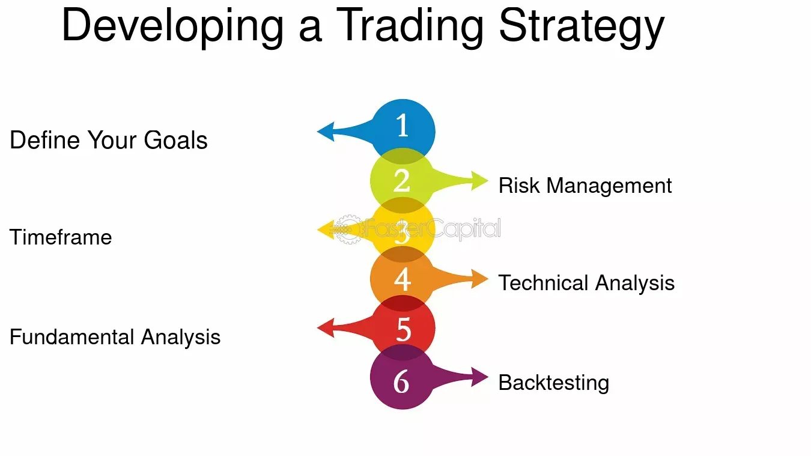

## Table of Contents

## What is a trading strategy and why is it important for traders?

A trading strategy is a set of rules and guidelines that a trader follows to make decisions about buying and selling assets in the financial markets. It helps traders determine when to enter and exit trades, how much to invest, and how to manage risks. A good trading strategy is based on thorough research and analysis, and it can be adjusted over time as market conditions change.

Having a trading strategy is important for traders because it provides a structured approach to trading, which can help reduce emotional decision-making. Without a strategy, traders might make impulsive decisions based on fear or greed, which can lead to big losses. A well-defined strategy helps traders stay disciplined and focused, increasing their chances of making consistent profits over time.

## How can beginners start developing their first trading strategy?

Beginners can start developing their first trading strategy by first learning the basics of the financial markets. They should understand what they want to trade, whether it's stocks, forex, commodities, or cryptocurrencies. Next, they need to decide on their trading style. Some people like to trade every day, which is called day trading. Others might hold onto their investments for weeks or months, which is known as swing trading or position trading. Once they know their style, they can start to think about specific rules for when to buy and sell.

After choosing a trading style, beginners should set clear goals for what they want to achieve with their trading. They might want to make a certain amount of money each month or just learn how the markets work. With their goals in mind, they can start to create simple rules for their strategy. For example, they might decide to buy a stock when its price goes above a certain level and sell it when it drops below another level. It's important to test these rules using a demo account before using real money. This way, they can see if their strategy works without risking any money. As they gain more experience, they can adjust their strategy to make it better.

## What are the key components of a successful trading strategy?

A successful trading strategy has a few important parts. First, it needs clear rules for when to buy and sell. These rules can be based on things like price movements, technical indicators, or even news events. Having clear rules helps traders make decisions without letting emotions get in the way. Another key part is risk management. This means deciding how much money to risk on each trade and setting stop-loss orders to limit losses. Good risk management helps traders protect their money and stay in the game longer.

Another important component is a trading plan that matches the trader's goals and style. Some people like to trade quickly and often, while others prefer to hold onto their investments for a longer time. Knowing your style helps you pick the right strategy. It's also important to keep learning and adjusting your strategy. Markets change, and what worked before might not work in the future. By testing and tweaking your strategy, you can keep improving and stay ahead.

## How do you backtest a trading strategy and why is it crucial?

Backtesting a trading strategy means using past market data to see how well your strategy would have worked. You pretend to trade with old data to see if your rules for buying and selling would have made money. You can use special software or a spreadsheet to do this. It's like playing a game with history to see if your plan is good. You look at things like how much money you would have made or lost, how often you would have made trades, and how big your wins and losses would have been.

Backtesting is really important because it helps you see if your strategy is any good before you use real money. It's like practicing before the big game. If your strategy doesn't work well in the past, it probably won't work well in the future either. Backtesting can also show you where your strategy might need to be changed or improved. By testing it first, you can feel more confident when you start trading for real, knowing that you've done your homework.

## What are common mistakes to avoid when developing a trading strategy?

When developing a trading strategy, one common mistake is not having a clear plan. Some people start trading without knowing exactly when to buy or sell. They might make decisions based on feelings instead of rules. This can lead to big losses because they're not following a set plan. Another mistake is not managing risk properly. Traders might risk too much money on one trade or not use stop-loss orders to limit their losses. This can wipe out their account quickly if the market moves against them.

Another big mistake is not testing the strategy before using real money. Some traders jump right into live trading without [backtesting](/wiki/backtesting) their strategy on past data. This means they don't know if their plan will work until it's too late. Also, many beginners don't keep learning and adjusting their strategy. Markets change, and what worked before might not work now. If traders don't keep up with these changes and tweak their strategy, they might miss out on better ways to trade.

## How can technical analysis be integrated into a trading strategy?

Technical analysis can be a big help when you're making a trading strategy. It's all about looking at past price movements and using charts to guess where prices might go next. You can use things like moving averages, which smooth out price data to show trends, or indicators like the Relative Strength Index (RSI) to see if a stock is overbought or oversold. By adding these tools to your strategy, you can make better decisions about when to buy and sell. For example, you might decide to buy a stock when its price goes above its 50-day moving average and sell it when it drops below its 200-day moving average.

It's important to use technical analysis in a way that fits your trading style. If you like to trade quickly, you might focus on short-term charts and indicators that react fast to price changes. But if you hold onto your investments for a longer time, you might look at longer-term charts and trends. The key is to test your technical analysis rules with past data to see if they work. This way, you can feel more confident that your strategy will help you make money in the real market.

## What role does risk management play in trading strategy development?

Risk management is a big part of making a good trading strategy. It's all about deciding how much money you can lose on each trade without getting into trouble. You need to set rules for how much to risk, like only using a small part of your money on one trade. This way, if you lose, you won't lose everything. You can also use stop-loss orders, which are like safety nets that automatically sell your investment if the price drops too much. This helps you limit your losses and keep trading even if things don't go your way.

Having good risk management in your strategy helps you stay in the game longer. It's easy to get excited and risk too much, but that can lead to big losses. By setting clear rules for risk, you can trade more calmly and make better decisions. Over time, this can help you make more money because you're not losing big chunks of your account. So, when you're making your trading strategy, always think about how you'll manage risk. It's just as important as knowing when to buy and sell.

## How can fundamental analysis enhance a trading strategy?

Fundamental analysis can make your trading strategy better by helping you understand the real value of what you're trading. It looks at things like a company's earnings, how much it's growing, and what's happening in the world that might affect it. By using [fundamental analysis](/wiki/fundamental-analysis), you can decide if a stock or other investment is a good buy or if it's overpriced. For example, if a company is making more money and growing fast, its stock might be a good investment even if the price is high. This can help you pick investments that have a good chance of going up in value over time.

Adding fundamental analysis to your trading strategy can also help you make smarter decisions about when to buy and sell. If you know a company is doing well but its stock price suddenly drops because of some short-term bad news, you might see it as a chance to buy at a lower price. On the other hand, if a company's fundamentals are getting worse, you might decide to sell before the price drops even more. By combining fundamental analysis with your other trading rules, you can create a more complete strategy that takes into account both the big picture and the day-to-day movements of the market.

## What advanced tools and technologies are available for strategy development?

There are many advanced tools and technologies that can help you develop a better trading strategy. One popular tool is [algorithmic trading](/wiki/algorithmic-trading) software, which lets you create and test trading rules using computer programs. These programs can look at lots of data very quickly and make trades automatically based on your rules. Another useful technology is [machine learning](/wiki/machine-learning), which can help you find patterns in the market that you might not see on your own. By using machine learning, you can make your strategy smarter and more accurate over time.

Another important tool is backtesting software, which lets you test your strategy on past market data to see how well it would have worked. This can help you find and fix problems in your strategy before you start trading with real money. There are also trading platforms that come with lots of built-in tools and indicators, like charting software and technical analysis tools. These can help you see the market in different ways and make better decisions. By using these advanced tools and technologies, you can make your trading strategy stronger and more likely to succeed.

## How do you adapt a trading strategy to different market conditions?

Adapting a trading strategy to different market conditions is important because markets can change a lot. Sometimes the market goes up a lot, which is called a bull market. Other times, it goes down a lot, which is called a bear market. There are also times when the market doesn't move much, which is called a sideways market. To do well in all these different situations, you need to change your strategy. For example, in a bull market, you might want to buy more and hold onto your investments longer. But in a bear market, you might want to sell more quickly or use strategies that make money when prices go down.

One way to adapt your strategy is by using different indicators and rules for different market conditions. You can use technical analysis to see what the market is doing right now and change your strategy based on that. For example, if you see that the market is starting to go down, you might use more short-selling or set tighter stop-loss orders to protect your money. Another way to adapt is by always learning and testing your strategy. You can use backtesting to see how your strategy would have worked in different past market conditions. This can help you make changes to your strategy so it works better no matter what the market is doing.

## What are the psychological aspects of sticking to a trading strategy?

Sticking to a trading strategy can be hard because of how our minds work. When you're trading, it's easy to let your feelings take over. If you see your investment going down, you might feel scared and want to sell it quickly, even if your strategy says to hold on. Or if you see a big win, you might get too excited and start taking bigger risks than you planned. These feelings can make you forget your strategy and make bad choices. That's why it's important to have a strong mind and stick to your plan, no matter what your feelings are telling you.

One way to help with this is to practice good habits. You can keep a trading journal to write down your trades and how you felt about them. This can help you see when your feelings are making you do things that don't follow your strategy. It's also good to take breaks and not trade all the time. This can help you stay calm and think clearly. Remember, the goal is to follow your strategy over the long run, not to make quick money from one trade. By working on your mind and sticking to your plan, you can become a better trader.

## How can machine learning and AI be utilized to optimize trading strategies?

Machine learning and AI can help make your trading strategy better by looking at a lot of data really fast. They can find patterns in the market that you might not see on your own. For example, machine learning can look at past prices, news, and other information to guess where prices might go next. This can help you make smarter decisions about when to buy and sell. AI can also help you test your strategy on old data to see how well it would have worked. This way, you can find and fix problems in your strategy before you start trading with real money.

Using machine learning and AI can also help you change your strategy when the market changes. They can keep learning and getting better over time, so your strategy can stay up-to-date with what's happening in the market. This means you can make your strategy stronger and more likely to succeed. By using these smart tools, you can make your trading decisions more accurate and have a better chance of making money in the long run.

## References & Further Reading

[1]: Bergstra, J., Bardenet, R., Bengio, Y., & Kégl, B. (2011). ["Algorithms for Hyper-Parameter Optimization."](https://papers.nips.cc/paper/4443-algorithms-for-hyper-parameter-optimization) Advances in Neural Information Processing Systems 24.

[2]: ["Advances in Financial Machine Learning"](https://www.amazon.com/Advances-Financial-Machine-Learning-Marcos/dp/1119482089) by Marcos Lopez de Prado

[3]: ["Evidence-Based Technical Analysis: Applying the Scientific Method and Statistical Inference to Trading Signals"](https://www.amazon.com/Evidence-Based-Technical-Analysis-Scientific-Statistical/dp/0470008741) by David Aronson

[4]: ["Machine Learning for Algorithmic Trading"](https://github.com/stefan-jansen/machine-learning-for-trading) by Stefan Jansen

[5]: ["Quantitative Trading: How to Build Your Own Algorithmic Trading Business"](https://www.amazon.com/Quantitative-Trading-Build-Algorithmic-Business/dp/1119800064) by Ernest P. Chan