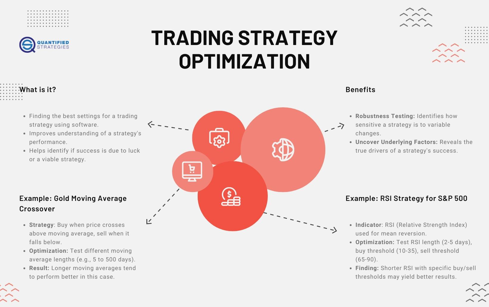

## Table of Contents

## What is trading strategy optimization?

Trading strategy optimization is the process of making a trading plan better. Traders use this to find the best way to buy and sell things like stocks or currencies. They do this by changing different parts of their plan, like when to buy or sell, and how much to buy or sell. The goal is to make more money and take less risk.

To optimize a trading strategy, traders often use computers to test many different versions of their plan. They use past data to see how each version would have worked. This helps them pick the version that would have made the most money in the past. But, traders need to be careful because what worked in the past might not work in the future. They need to keep checking and changing their plan to make sure it keeps working well.

## Why is it important to optimize a trading strategy?

Optimizing a trading strategy is important because it helps traders make more money and take less risk. When traders optimize their strategy, they look at different ways to buy and sell things like stocks or currencies. They change things like when to buy or sell, and how much to buy or sell. By doing this, they can find the best way to make their plan work better. This means they can make more money from their trades.

It's also important because markets change over time. What worked well in the past might not work well in the future. By optimizing their strategy, traders can keep up with these changes. They use computers to test their plan with past data, but they also need to keep checking and changing their plan as the market changes. This helps them stay successful over time.

## What are the basic steps involved in optimizing a trading strategy?

Optimizing a trading strategy starts with defining what you want to achieve. You need to set clear goals, like making more money or taking less risk. Once you know your goals, you can start testing different versions of your trading plan. You do this by changing things like when to buy or sell, and how much to buy or sell. You use a computer to test these changes with past data to see how each version would have worked.

After testing, you pick the version of your plan that would have made the most money in the past. But remember, what worked in the past might not work in the future. So, you need to keep checking your plan as the market changes. You might need to make more changes to keep your plan working well. This way, you can keep making money and taking less risk over time.

## What are the common metrics used to evaluate a trading strategy's performance?

When traders want to see how well their trading strategy is doing, they look at a few important numbers. One key number is the profit, which shows how much money the strategy made. Another important number is the risk, which shows how much money the strategy could lose. Traders often use a number called the risk-reward ratio to see if the possible profits are worth the possible losses. They also look at the win rate, which is the percentage of trades that make money.

Another useful number is the drawdown, which shows the biggest drop in the value of the trading account. This helps traders understand how much money they could lose at the worst time. The Sharpe ratio is another important number that shows how much extra return the strategy gives for the risk it takes. By looking at all these numbers, traders can get a good idea of how well their strategy is working and if they need to make any changes.

## How does backtesting fit into the optimization process?

Backtesting is a big part of making a trading strategy better. It's when traders use a computer to see how their plan would have worked in the past. They take old data about prices and use it to pretend they are trading. This helps them see if their plan would have made money or lost money. By doing this, traders can try out different versions of their plan and pick the one that would have worked the best.

But [backtesting](/wiki/backtesting) is not perfect. Just because a plan worked well in the past doesn't mean it will work well in the future. Markets change, and what was good before might not be good now. So, traders need to keep checking their plan and making changes. Backtesting helps them start with a good plan, but they need to keep working on it to make sure it keeps working well over time.

## What are the risks of overfitting when optimizing a trading strategy?

Overfitting is a big problem when traders try to make their trading plan better. It happens when traders change their plan too much to fit the past data perfectly. They might think they found the best way to trade, but really, their plan only works for the past and not for the future. This is because markets change, and what worked before might not work again. When traders overfit, they might make a lot of money in their backtests, but they could lose money when they start trading for real.

To avoid overfitting, traders need to be careful. They should not change their plan too much just to make it fit the past data. Instead, they should keep their plan simple and test it with different sets of data. This way, they can see if their plan works well in different situations. By doing this, traders can make a plan that is more likely to work well in the future, not just in the past.

## How can one avoid overfitting during the optimization process?

To avoid overfitting when making a trading plan better, traders should keep their plan simple. They should not change too many things just to make the plan fit the past data perfectly. Instead, they should focus on the main ideas of their plan and not get too caught up in small details. By keeping the plan simple, traders can make sure it works well in different situations, not just in the past.

Another way to avoid overfitting is to test the plan with different sets of data. Traders can split their data into two parts: one part to make the plan better and another part to check how well the plan works. This way, they can see if their plan works well on data it has not seen before. By doing this, traders can be more sure that their plan will work well in the future, not just in the past.

## What role does forward testing play in strategy optimization?

Forward testing is a key part of making a trading plan better. It's when traders use their plan in real time, but with pretend money. They do this to see how their plan works in the current market, not just in the past. By forward testing, traders can see if their plan can make money in the real world, not just in backtests. This helps them find out if their plan needs any changes to work well in the future.

Forward testing also helps traders avoid a problem called overfitting. Overfitting happens when a plan fits the past data too well but does not work in the future. By using forward testing, traders can see if their plan is too focused on the past or if it can adapt to new market conditions. This way, they can make sure their plan is strong and can make money over time, not just in the past.

## How do different market conditions affect the optimization of a trading strategy?

Different market conditions can change how well a trading strategy works. When the market is going up, a strategy that buys and holds might do well. But if the market starts going down, the same strategy might lose money. So, traders need to think about what the market is doing now and what it might do next. They might need to change their plan to fit the current market. For example, if the market is moving a lot, a strategy that trades often might work better than one that trades less.

Traders use past data to test their strategies, but they need to remember that the future might be different. What worked in a calm market might not work in a wild one. So, they need to keep checking their plan and making changes as the market changes. By doing this, they can make sure their plan keeps working well no matter what the market is doing. This way, they can keep making money and taking less risk over time.

## What advanced techniques can be used to further optimize a trading strategy?

One advanced technique to make a trading strategy even better is using [machine learning](/wiki/machine-learning). Machine learning is when computers learn from data and find patterns that people might miss. Traders can use machine learning to look at a lot of data and find the best times to buy or sell. This can help them make more money and take less risk. But, they need to be careful not to overfit the data, which means making the plan fit the past too well but not work in the future. They can avoid this by testing the plan with different sets of data and keeping the plan simple.

Another technique is using genetic algorithms. These are like a computer version of natural selection. The computer tries out many different versions of a trading plan and picks the ones that work the best. It then makes new versions based on the best ones, kind of like how animals evolve. This can help traders find a plan that works well in many different market conditions. But, like with machine learning, traders need to keep checking the plan and making sure it works in the real world, not just in tests.

A third technique is using walk-forward optimization. This is when traders test their plan on past data but keep moving forward in time. They use one part of the data to make the plan better and another part to check how well it works. This helps them see if the plan can adapt to new market conditions. By doing this, traders can make sure their plan keeps working well as the market changes. It's a good way to avoid overfitting and make sure the plan works in the future, not just in the past.

## How can machine learning be integrated into trading strategy optimization?

Machine learning can help make a trading strategy better by looking at a lot of data and finding patterns that people might miss. Traders can use machine learning to figure out the best times to buy or sell things like stocks or currencies. The computer learns from past data and can make smart guesses about what might happen next. This can help traders make more money and take less risk. But, they need to be careful not to make the plan fit the past too well, which is called overfitting. They can avoid this by testing the plan with different sets of data and keeping the plan simple.

To use machine learning in trading, traders need to give the computer a lot of data about prices, trading volumes, and other things that might affect the market. The computer then uses this data to learn and make predictions. Traders can use these predictions to decide when to buy or sell. But, they need to keep checking the plan and making sure it works in the real world, not just in tests. By doing this, traders can make sure their plan keeps working well as the market changes.

## What are the latest trends and tools in trading strategy optimization?

The latest trends in trading strategy optimization include the use of [artificial intelligence](/wiki/ai-artificial-intelligence) (AI) and big data. Traders are using AI to analyze huge amounts of data quickly and find patterns that can help them make better trading decisions. This means they can look at more information than ever before, like news articles, social media posts, and even weather reports, to see how these things might affect the market. Big data helps traders understand what is happening in the market in real time, so they can adjust their strategies to make more money and take less risk.

Another trend is the use of cloud computing. This lets traders use powerful computers over the internet to test and optimize their trading strategies. They don't need to buy expensive computers themselves; they can just use the cloud. This makes it easier and cheaper for traders to try out many different versions of their plan and see which one works the best. Tools like MetaTrader, NinjaTrader, and TradingView are also popular because they offer easy ways to backtest and forward test trading strategies. These tools help traders see how their plan would have worked in the past and how it might work in the future.

## References & Further Reading

[1]: Bergstra, J., Bardenet, R., Bengio, Y., & Kégl, B. (2011). ["Algorithms for Hyper-Parameter Optimization."](https://dl.acm.org/doi/10.5555/2986459.2986743) Advances in Neural Information Processing Systems 24.

[2]: ["Advances in Financial Machine Learning"](https://resources.caih.jhu.edu/textbooks/Resources/_pdfs/Advances_In_Financial_Machine_Learning.pdf) by Marcos Lopez de Prado

[3]: ["Evidence-Based Technical Analysis: Applying the Scientific Method and Statistical Inference to Trading Signals"](https://www.amazon.com/Evidence-Based-Technical-Analysis-Scientific-Statistical/dp/0470008741) by David Aronson

[4]: ["Machine Learning for Algorithmic Trading"](https://github.com/stefan-jansen/machine-learning-for-trading) by Stefan Jansen

[5]: ["Quantitative Trading: How to Build Your Own Algorithmic Trading Business"](https://books.google.com/books/about/Quantitative_Trading.html?id=j70yEAAAQBAJ) by Ernest P. Chan