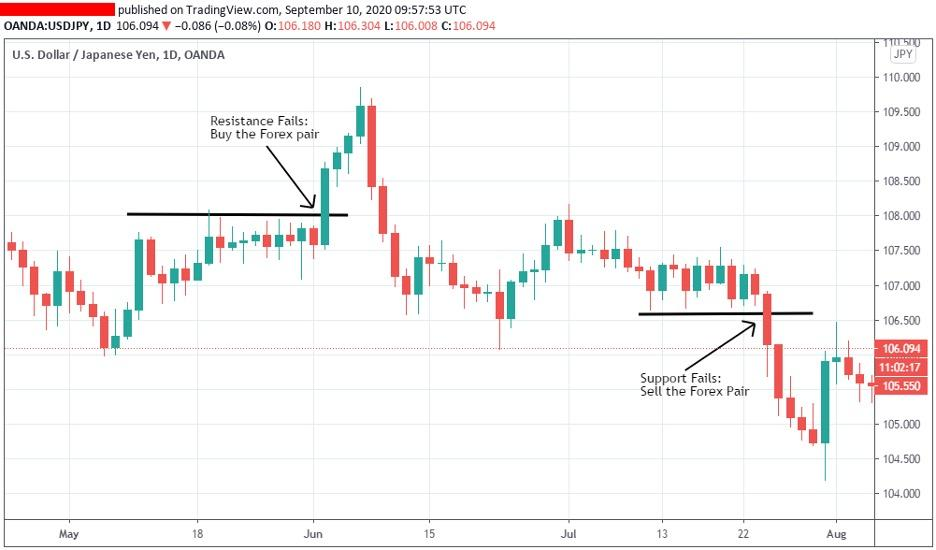

## Table of Contents

## What are support and resistance levels in trading?

Support and resistance levels are important concepts in trading that help traders make decisions about when to buy or sell assets. Support is a price level where a falling asset tends to stop falling and might start to rise again. It's like a floor that the price bounces off of. Traders often see this as a good time to buy, expecting the price to go up. Resistance, on the other hand, is a price level where a rising asset tends to stop rising and might start to fall again. It acts like a ceiling that the price hits and then drops from. Traders might see this as a good time to sell, expecting the price to go down.

These levels are not fixed and can change over time as market conditions change. They are often identified by looking at past price data on charts. When the price of an asset reaches these levels multiple times, it becomes more significant. Traders use these levels to set their trading strategies, but it's important to remember that support and resistance levels are not guarantees. The price can sometimes break through these levels, leading to new trends. Understanding these levels can help traders manage their risks and make more informed decisions.

## How can a beginner identify support and resistance levels on a chart?

To identify support and resistance levels on a chart, a beginner should start by looking at the price history of the asset. On a chart, find the points where the price has stopped falling and started to go up again. These are the support levels. They look like a floor that the price bounces off of. Now, look for the points where the price has stopped rising and started to go down again. These are the resistance levels. They act like a ceiling that the price hits and then drops from. The more times the price touches these levels without breaking through, the stronger these levels are.

It's helpful to use a longer time frame, like daily or weekly charts, to see these levels more clearly. Beginners can draw horizontal lines on the chart at these points to make the levels easier to see. Sometimes, the price might break through a support or resistance level. When this happens, the old support can become a new resistance, and the old resistance can become a new support. Watching how the price reacts at these levels over time will help beginners get better at spotting them. Remember, no level is perfect, and prices can move in unexpected ways, so always be ready to adjust your understanding as you learn more.

## What is a breakout in the context of support and resistance?

A breakout happens when the price of an asset moves past a support or resistance level. Imagine the price has been going up and down between two levels, like a ball bouncing between a floor and a ceiling. If the price suddenly goes above the ceiling, that's a breakout above the resistance. If it drops below the floor, that's a breakout below the support. This movement shows that something has changed, and the price might keep going in the direction of the breakout.

When a breakout happens, traders pay close attention because it can mean the start of a new trend. If the price breaks above a resistance level, traders might start buying more, expecting the price to keep going up. If the price breaks below a support level, traders might start selling more, expecting the price to keep going down. But, breakouts can be tricky. Sometimes the price breaks through a level but then quickly comes back inside the old range. Traders need to watch carefully to see if the breakout is real or just a false alarm.

## Why are breakouts significant for traders?

Breakouts are important for traders because they show that the price of an asset is moving in a new direction. When the price breaks past a resistance level, it might mean the price will keep going up. If it breaks below a support level, it might mean the price will keep going down. Traders watch for these breakouts because they can be the start of a new trend. Knowing when a trend is starting can help traders make money by buying or selling at the right time.

But breakouts can be tricky. Sometimes the price breaks through a level but then quickly goes back to where it was before. This is called a false breakout. Traders need to be careful and watch the price closely to see if the breakout is real or just a trick. If it's a real breakout, it can be a good chance to make a trade. If it's a false breakout, it might be better to wait and see what happens next.

## What are the common strategies for trading support and resistance breakouts?

One common strategy for trading support and resistance breakouts is to wait for the price to break through a level and then enter a trade in the direction of the breakout. For example, if the price breaks above a resistance level, a trader might buy the asset, expecting the price to keep going up. They might set a stop-loss order just below the breakout level to limit their risk if the price goes back down. The goal is to catch the start of a new trend and make a profit as the price moves in the new direction.

Another strategy is to wait for a retest after a breakout. After the price breaks through a level, it sometimes comes back to test that level again before continuing in the direction of the breakout. A trader might wait for this retest and then enter the trade if the price bounces off the level again. This can be a safer way to trade because it gives more confirmation that the breakout is real. But, it also means the trader might miss some of the move if the price doesn't come back to the level.

Some traders use a combination of these strategies. They might enter a small position right after the breakout and then add to it if the price comes back to retest the level. This way, they can start trading early but also get more confirmation before putting more money into the trade. No matter which strategy they use, traders need to be careful and watch the market closely because breakouts can be tricky and not always lead to big moves.

## How can traders use volume to confirm a breakout?

Traders can use volume to confirm a breakout by looking at how many people are buying or selling when the price moves past a support or resistance level. If the volume is high when the price breaks out, it means a lot of people are trading at that time. This can be a sign that the breakout is real and that the price might keep moving in that direction. High volume shows that there is strong interest in the asset, which can help push the price further.

On the other hand, if the volume is low when the price breaks out, it might mean the breakout is not as strong. Low volume can be a sign that not many people are interested in the asset at that time. This could mean the price might not keep moving in the direction of the breakout and could come back to the old level. So, traders often wait to see if the volume is high before they decide to trade based on a breakout.

## What are false breakouts and how can they be identified?

False breakouts happen when the price of an asset looks like it's going to move past a support or resistance level, but then it quickly comes back inside the old range. It's like the price tries to break out but doesn't have enough strength to keep going. This can trick traders into thinking a new trend is starting when it's not. False breakouts can lead to losses if traders buy or sell based on the breakout and then the price moves back to where it was before.

To spot a false breakout, traders often look at the volume of trades happening during the breakout. If the volume is low when the price breaks out, it might be a sign that the breakout is not strong and could be false. Another way to identify a false breakout is to wait for a retest. After a breakout, the price sometimes comes back to the level it broke through. If it bounces off that level and keeps moving in the direction of the breakout, it's more likely to be real. But if the price breaks through and then quickly goes back inside the old range without a strong bounce, it's probably a false breakout.

## How do different time frames affect the reliability of breakouts?

Different time frames can change how reliable a breakout is. When you look at a short time frame, like a 5-minute chart, breakouts might happen more often but they can be less reliable. This is because short time frames show more small moves in the price, and these moves can be caused by things that don't matter in the long run. So, a breakout on a short time frame might not lead to a big trend and could be a false breakout.

On the other hand, looking at a longer time frame, like a daily or weekly chart, can make breakouts more reliable. These charts show bigger moves in the price over time, and a breakout on a longer time frame is more likely to mean a real change in the trend. Traders often use longer time frames to find more reliable breakouts because they show what's happening in the market over a longer period, which can be a better sign of where the price is going.

## What technical indicators can enhance the analysis of support and resistance breakouts?

Technical indicators can help traders see if a breakout from support or resistance levels is real or not. One useful indicator is the Moving Average Convergence Divergence (MACD). It shows the relationship between two moving averages of a price. When the MACD line crosses above the signal line at the same time as a breakout, it can be a sign that the breakout is strong and the price might keep moving up. On the other hand, if the MACD line is moving down during a breakout, it might mean the breakout is weak and could be false.

Another helpful indicator is the Relative Strength Index (RSI). The RSI measures how fast and how much the price is moving. If the RSI is above 70 when the price breaks out, it might mean the asset is overbought and the breakout could be weak. But if the RSI is between 30 and 70 during a breakout, it can show that the price has more room to move and the breakout might be real. By using these indicators along with watching the price, traders can make better decisions about whether to trade on a breakout or wait for more signs.

## How can a trader manage risk when trading breakouts?

When trading breakouts, managing risk is really important. One way to do this is by using stop-loss orders. A stop-loss order is like a safety net that tells your broker to sell your asset if the price goes down to a certain level. By setting a stop-loss just below the breakout level, you can limit how much money you might lose if the breakout turns out to be false. This helps you stay in the game even if one trade doesn't go your way.

Another way to manage risk is by not putting all your money into one trade. Instead of betting everything on one breakout, you can spread your money across different trades. This is called diversification. If one trade doesn't work out, you won't lose everything because you have other trades going on. Also, it's smart to only use a small part of your money for each trade. This way, even if you lose on a few trades, you still have money left to keep trading.

## What are some advanced techniques for predicting potential breakout points?

One advanced technique for predicting potential breakout points is to use chart patterns like triangles, flags, and wedges. These patterns show up on the chart when the price moves in a certain way over time. For example, a triangle pattern happens when the price moves between two lines that are getting closer together. When the price finally breaks out of this pattern, it can be a strong sign that a new trend is starting. Traders look for these patterns because they can help guess where the price might break out next.

Another technique is to use Fibonacci retracement levels. This tool uses numbers from the Fibonacci sequence to find levels where the price might stop and then start moving again. Traders draw these levels on the chart and watch to see if the price bounces off them. If the price breaks through a Fibonacci level, it could mean a breakout is coming. By combining these levels with other signs like high volume or a strong chart pattern, traders can make better guesses about where the price might go next.

## How do market conditions influence the success rate of trading breakouts?

Market conditions can really change how well trading breakouts works. When the market is moving a lot and there's a lot of trading going on, breakouts can be more likely to happen and be real. This is because more people are buying and selling, which can push the price past support or resistance levels. But, if the market is calm and not moving much, breakouts might be less common and less strong. In a calm market, the price might not have enough energy to break through levels, and any breakouts that do happen could be false.

Also, the overall mood of the market, like whether people are feeling hopeful or worried, can affect breakouts. If everyone is feeling good about the market, they might be more likely to buy when the price breaks out, making the breakout stronger. But if people are worried, they might sell when the price breaks out, which can make the breakout weaker or even turn it into a false breakout. So, traders need to keep an eye on the market conditions and the mood of other traders to guess how well their breakout trades might do.

## How can one create an effective trading algorithm?

Developing an effective trading algorithm requires a comprehensive understanding of both technical analysis and computational models. The process starts with the identification and definition of clear parameters for recognizing support, resistance, and breakout conditions within your chosen markets. Traders must analyze historical price data, chart patterns, and market trends to set these parameters accurately.

Algorithm developers should incorporate historical data extensively to backtest the algorithm's performance. Backtesting involves simulating the trading algorithm on past market data to determine how it would have performed. This step helps refine the algorithm's criteria for improved accuracy and reliability. The goal is to identify any potential weaknesses or limitations in real market scenarios.

To ensure robust performance, it is crucial to optimize parameters such as trade entry and exit points, stop-loss orders, and take-profit targets. These elements enhance risk management and potential returns. For instance, an algorithm might use the following formula to determine breakouts:

$$

\text{Price} > \text{Resistance Level} \implies \text{Buy Signal}
$$
$$

\text{Price} < \text{Support Level} \implies \text{Sell Signal}
$$

In terms of code implementation, Python is often used for developing trading algorithms due to its simplicity and extensive libraries. Below is a basic example using Python to illustrate defining breakout conditions:

```python
import pandas as pd

def identify_breakouts(data, support, resistance):
    """
    Identifies buy and sell signals based on breakout conditions.

    :param data: DataFrame with price data.
    :param support: Identified support level.
    :param resistance: Identified resistance level.
    :return: DataFrame with breakout signals.
    """
    data['Signal'] = 0
    data.loc[data['Price'] > resistance, 'Signal'] = 1  # Buy signal
    data.loc[data['Price'] < support, 'Signal'] = -1   # Sell signal
    return data

# Example usage
price_data = pd.DataFrame({'Price': [90, 95, 100, 105, 110]})
support_level = 92
resistance_level = 108

breakout_signals = identify_breakouts(price_data, support_level, resistance_level)
print(breakout_signals)
```

This code snippet showcases a simple way to set up buy and sell signals based on breakout criteria. The analysis and refinement of these parameters are crucial in adapting the algorithm to changing market conditions, ensuring that it remains effective and competitive.

## References & Further Reading

[1]: Bergstra, J., Bardenet, R., Bengio, Y., & Kégl, B. (2011). ["Algorithms for Hyper-Parameter Optimization."](https://proceedings.neurips.cc/paper/2011/file/86e8f7ab32cfd12577bc2619bc635690-Paper.pdf) Advances in Neural Information Processing Systems 24.

[2]: ["Advances in Financial Machine Learning"](https://www.amazon.com/Advances-Financial-Machine-Learning-Marcos/dp/1119482089) by Marcos Lopez de Prado

[3]: ["Evidence-Based Technical Analysis: Applying the Scientific Method and Statistical Inference to Trading Signals"](https://www.amazon.com/Evidence-Based-Technical-Analysis-Scientific-Statistical/dp/0470008741) by David Aronson

[4]: ["Machine Learning for Algorithmic Trading"](https://github.com/PacktPublishing/Machine-Learning-for-Algorithmic-Trading-Second-Edition) by Stefan Jansen

[5]: ["Quantitative Trading: How to Build Your Own Algorithmic Trading Business"](https://books.google.com/books/about/Quantitative_Trading.html?id=j70yEAAAQBAJ) by Ernest P. Chan