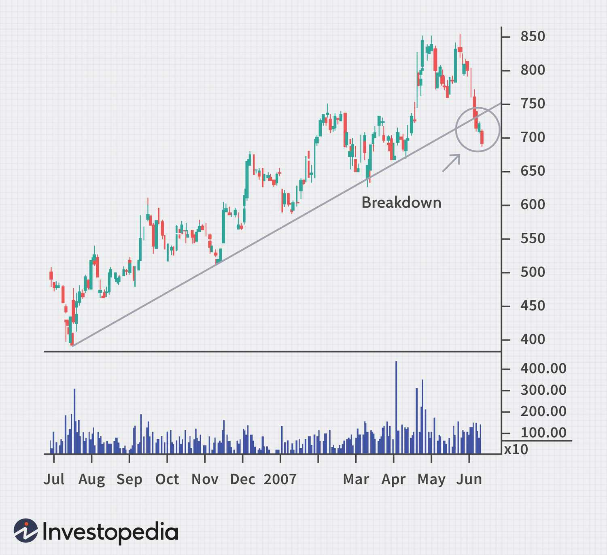

Trading strategies are crucial tools that individuals and institutions use to navigate the financial market effectively. These strategies encompass a broad range of methods and techniques designed to optimize decision-making and maximize profitability. They can vary from simple buying and selling decisions based on price movements to complex models that incorporate a plethora of indicators and external data. The importance of trading strategies lies in their ability to systematize trading decisions, reduce emotional bias, and manage risk effectively. 

Within the spectrum of technical analysis, trendlines occupy a pivotal role. A trendline is a straight line drawn over pivot highs or under pivot lows to depict the prevailing direction of price movements. They are used to identify the direction and strength of a trend, assisting traders in making informed decisions about their trades. Trendlines help in identifying potential support and resistance levels, acting as a visual tool for understanding market sentiment.



A significant event in trading occurs when these trendlines are broken. A broken trendline signals a potential change in market dynamics, indicating either a reversal in the existing trend or a potential continuation pattern. The break of a trendline can herald major shifts in market sentiment, offering traders opportunities to capitalize on emerging trends. Differentiating between a genuine breakout and a false one is key to making profitable trading decisions.

Algorithmic trading, often referred to as algo trading, represents a paradigm shift in how trades are executed. Equipped with the ability to process vast amounts of data and execute trades at speeds unachievably by human traders, algorithmic trading is becoming increasingly popular. This method uses complex algorithms to analyze market trends and execute orders automatically. The growing dependence on technology and algorithms is transforming the trading landscape by introducing precision, efficiency, and speed into trading operations.

The integration of broken trendline analysis with algorithmic trading strategies presents a promising avenue for traders seeking to enhance their trading outcomes. By leveraging the speed and data-processing capabilities of algorithms, traders can react to trendline breaks with precision and timely execution. This fusion of trendline analysis and algorithmic strategy offers a new frontier for enhancing market predictions and optimizing trading performance.

## Table of Contents

## Understanding Trendlines and Their Significance

Trendlines are a fundamental tool in technical analysis, used by traders to represent and identify trends in market data over time. A trendline is a straight line that connects two or more price points on a chart, typically plotted over the price of a security or index. The construction of a trendline requires at least two points; however, the more points that touch or come close to the line, the stronger the trendline is considered. These points are derived from the highs, lows, closing, or opening prices of the trading periods being analyzed.

The significance of trendlines lies in their ability to help traders visualize trends in market behavior and to identify key levels of support and resistance. A support trendline is drawn by connecting two or more low points, and it indicates that an asset's price is higher than the line. This suggests the market is likely to maintain its current trend and potentially reverse if the trendline is touched. Conversely, a resistance trendline connects high points and suggests the price is lower than the line, projecting where the market may face selling pressure.

Trendlines are categorized into three primary types based on the price movement they represent:

1. **Upward Trendlines**: These are created by joining two or more low points in the market, showing that the price is rising. An upward trendline indicates a bullish market where the asset's price is expected to continue moving higher. It's a reflection of increased buy-side interest, usually leading to higher peak and trough levels.

2. **Downward Trendlines**: Formed by connecting two or more high points on the chart, a downward trendline indicates a bearish market. This trendline shows that the price is falling, with lower peaks and troughs, signifying increasing sell-side pressure and a declining market trend.

3. **Sideways Trendlines**: Also referred to as horizontal trendlines, these are drawn when price moves within a horizontal channel over time. A sideways trendline showcases a period of market consolidation, where there is no distinct upward or downward movement. This type of trendline highlights equilibrium between supply and demand, with prices fluctuating within a bounded range.

Understanding these trends is crucial for predicting future price movements. Upward and downward trendlines help in forecasting potential market behavior by extrapolating the line into the future to anticipate support and resistance levels. This predictive power is central to crafting trading strategies, as it provides insight into when to enter or [exit](/wiki/exit-strategy) trades based on expected price movements.

The mathematical definition of a trendline can be described by a linear equation in slope-intercept form: $y = mx + c$, where $m$ represents the slope and $c$ the y-intercept. This formula helps traders ascertain the angle of the trend, which is pivotal in assessing the magnitude of price changes over time. 

In summary, trendlines serve as a strategic guide for traders, helping them navigate market trends and make informed decisions. By identifying support and resistance levels along with understanding the type of trend and its continuation likelihood, traders can harness trendlines to optimize their trading activities and enhance profitability.

## What Happens When Trendlines Break

A broken trendline occurs when the price movement of a financial asset decisively crosses and forms a new trajectory contrary to the trendline's original path. Such breaks indicate potential shifts in market sentiment and can be pivotal in forecasting future price directions. 

Trendline breaks materialize due to various market dynamics, such as changes in investor sentiment, geopolitical events, economic data releases, or even shifts in the supply-demand balance of the asset. For instance, if a rising trendline is broken by a downward price movement, it might denote diminishing bullish strength or a possible switch to bearish conditions. Conversely, a break above a downtrend line could suggest the onset of renewed bullish [momentum](/wiki/momentum).

From a predictive standpoint, broken trendlines offer crucial information. They can signal emerging patterns that traders might exploit for speculation or risk management. However, not all breaks confirm a permanent trend reversal; thus, differentiating between false breakouts and confirmed reversals is essential. A false [breakout](/wiki/breakout-trading) occurs when price breaches the trendline but fails to maintain momentum in the breakout direction, ultimately returning to its previous trajectory. This could be due to limited market participation, speculative news, or technical factors.

On the other hand, a confirmed trend reversal typically manifests with sustained price action away from the original trendline, often backed by increased trading volumes and other supporting indicators. Traders often seek confirmation through technical indicators like moving averages or oscillators to validate a true reversal. For instance, a Moving Average Convergence Divergence (MACD) crossover following a trendline break could add credence to the validity of the new trend direction.

In algorithmic analysis, trendline breaks can be programmed as triggers for buy or sell signals, enabling traders to react with speed and precision often unattainable through manual trading. The capacity to swiftly identify and capitalize on emerging trends underscores the importance of understanding the implications of broken trendlines within the broader context of market analysis.

## Trading Strategies Using Broken Trendlines

Trading strategies utilizing broken trendlines are popular among technical analysts and traders looking to exploit shifts in market dynamics. These strategies revolve around the idea that once a trendline—either upward or downward—is breached, it signals a potential shift in momentum or even a market reversal. This creates opportunities for traders to capitalize on these changes.

### Breakout Trading Strategies

Breakout trading strategies focus on identifying and exploiting breakouts through resistance or support levels, marked by trendlines. When a trendline is broken, it is typically considered a signal that the previous trend may be ending and a new trend is emerging. Traders use this signal to enter trades in the direction of the breakout.

For example, if an upward trendline is broken to the downside, a trader might see this as a signal to enter a short position, anticipating further downward movement. The key to successful breakout trading is confirming the breakout, which often includes looking for increased [volume](/wiki/volume-trading-strategy) or subsequent validation of the new trend direction. 

Python Example:
```python
import pandas as pd

def detect_breakout(price_data, trendline):
    breakouts = []
    for i in range(1, len(price_data)):
        if price_data[i] < trendline[i-1] and price_data[i-1] >= trendline[i-1]:
            breakouts.append((i, price_data[i]))
    return breakouts
```

### Retracement Strategies 

Retracement strategies are based on the idea that after a trendline break, the price will often retrace back toward the trendline before continuing in the direction of the breakout. Traders using this strategy wait for the retracement to provide a better entry point before the price resumes its new trend.

This strategy helps in refining entry points and reducing the risk of false breakouts. By entering after a retracement, traders can set tighter stop-loss orders just beyond the trendline, improving their risk-reward ratio.

### Risk Management Techniques

Effective risk management is crucial when trading broken trendlines, as false breakouts can lead to significant losses. Traders should employ several techniques:

1. **Stop-Loss Orders**: Placing stop-loss orders beyond the recent high or low can limit potential losses if the market reverses unexpectedly.

2. **Position Sizing**: Adjusting the size of each trade based on the confidence level in the trendline break and overall market conditions can help manage risk.

3. **Diversification**: Using trendline strategies across various assets and time frames can reduce the impact of a single security's adverse movement on the overall portfolio.

4. **Confirmation Indicators**: Utilizing additional technical indicators, such as moving averages or the Relative Strength Index (RSI), can help confirm trendline breaks and increase the probability of successful trades.

These concepts form a robust foundation for approaching market shifts using broken trendlines. Each trader must tailor these strategies to their own risk tolerance, trading style, and market conditions to achieve optimal results.

## Incorporating Algo Trading with Trendline Analysis

Algorithmic trading, commonly known as algo trading, involves the use of computer programs to execute trades based on predefined criteria. This methodology leverages computational power to process vast amounts of data rapidly, allowing for execution at rates impossible for humans. The primary advantages of algo trading include increased speed, efficiency, and accuracy in executing trades, reduced likelihood of human error, and the ability to backtest strategies on historical data to evaluate their effectiveness.

An essential component of [algorithmic trading](/wiki/algorithmic-trading) is its capability to detect and react to market events, such as trendline breaks, with high precision and timeliness. Trendlines are fundamental tools in technical analysis, used to identify and forecast price movements by connecting a series of high or low points on a price chart. When a price movement disrupts these lines, it signals a potential shift in market trends.

Algorithms can monitor numerous assets and trendlines concurrently, identifying breaks momentarily and triggering trades based on probability-driven rules. For instance, once a trendline break is identified, the algorithm might execute a trade in the direction of the break if it meets specific conditions, such as volume increase or confirmation by other technical indicators. This immediacy aids in capturing emerging opportunities that might elude manual traders due to latency and human limitations.

Incorporating trendline analysis into algorithmic strategies involves programming algorithms to recognize these market structures and respond accordingly. A straightforward example could be the implementation of a breakout strategy. This approach could be coded in Python using libraries like pandas for data manipulation, TA-Lib for technical analysis, and APIs for real-time data feed and trade execution. Here's a simple outline of such a strategy:

```python
import pandas as pd
from talib import abstract

# Load historical data
data = pd.read_csv('historical_price_data.csv')
# Calculate moving averages to identify trendline
data['SMA_50'] = abstract.SMA(data['Close'], timeperiod=50)
data['SMA_200'] = abstract.SMA(data['Close'], timeperiod=200)

# Detect trendline crossover (e.g., 50-SMA crossing above 200-SMA indicates a break)
data['Signal'] = 0
data.loc[(data['SMA_50'] > data['SMA_200']), 'Signal'] = 1

# Execute trade based on signal
def execute_trade(signal):
    if signal == 1:  # Buy signal
        print("Execute Buy Order")
    else:
        print("Hold/Exit")

data['Signal'].apply(execute_trade)
```

Strategies using trendline analysis can range from simple crossovers to complex models incorporating multiple indicators and market conditions. For example, a more sophisticated algorithm may include [machine learning](/wiki/machine-learning) models that learn from historical trendline breaks to predict future price actions with greater accuracy. 

While integrating trendline analysis with algorithmic strategies provides significant benefits, such as improved responsiveness and systematic execution, it also demands robust development and ongoing optimization. Ensuring algorithms are adaptable to changing market conditions and thoroughly backtested can mitigate risks associated with rapid market fluctuations. 

Overall, the fusion of trendline analysis with algo trading harnesses both the structured approach of technical analysis and the computational advantages of algorithmic execution, offering traders a modern toolset for competing in dynamic financial markets.

## Benefits and Challenges of Algo Trading with Broken Trendlines

Algorithmic trading has significantly transformed how traders approach financial markets, especially regarding technical analysis tools like trendlines. When combined with broken trendline analysis, algo trading offers numerous benefits, while also presenting distinct challenges.

### Benefits

1. **Precision and Speed**: One of the primary advantages of algo trading is its ability to execute trade decisions with minimal delay. Algorithms can monitor numerous securities simultaneously and react to trendline breaks faster than human traders, providing a significant edge in capturing favorable market movements. This speed allows for taking advantage of fleeting market opportunities that might be missed otherwise.

2. **Consistency and Objectivity**: Algorithms operate based on predefined rules and criteria, removing emotional biases inherent in manual trading decisions. This objectivity ensures a consistent approach to trading, which is crucial for implementing strategies based on trendline analysis. 

3. **Ability to Process Large Data Sets**: Algorithms can analyze vast amounts of historical and real-time data to identify potential trendline breaks. They can scan multiple charts and timeframes to detect these opportunities, providing comprehensive market coverage and increasing the chances of successful trades.

### Challenges

1. **Operational Complexities**: While algorithmic trading offers technical advantages, it involves considerable complexities in design and implementation. Developing reliable algorithms requires a deep understanding of both coding and financial markets. Additionally, building a robust infrastructure for algorithmic execution and monitoring can be costly and resource-intensive.

2. **Continuous Optimization**: The market is dynamic and constantly evolving, necessitating constant tuning and optimization of algorithms. A strategy that works well today might not be effective tomorrow due to changing market conditions or patterns. Hence, maintaining the relevance and accuracy of algorithms is an ongoing challenge.

3. **Risk of False Signals**: Algorithms reacting to trendline breaks might occasionally misinterpret market noise as genuine signals, leading to false breakouts. Distinguishing between false signals and actual market reversals requires sophisticated filtering mechanisms within the algorithm.

### Importance of Backtesting and Real-Time Monitoring

Backtesting algorithms against historical data is essential to evaluate their potential effectiveness before deploying them in live markets. By simulating trades over past data, traders can identify weaknesses and refine their strategies to enhance performance. Moreover, real-time monitoring allows for immediate observation and intervention if the algorithms deviate from expected behavior.

### Impact of Market Conditions

The effectiveness of trendline-based algorithms heavily depends on prevailing market conditions. In trending markets, these algorithms might perform exceptionally well, leveraging clear directional movements. However, during periods of high [volatility](/wiki/volatility-trading-strategies) or sideways markets, trendline-based strategies might struggle, requiring adaptive mechanisms to adjust their parameters dynamically. Additionally, factors such as [liquidity](/wiki/liquidity-risk-premium), market depth, and economic news releases can influence the performance and success rate of these algorithms.

In summary, while algorithmic trading offers remarkable advantages in terms of speed and precision for trendline analysis, it also requires traders to address operational complexities, continuous optimization, and the unpredictable influence of market conditions. Backtesting and real-time monitoring become vital components in harnessing its potential effectively.

## Conclusion

The discussion on broken trendlines and algorithmic trading highlights a significant intersection of technical analysis and automated strategies in modern financial markets. Trendlines serve as fundamental tools in technical analysis, providing insights into market trends and potential support or resistance levels. When these trendlines are broken, they can signal potential reversals or shifts in market trends, offering lucrative opportunities for traders who can effectively interpret these signals.

The integration of trendline analysis with algorithmic trading strategies brings numerous advantages. Algorithms have the capacity to detect trendline breaks quickly and execute trades with precision, minimizing human latency and emotion-driven decisions. This combination allows traders to harness both the analytical insights derived from trendline analysis and the operational efficiency provided by automated systems.

However, while algorithmic trading enhances precision and speed, it is equally important for traders to incorporate human insight. Understanding market nuances and maintaining awareness of broader economic conditions remain crucial for effective trading, as reliance solely on algorithms without a nuanced understanding of market dynamics can lead to suboptimal outcomes.

Reflecting on the evolving nature of trading strategies, it is clear that the integration of technical analysis with advanced computational techniques represents a pivotal shift in how trading is conducted. The landscape is continually transforming, driven by technological advancements and changing market conditions. Traders who embrace this evolution by combining traditional analytical methods with cutting-edge algorithmic strategies are likely to maintain a competitive edge in the dynamic world of financial markets.

## References & Further Reading

[1]: Bergstra, J., Bardenet, R., Bengio, Y., & Kégl, B. (2011). ["Algorithms for Hyper-Parameter Optimization."](https://dl.acm.org/doi/10.5555/2986459.2986743) Advances in Neural Information Processing Systems 24.

[2]: ["Advances in Financial Machine Learning"](https://www.amazon.com/Advances-Financial-Machine-Learning-Marcos/dp/1119482089) by Marcos Lopez de Prado

[3]: ["Evidence-Based Technical Analysis: Applying the Scientific Method and Statistical Inference to Trading Signals"](https://www.amazon.com/Evidence-Based-Technical-Analysis-Scientific-Statistical/dp/0470008741) by David Aronson

[4]: ["Machine Learning for Algorithmic Trading"](https://github.com/stefan-jansen/machine-learning-for-trading) by Stefan Jansen

[5]: ["Quantitative Trading: How to Build Your Own Algorithmic Trading Business"](https://www.amazon.com/Quantitative-Trading-Build-Algorithmic-Business/dp/1119800064) by Ernest P. Chan