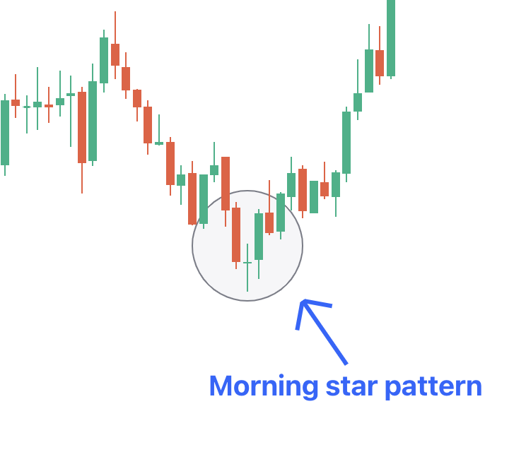

## Table of Contents

## What is the Morning Star candlestick pattern?

The Morning Star is a bullish candlestick pattern that appears at the end of a downtrend. It signals that the market might be turning around and starting to go up. The pattern is made up of three candles. The first candle is a long bearish one, showing that the sellers are still in control. The second candle is a small one, which can be either bullish or bearish, and it shows that the market is unsure. The third candle is a long bullish one, showing that the buyers have taken over and the trend might be changing to an uptrend.

This pattern is important because it can help traders decide when to buy. When they see the Morning Star, it might be a good time to enter a long position, hoping that the price will keep going up. However, it's always a good idea to use other tools and indicators to confirm the signal, because no pattern works perfectly all the time. By combining the Morning Star with other signs, traders can make better decisions and manage their risks more effectively.

## How can you identify a Morning Star pattern on a chart?

To spot a Morning Star pattern on a chart, you need to look for three specific candles in a row. The first candle should be a long one with a bearish color, like red or black, showing that the price went down a lot that day. This tells you that sellers were in control. The second candle should be small, and it can be either bullish or bearish. It's like a pause in the action, showing that the market isn't sure what to do next. The third candle is the key: it should be a long bullish candle, like green or white, showing that the price went up a lot. This tells you that buyers have taken over and the trend might be changing.

When you see these three candles in this order at the end of a downtrend, you might be looking at a Morning Star pattern. It's a sign that the market could be turning around and starting to go up. But remember, it's always a good idea to check other things on the chart too, like other patterns or indicators, to make sure the signal is strong. Using more than one tool can help you make better trading decisions and manage your risks.

## What does the Morning Star pattern signify in terms of market sentiment?

The Morning Star pattern shows a change in how people feel about the market. At first, everyone is selling and the price is going down, which is shown by the first long bearish candle. This means that sellers are in charge and people are feeling negative about the market. But then, the second small candle comes along, and it's like the market is taking a break. It's not sure if it wants to keep going down or start going up. This shows that the strong feeling of wanting to sell is starting to fade.

Then, the third long bullish candle appears, and it's a big sign that buyers are now in control. The price goes up a lot, showing that people are starting to feel more positive about the market. The Morning Star pattern tells us that the market might be turning around from going down to going up. It's a sign of hope for people who want to buy, because it shows that the bad feelings are going away and good feelings are coming back.

## Can you explain the three components of the Morning Star pattern?

The Morning Star pattern has three parts that you need to know. The first part is a long bearish candle. This candle shows that the price went down a lot and sellers were in control. It means that people were feeling bad about the market and wanted to sell their stuff.

The second part is a small candle. This candle can be either bullish or bearish, but it's not very big. It shows that the market is taking a break and isn't sure what to do next. It's like the market is thinking about whether it wants to keep going down or start going up.

The third part is a long bullish candle. This candle shows that the price went up a lot and buyers are now in control. It means that people are starting to feel good about the market again and want to buy. When you see these three candles in this order, it's called a Morning Star pattern, and it can mean that the market might start going up soon.

## What are the key differences between a Morning Star and an Evening Star pattern?

The Morning Star and Evening Star patterns are both made up of three candles, but they show opposite things about the market. The Morning Star pattern happens at the end of a downtrend and tells you that the market might start going up. It starts with a long bearish candle, showing that sellers were in control. Then, there's a small candle that can be either bullish or bearish, showing that the market is unsure. Finally, a long bullish candle comes, showing that buyers have taken over and the market might start going up.

On the other hand, the Evening Star pattern happens at the end of an uptrend and tells you that the market might start going down. It starts with a long bullish candle, showing that buyers were in control. Then, there's a small candle that can be either bullish or bearish, showing that the market is unsure. Finally, a long bearish candle comes, showing that sellers have taken over and the market might start going down. So, while the Morning Star is a sign of hope for buyers, the Evening Star is a warning for them.

## How reliable is the Morning Star pattern as a bullish reversal signal?

The Morning Star pattern is seen as a good sign that the market might start going up, but it's not perfect. It works well when you see it at the end of a downtrend, and it can help traders decide when to buy. But, like any pattern, it doesn't work every time. Sometimes, the market might keep going down even after you see a Morning Star. That's why it's smart to use other tools and signs to check if the pattern is really telling the truth.

To make the Morning Star pattern more reliable, traders often look at other things on the chart too. They might use other patterns, like support and resistance levels, or indicators like the Relative Strength Index (RSI) or Moving Averages. By combining the Morning Star with these other tools, traders can feel more sure about their decisions. This way, they can better manage their risks and have a higher chance of making good trades.

## What are the best market conditions for trading the Morning Star pattern?

The Morning Star pattern works best when the market has been going down for a while. If you see this pattern after a long downtrend, it's a good sign that the market might start going up. The pattern shows that sellers were in control at first, but then buyers start to take over. This change in who's in charge can mean that the market is ready to turn around.

To make sure the Morning Star pattern is a good sign, it's important to look at other things on the chart too. You might want to check if the price is near a level where it usually stops going down, called support. Or you could use tools like the Relative Strength Index (RSI) to see if the market is getting ready to go up. By using the Morning Star pattern along with these other signs, you can feel more sure about your trading decisions and have a better chance of making money.

## What additional indicators should be used to confirm a Morning Star pattern?

To make sure a Morning Star pattern is a good sign that the market might start going up, you should use other tools to check it. One good tool is the Relative Strength Index (RSI). If the RSI is below 30 and then starts to go up when you see the Morning Star, it means the market was oversold and is now getting stronger. This can make you feel more sure that the pattern is right.

Another helpful tool is looking at support levels. If the Morning Star pattern happens near a price where the market usually stops going down, it's a stronger sign that the market might turn around. You can also use moving averages. If the price crosses above a moving average, like the 50-day or 200-day moving average, right after the Morning Star, it's another good sign that the market might start going up.

By using these extra tools along with the Morning Star pattern, you can feel more confident about your trading decisions. It's like having more pieces of a puzzle that all fit together to show you the market might be ready to go up. This way, you can manage your risks better and have a better chance of making good trades.

## How should one set entry points, stop losses, and take profits when trading the Morning Star?

When trading the Morning Star pattern, setting your entry point is important. A good time to enter a trade is right after the third candle of the Morning Star finishes. This is when the long bullish candle shows that buyers are taking over. You can enter your trade at the opening price of the next candle after the Morning Star, or you can wait for a small pullback to get a better price. The key is to make sure the pattern is confirmed by other signs like the RSI or support levels before you enter.

Setting your stop loss is also crucial to manage your risk. A good place to put your stop loss is just below the low of the first bearish candle in the Morning Star pattern. This way, if the price goes back down and breaks that low, it means the pattern might not work and you should get out of the trade to limit your losses. For your take profit, you can aim for a level where the price might face resistance, like a previous high or a key Fibonacci level. Another way is to set your take profit at a certain percentage or dollar amount that you're happy with, based on how much risk you're willing to take.

## What are common mistakes traders make when trading the Morning Star pattern?

One common mistake traders make when trading the Morning Star pattern is not waiting for confirmation. They see the pattern and jump into a trade right away without checking other signs like the RSI or support levels. This can lead to bad trades because the pattern might not work without other signs to back it up. It's important to be patient and make sure the pattern is strong before you start trading.

Another mistake is setting the stop loss too far away or not setting one at all. If the stop loss is too far from the entry point, a small move against the trade can cause big losses. And if you don't set a stop loss, you could lose a lot of money if the trade goes the wrong way. Always set your stop loss just below the low of the first bearish candle in the Morning Star to limit your risk.

Lastly, traders often forget to set a take profit level or set it too close to the entry point. If you don't set a take profit, you might miss out on good profits if the price keeps going up. And if you set it too close, you might not make as much money as you could. It's good to aim for a level where the price might face resistance or set a take profit based on how much risk you're willing to take.

## How does the Morning Star pattern perform in different time frames?

The Morning Star pattern can work well in different time frames, like short ones such as 5-minute charts or longer ones like daily charts. On shorter time frames, the pattern might show up more often, but it can be less reliable because the market can change quickly. Traders who use short time frames need to be quick and watch the market closely. They might see more chances to trade, but they also need to be careful because the pattern might not last long.

On longer time frames, like daily or weekly charts, the Morning Star pattern can be more reliable. This is because the pattern has more time to develop and show a real change in the market. Traders who use longer time frames might not see the pattern as often, but when they do, it can be a stronger sign that the market is turning around. They can take their time to check other signs and make sure the pattern is strong before they start trading.

## Can you provide case studies or examples of successful trades using the Morning Star pattern?

In one example, a trader was watching a stock that had been going down for weeks. The stock was in a clear downtrend, and the trader was waiting for a sign that it might start going up. One day, they saw a Morning Star pattern on the daily chart. The first candle was a long red one, showing that sellers were still in control. The next day, there was a small candle, showing that the market was unsure. On the third day, a long green candle appeared, showing that buyers were taking over. The trader waited for the RSI to confirm the pattern by moving above 30, and then they entered a long position at the opening price of the next candle. They set their stop loss just below the low of the first red candle and aimed for a take profit at a previous high. The trade worked out well, and the stock kept going up, hitting the take profit level and giving the trader a nice profit.

In another case, a trader was looking at a 1-hour chart of a currency pair that had been falling for several days. They noticed a Morning Star pattern forming. The first hour showed a long bearish candle, followed by a small candle the next hour, and then a long bullish candle in the third hour. The trader checked the support level and saw that the pattern was forming right at a strong support level, which made them feel more confident. They entered the trade at the opening of the next hour's candle, set their stop loss just below the low of the first bearish candle, and set their take profit at a resistance level they had identified earlier. The trade went well, and the price moved up to hit the take profit level, giving the trader a successful trade based on the Morning Star pattern.

## References & Further Reading

[1]: Bergstra, J., Bardenet, R., Bengio, Y., & Kégl, B. (2011). ["Algorithms for Hyper-Parameter Optimization."](https://papers.nips.cc/paper/4443-algorithms-for-hyper-parameter-optimization) Advances in Neural Information Processing Systems 24.

[2]: ["Advances in Financial Machine Learning"](https://www.amazon.com/Advances-Financial-Machine-Learning-Marcos/dp/1119482089) by Marcos Lopez de Prado

[3]: ["Evidence-Based Technical Analysis: Applying the Scientific Method and Statistical Inference to Trading Signals"](https://onlinelibrary.wiley.com/doi/book/10.1002/9781118268315) by David Aronson

[4]: ["Machine Learning for Algorithmic Trading"](https://github.com/stefan-jansen/machine-learning-for-trading) by Stefan Jansen

[5]: ["Quantitative Trading: How to Build Your Own Algorithmic Trading Business"](https://www.amazon.com/Quantitative-Trading-Build-Algorithmic-Business/dp/1119800064) by Ernest P. Chan