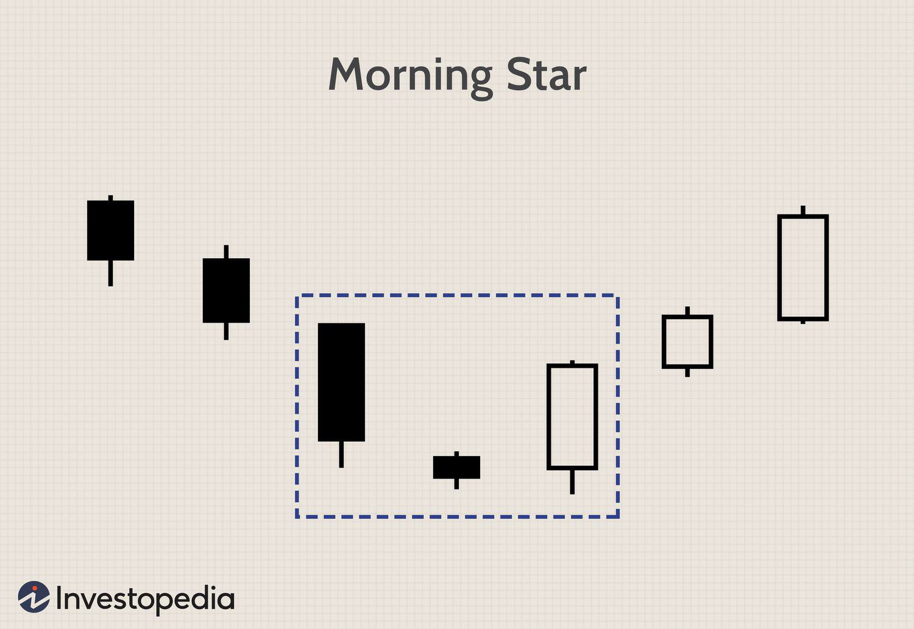

The Morning Star candlestick pattern is a powerful indicator employed in technical analysis for predicting bullish market reversals. This pattern's significance lies in its ability to signal a shift in market sentiment, transitioning from a bearish to a bullish outlook. It represents a critical juncture where sellers' momentum wanes, and buyers begin to assert control, often leading to an upward price movement.

In recent years, with the rise of algorithmic trading, the application of the Morning Star pattern has evolved. Traders now utilize sophisticated algorithms to automate the identification and execution of trades based on this pattern, enhancing the efficiency and accuracy of their trading strategies. Algorithmic trading systems can expedite the trading process by swiftly analyzing large volumes of data to detect patterns, significantly reducing the reliance on human intervention and potential errors.



In this article, we will explore the complexities of the Morning Star pattern and its application in algorithmic trading. Understanding this pattern's structure and dynamics can provide traders with valuable insights into potential market movements, allowing for more informed and strategic decision-making. As we delve deeper, the focus will be on recognizing the pattern's formation and leveraging complementary technical indicators to maximize its predictive capabilities within automated trading systems.

## Table of Contents

## Understanding the Morning Star Pattern

The Morning Star pattern is a key reversal pattern in technical analysis, often used by traders to predict the transition from a market downtrend to an uptrend. It is a three-candlestick formation that can be observed on financial price charts, signaling that a bullish reversal might be imminent.

The pattern begins with a long bearish candlestick, reflecting a continuation of the prevailing downtrend. This candle demonstrates significant selling pressure, as the closing price is substantially lower than the opening price. Following this, the second candlestick is noticeably smaller, which can be either bullish or bearish. This smaller candle represents a period of market consolidation and indecision, indicating that the selling pressure is diminishing. The second candlestick's body typically lies below or at the bottom of the previous bearish candle, forming a gap known as a "doji" or small-bodied candle, suggesting that the market is at a crossroads.

The pattern concludes with a long bullish candlestick, larger than the prior two. This candle reflects a strong upward momentum, where the closing price is significantly higher than the opening price. The long bullish candle signals that buyers have regained control, overshadowing the preceding indecision, and are driving the price up. The transition from the initial bearish candle to the final bullish candle represents a shift in sentiment from sellers to buyers, suggesting that the downtrend has potentially ended, paving the way for a new upward trend.

The effectiveness of the Morning Star pattern hinges on the context in which it appears. A supportive higher trading [volume](/wiki/volume-trading-strategy) on the third bullish candlestick enhances its reliability, as it confirms the strength of the buyer's control. Additionally, traders often look for the pattern to occur at or near key levels of support to affirm its significance. While the Morning Star pattern serves as a potent indicator of a potential bullish reversal, it is typically used in conjunction with other technical analysis tools to confirm its signals and mitigate potential risks.

## Trading the Morning Star: Manual vs. Algo Trading

Manual trading involves traders visually identifying the Morning Star pattern on candlestick charts and making trading decisions based on their analysis and judgment. This method relies heavily on a trader's experience and intuition to recognize the emergence of the pattern among other market signals. Traders often use charting software to meticulously analyze historical and real-time data, watching for the precise formation of a long bearish candle, followed by a small-bodied candle, and concluding with a long bullish candle. The manual approach allows for a flexible response to market conditions but can be time-consuming and susceptible to emotional biases, potentially impacting decision-making.

In contrast, [algorithmic trading](/wiki/algorithmic-trading) employs pre-programmed rules and criteria to automatically detect and trade the Morning Star pattern without human intervention. This approach leverages computational power to swiftly analyze vast amounts of data and execute trades faster than manual methods. Algorithmic trading systems can be programmed using scripting languages such as Python, which provides numerous libraries for automation in trading, like `pandas` for data manipulation and `numpy` for numerical processing. A sample code snippet to identify a Morning Star pattern might involve setting conditions for the opening and closing prices of the candlesticks, such as:

```python
def detect_morning_star(data):
    for i in range(2, len(data)):
        first_candle = data[i-2]
        second_candle = data[i-1]
        third_candle = data[i]

        # Check for Morning Star pattern
        if (first_candle['close'] < first_candle['open'] and
            second_candle['close'] > first_candle['close'] and
            second_candle['close'] < second_candle['open'] and
            third_candle['close'] > third_candle['open'] and
            third_candle['close'] > second_candle['open']):
            print(f"Morning Star pattern detected on {third_candle['date']}")

```

The primary advantage of algorithmic trading is its speed and efficiency, allowing for high-frequency trading that takes advantage of even small market movements. It eliminates human error and emotional bias, adhering strictly to the predefined trading plan. However, the effectiveness of an algorithmic system heavily depends on the robustness of its design and the quality of the input data. Consequently, it is crucial to incorporate sound risk management and periodic evaluation of the algorithm's performance to ensure adaptability to changing market conditions.

## Incorporating Technical Indicators

Incorporating additional technical indicators can significantly enhance the effectiveness of the Morning Star candlestick pattern for making informed trading decisions. One such indicator is the Relative Strength Index (RSI), which is a [momentum](/wiki/momentum) oscillator that measures the speed and change of price movements. The RSI is typically used to identify overbought or oversold conditions in a market. For the Morning Star pattern, an RSI below 30 can confirm that the market is in an oversold condition, supporting the likelihood of a bullish reversal.

Another valuable tool is Bollinger Bands, which provide a relative definition of high and low prices by calculating standard deviations around a simple moving average. When a Morning Star pattern forms and the price touches the lower Bollinger Band, it could suggest that the price is low relative to recent levels, further reinforcing the potential for an upward reversal.

Volume is also a crucial [factor](/wiki/factor-investing) in confirming the Morning Star pattern. High trading volumes on the third candle, which should be bullish, indicate strong buyer interest and can validate the pattern's signaling of a market reversal. This is achieved as follows:

- Calculate the moving average of volume over a certain period (e.g. 20 days).
- Compare the volume of the bullish candle in the Morning Star pattern to the moving average.
- A volume above the moving average provides additional confirmation.

Incorporating these tools involves overlaying the Morning Star pattern with the selected indicators on trading software capable of handling these computations. This additional analysis enriches the decision-making process by reducing the likelihood of false signals and enhancing the overall strategy robustness. Proper integration of RSI and Bollinger Bands can be achieved through various platforms or by implementing a custom script if needed. Here's a simplified Python example to demonstrate the potential integration using TA-Lib:

```python
import talib
import numpy as np

# Sample data arrays
prices = np.random.random(100)
volumes = np.random.random(100)

# Compute RSI
rsi = talib.RSI(prices, timeperiod=14)

# Compute Bollinger Bands
upperband, middleband, lowerband = talib.BBANDS(prices, timeperiod=20, nbdevup=2, nbdevdn=2, matype=0)

# Define the Morning Star detection logic alongside volume
def is_morning_star(prices, volumes, rsi, lowerband):
    # Example condition
    condition = (rsi < 30) and (prices[-1] > lowerband[-1]) and (volumes[-1] > np.mean(volumes[-20:]))

    return condition

# Check for pattern with added indicators
if is_morning_star(prices, volumes, rsi, lowerband):
    print("Opportunity for bullish reversal with confirmed Morning Star pattern")
```

In conclusion, using RSI, Bollinger Bands, and volume as complementary tools can robustly confirm the Morning Star pattern for traders, enabling smarter and potentially more profitable trading decisions.

## Strategies for Algo Trading with Morning Star Pattern

The Morning Star pattern is a vital component of algorithmic trading strategies, serving as a robust signal for potential trend reversals. By integrating this candlestick pattern with other tools and indicators, traders can significantly enhance their strategy's efficacy.

One approach to leveraging the Morning Star in algorithmic trading is to combine it with support levels. Support levels are price points where a security tends to stop falling and potentially reverse its direction. When a Morning Star pattern appears near a significant support level, the confluence of these technical signals can strengthen the likelihood of a bullish reversal. By coding algorithms to recognize these patterns at support levels, traders can automate decision-making processes, entering positions with increased confidence.

Incorporating moving averages is another strategic enhancement for using the Morning Star pattern. Moving averages, such as the simple moving average (SMA) or exponential moving average (EMA), help in identifying the overall trend direction and potential entry points. An algorithm could be programmed to trigger a trade when a Morning Star pattern forms, provided that the price remains above a specific moving average, indicating an uptrend's potential continuation.

Python, being a popular language for developing trading algorithms, offers libraries such as NumPy and pandas for handling data and [backtesting](/wiki/backtesting) strategies. Below is a snippet of code outlining how one might implement a simple strategy involving the Morning Star pattern and moving averages:

```python
import pandas as pd

def identify_morning_star(data):
    # This is a placeholder for logic to identify a Morning Star pattern
    pass

def moving_average(data, window):
    return data['Close'].rolling(window=window).mean()

# Assume 'data' is a DataFrame containing stock price data with columns 'Open', 'High', 'Low', 'Close'.
data = pd.read_csv('stock_data.csv')

# Calculate a 50-period moving average
data['50_MA'] = moving_average(data, 50)

for index, row in data.iterrows():
    if identify_morning_star(row):
        if row['Close'] > row['50_MA']:
            print(f"Buy Signal at {row['Date']}")

```

Strategies using the Morning Star can range from simple crossover signals, where trades are triggered by moving average crossovers occurring simultaneously with the pattern, to more complex multi-indicator systems involving momentum indicators and oscillators. Multi-indicator systems might use the Relative Strength Index (RSI) to provide additional validation that the security is not overbought before initiating a buy order. 

By crafting intricate systems that integrate the Morning Star with several corroborative indicators, algorithmic traders can create well-rounded strategies that adapt to diverse market conditions while minimizing risk. However, it is crucial to continually backtest and optimize these systems to ensure they remain effective over time.

## Backtesting and Optimization

Backtesting is a crucial component in evaluating the effectiveness of trading strategies that incorporate the Morning Star candlestick pattern. By applying historical market data, traders can simulate trades and assess how well the pattern performs under various conditions. This analysis enables traders to identify potential weaknesses and strengths in their strategies, facilitating informed decision-making and risk management.

To conduct backtesting, traders often utilize sophisticated software platforms that automate the process and provide detailed insights into the strategy's historical performance. These platforms can run scripts that replicate trading decisions based on the appearance of the Morning Star pattern, allowing users to experiment with different parameters and refine their approach.

### Python for Backtesting

Python is a popular language for backtesting due to its powerful libraries and ease of use. To illustrate a simple backtesting setup, consider the following Python example using the `pandas` and `numpy` libraries:

```python
import pandas as pd
import numpy as np

# Example historical data
data = pd.DataFrame({
    'Open': [30, 28, 27, 26, 29],
    'High': [32, 29, 28, 27, 31],
    'Low': [28, 27, 25, 25, 28],
    'Close': [28, 27, 26, 29, 30]
})

def identify_morning_star(data):
    pattern_found = []
    for i in range(1, len(data) - 1):
        if data['Close'][i-1] < data['Open'][i-1] and \
           min(data['Open'][i], data['Close'][i]) > data['Close'][i-1] and \
           data['Close'][i+1] > data['Open'][i+1] and data['Close'][i+1] > data['Open'][i-1]:
            pattern_found.append(i-1)
    return pattern_found

# Identify Morning Star pattern
morning_star_indices = identify_morning_star(data)

# Simulating trades
trades = [data['Close'][i+1] - data['Close'][i] for i in morning_star_indices]

# Output the result
print("Morning Star pattern identified at indices:", morning_star_indices)
print("Simulated trades' results:", trades)
```

This code snippet demonstrates a simple method to identify the Morning Star pattern and simulate resulting trades. By examining the closing prices of these trades, traders can assess the profitability of the pattern and adjust their strategies accordingly.

### Optimization

Continuous optimization is essential for maintaining the relevance and effectiveness of the Morning Star-based strategies, especially in the ever-evolving financial markets. Traders can adjust parameters such as pattern recognition criteria, entry and [exit](/wiki/exit-strategy) conditions, and risk management techniques based on backtesting results. 

Software platforms also enable parameter optimization through methods like grid search or genetic algorithms, which systematically test combinations of parameters to find the optimal configuration. Such tools are invaluable for adapting strategies to reflect current market dynamics, ensuring that trading decisions remain well-founded.

In summary, backtesting and optimization are vital processes for traders utilizing the Morning Star candlestick pattern. By leveraging backtesting software and employing Python for custom analysis, traders can refine their strategies, adapt to changing market conditions, and enhance their overall trading performance.

## Limitations and Considerations

The Morning Star candlestick pattern is highly regarded for its ability to signal positive market reversals. However, it is important to understand its limitations and apply it in conjunction with other technical indicators to increase its reliability.

**Market Conditions:**

The effectiveness of the Morning Star pattern can be heavily influenced by prevailing market conditions. Volatility, a measure of price variation over a given period, can significantly impact the dependability of the Morning Star. High [volatility](/wiki/volatility-trading-strategies) environments may lead to more frequent but less reliable occurrences of candlestick patterns, including false signals. Conversely, in low volatility conditions, patterns may be less frequent but potentially more reliable.

Volume is another crucial factor to consider when evaluating the Morning Star pattern. High trading volume accompanying the pattern generally strengthens the signal, suggesting strong buying pressure and increased likelihood of a legitimate bullish reversal. In contrast, a Morning Star pattern emerging with low volume might not provide as strong a confirmation, as it may reflect a lack of participation or interest from the market.

**Impact of News and Events:**

Market sentiment, driven by news and events, can also influence the reliability of the Morning Star pattern. Economic reports, geopolitical events, and significant company announcements can cause sudden shifts in market sentiment, negating technical signals such as the Morning Star. Traders should thus remain informed about relevant news and consider potential impacts on market behavior when relying on technical patterns.

**Integrating Additional Indicators:**

To mitigate these limitations, traders often combine the Morning Star pattern with other technical indicators, such as moving averages, the Relative Strength Index (RSI), or Bollinger Bands. This multi-indicator approach can provide additional layers of validation, improving the robustness of trading signals derived from the Morning Star pattern.

Moreover, algorithmic trading systems can be programmed to incorporate these considerations, automatically adjusting trading strategies based on real-time volatility, volume analysis, and other contextual factors. Using these systems, traders can more effectively adapt to changing market environments and reduce the likelihood of false signals. 

In conclusion, while the Morning Star pattern is a valuable tool in technical analysis, its limitations must be considered to enhance trading outcomes. Integrating it with other indicators and accounting for market conditions will better position traders to capitalize on potential bullish reversals.

## Conclusion

The Morning Star candlestick pattern serves as an invaluable indicator for both manual and algorithmic traders aiming to identify potential bullish reversals in financial markets. Its importance stems from its historical reliability in signaling shifts in market sentiment from bearish to bullish. Moreover, when the Morning Star pattern is effectively combined with other technical analysis tools like moving averages, the Relative Strength Index (RSI), or Bollinger Bands, it can present lucrative trading opportunities by enhancing the accuracy of entry and exit points.

For traders utilizing algorithmic strategies, incorporating the Morning Star pattern in conjunction with additional technical indicators can optimize automated trading systems. This approach allows traders to capitalize on its predictive capabilities while compensating for its limitations. For instance, programmatic rules can be tailored to account for market volatility and ensure trades are executed with precision, leveraging the speed and efficiency inherent in algorithmic trading.

Notwithstanding its benefits, traders must remain prudent and conduct thorough due diligence before and during the implementation of the Morning Star pattern in their strategies. Continuous learning is fundamental, as the ever-evolving nature of market conditions can influence the reliability of any technical indicator. Furthermore, robust risk management practices should consistently be employed to mitigate potential losses, ensuring that the trader's capital is preserved even under adverse scenarios.

In summary, while the Morning Star candlestick pattern offers compelling insights into potential market movements, successful application hinges on holistic integration with other technical tools and unwavering commitment to learning and risk management.

## References & Further Reading

[1]: Bergstra, J., Bardenet, R., Bengio, Y., & Kégl, B. (2011). ["Algorithms for Hyper-Parameter Optimization."](https://papers.nips.cc/paper/4443-algorithms-for-hyper-parameter-optimization) Advances in Neural Information Processing Systems 24.

[2]: ["Advances in Financial Machine Learning"](https://www.amazon.com/Advances-Financial-Machine-Learning-Marcos/dp/1119482089) by Marcos Lopez de Prado

[3]: ["Evidence-Based Technical Analysis: Applying the Scientific Method and Statistical Inference to Trading Signals"](https://onlinelibrary.wiley.com/doi/book/10.1002/9781118268315) by David Aronson

[4]: ["Machine Learning for Algorithmic Trading"](https://github.com/stefan-jansen/machine-learning-for-trading) by Stefan Jansen

[5]: ["Quantitative Trading: How to Build Your Own Algorithmic Trading Business"](https://www.amazon.com/Quantitative-Trading-Build-Algorithmic-Business/dp/1119800064) by Ernest P. Chan