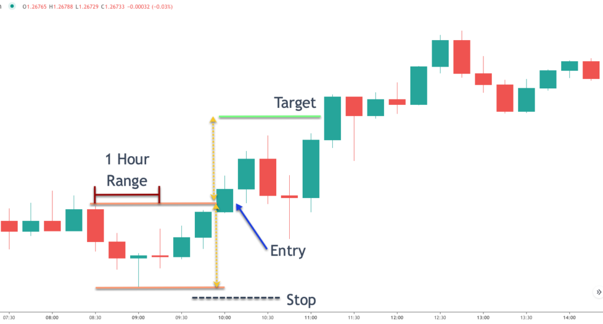

## Table of Contents

## What is the USD/CAD currency pair?

The USD/CAD currency pair is the exchange rate between the United States Dollar (USD) and the Canadian Dollar (CAD). It shows how many Canadian Dollars you can get for one US Dollar. This pair is important because the US and Canada are close neighbors and have a lot of trade between them.

People who trade currencies often watch the USD/CAD pair closely. The value of this pair can change because of things like oil prices, since Canada exports a lot of oil, or because of economic news from the US or Canada. Traders use this information to decide when to buy or sell the currency pair.

## Why is trading the USD/CAD pair important?

Trading the USD/CAD pair is important because the US and Canada are big trading partners. They share a long border and do a lot of business together. When people trade this currency pair, they are betting on how the economies of these two countries will do compared to each other. If someone thinks the US economy will do better than Canada's, they might buy USD and sell CAD, hoping to make money when the exchange rate changes.

Another reason this pair is important is because of oil. Canada has a lot of oil, and the price of oil can affect the Canadian dollar. When oil prices go up, the Canadian dollar often gets stronger. When oil prices go down, the Canadian dollar can get weaker. Traders watch oil prices closely because it helps them guess what might happen to the USD/CAD exchange rate. This makes the USD/CAD pair very interesting for people who trade currencies.

## What are the basic factors affecting the USD/CAD exchange rate?

The USD/CAD exchange rate is affected by many things, but two big ones are the economic health of the US and Canada. When the US economy is doing well, the US dollar usually gets stronger. If the Canadian economy is doing well, the Canadian dollar gets stronger. People who trade currencies watch things like job numbers, how much stuff people are buying, and how fast the economy is growing in both countries. If the US is doing better than Canada, the USD/CAD rate might go up, meaning you get more Canadian dollars for one US dollar.

Another big [factor](/wiki/factor-investing) is the price of oil. Canada has a lot of oil, so when oil prices go up, the Canadian dollar often gets stronger. This is because people want to buy Canadian dollars to buy oil. When oil prices go down, the Canadian dollar can get weaker because people don't want to buy as many Canadian dollars. Traders keep a close eye on oil prices because it helps them guess what might happen to the USD/CAD rate. So, the health of both economies and the price of oil are key things to watch when trading this currency pair.

## How does the economic relationship between the U.S. and Canada influence the USD/CAD pair?

The economic relationship between the U.S. and Canada plays a big role in the USD/CAD exchange rate. Because these two countries are neighbors and trade a lot with each other, what happens in one country can affect the other. If the U.S. economy is doing well, people might want more U.S. dollars to buy things from the U.S., making the USD stronger against the CAD. On the other hand, if Canada's economy is doing better, people might want more Canadian dollars, making the CAD stronger against the USD.

This relationship is also affected by how much the countries trade with each other. A lot of what Canada sells to the U.S. is stuff like cars and oil. If the U.S. buys more from Canada, it can make the Canadian dollar stronger because more people need CAD to buy those things. But if the U.S. buys less, the Canadian dollar might get weaker. So, the ups and downs in their trade can make the USD/CAD rate move around a lot.

## What are the key economic indicators to watch for trading USD/CAD?

When trading the USD/CAD pair, you should keep an eye on economic indicators from both the U.S. and Canada. For the U.S., important ones to watch are the Non-Farm Payrolls, which tell us how many jobs were added or lost in the U.S. each month, and the Gross Domestic Product (GDP), which shows how fast the U.S. economy is growing. The Federal Reserve's [interest rate](/wiki/interest-rate-trading-strategies) decisions are also key because they affect how much it costs to borrow money in the U.S., which can make the U.S. dollar stronger or weaker.

For Canada, you should pay attention to the employment data, which is like the Non-Farm Payrolls but for Canada, and the GDP numbers. The Bank of Canada's interest rate decisions are also very important because they can affect the value of the Canadian dollar. Another big thing to watch is the price of oil, since Canada exports a lot of oil. When oil prices go up, the Canadian dollar often gets stronger, and when oil prices go down, it can get weaker.

So, to trade the USD/CAD pair well, you need to look at these key indicators. They help you understand how the economies of the U.S. and Canada are doing and how their currencies might move against each other. By keeping an eye on these, you can make better guesses about where the USD/CAD rate might go next.

## How do commodity prices, particularly oil, impact the USD/CAD pair?

Commodity prices, especially oil, have a big effect on the USD/CAD pair. Canada is a big oil exporter, so when the price of oil goes up, it usually makes the Canadian dollar stronger. People want to buy more Canadian dollars to get oil, which pushes up the value of the CAD against the USD. On the other hand, when oil prices drop, the Canadian dollar can weaken because fewer people want to buy it.

This relationship between oil prices and the Canadian dollar is something traders watch closely. If oil prices are expected to rise, traders might buy more Canadian dollars, expecting the USD/CAD rate to go down. If oil prices are expected to fall, they might sell Canadian dollars, expecting the rate to go up. So, knowing what's happening with oil prices can help traders make better guesses about where the USD/CAD pair might be headed.

## What are the common trading strategies for the USD/CAD pair?

One common strategy for trading the USD/CAD pair is called [trend following](/wiki/trend-following). This means traders look at the price chart to see if the USD/CAD rate is going up or down over time. If they see it's going up, they might buy the pair, hoping to sell it later at a higher price. If they see it's going down, they might sell the pair, hoping to buy it back later at a lower price. Traders use tools like moving averages to help them see the trend better. This strategy works well when the market is moving in a clear direction, but it can be tricky if the market is moving back and forth a lot.

Another strategy is called range trading. This is used when the USD/CAD rate is moving between two levels and not going much higher or lower than those levels. Traders might buy the pair when it gets close to the lower level, expecting it to go back up. They might sell it when it gets close to the higher level, expecting it to go back down. This strategy can be good when the market is not moving much, but it can be hard if the market suddenly starts to trend in one direction.

A third strategy is to trade based on news and economic events. Traders watch things like oil prices, employment data, and interest rate decisions from the U.S. and Canada. If they think a news event will make the Canadian dollar stronger, they might buy the USD/CAD pair. If they think it will make the U.S. dollar stronger, they might sell it. This strategy can be risky because it's hard to predict exactly how the market will react to news, but it can also be very rewarding if the trader gets it right.

## How can technical analysis be applied to trading USD/CAD?

Technical analysis is a way to look at past price movements of the USD/CAD pair to guess where it might go next. Traders use charts and special tools to see patterns in how the price has moved. One common tool is the moving average, which is a line on the chart that shows the average price over a certain time. If the price is above the moving average, it might mean the USD/CAD is going up, and traders might want to buy. If the price is below the moving average, it might mean the pair is going down, and traders might want to sell. Another tool is the Relative Strength Index (RSI), which helps traders see if the pair is overbought or oversold. If the RSI is high, it might mean the pair is overbought and could go down soon. If it's low, it might mean the pair is oversold and could go up.

Another way to use technical analysis is to look for patterns in the price chart. For example, a "head and shoulders" pattern can show that the price might be about to go down. A "double bottom" pattern can show that the price might be about to go up. Traders also use support and resistance levels, which are price levels where the USD/CAD has had trouble moving past before. If the price gets close to a support level, traders might buy, expecting the price to bounce back up. If it gets close to a resistance level, traders might sell, expecting the price to go back down. By using these tools and patterns, traders can make better guesses about where the USD/CAD pair might be headed next.

## What are the typical volatility patterns in the USD/CAD pair?

The USD/CAD pair can be pretty up and down, especially around big news events. When the U.S. or Canada releases important economic data, like jobs numbers or interest rate decisions, the pair can move a lot. This is because traders are trying to guess how the news will affect the economies of both countries and their currencies. For example, if oil prices change a lot, the Canadian dollar might move more than usual because Canada sells a lot of oil. So, if you're trading USD/CAD, you need to watch out for these times when the market might be more jumpy.

Besides news events, the USD/CAD pair can also have more ups and downs during certain times of the day. The pair tends to move more when both the U.S. and Canadian markets are open at the same time. This is usually in the afternoon in North America. During these times, more traders are buying and selling, which can make the pair more volatile. But, when the markets are closed or only one is open, the pair might not move as much. So, knowing when the markets are open can help you guess when the USD/CAD might be more likely to move around a lot.

## How do interest rate differentials affect the USD/CAD pair?

Interest rate differentials between the U.S. and Canada can really affect the USD/CAD pair. When the U.S. has higher interest rates than Canada, people might want to buy more U.S. dollars to get the higher interest. This can make the USD stronger against the CAD. On the other hand, if Canada has higher interest rates, people might want to buy more Canadian dollars to get the higher interest, making the CAD stronger against the USD. So, the difference in interest rates can pull the exchange rate one way or the other.

Traders watch interest rate decisions from the Federal Reserve in the U.S. and the Bank of Canada closely. If the U.S. raises its interest rates more than Canada, it might make the USD/CAD rate go up, meaning you get more Canadian dollars for one U.S. dollar. If Canada raises its rates more, the rate might go down. These decisions don't just affect the currencies right away; they can also change how people expect the rates to move in the future, which can make the USD/CAD pair move even more.

## What are the risks involved in trading USD/CAD, and how can they be managed?

Trading USD/CAD can be risky because the price can move a lot, especially when big news comes out. If you're not careful, you could lose money fast. Another risk is that the market might not go the way you think it will. Even if you do everything right, you might still lose money because trading is never sure. Also, trading with too much money at once can be dangerous. If you put all your money into one trade and it goes wrong, you could lose a lot.

To manage these risks, it's a good idea to use something called a stop-loss order. This is a way to tell your trading platform to sell your USD/CAD if the price goes against you by a certain amount. It helps limit how much you can lose on one trade. Another way to manage risk is to not use all your money at once. Instead, only use a small part of your money for each trade. This way, if one trade goes bad, you still have money left to try again. Lastly, it's smart to learn as much as you can about what makes the USD/CAD move. The more you know, the better you can guess where it might go next, and that can help you make safer trades.

## How do geopolitical events influence the USD/CAD exchange rate?

Geopolitical events can shake up the USD/CAD exchange rate a lot. When big things happen around the world, like fights between countries or big changes in how countries work together, people can get worried. If they think the U.S. is going to be okay but Canada might have problems, they might want to buy more U.S. dollars and sell Canadian dollars. This can make the USD stronger and the CAD weaker. On the other hand, if people think Canada will be fine but the U.S. might have trouble, they might buy more Canadian dollars and sell U.S. dollars, making the CAD stronger and the USD weaker.

Oil prices are another way geopolitical events can affect the USD/CAD rate. Canada sells a lot of oil, so if something happens that makes oil prices go up or down a lot, it can change how much people want Canadian dollars. For example, if there's a war in a place that makes oil, and oil prices go up, people might want to buy more Canadian dollars to get that oil. This can make the CAD stronger against the USD. But if something happens that makes oil prices drop, people might not want as many Canadian dollars, and the CAD can get weaker. So, keeping an eye on what's happening around the world can help you understand why the USD/CAD rate might be moving.

## What are some practical tips for successful trading?

Understanding technical analysis is essential for identifying entry and [exit](/wiki/exit-strategy) points in [forex](/wiki/forex-system) trading. This involves studying price patterns, support and resistance levels, and various indicators such as moving averages and the Relative Strength Index (RSI). However, to enhance the accuracy of these insights, traders should also confirm them with [fundamental analysis](/wiki/fundamental-analysis). Fundamental analysis involves assessing economic indicators, interest rates, and geopolitical events that may impact currency values, offering a more comprehensive view of market conditions.

False breakouts pose a significant risk, especially during times of heightened market [volatility](/wiki/volatility-trading-strategies). Traders should be cautious and look for complete consolidation before making trading decisions. Consolidation provides more stable ground by indicating that the market has digested recent news and is moving in a more predictable pattern. During consolidation, prices typically move within a range, allowing traders to identify more reliable support and resistance levels.

Advanced trading platforms are invaluable resources, offering sophisticated charting tools and customizable alerts. These features enable traders to effectively monitor market changes and make timely decisions. Platforms like MetaTrader or TradingView provide capabilities to customize indicators, automate trading through scripts, and set alerts for specific market conditions, ensuring traders stay informed.

Risk management is a fundamental component of successful forex trading. Traders must employ stop-loss orders to limit potential losses and use position sizing to allocate capital effectively. Calculating the appropriate position size involves determining the percentage of capital to risk per trade, often advised to be around 1-2%. This can be calculated using the formula:

$$
\text{Position Size} = \frac{\text{Account Risk}}{\text{Trade Risk (Pips)}} \times \text{Pip Value}
$$

where Account Risk is the total amount a trader is willing to risk, and Trade Risk (Pips) is the distance between the entry point and the stop-loss order in pips.

For novice traders or those seeking to refine their strategies, copy trading offers substantial benefits. This method allows traders to replicate the trades of experienced investors. By observing seasoned traders, newcomers can learn effective strategies and risk management techniques without direct exposure to all the risks involved in developing their strategies from scratch. Many platforms, such as eToro, facilitate copy trading, enabling traders to follow and mimic successful peers, thus accelerating their learning curve.

## References & Further Reading

[1]: Bergstra, J., Bardenet, R., Bengio, Y., & Kégl, B. (2011). ["Algorithms for Hyper-Parameter Optimization."](https://papers.nips.cc/paper/4443-algorithms-for-hyper-parameter-optimization) Advances in Neural Information Processing Systems 24.

[2]: ["Advances in Financial Machine Learning"](https://www.amazon.com/Advances-Financial-Machine-Learning-Marcos/dp/1119482089) by Marcos Lopez de Prado

[3]: ["Evidence-Based Technical Analysis: Applying the Scientific Method and Statistical Inference to Trading Signals"](https://www.amazon.com/Evidence-Based-Technical-Analysis-Scientific-Statistical/dp/0470008741) by David Aronson

[4]: ["Machine Learning for Algorithmic Trading"](https://github.com/stefan-jansen/machine-learning-for-trading) by Stefan Jansen

[5]: ["Quantitative Trading: How to Build Your Own Algorithmic Trading Business"](https://www.amazon.com/Quantitative-Trading-Build-Algorithmic-Business/dp/1119800064) by Ernest P. Chan