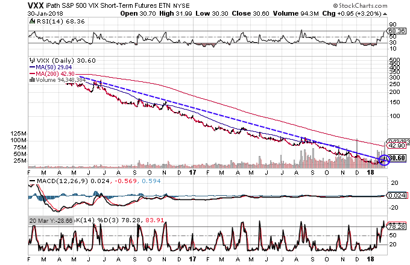

## Table of Contents

## What is the VIX and how does it measure market volatility?

The VIX, or the CBOE Volatility Index, is often called the "fear gauge" of the stock market. It measures how much people expect the stock market to move up or down in the next 30 days. The VIX is calculated using the prices of options on the S&P 500, which are financial contracts that give the right to buy or sell the index at a certain price. When people think the market will be more volatile, they are willing to pay more for these options, which makes the VIX go up.

A higher VIX number means that people expect bigger swings in the stock market, which often happens during times of uncertainty or bad news. For example, if the VIX is at 20, it means the market expects the S&P 500 to move up or down by about 20% over the next year. When the VIX is low, like around 12, it suggests that people expect the market to be calm and stable. So, the VIX helps investors understand how nervous or calm the market feels about the future.

## What are ETFs and how can they be used to trade the VIX?

ETFs, or Exchange-Traded Funds, are investment funds that you can buy and sell on a stock exchange, just like stocks. They are designed to track the performance of a specific index, commodity, or basket of assets. For example, an ETF might track the S&P 500 or the price of gold. ETFs are popular because they offer a way to diversify your investments easily and often have lower fees than mutual funds.

To trade the VIX using ETFs, you can use special ETFs that are designed to track the VIX. These are called VIX ETFs, and they aim to mimic the performance of the VIX index. However, trading VIX ETFs can be tricky because they don't always move exactly like the VIX. Some VIX ETFs are designed to give you the daily performance of the VIX, which means they might not be good for long-term holding. It's important to understand how these ETFs work and to be aware of the risks before you start trading them.

## What are the most popular VIX ETFs available to investors?

The most popular VIX ETFs are the iPath Series B S&P 500 VIX Short-Term Futures ETN (VXX) and the ProShares VIX Short-Term Futures ETF (VIXY). These ETFs aim to track the performance of short-term VIX futures contracts. The VXX and VIXY are designed to give investors exposure to the expected volatility of the S&P 500 over the next 30 days. They are popular because they are easy to buy and sell on the stock market, just like regular stocks.

However, it's important to know that these ETFs don't always move exactly like the VIX. They track VIX futures, which can be different from the VIX itself. This means that over time, the value of these ETFs can go down even if the VIX stays the same or goes up. So, they are often used by traders for short-term bets on market volatility rather than as long-term investments.

## How do VIX ETFs track the performance of the VIX?

VIX ETFs track the performance of the VIX by investing in VIX futures contracts, which are agreements to buy or sell the VIX at a future date. The VIX itself is not something you can directly invest in because it's just a number that measures expected stock market volatility. So, these ETFs use VIX futures to get as close as they can to tracking the VIX. The most common VIX ETFs, like VXX and VIXY, focus on short-term VIX futures, which are contracts that will soon expire.

However, these ETFs don't track the VIX perfectly. The reason is that the VIX is based on the current prices of S&P 500 options, while VIX futures are based on what people think the VIX will be in the future. This difference can cause the ETFs to move differently from the VIX, especially over longer periods. Because of this, VIX ETFs are often used for short-term trading rather than long-term investing.

## What are the key differences between short-term and mid-term VIX ETFs?

Short-term VIX ETFs, like the VXX and VIXY, focus on VIX futures that will expire soon, usually within the next month. These ETFs aim to track the expected volatility of the S&P 500 over the next 30 days. Because they are based on short-term futures, they can be more reactive to sudden changes in market sentiment. This makes them popular for traders who want to bet on quick shifts in volatility. However, they can also lose value quickly if the market stays calm, due to something called "contango," where the price of future contracts is higher than the current ones.

Mid-term VIX ETFs, on the other hand, invest in VIX futures that have a longer time until they expire, usually between one and six months. A common example is the iPath Series B S&P 500 VIX Mid-Term Futures ETN (VXZ). These ETFs track the expected volatility of the S&P 500 over a longer period, which makes them less sensitive to short-term market swings. They are often used by investors who want a more stable exposure to volatility. Still, like short-term ETFs, they can also be affected by contango, but the impact is usually less severe because of the longer time frame.

## What are the risks associated with trading VIX ETFs?

Trading VIX ETFs comes with a lot of risks. One big risk is that these ETFs don't always move the same way as the VIX. They track VIX futures, which can be different from the VIX itself. This means that even if the VIX goes up, the ETF might not go up as much, or it might even go down. This can be confusing and lead to losses if you're not careful.

Another risk is something called "contango." This happens when the price of future VIX contracts is higher than the current ones. Over time, as the ETF rolls over from one futures contract to another, it can lose value. This is especially true for short-term VIX ETFs, which can lose value quickly if the market stays calm. So, if you hold these ETFs for a long time, you might lose money even if the VIX stays the same or goes up a little.

Also, VIX ETFs are often used for short-term trading, which can be risky. The market can be very unpredictable, and trying to guess how volatility will change in the short term can lead to big losses. It's important to understand these risks and maybe talk to a financial advisor before you start trading VIX ETFs.

## How can VIX ETFs be used as part of a broader investment strategy?

VIX ETFs can be used as part of a broader investment strategy to help manage risk. Since these ETFs track market volatility, they can act like a safety net during times when the stock market is shaky. For example, if you think the market might get bumpy, you could buy some VIX ETFs. If the market does get volatile, the value of these ETFs might go up, which could help balance out losses in other parts of your portfolio. It's a way to hedge against big drops in the stock market.

However, using VIX ETFs in this way needs careful planning. They are not meant for long-term holding because they can lose value over time, especially if the market stays calm. So, they are best used for short periods when you expect the market to be volatile. It's also important to keep VIX ETFs as just a small part of your overall strategy. That way, you can use them to manage risk without putting too much of your money into something that can be unpredictable. Talking to a financial advisor can help you figure out the best way to use VIX ETFs in your investment plan.

## What are some common trading strategies for VIX ETFs?

One common trading strategy for VIX ETFs is called "mean reversion." This means that traders believe the VIX will go back to its average level after it goes too high or too low. So, if the VIX is really high, a trader might buy a VIX ETF, thinking it will go up a bit more and then come back down. Once it starts to come down, they sell the ETF to make a profit. If the VIX is really low, they might sell the ETF short, hoping to buy it back cheaper when the VIX goes back up.

Another strategy is to use VIX ETFs to hedge against market downturns. If a trader thinks the stock market might drop, they might buy a VIX ETF to protect their other investments. If the market does go down and gets more volatile, the VIX ETF might go up, which can help balance out losses in their portfolio. This strategy is about managing risk, not trying to make a big profit from the VIX ETF itself.

A third strategy is to trade VIX ETFs based on big news events. Traders might buy VIX ETFs right before big news, like an election or a major economic report, because these events can make the market more volatile. If the news causes the VIX to spike, the trader can sell the ETF for a profit. But this strategy is risky because it's hard to predict how the market will react to news.

## How do market conditions influence the performance of VIX ETFs?

Market conditions have a big impact on how VIX ETFs perform. When the stock market gets really shaky, like during a big economic scare or a sudden drop in stock prices, the VIX usually goes up. This is because more people want to buy options to protect their investments, which makes the VIX go up. If you own a VIX ETF during these times, its value might go up too, since it's trying to track the VIX. But, it's important to know that VIX ETFs don't always move exactly like the VIX, so they might not go up as much as you expect.

On the other hand, when the stock market is calm and stable, the VIX usually goes down. This means fewer people are worried about big swings in the market, so they don't need as many options. If you hold a VIX ETF during these calm times, its value might go down. Plus, there's something called "contango" that can make VIX ETFs lose value over time, especially if the market stays calm for a long time. So, it's important to watch the market and understand how these conditions can affect your VIX ETFs.

## What advanced techniques can be used to enhance returns from trading VIX ETFs?

One advanced technique to enhance returns from trading VIX ETFs is to use options. You can buy or sell options on VIX ETFs, which can help you make money if you think the VIX will go up or down a lot. For example, if you think the VIX will spike soon, you might buy call options on a VIX ETF. If the VIX does go up, the value of your options could go up a lot more than the ETF itself. But, this is risky because options can lose all their value if the VIX doesn't move the way you expect.

Another technique is to use a strategy called "pairs trading." This means you buy one VIX ETF and sell another one at the same time. For example, you could buy a short-term VIX ETF like VXX and sell a mid-term VIX ETF like VXZ. The idea is that the difference between the two ETFs might change in a way that you can make money from. This can help you make money even if the overall market doesn't move much, but it's complicated and needs a lot of watching and understanding of how these ETFs work together.

## How can one manage the decay in VIX ETFs and what impact does it have on long-term holding?

Managing the decay in VIX ETFs is important because these ETFs can lose value over time, especially if you hold them for a long time. This decay happens because of something called "contango," where the price of future VIX contracts is higher than the current ones. To manage this, you can trade VIX ETFs for short periods instead of holding them long-term. This means you buy the ETF when you think the market will get volatile and sell it when you think the volatility will go down. By doing this, you can try to make money from the short-term ups and downs of the VIX without losing too much to decay.

The impact of decay on long-term holding of VIX ETFs can be big. If you hold a VIX ETF for a long time, like months or years, it's likely to lose value even if the VIX stays the same or goes up a little. This is because the ETF has to keep buying new futures contracts as the old ones expire, and if those new contracts are more expensive, the ETF loses money. So, if you want to use VIX ETFs, it's better to think of them as a short-term tool for trading or hedging, not as something to hold onto for a long time.

## What are the tax implications of trading VIX ETFs and how can they be optimized?

Trading VIX ETFs can have tax implications that you need to think about. When you buy and sell these ETFs, any profits you make are usually considered short-term capital gains if you hold them for less than a year. Short-term gains are taxed at your regular income tax rate, which can be higher than the rate for long-term gains. Also, if you use VIX ETFs to hedge other investments, you might be able to use losses from the ETFs to offset gains from other parts of your portfolio, which can help lower your taxes. But, you need to be careful because the IRS has rules about what counts as a hedge and what doesn't.

To optimize the tax implications of trading VIX ETFs, you can try to hold them for at least a year to get the lower long-term capital gains tax rate. But, because VIX ETFs are usually better for short-term trading due to decay, this might not be the best strategy. Another way to optimize is to keep good records of your trades and use any losses to offset gains. You might also want to talk to a tax advisor who can help you figure out the best way to manage your taxes when trading VIX ETFs.

## What is the relationship between understanding market volatility and the VIX?

Market volatility is a key concept in the financial world, representing the rate at which the prices of securities fluctuate over a specified period. This fluctuation is measured by the standard deviation of the returns of the asset and is an indicator of the uncertainty or risk associated with the asset's value. Investors and traders pay close attention to volatility levels to gauge potential risks and opportunities in the market.

A central tool for measuring market [volatility](/wiki/volatility-trading-strategies) is the VIX, or Volatility Index, which is often referred to as the market's "fear gauge." The VIX quantifies the market's expectations of volatility in the S&P 500 for the upcoming 30 days. It is calculated based on the prices of options on the S&P 500 index. Specifically, the VIX represents the market's expectations of future volatility as implied by S&P 500 index option prices. These options are financial derivatives that provide traders with the right, but not the obligation, to buy or sell the S&P 500 index at a specified price before a specified date.

The computation of VIX values involves complex formulas that consider both call and put options on the S&P 500. The general idea is to calculate a weighted average of the estimated variances of a wide range of options. The formula for the VIX involves the use of out-of-the-money options, which are options where the strike prices are above (for calls) or below (for puts) the current level of the index.

$$
\text{VIX} = 100 \times \sqrt{\frac{2}{T} \sum \frac{\Delta K_i}{K_i^2} e^{RT} \overline{Q(K_i)} - \frac{1}{T} \left( \frac{F_0}{K_0} - 1 \right)^2 }
$$

Where:
- $T$ is the time to expiration
- $\Delta K_i$ is the interval between strike prices
- $K_i$ are strike prices
- $\overline{Q(K_i)}$ are the mid-point prices of bid-ask quotes for options
- $R$ is the risk-free interest rate
- $F_0$ is the forward index level
- $K_0$ is the first strike below the forward index level

A high VIX value generally indicates that the market anticipates significant price swings in the near term, reflecting elevated investor anxiety or uncertainty. This can be attributed to various factors such as geopolitical events, economic data releases, or shifts in monetary policy. Conversely, a low VIX value suggests that the market is relatively calm and anticipates stable conditions, with lesser expected price fluctuations. Investors and traders use VIX levels to make informed decisions; for example, a high VIX may prompt an investor to hedge their portfolios against potential downturns, while a low VIX might indicate a time to execute risk-on strategies.

## References & Further Reading

[1]: Whaley, R. E. (2000). ["The Investor Fear Gauge."](https://www.semanticscholar.org/paper/The-Investor-Fear-Gauge-Whaley/37ea262fb99beb8bf9dcb8406400d491aab40a0b) The Journal of Portfolio Management, 26(3), 12-17.

[2]: ["VIX Futures and Options: Pricing and Using Volatility Products to Managed Portfolio Risk"](https://www.researchgate.net/publication/240315836_VIX_Futures_and_Options_Pricing_and_Using_Volatility_Products_to_Manage_Downside_Risk_and_Improve_Efficiency_in_Equity_Portfolios) by Russell Rhoads

[3]: ["Volatility Trading"](https://www.investopedia.com/articles/investing/021716/strategies-trading-volatility-options-nflx.asp) by Euan Sinclair

[4]: Alexander, C. (2008). ["Market Risk Analysis Volume II: Practical Financial Econometrics."](https://pdfs.semanticscholar.org/159a/c49d31ebb0e594e993935a463c42c97874e6.pdf) John Wiley & Sons.

[5]: ["Algorithmic Trading: Winning Strategies and Their Rationale"](https://www.amazon.com/Algorithmic-Trading-Winning-Strategies-Rationale-ebook/dp/B00CY5HC0U) by Ernest P. Chan

[6]: Rachev, S. T., Mittnik, S., Fabozzi, F. J., Focardi, S. M., & Jasic, T. (2007). ["Financial Econometrics: From Basics to Advanced Modeling Techniques."](https://onlinelibrary.wiley.com/doi/book/10.1002/9781119201847) John Wiley & Sons.