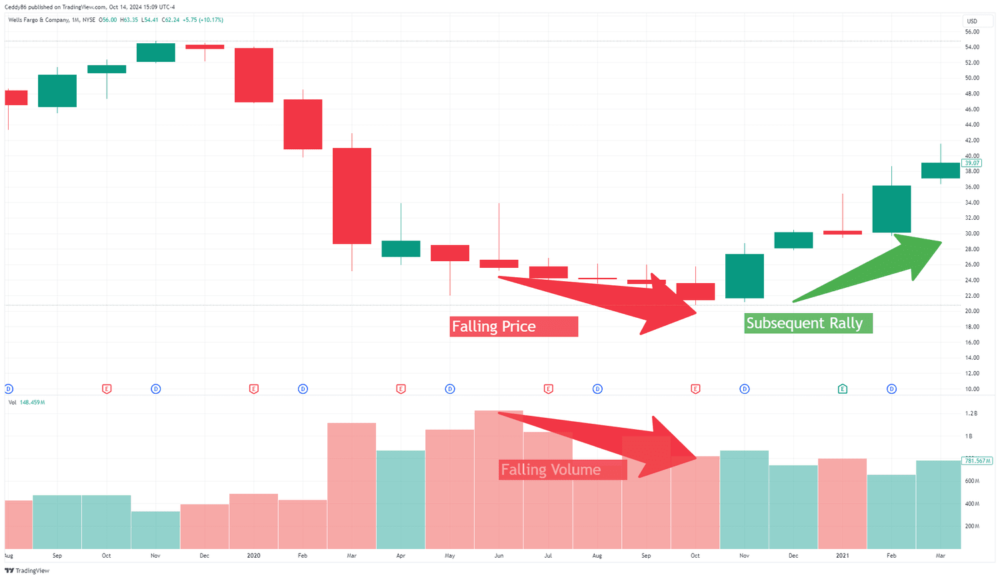

## Table of Contents

## What is trading volume and why is it important in financial markets?

Trading volume is the total number of shares or contracts traded for a specific security or market during a given period, usually a day. It shows how many times people bought and sold a particular stock or other financial product. Think of it like how busy a store is; if lots of people are coming in and out, that store has a high volume of customers.

Volume is important in financial markets because it helps investors understand the interest and activity around a stock. If a stock has high trading volume, it means many people are interested in it, and it's easier to buy or sell that stock quickly. On the other hand, low volume might mean less interest and could make it harder to trade. Volume also helps investors spot trends; if volume increases when a stock's price goes up, it might mean the price trend is strong and likely to continue.

## How can beginners use trading volume to confirm price trends?

Beginners can use trading volume to confirm price trends by looking at how much a stock is being traded when its price changes. If a stock's price goes up and the trading volume is high, it means many people are buying the stock, which can confirm that the upward trend is strong. On the other hand, if the price goes up but the volume is low, it might mean the trend isn't as strong because fewer people are interested.

Similarly, if a stock's price goes down with high volume, it shows that many people are selling, which can confirm a downward trend. But if the price drops and the volume is low, it might not be a strong trend because not many people are selling. By paying attention to volume, beginners can get a better idea of whether a price trend is likely to continue or if it might reverse soon.

## What are the key indicators derived from trading volume and how are they calculated?

One key indicator derived from trading volume is the Volume Oscillator. It helps show if volume is going up or down over time. To calculate it, you take the difference between two moving averages of volume, usually a short-term and a long-term one. For example, you might use a 5-day moving average and a 10-day moving average. If the short-term average is higher than the long-term average, the oscillator is positive, meaning volume is increasing. If it's lower, the oscillator is negative, meaning volume is decreasing.

Another important indicator is the On-Balance Volume (OBV). This indicator adds volume on up days and subtracts it on down days, helping to show if volume is flowing into or out of a stock. To calculate OBV, start with an initial value, usually zero. If the stock price goes up from one day to the next, add that day's volume to the OBV. If the price goes down, subtract the volume. If the price stays the same, the OBV doesn't change. Rising OBV can confirm an upward price trend, while falling OBV can confirm a downward trend.

The Accumulation/Distribution Line is also derived from volume. It considers both the volume and the price range of a stock during a trading day. To calculate it, you first find the close location value (CLV), which shows where the closing price is within the day's range. Then, you multiply the day's volume by the CLV and add this to the previous Accumulation/Distribution Line value. If the line is going up, it suggests more buying pressure, and if it's going down, it suggests more selling pressure. This can help confirm whether a price trend is supported by volume.

## How does volume analysis differ between stocks, forex, and commodities?

Volume analysis is used in different ways depending on whether you're looking at stocks, forex, or commodities. For stocks, volume is very clear because it shows how many shares are traded. If a stock's price goes up with high volume, it means many people are buying, which can make the upward trend stronger. For forex, volume isn't as straightforward because it's not about trading specific units like shares. Instead, forex volume often refers to the number of transactions or the amount of money traded. This can still help show if a currency pair's price trend is strong, but it's a bit different from stocks.

For commodities, volume can also be important, but it depends on the type of commodity. For example, futures contracts for oil or gold have volume data similar to stocks, showing how many contracts are traded. This can help confirm trends in commodity prices. However, for physical commodities like grains or metals, the volume might refer to the actual amount of the commodity traded, which can be less directly related to price trends. In all cases, volume helps traders see if a price movement is supported by a lot of trading activity, but the specifics of how volume is measured and used can vary.

## What is the significance of volume spikes and how should they be interpreted?

Volume spikes mean that a lot more people are trading a stock, currency, or commodity than usual. It's like a sudden rush of activity. When you see a volume spike, it often means something important is happening. Maybe there's big news about the company, or something in the market changed suddenly. It's a signal that traders should pay attention because big moves in price often happen after volume spikes.

To interpret volume spikes, you need to look at what's happening with the price at the same time. If the price goes up a lot with a volume spike, it usually means a lot of people are buying, and the upward trend might keep going. But if the price goes down with a volume spike, it means a lot of people are selling, and the downward trend might continue. Sometimes, a volume spike can also mean the price might reverse soon. So, it's important to watch what happens after the spike to see if the trend keeps going or if it changes direction.

## How can volume be used to predict potential reversals in the market?

Volume can help you guess if the price of a stock, currency, or commodity might start going the other way soon. If you see the price going up but the volume is getting lower, it could mean that fewer people are interested in buying. This might be a sign that the upward trend is getting weak and could reverse. On the other hand, if the price is going down but the volume is also going down, it might mean that not many people are selling anymore, which could signal that the downward trend is running out of steam and might reverse soon.

Another way to spot a potential reversal is by looking at volume spikes. If there's a big jump in volume and the price makes a sharp move up or down, it's a sign that a lot of people are trading. After such a spike, if the price starts to move in the opposite direction, it could mean that the trend is reversing. For example, if the price was going up and then there's a volume spike followed by the price starting to go down, it might mean the upward trend is over and a new downward trend is starting. Watching volume can give you clues about when a trend might change direction.

## What are the common pitfalls and misconceptions about volume analysis?

One common pitfall in volume analysis is thinking that high volume always means the price will keep going in the same direction. High volume can show that a lot of people are interested, but it doesn't always mean the trend will continue. Sometimes, a big jump in volume can actually mean the price is about to change direction. So, it's important to look at other things like what's happening with the price and any news that might affect the stock.

Another misconception is that low volume always means the price trend is weak. Sometimes, a stock can keep moving in the same direction even with low volume, especially if there's not much new news or interest. Low volume doesn't always mean the trend is about to stop or reverse. It's important to consider the bigger picture and not just focus on volume alone.

Lastly, some people think that volume analysis is the only thing they need to make good trading decisions. While volume can give you useful information, it's just one part of the puzzle. You should also look at things like price patterns, economic indicators, and company news to get a full picture of what's happening in the market. Relying too much on volume without considering other factors can lead to mistakes.

## How does volume analysis integrate with other technical analysis tools?

Volume analysis works well with other technical analysis tools to help traders understand what's happening in the market. For example, you can use volume with price charts to see if a trend is strong. If the price is going up and the volume is high, it can confirm that the trend is strong because a lot of people are buying. But if the price is going up and the volume is low, it might mean the trend is weak and could change direction soon. By looking at volume and price together, you get a better idea of whether to trust the price movement.

Another way volume integrates with technical tools is through indicators like the Moving Average Convergence Divergence (MACD) or the Relative Strength Index (RSI). These indicators show if a stock might be overbought or oversold. If the RSI shows a stock is overbought and you see a volume spike at the same time, it could mean the price is about to drop. Or if the MACD shows a bullish signal and the volume is increasing, it can make you more confident that the price will keep going up. Combining volume with these indicators helps you make smarter trading decisions by looking at more than just one piece of information.

## Can volume analysis be effectively used in algorithmic trading strategies?

Yes, volume analysis can be effectively used in algorithmic trading strategies. In algorithmic trading, computers use math and rules to make trading decisions quickly. Volume is an important part of these rules because it shows how many people are interested in a stock, currency, or commodity. If a computer sees that a stock's price is going up and the volume is high, it might decide to buy more of that stock because it thinks the price will keep going up. On the other hand, if the price is going down with high volume, the computer might decide to sell because it thinks the price will keep dropping.

Volume can also help computers spot when a price trend might change. If an algorithm sees that the volume is getting lower while the price is still going up, it might predict that the upward trend is getting weak and could reverse soon. This can help the computer make smarter trades by selling before the price drops. By including volume in their rules, algorithmic trading strategies can make better decisions and possibly make more money.

## What advanced volume-based indicators exist and how do they enhance trading decisions?

One advanced volume-based indicator is the Volume Profile. It shows how much trading happened at different price levels over time. This can help traders see where a lot of people bought or sold a stock, which can be important because those levels might act as support or resistance in the future. If a lot of trading happened at a certain price, and the price comes back to that level, it might be harder for the price to keep moving in the same direction because a lot of people might want to buy or sell again at that price. By looking at the Volume Profile, traders can make better decisions about where to enter or exit trades.

Another useful indicator is the Volume Weighted Average Price (VWAP). It calculates the average price of a stock, taking into account the volume traded at each price level during the day. This helps traders see if they're getting a good deal on a stock. If the current price is below the VWAP, it might be a good time to buy because the stock is cheaper than the average price people paid for it that day. If the price is above the VWAP, it might be a good time to sell because the stock is more expensive than the average. Using VWAP can help traders make smarter choices about when to buy or sell based on how the price compares to the day's average.

## How can volume data be used to assess the liquidity and market interest in a security?

Volume data can help you see how easy it is to buy or sell a security, which is called liquidity. If a stock has high trading volume, it means a lot of people are buying and selling it. This makes it easier for you to trade the stock because there are always people ready to buy or sell. On the other hand, if a stock has low volume, it might be harder to trade because fewer people are interested, and it might take longer to find someone to buy from or sell to. So, by looking at the volume, you can tell if a stock is liquid or not.

Volume also shows how much interest there is in a security. If a stock's volume is high, it means a lot of people are paying attention to it. This could be because of good or bad news about the company, or because something big is happening in the market. High volume can mean that more people think the stock's price will go up or down, which can make the price move more quickly. By watching the volume, you can get a sense of how interested people are in a stock and whether it's worth looking into more.

## What are the latest research findings on volume analysis and their implications for expert traders?

Recent research on volume analysis has shown that it can be even more useful for expert traders when combined with other data. For example, studies have found that looking at volume together with order flow data can give a clearer picture of market trends. Order flow data shows the real-time buying and selling activity, and when you add this to volume data, you can better predict price movements. This means expert traders can make more informed decisions by understanding not just how much is being traded, but also who is doing the trading and why.

Another important finding is that volume spikes can be key signals for expert traders. Research has shown that volume spikes often happen before big price changes, which can be used to spot potential reversals or continuations of trends. By paying close attention to these spikes and understanding the context behind them, expert traders can position themselves to take advantage of these movements. This research suggests that volume analysis, when used correctly, can significantly improve trading strategies and help traders stay ahead in the market.

## How can one leverage volume insights in algorithmic trading?

Algorithmic trading utilizes automated systems to examine and interpret trading volume data, enabling rapid and unemotional trading decisions. By leveraging algorithms, traders can incorporate volume indicators to execute trades based on predefined criteria, thereby optimizing entry and [exit](/wiki/exit-strategy) points.

Volume indicators are a crucial component of [algorithmic trading](/wiki/algorithmic-trading) strategies. The Volume Weighted Average Price (VWAP) and On-Balance Volume (OBV) tools are among the most popular in the algorithmic trading repertoire. VWAP provides the average price a security has traded at throughout the day, based on both volume and price. It is calculated using the formula:

$$
\text{VWAP} = \frac{\sum_{i=1}^{n} P_i \times Q_i}{\sum_{i=1}^{n} Q_i}
$$

where $P_i$ is the price of the trade and $Q_i$ is the quantity of the trade. Traders use VWAP to assess whether a security is being bought or sold below its average price, providing insights into the strength or weakness of market trends.

On-Balance Volume (OBV) is another tool that helps traders understand trends in volume alongside price movements. OBV calculates a cumulative total of volume, adding volume on days when the price increases and subtracting it on days when the price decreases. This indicator helps to reveal market participants' sentiment and potential future movements in price.

Incorporating these volume insights into algorithmic trading enables traders to make more informed decisions. Algorithms allow for real-time processing and analysis of intricate volume data, which would be impractical to attain through manual trading. By processing vast amounts of data quickly, algorithms can exploit short-term market inefficiencies and adapt to changing market conditions swiftly.

The real-time capabilities of algorithms ensure that volume analysis is not only detailed but also timely, which is vital in the ever-changing landscape of financial markets. By utilizing such advanced analytical techniques, traders can enhance their strategies, leading to potentially higher returns and more strategically sound trading decisions.

## What are the strategies and tools for volume analysis?

Investors and traders employ a variety of volume-based strategies and tools to effectively navigate the complexities of financial markets. One of the prominent methodologies is Volume Spread Analysis (VSA), which aims to interpret the relationship between trading volume and the price spread. VSA assumes that every price change in the market is backed by a certain level of volume, which can provide insights into market intentions and potential directions. By analyzing the interaction between price bars and volume, traders can identify accumulation, distribution, and potential price reversals.

Among the essential indicators utilized in volume analysis is the Chaikin Money Flow (CMF), which assesses the buying and selling pressure in a market over a specific period. The CMF is calculated by multiplying the closing location value by the volume for the period, followed by a cumulative total of these values over the period length. A positive CMF value suggests buying pressure, while a negative value indicates selling pressure. This indicator helps traders confirm trends and spot potential reversals based on volume movements.

Another noteworthy tool is the Price Volume Trend (PVT), which combines price change and volume to indicate the direction of price momentum. The PVT is calculated as follows:

$$

\text{PVT} = \Sigma \left( \frac{{\text{Current Close} - \text{Previous Close}}}{\text{Previous Close}} \times \text{Volume} \right) 
$$

The PVT provides insights into the strength of a price trend by considering the amount of volume accompanying price movements. An upward trend in PVT signals strength in a bullish trend, while a downward trend points towards bearish momentum.

Effectively utilizing these tools can significantly enhance the accuracy of market predictions and contribute to trading success. By integrating these volume-based strategies into their analysis, traders gain a deeper understanding of market dynamics and can better anticipate market movements.

## References & Further Reading

[1]: Bergstra, J., Bardenet, R., Bengio, Y., & Kégl, B. (2011). ["Algorithms for Hyper-Parameter Optimization."](https://papers.nips.cc/paper/4443-algorithms-for-hyper-parameter-optimization) Advances in Neural Information Processing Systems 24.

[2]: ["Advances in Financial Machine Learning"](https://www.amazon.com/Advances-Financial-Machine-Learning-Marcos/dp/1119482089) by Marcos Lopez de Prado

[3]: ["Evidence-Based Technical Analysis: Applying the Scientific Method and Statistical Inference to Trading Signals"](https://www.amazon.com/Evidence-Based-Technical-Analysis-Scientific-Statistical/dp/0470008741) by David Aronson

[4]: ["Machine Learning for Algorithmic Trading"](https://github.com/stefan-jansen/machine-learning-for-trading) by Stefan Jansen

[5]: ["Quantitative Trading: How to Build Your Own Algorithmic Trading Business"](https://www.amazon.com/Quantitative-Trading-Build-Algorithmic-Business/dp/1119800064) by Ernest P. Chan