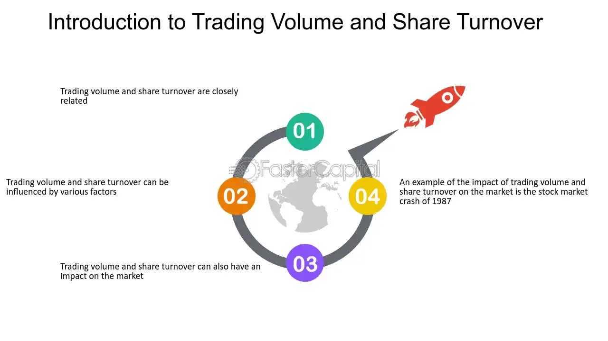

## Table of Contents

## What is trading volume?

Trading volume is the total number of shares or contracts traded for a particular security or market during a specific time period, usually a day. It shows how active the market is. When lots of people are buying and selling, the trading volume is high. When fewer people are trading, the volume is low.

High trading volume can mean that a stock is popular or that something important is happening with the company. For example, if a company announces good news, more people might want to buy the stock, which increases the trading volume. On the other hand, low trading volume might mean that not many people are interested in the stock at that time.

## What does 'shares outstanding' mean?

Shares outstanding is the total number of shares of a company's stock that are currently owned by all its shareholders, including the public and company insiders. It's an important number because it shows how big a piece of the company each share represents. If a company has a lot of shares outstanding, each share is a smaller piece of the company.

This number can change over time. For example, if a company issues new shares to raise money, the number of shares outstanding goes up. On the other hand, if the company buys back its own shares, the number of shares outstanding goes down. Knowing the number of shares outstanding helps investors understand the value of their shares and how the company is managing its stock.

## How can trading volume exceed shares outstanding?

Trading [volume](/wiki/volume-trading-strategy) can exceed shares outstanding because the same shares can be traded multiple times in a single day. Imagine you have a ball and you throw it to a friend, then your friend throws it to someone else, and so on. Even though there's only one ball, it can be passed around many times. In the same way, a single share can be bought and sold by different people throughout the day, adding to the total trading volume.

This happens a lot, especially with popular stocks. If a stock is in the news or if something exciting is happening with the company, more people might want to buy and sell it. So, even though the total number of shares (shares outstanding) stays the same, the number of times those shares are traded (trading volume) can be much higher.

## What are the common causes of trading volume exceeding shares outstanding?

Trading volume can exceed shares outstanding when a lot of people are buying and selling the same shares over and over again in a single day. Imagine a popular toy that everyone wants to play with. Even though there's only one toy, it can be passed around many times. In the stock market, if a stock is in the news or if something exciting is happening with the company, more people might want to trade it. This means the same shares get bought and sold multiple times, making the trading volume much higher than the number of shares that actually exist.

Another reason this happens is when there's a lot of interest in a stock. For example, if a company announces good earnings or a new product, investors might rush to buy or sell the stock. This creates a lot of activity, and the same shares can change hands many times. So, even though the total number of shares (shares outstanding) doesn't change, the number of trades (trading volume) can be much bigger. This is normal and shows how active the market is for that stock.

## Can trading volume exceeding shares outstanding affect stock prices?

Yes, trading volume exceeding shares outstanding can affect stock prices. When a lot of people are buying and selling the same shares over and over again, it can make the stock price go up or down quickly. If many people want to buy the stock, the price might go up because there's more demand. On the other hand, if many people want to sell, the price might go down because there's more supply.

This high trading volume can also make the stock more volatile. That means the price can change a lot in a short time. When a stock is popular and everyone is trading it, even small news or rumors can cause big price swings. So, if you see a stock with trading volume much higher than its shares outstanding, it's a sign that the stock might be more likely to have big price changes.

## What are the implications of high trading volume relative to shares outstanding?

When trading volume is high compared to shares outstanding, it means a lot of people are buying and selling the same shares over and over again. This can make the stock more popular and can lead to big changes in the stock price. If many people want to buy the stock, the price might go up because there's more demand. But if many people want to sell, the price might go down because there's more supply. This high activity can make the stock more exciting but also more risky because the price can change a lot in a short time.

High trading volume relative to shares outstanding can also be a sign that something important is happening with the company. Maybe they announced good news, like a new product or better earnings, which makes more people want to trade the stock. Or maybe there's a lot of interest because of rumors or news stories. Either way, when you see this kind of high trading volume, it's a good idea to pay attention because it might mean the stock is about to make big moves.

## How do market makers and high-frequency trading contribute to this phenomenon?

Market makers and high-frequency trading can make trading volume go way up compared to shares outstanding. Market makers are like middlemen who help people buy and sell stocks. They keep the market running smoothly by always being ready to buy or sell shares. When a lot of people want to trade a stock, market makers step in and do a lot of trades themselves to keep up with the demand. This means the same shares get traded over and over, making the trading volume much higher than the number of shares that actually exist.

High-frequency trading is when computers do a lot of trades very quickly. These computers can buy and sell the same shares many times in just a few seconds. They're looking for tiny changes in the stock price to make a profit. When high-frequency trading is happening a lot, it can make the trading volume go up a lot because the same shares are being traded so many times. So, both market makers and high-frequency trading can make the trading volume much bigger than the shares outstanding, which can make the stock market more exciting but also more unpredictable.

## What are the regulatory perspectives on trading volume exceeding shares outstanding?

Regulators keep an eye on trading volume because it can show how healthy the market is. When trading volume is much higher than shares outstanding, it can mean that a lot of people are buying and selling the same shares over and over. Regulators want to make sure this high activity is not because of bad behavior, like people trying to trick others into buying or selling a stock. They have rules to stop this kind of thing, like rules against market manipulation and insider trading. These rules help keep the market fair for everyone.

Regulators also look at how market makers and high-frequency trading affect trading volume. Market makers help keep the market running smoothly, but regulators want to make sure they're not doing anything to unfairly change stock prices. High-frequency trading can make trading volume go up a lot, and regulators want to make sure these fast trades are not causing problems for other investors. They have rules to make sure high-frequency traders are not messing up the market. Overall, regulators work to make sure high trading volume is a sign of a healthy, active market, not a sign of trouble.

## How can investors use the data on trading volume and shares outstanding in their analysis?

Investors can use trading volume and shares outstanding to understand how popular a stock is and how much it might move. If a stock has high trading volume compared to its shares outstanding, it means a lot of people are buying and selling it. This can be a sign that the stock is popular or that something important is happening with the company. Investors might see this as a chance to buy or sell the stock quickly, but they should also be careful because high trading volume can make the stock price go up and down a lot.

Looking at shares outstanding helps investors know how big a piece of the company each share is. If a company has a lot of shares outstanding, each share is a smaller piece of the company. This can affect how much the stock price might change. For example, if a company with fewer shares outstanding gets good news, the stock price might go up a lot because there are fewer shares to go around. By looking at both trading volume and shares outstanding, investors can get a better idea of what's happening with a stock and make smarter choices about buying or selling.

## What are some historical examples where trading volume significantly exceeded shares outstanding?

One famous example of trading volume exceeding shares outstanding happened with GameStop in early 2021. GameStop is a company that sells video games. A lot of people on the internet started talking about GameStop and decided to buy its stock. This made the trading volume go way up, much higher than the number of shares that actually existed. People were buying and selling the same shares over and over again, which made the stock price go up a lot in a short time. This showed how much interest there was in GameStop and how the stock could move a lot when a lot of people were trading it.

Another example was with Tesla in 2020. Tesla makes electric cars and had been in the news a lot. Many investors were excited about the company and wanted to buy its stock. This led to a lot of trading, with the volume being much higher than the shares outstanding. The high trading volume showed that Tesla was a popular stock and that its price could change a lot because so many people were buying and selling it. These examples show how trading volume can be much higher than shares outstanding when a stock gets a lot of attention and interest from investors.

## How do different stock exchanges handle situations where trading volume exceeds shares outstanding?

Stock exchanges don't really do anything special when trading volume goes higher than shares outstanding. They just keep track of how many shares are being traded. They want to make sure everything is fair and that no one is trying to trick others. If the trading volume is high, it just means a lot of people are buying and selling the same shares over and over. The exchanges make sure all these trades happen smoothly and that the rules are followed.

Sometimes, if the trading volume is really high, the stock exchange might watch more closely to make sure nothing bad is happening. They might check if anyone is trying to manipulate the market or if there's any unusual activity. But usually, high trading volume compared to shares outstanding is just a sign that a lot of people are interested in the stock. The exchanges keep things running smoothly and make sure everyone can trade fairly.

## What advanced metrics or tools can be used to analyze the impact of trading volume exceeding shares outstanding?

One advanced metric that can help analyze the impact of trading volume exceeding shares outstanding is the turnover ratio. This is a simple number that shows how often the shares of a company are traded in a certain time, like a day or a month. If the turnover ratio is high, it means the shares are being bought and sold a lot, which can make the stock price move more. Investors can use this to see if a stock is popular and how much it might change in price.

Another tool is volume-weighted average price (VWAP). This tool looks at the average price of a stock, but it gives more weight to the prices when more shares were traded. If the trading volume is much higher than the shares outstanding, VWAP can show how the stock price is affected by all this trading. It helps investors see if the stock is being bought or sold at a good price, especially when a lot of people are trading it. By using these metrics, investors can get a better idea of what's happening with a stock and make smarter choices about buying or selling.

## References & Further Reading

[1] Bodie, Z., Kane, A., & Marcus, A. J. (2014). ["Investments."](https://books.google.com/books/about/EBOOK_Investments_Global_edition.html?id=BMsvEAAAQBAJ) McGraw-Hill Education.

[2] Eakins, S. G., & Mishkin, F. S. (2011). ["Financial Markets and Institutions."](https://books.google.com/books/about/Financial_Markets_and_Institutions_Globa.html?id=PPJFDwAAQBAJ) Prentice Hall.

[3] Hull, J. C. (2018). ["Options, Futures, and Other Derivatives."](https://www.semanticscholar.org/paper/Options%2C-Futures%2C-and-Other-Derivatives-Hull/89bdee500c8623864fc9eb7a471546aa713acc44) Pearson.

[4] Aldridge, Irene. ["High-Frequency Trading: A Practical Guide to Algorithmic Strategies and Trading Systems."](https://www.amazon.com/High-Frequency-Trading-Practical-Algorithmic-Strategies/dp/1118343506) Wiley Trading.