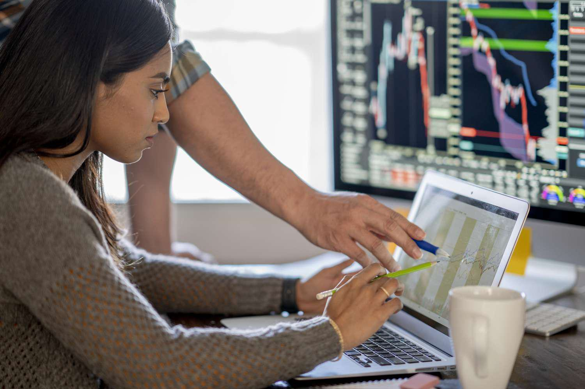

The stock market is a vital component of the global economy, serving as a platform for the buying and selling of securities such as stocks and bonds. It plays a crucial role in the allocation of resources, providing companies with access to capital and allowing investors to own a portion of businesses and potentially earn profits. The stock market's importance is highlighted by its ability to influence investment decisions, impact economic growth, and serve as an indicator of economic health.

Key terms are essential for understanding the dynamics of the stock market. Trading volume refers to the number of shares or contracts traded in a security or market during a given period. It is a key indicator of market activity and liquidity, with higher volumes suggesting greater interest and ease in executing transactions.

Shares outstanding represent the total number of shares currently owned by shareholders, including restricted shares and those held by institutional investors. This figure is distinct from the "float," which refers to shares available for trading by the general public, excluding those owned by insiders or locked up.

Algorithmic trading, commonly known as algo trading, involves using computer programs to automate and execute trading strategies based on predefined criteria. This modern approach to trading enhances market efficiency by allowing for rapid execution, reducing transaction costs, and minimizing the impact of human emotions on investment decisions.

The objective of this article is to explore how trading volume, shares outstanding, and algorithmic trading interact and influence each other in the financial markets. Understanding this interplay can provide insights into market behavior, the forces driving trading activity, and the evolving landscape of modern finance.

## Table of Contents

## Understanding Trading Volume and Shares Outstanding

Trading volume is a critical metric in the stock market that quantifies the number of shares traded for a particular stock or the entire market within a specific timeframe, typically a single trading day. It serves as an indicator of market activity and sentiment, providing insights into the level of interest and liquidity for a given security. High trading volumes can indicate strong investor interest and usually occur when news, events, or trends are influencing the market. Conversely, low trading volumes might reflect reduced interest or uncertainty among investors. Trading volume is particularly significant during market-moving events such as earnings announcements, economic data releases, or geopolitical developments, which can lead to increased buying or selling activities [1].

Shares outstanding refer to the total number of a company’s shares that are held by all its shareholders, including retail investors, institutional investors, and company insiders. This figure is crucial as it provides the basis for calculating key financial metrics like earnings per share (EPS) and market capitalization. Shares outstanding differ from shares available for trading, often referred to as the "float", which excludes restricted shares held by company insiders that are not available for public trading until they become unrestricted. The float represents the portion of shares that is most actively traded by investors, having a direct impact on a stock's [volatility](/wiki/volatility-trading-strategies) and [liquidity](/wiki/liquidity-risk-premium). A small float can lead to higher volatility, as fewer shares are available to absorb trading activity [2].

Several factors influence variations in trading [volume](/wiki/volume-trading-strategy). Key drivers include market events such as mergers and acquisitions, initial public offerings (IPOs), and macroeconomic announcements that can significantly sway investor sentiment and provoke substantial trading activity. Moreover, investor behavior is often shaped by psychological factors, such as fear and greed, which can lead to heightened trading during periods of market uncertainty or speculative bubbles. Additionally, institutional trading strategies, including those executed by hedge funds or mutual funds, can also cause shifts in volume, especially when large blocks of shares are bought or sold. Technological advancements and the growing prevalence of [algorithmic trading](/wiki/algorithmic-trading) have further contributed to changes in trading volume dynamics, allowing for high-frequency trades that can quickly alter the volume landscape [3].

By analyzing trading volume and understanding the concepts of shares outstanding and float, investors and market participants can gain a more comprehensive view of market dynamics and make more informed decisions.

References:
1. Eakins, S. G., & Mishkin, F. S. (2011). Financial Markets and Institutions. Prentice Hall.
2. Bodie, Z., Kane, A., & Marcus, A. J. (2014). Investments. McGraw-Hill Education.
3. Hull, J. C. (2018). Options, Futures, and Other Derivatives. Pearson.

## Algorithmic Trading: The Modern Approach

Algorithmic trading, commonly referred to as algo trading, is a method of executing orders using automated pre-programmed trading instructions. These instructions are based on various factors such as time, price, and volume. It leverages mathematical models and algorithms to make high-speed decisions that human traders would be unlikely to execute as efficiently. 

The primary role of algorithmic trading in the financial markets includes enhancing market liquidity and making trading more systematic and less prone to human error. By executing trades at higher speeds and frequencies, algo trading aids in pricing efficiency and reduces the transaction costs associated with manual trading.

Key [statistics](/wiki/bayesian-statistics) underline the predominant role of algo trading in modern financial markets. As of recent years, it has been reported that algorithmic trading accounts for approximately 60-70% of all equity trading in the United States[1]. Its adoption is also growing rapidly in other regions, including Europe and Asia. The increase can be attributed to technological advancements and the sophistication of trading strategies.

Several strategies are employed in algorithmic trading, each catering to different market conditions:

- **Trend-Following**: This is perhaps the simplest algorithmic strategy that relies on technical indicators to determine the flow direction in an asset's price movement. The basic idea is to buy an asset when the trend is upward and sell when the trend is downward. This strategy does not attempt to predict or forecast price levels but follows trends purely.

- **Mean Reversion**: This strategy is built around the idea that asset prices will revert to their mean or average price over time. Mean reversion strategies involve identifying the trading range for an asset and calculating the average price using mean statistical models. When the current market price of an asset deviates significantly from this average, the strategy will suggest a buy or sell action.

- **Statistical Arbitrage**: This involves trading two or more assets that exhibit statistically driven economic relationships, seeking to profit from relative price movements. Statistical models identify mispricing between related assets over time and signal arbitrage opportunities by taking offsetting long and short positions.

Algorithmic trading not only optimizes trading performance by automation but also plays a critical role in shaping the dynamics of modern financial markets, introducing both opportunities and complexities. As technological capabilities continue to evolve, so too does the prevalence and impact of algorithmic trading strategies.

[1] Aldridge, Irene. *High-Frequency Trading: A Practical Guide to Algorithmic Strategies and Trading Systems*, Wiley Trading, 2013.

## Interplay Between Trading Volume, Shares Outstanding, and Algo Trading

Algorithmic trading, often referred to as algo trading, plays a significant role in shaping the trading volumes and market liquidity in modern financial markets. At its core, algorithmic trading utilizes pre-programmed instructions to automatically execute trades at speeds and frequencies that are impossible for human traders. This automation can profoundly influence trading volume and market behavior.

### Impact on Trading Volume and Market Liquidity

Algorithmic trading can substantially increase trading volumes due to the rapid execution of a large number of orders in brief time spans. High-frequency trading ([HFT](/wiki/high-frequency-trading-strategies)), a subset of algorithmic trading, is particularly influential, as it aims to capture minute price discrepancies within microseconds. This high velocity of trades enhances market liquidity since more buy and sell orders are continuously being added to the market, making it easier for other traders to execute their orders without causing significant price changes.

For instance, market-making algorithms continuously place buy and sell orders at or near the current market price. This practice increases trading volumes and provides liquidity, as these algorithms profit from the bid-ask spread while facilitating other market participants' ability to find matching counterparts for their trades.

### Scenarios Where Trading Volume Exceeds Shares Outstanding

It might initially seem counterintuitive for trading volume to exceed the number of shares outstanding. However, this can occur due to factors such as high intraday trading activity and short selling, where a stock's turnover ratio becomes exceptionally high.

Imagine a stock with 1 million shares outstanding. If active trade results in each share being bought and sold multiple times within a trading day, the total trading volume could easily exceed the number of shares outstanding. This phenomenon is often observed during periods of heightened market activity, such as the release of important financial news or stock inclusion in a major index.

### Influence on Market Volatility and Efficiency

Algorithmic trading can both stabilize and destabilize markets. On the one hand, algorithms trading programs can enhance market efficiency by tightening spreads and reducing [arbitrage](/wiki/arbitrage) opportunities, thereby reflecting new information in prices more rapidly. An example of this is [statistical arbitrage](/wiki/statistical-arbitrage) strategies that exploit pricing inefficiencies between correlated securities until the price gap closes.

On the other hand, algorithms can also exacerbate market volatility, particularly during market stress or rapid movements. Algorithms triggered by similar signals might lead to simultaneous buying or selling, intensifying price swings. Such events were partly observed during the 2010 "Flash Crash," where aggressive selling by algorithms significantly contributed to a sudden and deep market sell-off, followed by an equally swift recovery.

In conclusion, while algorithmic trading enhances liquidity and efficiency by increasing trading volumes, its capacity to amplify volatility remains a challenge for market stability. The ongoing evolution of these technologies necessitates careful oversight to uphold the delicate balance between market liquidity and volatility.

## Case Studies: High Trading Volumes and Algorithmic Impact

In certain market events, trading volumes can significantly exceed the number of shares outstanding. This phenomenon can occur during initial public offerings (IPOs), earnings announcements, and takeover bids. Such events often attract intense interest from investors and traders, resulting in elevated trading activity. 

### Real-World Examples

1. **Initial Public Offerings (IPOs):** During an IPO, a company's shares become available to the public for the first time. The excitement and anticipation surrounding new listings can lead to trading volumes that surpass shares outstanding due to multiple trades of the same shares within a single day. For instance, the IPO of Alibaba Group in 2014 witnessed an extraordinarily high trading volume, reflecting heightened investor activity and demand. The single day trading volume reached approximately 271 million shares, compared to the 320 million shares offered during the IPO, demonstrating high churn as shares changed hands multiple times within the trading day.

2. **Earnings Reports:** Companies releasing earnings reports can experience trading volumes that exceed their shares outstanding, especially if the results significantly deviate from analyst expectations, whether positively or negatively. A notable example is Apple Inc., which often sees trading spikes post-earnings announcements due to its widespread investor base and market influence. The impact of potentially surprising earnings can trigger rapid buying or selling by both institutional and retail investors, amplified by algorithmic trading strategies that respond to news.

3. **Takeovers and Mergers:** Announcement of a takeover or merger can also result in abnormally high trading volumes. When a takeover is announced, the target company's stock usually sees a sharp increase in price and volume as traders speculate on the deal's completion. In the acquisition of Time Warner by AT&T in 2016, Time Warner's stock experienced a significant spike in trading volume following the announcement, demonstrating heightened speculative trading and arbitrage activity.

### The Role of Algorithmic Trading

Algorithmic trading plays a critical role in these significant market events by facilitating rapid response times and executing complex strategies. This is achieved through:

- **Trend Following:** Algorithms programmed to identify and leverage market trends can significantly increase trading volumes by systematically buying or selling according to observed patterns.
- **Statistical Arbitrage:** This involves sophisticated algorithms that exploit price discrepancies between securities. During high volume events, such arbitrage opportunities may arise quickly due to the heightened price movements and volatility.

As trading algorithms respond instantaneously to market conditions, they contribute to increased liquidity and can either mitigate or exacerbate volatility. The speed and efficiency of these systems allow them to participate actively in the market during events when human traders might be slower to react.

In conclusion, the interaction between market events and algorithmic trading showcases the complexity and dynamics of modern financial markets. As trading volumes spike during crucial events, algorithms enhance the market's ability to process information, though they also heighten the potential for great price swings and volatility.

## Challenges and Opportunities in Algo Trading

Algorithmic trading, often referred to as algo trading, has transformed the landscape of financial markets through its ability to execute trades at lightning speeds and with precision. However, it brings with it both significant opportunities and pronounced challenges.

### Potential Challenges

#### Market Impact

Algorithmic trading can influence market conditions in several ways. Large volumes of trades executed within a short time can lead to sharp price movements, impacting market stability. For instance, the "Flash Crash" of May 6, 2010, is a prominent example where a large sell order, coupled with algorithmic trading activity, resulted in a sudden drop and recovery of the U.S. stock markets within minutes. The high speed and volume of algo trades can exacerbate volatility, leading to increased risks for market participants.

#### Technological Glitches

The reliance on automated systems means that any failure in these systems can result in substantial financial loss. Technical glitches, such as software bugs or system outages, can cause erroneous trades. For example, a minor programming error might misinterpret market data, leading to unintended trade executions. Therefore, robust testing and fail-safes are critical in the development and deployment of algorithmic trading systems.

### Benefits of Utilizing Algo Trading

Algorithmic trading offers several advantages. It enhances market liquidity by increasing the number of trades executed, thereby ensuring tighter bid-ask spreads. This is beneficial for all market participants as it reduces transaction costs and facilitates smoother price discovery. Additionally, algo trading minimizes human errors by eliminating emotional and cognitive biases that can cloud judgment during decision-making. The use of quantitative models allows for the implementation of complex strategies that can exploit small inefficiencies in the market, increasing the potential for profit.

### Future Trends and Technological Advancements

As technology evolves, so too does the landscape of algorithmic trading. Machine learning and [artificial intelligence](/wiki/ai-artificial-intelligence) are becoming increasingly integrated into trading algorithms, allowing for more sophisticated strategies that adapt to changing market conditions in real-time. The use of big data analytics provides enhanced capabilities for market prediction and sentiment analysis, thus refining trading decisions. Furthermore, the rise of quantum computing, though still in its nascent stages, holds the potential to revolutionize algorithmic trading by solving complex optimization problems more efficiently than classical computers.

The continuous advancement in technology promises increased efficiency and sophistication in algo trading. However, it also necessitates stringent regulatory oversight and a focus on ethical considerations to ensure market integrity and protect investor interests. As such, the balance between leveraging cutting-edge technology and maintaining rigorous oversight remains a pivotal aspect of the future of algorithmic trading.

## Conclusion

The exploration of trading volume, shares outstanding, and algorithmic trading reveals their integral roles in modern financial markets. These elements intertwine to form a complex ecosystem that influences market behavior and outcomes. Trading volume serves as a critical indicator of market activity, reflecting investor sentiment and reacting to events. Shares outstanding define the total shares a corporation has issued, while the float represents those available for public trading, introducing variability in liquidity and market engagement.

Algorithmic trading has fundamentally reshaped how trading is conducted, operating at the intersection of technology and finance. It brings efficiency and speed, allowing for the execution of complex strategies like trend-following, mean reversion, and statistical arbitrage. This has led to significant advancements in trading practices, introducing precision and scalability that were previously unattainable.

The evolution of trading strategies continues to advance as technology becomes more sophisticated. The prevalence of algorithmic trading is a testament to the technology-driven transformation underway in financial markets. As algorithms make trading more efficient, they also have the potential to introduce new challenges, such as increased volatility and susceptibility to systemic risks stemming from technological glitches or market anomalies.

A critical takeaway from this discussion is the necessity to balance algorithmic proficiency with human oversight. While algorithms excel in executing predefined strategies at high frequencies, human intuition remains essential in navigating market complexities and unforeseen events. The symbiosis between human judgment and algorithmic precision can enhance decision-making processes, ensuring robust and adaptable trading strategies. As technology evolves, the financial industry is poised to harness breakthroughs that will further refine and optimize trading methodologies, ultimately shaping the future landscape of global markets.

## References & Further Reading

[1] Bodie, Z., Kane, A., & Marcus, A. J. (2014). ["Investments."](https://books.google.com/books/about/EBOOK_Investments_Global_edition.html?id=BMsvEAAAQBAJ) McGraw-Hill Education.

[2] Eakins, S. G., & Mishkin, F. S. (2011). ["Financial Markets and Institutions."](https://books.google.com/books/about/Financial_Markets_and_Institutions_Globa.html?id=PPJFDwAAQBAJ) Prentice Hall.

[3] Hull, J. C. (2018). ["Options, Futures, and Other Derivatives."](https://www.semanticscholar.org/paper/Options%2C-Futures%2C-and-Other-Derivatives-Hull/89bdee500c8623864fc9eb7a471546aa713acc44) Pearson.

[4] Aldridge, Irene. ["High-Frequency Trading: A Practical Guide to Algorithmic Strategies and Trading Systems."](https://www.amazon.com/High-Frequency-Trading-Practical-Algorithmic-Strategies/dp/1118343506) Wiley Trading.