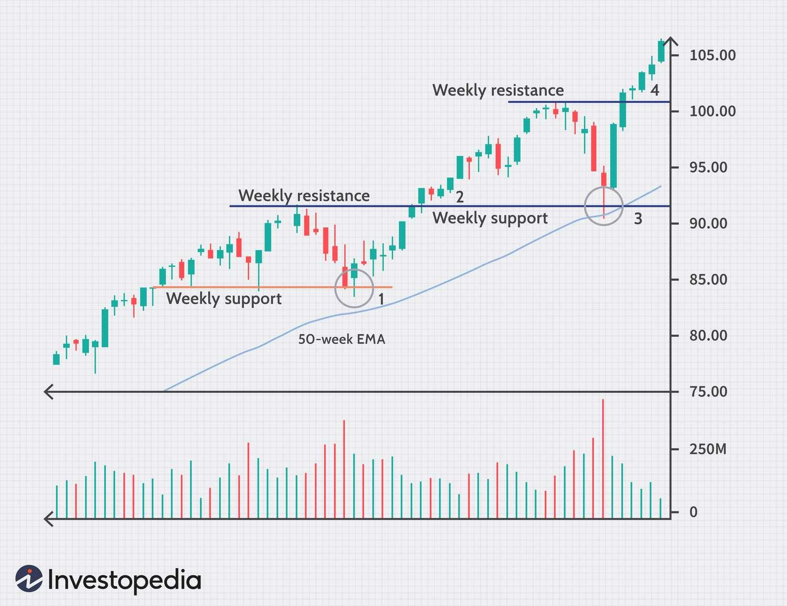

## Table of Contents

## What are weekly patterns in trading?

Weekly patterns in trading refer to the trends and behaviors that happen over the course of a week in financial markets. Traders often look at these patterns to help them make better decisions about when to buy or sell. For example, some stocks or currencies might go up on certain days of the week and go down on others. This can be because of regular events like reports or announcements that happen on the same day each week.

One common weekly pattern is the "Monday effect," where stocks might drop at the beginning of the week because people are reacting to news from over the weekend. Another pattern is the "Friday effect," where traders might sell their stocks before the weekend to avoid any unexpected news that could happen when the market is closed. By understanding these patterns, traders can plan their moves and hopefully make more money.

It's important to remember that these patterns are not always the same and can change over time. What works one week might not work the next. Traders need to keep watching the market and be ready to change their plans. Using weekly patterns can be a helpful tool, but it's just one part of a bigger strategy in trading.

## Why is understanding weekly patterns important for traders?

Understanding weekly patterns is important for traders because it helps them predict how the market might move during the week. By knowing that certain stocks or currencies tend to go up or down on specific days, traders can plan their buying and selling better. For example, if a trader knows that a stock usually drops on Mondays, they might wait until later in the week to buy it, hoping to get a better price.

Also, weekly patterns can help traders manage their risks. If they know that the market often gets more unpredictable on Fridays, they might decide to sell their stocks before the weekend to avoid any big surprises. This way, they can protect their money and make smarter decisions. But traders need to remember that these patterns can change, so they should always keep an eye on the market and be ready to adjust their plans.

## How can beginners identify common weekly patterns in the market?

Beginners can start identifying common weekly patterns by looking at historical data of stocks or currencies they are interested in. They can use tools like stock charts or trading platforms that show how prices have changed over time. By looking at these charts, beginners can see if there are any days of the week when the prices tend to go up or down more often. For example, they might notice that a stock usually goes up on Tuesdays or drops on Fridays. It's a good idea to look at data from several weeks or months to see if these patterns happen regularly.

Another way beginners can identify weekly patterns is by reading news and reports that come out on specific days of the week. For example, some economic reports are released every Friday, and these can affect the market. By keeping track of when these reports come out and how the market reacts to them, beginners can start to see patterns. It's important to remember that these patterns might not always be the same, so beginners should keep watching the market and be ready to change their plans if needed.

## What tools and indicators are useful for analyzing weekly patterns?

To analyze weekly patterns, beginners can use several tools and indicators that help them see how prices move over time. One useful tool is a stock chart, which shows the price of a stock or currency over different time periods, like days, weeks, or months. By looking at these charts, beginners can see if there are any days of the week when the price tends to go up or down more often. Another helpful tool is a trading platform, which often has features that let users look at historical data and see how prices have changed in the past. These platforms can also show moving averages, which are lines on the chart that smooth out price changes and help show trends over time.

Indicators like the Relative Strength Index (RSI) and the Moving Average Convergence Divergence (MACD) can also be useful for analyzing weekly patterns. The RSI helps show if a stock is overbought or oversold, which can give clues about when the price might change direction. The MACD shows the relationship between two moving averages and can help traders see when a trend is getting stronger or weaker. By using these indicators, beginners can get a better idea of how the market might move during the week and plan their trades accordingly.

## Can you explain the impact of economic calendars on weekly trading patterns?

An economic calendar can really affect how the market moves during the week. This calendar lists when important reports and announcements will come out. Things like jobs reports, [interest rate](/wiki/interest-rate-trading-strategies) decisions, and other economic news can make prices go up or down. For example, if a jobs report is released on a Friday, traders might see the market change a lot that day. Knowing when these reports will come out can help traders plan their moves better.

Traders use the economic calendar to get ready for big changes in the market. If they know a report is coming out, they can guess how it might affect prices and decide whether to buy or sell before it happens. This can help them make money or avoid losing it. But, it's important to remember that the market doesn't always react the way traders expect. So, while the economic calendar is a helpful tool, traders need to stay flexible and keep watching the market to make the best decisions.

## How do seasonal trends affect weekly trading patterns?

Seasonal trends can change how the market moves during the week. For example, some times of the year, like the end of the year, can make people buy or sell more. This can make the market go up or down on certain days of the week. If traders know about these seasonal trends, they can plan their trades better. For instance, if they know that the market usually goes up in December, they might buy stocks earlier in the week to sell them later when the price is higher.

But, seasonal trends don't always work the same way every year. Sometimes, other things like big news or economic reports can change how the market reacts to these trends. Traders need to keep an eye on both the seasonal trends and what's happening in the market right now. By doing this, they can make smarter choices about when to buy or sell during the week.

## What are some strategies for trading based on weekly patterns?

One strategy for trading based on weekly patterns is to watch for the "Monday effect" and the "Friday effect." Many traders have noticed that stocks can drop on Mondays because people are reacting to news from over the weekend. To use this pattern, a trader might wait until later in the week to buy stocks, hoping to get them at a lower price. On the other hand, the market can be more unpredictable on Fridays because traders might sell their stocks before the weekend to avoid any surprises. A trader could use this by selling their stocks on Thursday or early Friday to avoid any big drops.

Another strategy is to pay attention to economic calendars and seasonal trends. Economic reports like jobs numbers or interest rate decisions often come out on the same day each week. If a trader knows when these reports are coming, they can guess how the market might react and plan their trades around these times. For example, if a big report is coming out on Friday, a trader might buy or sell stocks earlier in the week to take advantage of the expected market movement. Seasonal trends, like the market going up in December, can also help. A trader could buy stocks at the beginning of the week during these times, hoping to sell them later in the week at a higher price.

Both of these strategies can help traders make better decisions, but it's important to remember that the market can change. What works one week might not work the next. So, traders need to keep watching the market and be ready to change their plans if needed. By staying flexible and using these patterns as a guide, traders can improve their chances of making money.

## How can traders adapt weekly pattern strategies to different market conditions?

Traders need to be flexible when using weekly pattern strategies because the market can change a lot. If the market is going up, traders might want to buy stocks earlier in the week, like on a Monday or Tuesday, and then sell them later in the week when prices are higher. But if the market is going down, traders might wait until later in the week, like Thursday or Friday, to buy stocks at a lower price. They can also look at economic reports and news to guess how the market might move and plan their trades around these events. For example, if a big report is coming out on Friday, a trader might buy or sell stocks earlier in the week to take advantage of the expected market movement.

Seasonal trends can also affect how traders use weekly patterns. During times like the end of the year, when the market often goes up, traders might buy stocks earlier in the week to sell them later at a higher price. But if it's a time when the market usually goes down, like in September, traders might wait until later in the week to buy stocks at a lower price. By keeping an eye on both the weekly patterns and the overall market conditions, traders can make smarter decisions about when to buy or sell. It's important for traders to always be ready to change their plans if the market does something unexpected.

## What are the psychological aspects to consider when trading weekly patterns?

When trading based on weekly patterns, it's important to think about how feelings can affect your choices. People can get too excited or too worried about the market, which can make them buy or sell at the wrong times. For example, if someone sees a stock going up on a certain day of the week, they might feel like they have to buy it right away, even if it's not the best time. This can lead to bad decisions and losing money. It's helpful to stay calm and not let feelings push you into doing something you might regret later.

Another thing to think about is how other people's feelings can change the market. If a lot of traders think the same way about a weekly pattern, they might all try to buy or sell at the same time. This can make the market move a lot more than usual. For example, if everyone knows that stocks often go down on Mondays, many traders might sell their stocks on Friday to avoid the drop. This can make the market go down even more on Monday. So, it's good to think about what other traders might do and how that can affect the patterns you're watching.

## How can advanced traders use weekly patterns to enhance portfolio diversification?

Advanced traders can use weekly patterns to enhance portfolio diversification by spreading their investments across different assets that show different weekly trends. For example, if a trader notices that certain stocks tend to go up on Mondays while others go up on Fridays, they can buy stocks with different patterns. This way, they can take advantage of the ups and downs throughout the week and reduce the risk of losing money if one stock doesn't perform well.

Another way advanced traders can use weekly patterns is by looking at different sectors or markets. Some sectors might have strong weekly patterns that are different from others. By investing in a mix of sectors with varied weekly patterns, traders can balance their portfolio better. This helps them avoid putting all their money in one place and increases their chances of making money from different parts of the market.

## What are the risks associated with relying on weekly patterns for trading decisions?

Relying on weekly patterns for trading decisions can be risky because these patterns don't always happen the same way every week. The market can change because of news, economic reports, or other things that traders can't predict. If a trader bets too much on a weekly pattern and it doesn't happen, they could lose a lot of money. It's important for traders to remember that weekly patterns are just one part of the market and they need to be ready for surprises.

Another risk is that too many traders might be watching the same weekly patterns. If everyone tries to buy or sell at the same time because of a pattern, it can make the market move in unexpected ways. This can make the pattern not work as well or even make it do the opposite of what traders expect. Traders need to think about what other people might do and not just follow the patterns without thinking.

## How can one backtest and optimize a trading strategy focused on weekly patterns?

To backtest a trading strategy that uses weekly patterns, a trader needs to look at old market data to see how the strategy would have worked in the past. They can use a computer program or a trading platform that lets them go back in time and see what would have happened if they had followed their strategy. For example, if the strategy says to buy a stock on Monday and sell it on Friday, the trader can see how much money they would have made or lost by doing this over many weeks. This helps them understand if the strategy works well or if it needs changes.

To optimize the strategy, the trader can try different things to make it better. They might change the days they buy and sell, or they might look at different stocks or markets. By trying out these changes on the old data, they can see which ones make the strategy work better. It's important to keep testing and changing the strategy until it gives the best results. But traders should remember that even a good backtest doesn't guarantee the strategy will work in the future, so they need to keep watching the market and be ready to change their plans if needed.

## What is the Weekly Trading Strategy Backtesting?

Backtesting is a critical component in evaluating the effectiveness of weekly trading strategies. It involves simulating a trading strategy using historical data to determine how it would have performed in the past. By verifying the viability of a strategy through [backtesting](/wiki/backtesting), traders can gain insight into its potential profitability and risks before deploying real capital.

### Significance of Backtesting

Backtesting provides several advantages, such as identifying a strategy's strengths and weaknesses, measuring its robustness, and uncovering aspects that may require optimization. A thorough backtest helps traders avoid strategies that could appear promising at first glance but fail under real market conditions due to overfitting or lack of adaptability to varying market dynamics.

### Metrics and Tools for Performance Assessment

Key metrics are used to assess the performance of backtested strategies. Among them, the Sharpe Ratio and Value at Risk (VaR) are prominent:

- **Sharpe Ratio**: This metric calculates the risk-adjusted return of a trading strategy. It is given by the formula:
$$
  \text{Sharpe Ratio} = \frac{E[R_p - R_f]}{\sigma_p}

$$

  where $E[R_p - R_f]$ is the expected return of the portfolio minus the risk-free rate, and $\sigma_p$ is the standard deviation of the portfolio's excess return. A higher Sharpe Ratio indicates a more desirable risk-adjusted performance.

- **Value at Risk (VaR)**: VaR estimates the potential loss in value of a portfolio over a defined period for a given confidence interval. It helps traders understand the extent of loss they can expect under normal market conditions.

### Example of a Backtesting Script Using Python

Python, with its robust libraries, provides an excellent platform for backtesting trading strategies. Below is a simplified example of a backtesting script using Python's popular libraries `pandas` and `numpy`:

```python
import pandas as pd
import numpy as np

# Load historical data
data = pd.read_csv('historical_prices.csv', parse_dates=True, index_col='Date')
weekly_data = data['Close'].resample('W').agg({'last'})

# Define moving average strategy
short_window = 4
long_window = 10

weekly_data['Short_MA'] = weekly_data['last'].rolling(window=short_window).mean()
weekly_data['Long_MA'] = weekly_data['last'].rolling(window=long_window).mean()

# Trading signals
weekly_data['Signal'] = 0
weekly_data['Signal'][short_window:] = np.where(
    weekly_data['Short_MA'][short_window:] > weekly_data['Long_MA'][short_window:], 1, -1)

# Calculate returns
weekly_data['Returns'] = weekly_data['last'].pct_change()
weekly_data['Strategy_Returns'] = weekly_data['Signal'].shift(1) * weekly_data['Returns']

# Evaluate strategy performance
cumulative_returns = (1 + weekly_data['Strategy_Returns']).cumprod()
sharpe_ratio = (weekly_data['Strategy_Returns'].mean() / weekly_data['Strategy_Returns'].std()) * np.sqrt(52)

print("Cumulative Returns:", cumulative_returns[-1])
print("Sharpe Ratio:", sharpe_ratio)
```

In this script, a simple moving average strategy is implemented. Historical price data is resampled to weekly intervals to calculate short-term and long-term moving averages. A trading signal is generated based on the crossover of these moving averages, and returns are calculated to assess the strategy's performance, including the Sharpe Ratio for risk-adjusted performance evaluation.

Backtesting with Python is valuable for its flexibility and capability to handle large datasets. It allows traders to rigorously test their strategies, enabling informed decisions and fostering confidence in their implementation.

## References & Further Reading

1. **Books and Publications**:
   - **"Algorithmic Trading: Winning Strategies and Their Rationale" by Ernie Chan**: This book discusses algorithmic trading strategies, offering insights into quantitative trading, data analysis, and hands-on examples for building trading models.
   - **"Quantitative Trading: How to Build Your Own Algorithmic Trading Business" by Ernie Chan**: Further exploration into designing, testing, and implementing trading strategies. It emphasizes the practical aspects of starting a trading business.
   - **"Technical Analysis of the Financial Markets" by John J. Murphy**: A comprehensive guide to understanding price movements and chart patterns, essential for interpreting weekly trading strategies.

2. **Online Articles and Journals**:
   - **"Algorithmic and High-Frequency Trading" by Algotrading101**: Provides a foundational understanding of algorithmic trading with a focus on developing strategies for various timeframes including weekly data. Available online at [Algotrading101](https://www.algotrading101.com/learn/).
   - **The Journal of Portfolio Management**: Offers peer-reviewed articles focusing on quantitative finance, portfolio management, and trading strategy methodologies. Available through financial databases and libraries.

3. **Research Papers**:
   - **"A Survey of Trading Strategy Robustness" by Tomasz Janeczko**: Examines the consistency of trading strategies across different market conditions and timeframes, available in financial research archives.
   - **"The Impact of Algorithms on Trading Alpha" by Laurent Bernut**: Investigates the effectiveness of algorithmic trading strategies in achieving superior returns, with a specific focus on different time intervals, including weekly. Published in the Journal of Trading.

4. **Online Courses and Tutorials**:
   - **Coursera's Algorithmic Trading Course** by the University of Michigan: Covers the basics of algorithmic trading, strategy design, and implementation using Python. Accessible online at [Coursera](https://www.coursera.org/).
   - **QuantInsti's Executive Program in Algorithmic Trading (EPAT)**: Offers comprehensive training in quantitative and algorithmic trading, emphasizing building robust trading strategies across timeframes. More information available at [QuantInsti](https://www.quantinsti.com/).

5. **Software and Tools**:
   - **QuantConnect and Alpaca**: Platforms for backtesting and deploying algorithmic trading strategies, providing historical market data and integrated development environments in Python.
   - **TradeStation**: Offers tools for developing and backtesting trading strategies using EasyLanguage, which can be adapted for weekly trading.

6. **Experts and Consultants**:
   - **Dr. Ernest Chan**: A renowned expert in algorithmic trading. Information about consultations and workshops can be found on his blog [Quantitative Research and Trading](http://epchan.blogspot.com/).
   - **Quantitative Finance Practitioners on LinkedIn**: Networking with experienced professionals can provide practical insights and guidance on weekly trading strategies.

By engaging with these resources, traders can deepen their understanding of [algorithmic trading](/wiki/algorithmic-trading) and optimize their use of weekly trading strategies for improved market participation.

